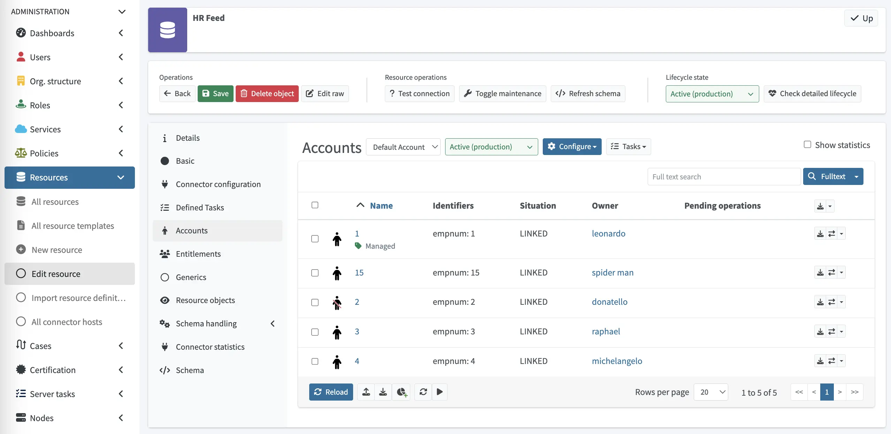
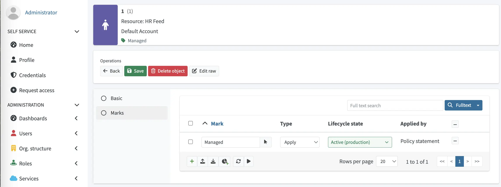
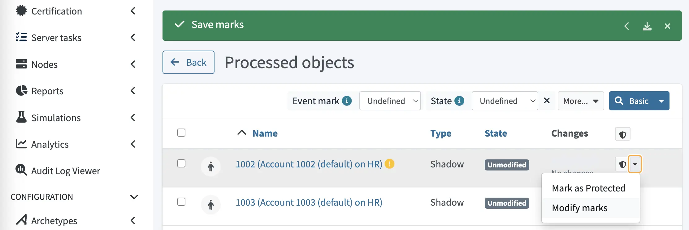
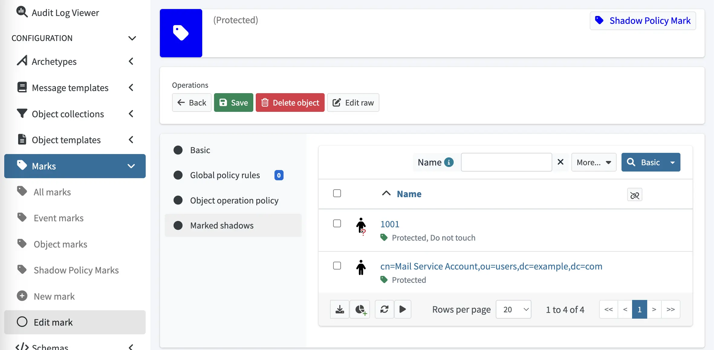

= Resource wizard: Object type policies
:page-nav-title: Policies
:page-toc: top
:page-since: "4.9"
:experimental:
:page-keywords: object type policy, marks, default policy, filter
:page-description: This page describes how to use object marks in the Object type policies section of the midPoint graphical user interface (GUI), thus enabling you to control the behavior of groups of accounts and entitlements in resources.

This page describes how to use object marks in the *Object type policies* section of the midPoint graphical user interface (GUI), thus enabling you to control the behavior of groups of accounts and entitlements in resources.

For more technical details on object marks, and to see how you can use them in your workflows, see xref:/midpoint/reference/concepts/mark[].

Object type policies enable you to configure the following features:

* <<classsifyObjects,Marking>> - Groups accounts/entitlements by filtering them and assigning marks to them.
* <<defaultOperationPolicy,Default Operation Policy>> - Defines the default policy for objects that have not been explicitly assigned marks in the <<classsifyObjects,Marking>> section.

image::object-type-policies.webp[link=object-type-policies.webp,70%,title=Object type policies]

[[classsifyObjects]]
== Classify objects using marks

In midPoint GUI, you can group accounts and entitlements in resources so that you can apply policies only to such groups.
This is done by selecting a mark, and subsequently, defining a xref:/midpoint/reference/concepts/query/midpoint-query-language/[filter] that matches the objects that you want to group under that mark.

. Create an object mark for your use case in [.nowrap]#icon:tag[] *Marks*# > [.nowrap]#icon:tag[] *Object marks*#.
. Go to the resource that contains the objects to which you want to apply marks by clicking [.nowrap]#icon:database[] *Resources*# > [.nowrap]#icon:database[] *All resources*# > resource.
. In the resource, depending on which objects you want to group, click [.nowrap]#icon:male[] *Accounts*# or [.nowrap]#icon:users[] *Entitlements*#.
. Click [.nowrap]#icon:cog[] btn:[Configure]# and select [.nowrap]#icon:balance-scale[] *Policies*#.
+
image::resource-account.webp[link=resource-account.webp,100%,title=Access marks in a resource]
. Click [.nowrap]#icon:tag[] btn:[Marking]#.
. Click [.nowrap]#icon:circle-plus[] btn:[New marking rule]#.
. Select the mark that you want to use for your group of objects.
. In *Application time*, select when the mark should be applied to objects:
    ** *Always* - Anytime that midPoint works with the objects.
    ** *Classification* - Only once when the objects are created in the midPoint repository.
. Click [.nowrap]#icon:edit[] btn:[Edit]# and enter a xref:/midpoint/reference/concepts/query/midpoint-query-language/filters[filter query] that matches the objects that you want to group under the mark that you have selected.
. Click btn:[Done].
. Click btn:[Save marking rules].

[[defaultOperationPolicy]]
== Define default operation policy
// GUI - "Default operation policy"

Default operation policy defines the default policy for all objects that are not explicitly marked in the <<classifyObjects,Marking>> section.
This enables you to define the default behavior for objects that do not need a specific treatment.
For example, you may want to set the Default operation policy to `Unmanaged` to make all objects of the object type effectively read-only (outbound behavior will be ignored) during object management migration to midPoint.

. Go to the resource that contains the objects to which you want to apply the default operation policy by clicking [.nowrap]#icon:database[] *Resources*# > [.nowrap]#icon:database[] *All resources*# > resource.
. In the resource, depending on the objects for which you want to set up the default operation policy, click [.nowrap]#icon:male[] *Accounts*# or [.nowrap]#icon:users[] *Entitlements*#.
. Click [.nowrap]#icon:cog[] btn:[Configure]# and select [.nowrap]#icon:balance-scale[] *Policies*#.
. Click [.nowrap]#icon:tag[] btn:[Default operation policies]#.
. Click [.nowrap]#icon:circle-plus[] btn:[Add new policy]#.
. In the *Policy* field, select the mark to which your default policy applies. +
To create a new mark, click [.nowrap]#icon:edit[] btn:[Edit]# and select *Create new mark* in the Default operation policy dialog.
This way you can enable/disable the policy for individual operations, such as Add or Modify, and define what the system reports when those operations occur by configuring the severity of the individual operations.
. Select the xref:/midpoint/reference/concepts/object-lifecycle/[lifecycle state] for your policy.
. Click btn:[Save policies].

TIP: Default operation policy is heavily used in xref:/midpoint/methodology/group-synchronization/[].

[[markManually]]
== Mark objects manually

In addition to marking objects in bulk by filtering them in the <<classsifyObjects,Marking>> section, you can also mark individual objects manually in the following areas of the midPoint GUI:

=== Accounts
. Go to [.nowrap]#icon:database[] *Resources*# > [.nowrap]#icon:database[] *All resources*# > resource.
. In the resource, click [.nowrap]#icon:male[] *Accounts*#.
+

. Click the name of the account that you want to mark.
. Go to the [.nowrap]#icon:circle[] *Marks*# tab.
+

. Click [.nowrap]#icon:plus[] btn:[Add mark]# to add a new mark.

=== Entitlements
. Go to [.nowrap]#icon:database[] *Resources*# > [.nowrap]#icon:database[] *All resources*# > resource.
. In the resource, click [.nowrap]#icon:users[] *Entitlements*#.
. Click the dropdown button at the farthest right for the entitlement you want to mark and select [.nowrap]#*Modify marks*#.
+
image::object-add-mark-03.webp[link=object-add-mark-03.webp,100%,title=Add marks to entitlements]
. Click [.nowrap]#icon:plus[] btn:[Add mark]# to add a new mark.

=== Simulations
. Go to [.nowrap]#icon:flask[] *Simulations*# > [.nowrap]#icon:circle[] *All results*#.
. Click the name of a simulation.
. Click the [.nowrap]#icon:search[] btn:[View processed objects]# button.
. For the object to which you want to assign marks, you can:
** Mark the object directly as _Protected_ by clicking the [.nowrap]#icon:shield-alt[] btn:[Mark as Protected]# button.
+

** Assign other marks by clicking the dropdown button next to the [.nowrap]#icon:shield-alt[] btn:[Mark as Protected]# button, and selecting *Modify marks*.

== Review marks

You can review marked objects by going to [.nowrap]#icon:tag[] *Marks*# > [.nowrap]#icon:tag[] *Object marks*# > mark > [.nowrap]#icon:circle[] *Marked shadows*#.

include::../../see-also.adoc[]
