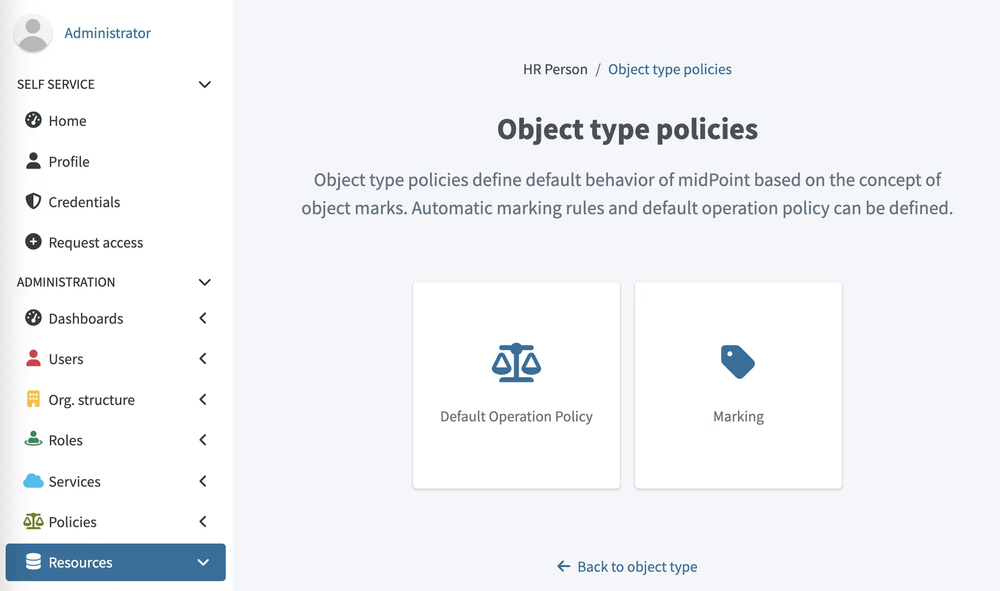
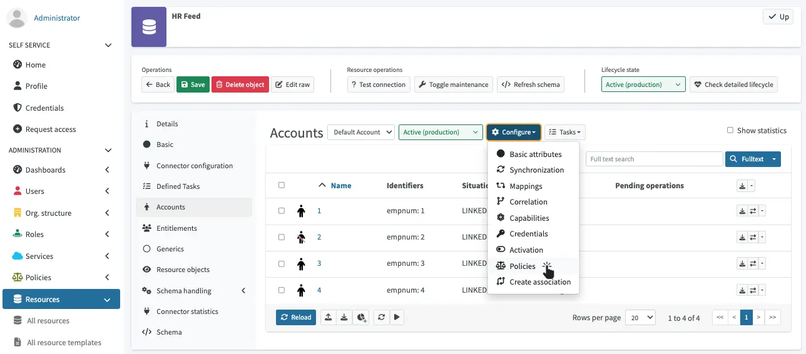

= Resource wizard: Object type policies
:page-nav-title: Policies
:page-toc: top
:page-since: "4.9"
:experimental:
:page-keywords: object type policy, marks, default policy, filter
:page-description: This page describes how to use object marks in the Object type policies section of the midPoint graphical user interface (GUI), thus enabling you to control the behavior of groups of accounts and entitlements.

This page describes how to use object marks in the *Object type policies* section of the midPoint graphical user interface (GUI), thus enabling you to control the behavior of groups of accounts and entitlements.

To learn more technical details on object marks, and to see how you can use them in your workflows, see xref:/midpoint/reference/concepts/mark[].

You can access the Object type policies section by going to icon:database[] *Resources* > icon:database[] *All resources* > resource > icon:male[] *Accounts* / icon:users[] *Entitlements* > icon:cog[] btn:[Configure] > icon:balance-scale[] *Policies*.
In this section, you can configure the following features:

* <<classsifyObjects,Marking>> - Groups accounts/entitlements by filtering them and assigning marks.
* <<defaultOperationPolicy,Default Operation Policy>> - Captures all objects that have not been assigned marks in the <<classsifyObjects,Marking>> section and assigns them a default mark.

[[classsifyObjects]]
== Classify objects using marks

In midPoint GUI, you can group accounts and entitlements in resources so that you can apply policies only to such groups.
This is done by selecting a mark, and subsequently, defining a xref:/midpoint/reference/concepts/query/midpoint-query-language/[filter] that matches the objects that you want to group under that mark.

. Create an object mark for your use case in icon:tag[] *Marks* > icon:tag[] *All marks*.
. Go to the resource that contains the objects you want to apply marks to by clicking icon:database[] *Resources* > icon:database[] *All resources* > resource.
. In the resource, go to icon:male[] *Accounts* / icon:users[] *Entitlements* > icon:cog[] btn:[Configure] > icon:balance-scale[] *Policies*.
+

. Click icon:tag[] btn:[Marking].
. Click icon:circle-plus[] btn:[New marking rule].
. Select the mark that you want to use for your group of objects.
. In *Application time*, select when the mark should be applied to objects:
    ** *Always* - Anytime that midPoint works with the objects.
    ** *Classification* - Only once when the objects are created in the midPoint repository.
. Click icon:edit[] btn:[Edit] and enter a filter query that matches the objects that you want to group under the mark that you have selected.
. Click btn:[Done].
. Click btn:[Save marking rules].

[[defaultOperationPolicy]]
== Define default operation policy
// GUI - "Default operation policy"

Default operation policy defines the default mark for all objects that are not marked explicitly in the <<classifyObjects,Marking>> section.
This enables you to define the default behavior for objects that do not need a specific treatment.
For example, you may want to set the Default operation policy as `Unmanaged` to make all objects of the object type effectively read-only (outbound behavior will be ignored) during object management migration to midPoint.

. Go to the resource that contains the objects you want to apply marks to by clicking icon:database[] *Resources* > icon:database[] *All resources* > resource.
. In the resource, go to icon:male[] *Accounts* / icon:users[] *Entitlements* > icon:cog[] btn:[Configure] > icon:balance-scale[] *Policies*.
. Click icon:tag[] btn:[Default operation policies].
. Click icon:circle-plus[] btn:[Add new policy].
. In the *Policy* field, select the mark to which your default policy applies. +
To create a new mark, click icon:edit[] btn:[Edit] and select *Create new mark* in the Default operation policy dialog.
This way you can enable/disable the policy for individual operations, such as Add or Modify, and define what the system reports when those operations occur by configuring the severity of the individual operations.
. Select the xref:/midpoint/reference/concepts/object-lifecycle/[lifecycle state] for your policy.
. Click btn:[Save policies].

TIP: Default operation policy is heavily used in xref:/midpoint/methodology/group-synchronization/[].

== Assign marks to users manually

In some cases, you may need to assign marks to individual objects manually.
For example, when you only want to apply marks temporarily, or when you need more precision than filters can provide in <<classsifyObjects,marking>>.

You can assign marks directly to users in icon:user[] *Users* > user > icon:circle[] *Marks*.

include::../../see-also.adoc[]
