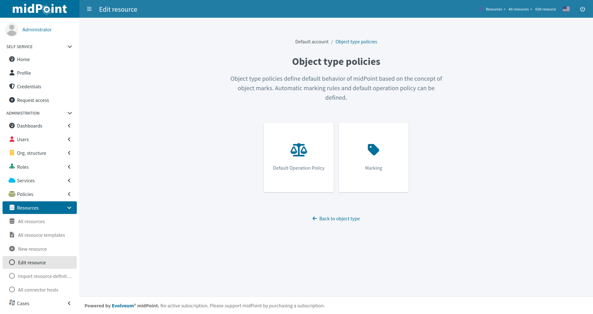
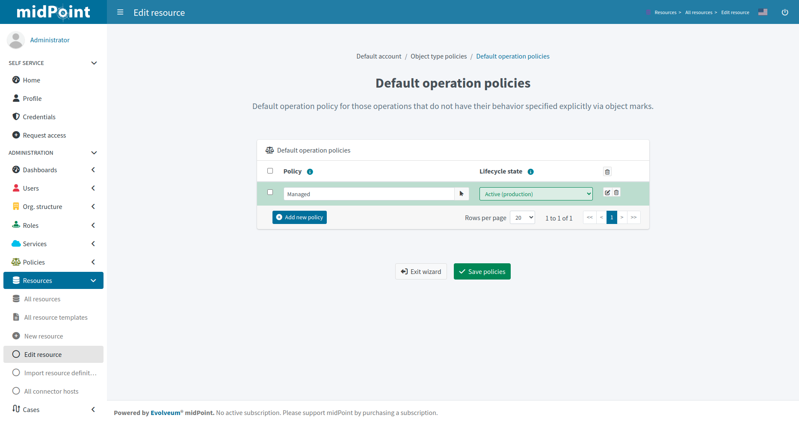
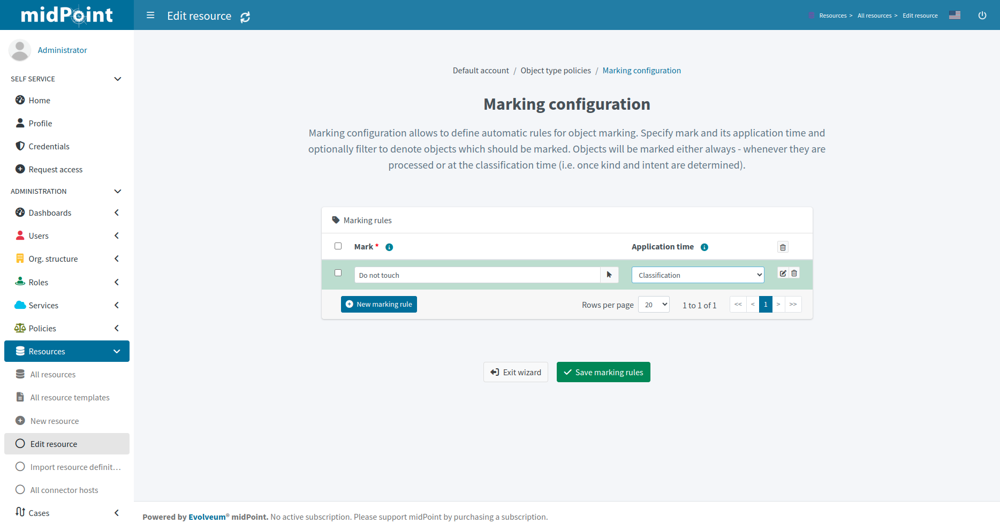

= Resource wizard: Object type policies
:page-nav-title: Policies
:page-toc: top
:page-since: "4.9"

Object type policies define default behavior of midPoint based on the concept of object marks. Automatic marking rules and default operation policy can be defined.

Default operation policy defines behavior for operations if the object marks are not explicitly specified.
For example, you may need to set the Default operation policy as `Unmanaged` to make all objects of the object type effectively read-only (outbound behavior will be ignored) during object management migration to midPoint.

TIP: Default operation policy is heavily used in xref:/midpoint/methodology/group-synchronization/[]

Click btn:[Save policies] when done to return to the previous page from which you started the default operation policies editor.

Marking configuration allows to define automatic rules for object marking.
Specify mark and its application time and optionally a *filter* to denote objects which should be marked.
Objects will be marked either `always` - whenever they are processed or at the `classification` time - when the object is classified by midPoint for the first time.

Click btn:[Save marking rules] when done to return to the previous page from which you started the marking editor.

include::../../configuration-resource-panels.adoc[]

include::../../how-to-use-lifecycle-state.adoc[]
