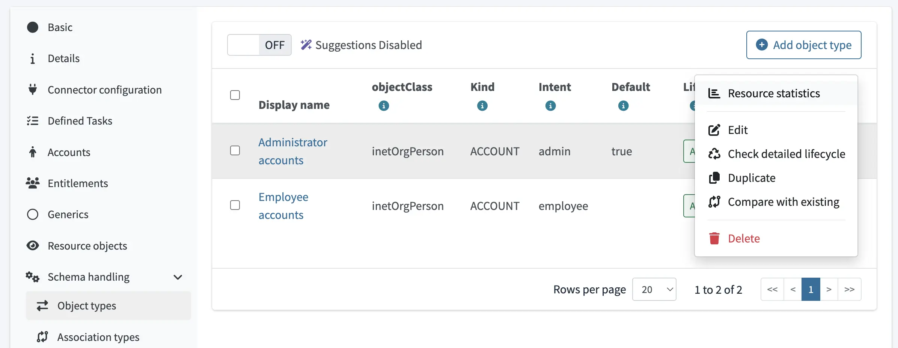
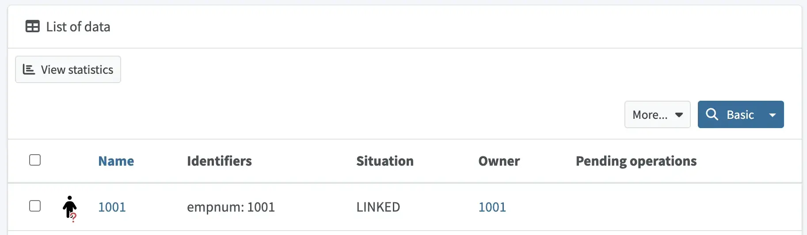
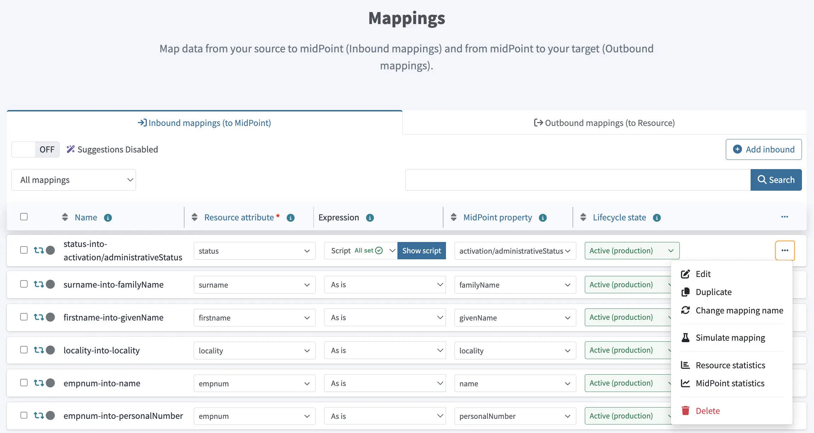
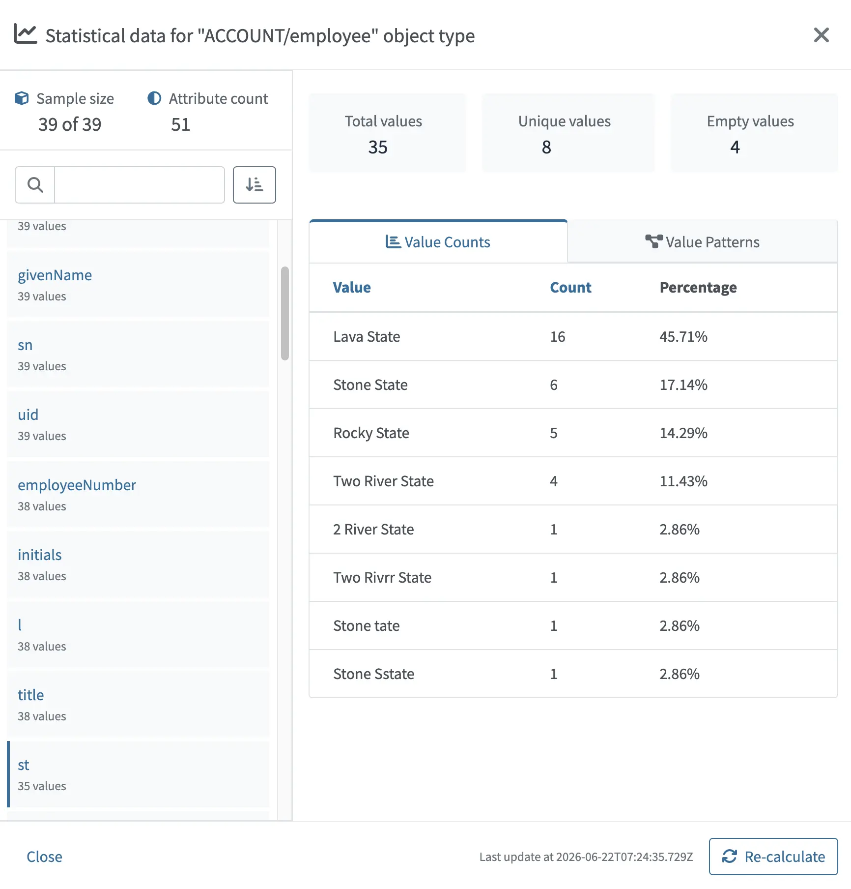

= Attribute Statistics
:toc: top
:experimental:
:page-keywords: attribute statistics, statistic, statistics, value count, ai suggestion, suggestions, suggestion, sample size
:page-description: This conceptual overview describes attribute statistics in midPoint and explains how they help evaluate AI-generated suggestions when configuring resources.

This conceptual overview describes attribute statistics in midPoint and explains how they help evaluate AI-generated suggestions when configuring resources.

== Introduction

Attribute statistics in midPoint help you make more qualified and confident decisions when working with AI-driven suggestions during resource onboarding and configuration.

When connecting a new resource to midPoint, midPoint allows you to use AI to generate suggestions in areas such as object class delineation and inbound and outbound attribute mappings.
In order to generate suggestions, midPoint utilizes the information it has about the resource (such as the schema, documentation, and data samples), and the current schema of midPoint.

As AI suggestions may not always be perfect, they should be reviewed before they are accepted.
Attribute statistics provide transparency into the underlying data, and allow you to asses the validity of the provided suggestions.

In short, attribute statistics help you answer a critical question: "Can I trust this AI suggestion based on how the data actually looks?"

== Where to find statistics

Attribute statistics are available for:

* xref:/midpoint/reference/admin-gui/resource-wizard/object-type/[Object types] - Where they help you delineate resource objects into midPont object types. +
You can view these statistics by going to [.nowrap]#icon:database[] btn:[Resources]# > [.nowrap]#icon:database[] btn:[All resources]# > _resource_ > [.nowrap]#icon:gears[] btn:[Schema handling]# > [.nowrap]#icon:exchange-alt[] btn:[Object types]#, and selecting [.nowrap]#icon:chart-bar[] btn:[Resource statistics]# in the icon:ellipsis-h[] actions menu for a particular object type.

+

+
You can access the same statistics by clicking _object type_ > [.nowrap]#icon:magnifying-glass[] btn:[Preview data]# > [.nowrap]#icon:chart-bar[] btn:[View statistics]#.

+

* xref:/midpoint/reference/admin-gui/resource-wizard/object-type/mapping/[Object type mappings] - Here, statistics help you to asses the validity of mappings within an object type. +
Statistics are available separately for resources, [.nowrap]#icon:chart-bar[] btn:[Resource statistics]#, and for the midPoint side, [.nowrap]#icon:line-chart[] btn:[MidPoint statistics]#, allowing you to check both sides of mappings.

+

== What statistics provide

Attribute statistics are computed from objects, indicated as [.nowrap]#icon:cube[] *Sample size*#, and attributes of those objects, indicated by [.nowrap]#icon:adjust[] *Attribute count*#.

Statistics expose the following key data characteristics:

* *Value Counts* - This value distribution shows how frequently individual values occur.
For example, for account status, you can see how many accounts are enabled/disabled.
* *Cardinality* - By comparing the *Total values* and *Unique values* tiles, you can check how many values are unique within a dataset.
This is a good indicator that an attribute may be suitable for identification or correlation.
You can check the [.nowrap]#icon:chart-bar[] *Value Counts*# tab for specific details.
* *Data quality* - Statistics highlight potential issues such as missing or null values, or irregular and inconsistent formats.
See the *Empty values* tile for their count, or check the [.nowrap]#icon:chart-bar[] *Value Counts*# and [.nowrap]#icon:project-diagram[] *Value Patterns*# tabs for specific details.
* *Value Patterns* - Shows common structural patterns found in the data, such as various prefixes and suffixes.
This is typically used to identify specific object types during delineation.
For example, value patterns make it easier for you to identify administrator accounts that are often prefixed using "adm-".

To help you work with attribute statistics, you can use the following functionality:

* *Searching* - A search field is available to quickly locate attributes by name.
This is especially useful for object classes with large attribute sets.
* *Re-calculation* - If your source data has changed since the last time you had midPoint show you attribute statistics, you can click the [.nowrap]#icon:sync[] btn:[Re-calculate]# button in the right lower corner of the statistics detail pop-up to renew the statistics based on the current data.
You can see the time of the last calculation to the left from the button.

Note that depending on the resource, computation may take a few moments.

== Usage examples

Attribute statistics help you with the following:

* *Validating AI suggestions* - By viewing individual attributes data, you can validate that the suggestions are representative of the entire data set.
For example, you may explore the underlying data to understand why AI has generated a particular script for a mapping.
* *Determine strong identifier candidates* - By identifying attributes with near-total, or total uniqueness, and stable and consistent formatting, you can determine quality candidates for correlation.
* *Detecting weak suggestions* - If you see skewed distributions, high null ratios, or unexpected value patters, you may need to review and adjust an AI suggestion.