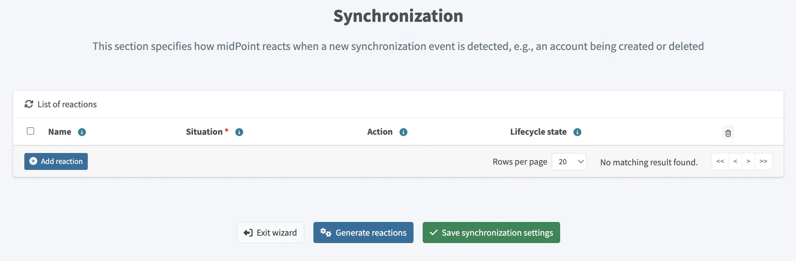
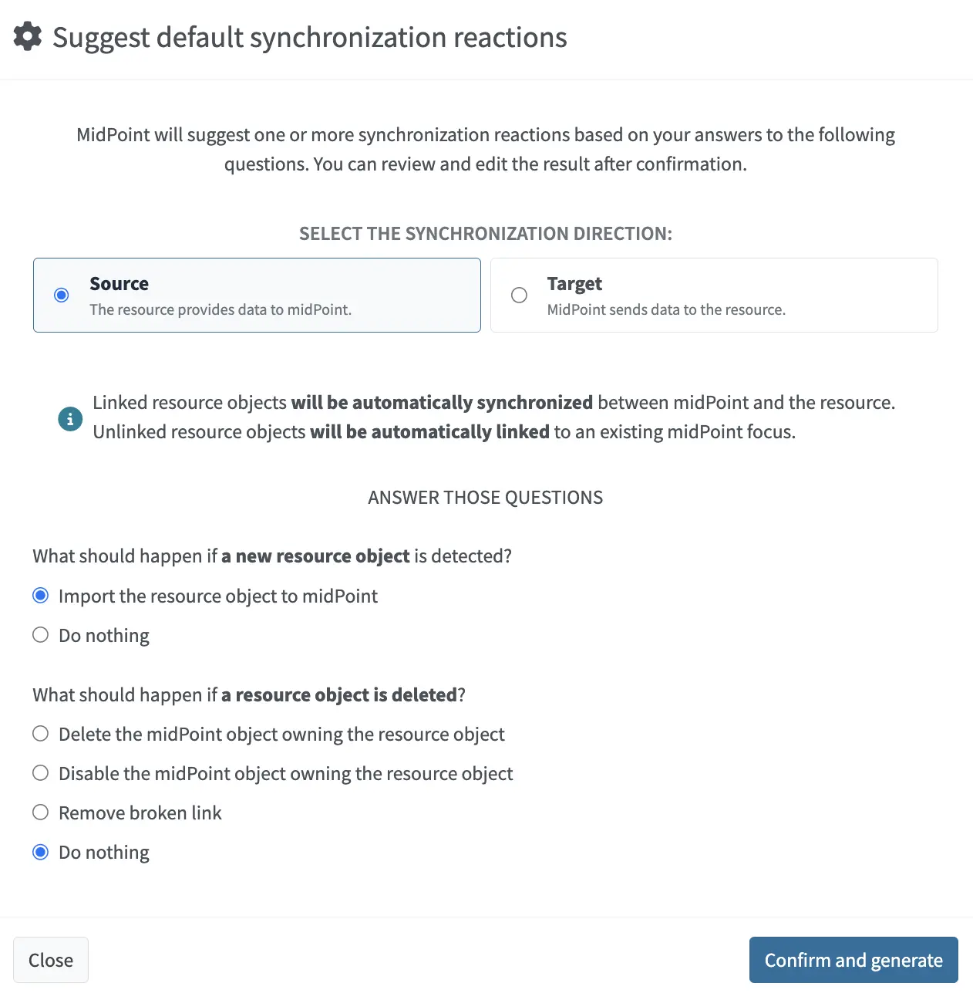
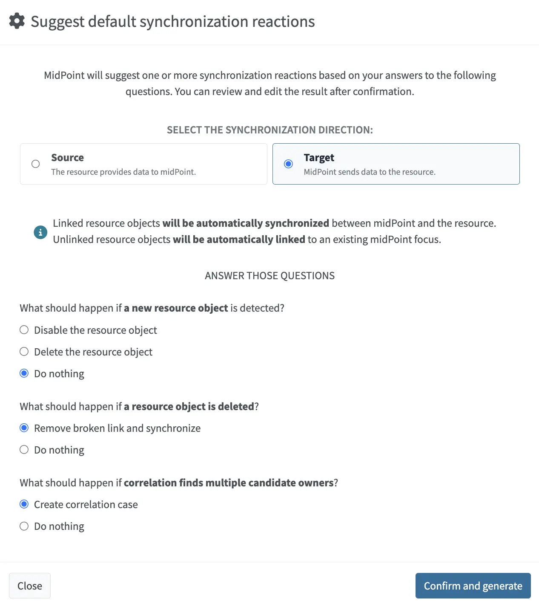

= Resource wizard: Object type synchronization
:page-nav-title: Synchronization
:page-toc: top
:page-since: "4.9"
:experimental:
:page-keywords: synchronization, synchronization reactions, synchronization rules, reactions to synchronization situations
:page-description: This describes how to set up synchronization reactions in the resource wizard.

This describes how to set up synchronization reactions in the resource wizard.

== Introduction

Synchronization in midPoint is the mechanism that keeps identity data consistent between midPoint and connected systems.
It reacts to changes based on the defined synchronization reactions.

You can use the synchronization wizard to define xref:/midpoint/reference/synchronization/situations/[reactions to synchronization situations].
These situation–action pairs represent the state of resource objects (e.g., accounts) in relation to midPoint and appropriate actions to be executed by midPoint in the particular situation.

image::./sync-rules-setup-accounts-configure-menu.webp[Configuration menu in resource accounts list as an entry point to the synchronization wizard]

For more technical details, refer to xref:/midpoint/reference/resources/resource-configuration/schema-handling/synchronization/[].

[[setup-synchronization-reactions]]
== Set up synchronization reactions

. In [.nowrap]#icon:database[]  *Resources*# > [.nowrap]#icon:database[] *All Resources*#, select your resource.
. In [.nowrap]#icon:male[] *Accounts*#, click [.nowrap]#icon:cog[] btn:[Configure]# > [.nowrap]#icon:arrows-rotate[] *Synchronization*#.
. You can:
    ** Add synchronization reactions manually by clicking [.nowrap]#icon:circle-plus[] btn:[Add reaction]# and setting up <<situations-and-actions, situations and actions>>.
    ** Generate synchronization reactions as described in <<generate-reactions>>.
. Click [.nowrap]#icon:check[] btn:[Save synchronization settings]# when done.

You can delete a reaction using the [.nowrap]#icon:trash-alt[] btn:[Delete]# button.

image::./sync-rules-setup-rules-list.webp[Configured synchronization reactions]

You can access a more complex configuration for each reaction using the [.nowrap]#icon:edit[] btn:[Edit]# button:

[%autowidth, cols="a,a,a", frame=none, grid=none, role=center]
|===
| image::step-3-synch-detail-basic.png[100%, title=Basic configuration of a synchronization reaction]
| image::step-3-synch-detail-action.png[100%, title=Action for a synchronization reaction]
| image::step-3-synch-detail-optional.png[100%, title=Optional attributes for a synchronization reaction]
|===

[[situations-and-actions]]
== Situations and actions

For each reaction, you need to configure the following options:

* *Name* of the reaction configuration. This is not mandatory but it helps when troubleshooting and using resource template inheritance.
* *Situation* contains the following options:
** *Linked*: The resource object is linked to its midPoint owner (focus object).
** *Unlinked*: A new resource object has been found and its owner (focus) can be determined but there is no link between them.
** *Deleted*: There is a focus in midPoint for the resource object but the resource object no longer exists.
** *Unmatched*: A new resource object has been found but midPoint cannot determine any owner (focus) for the account.
** *Disputed*: MidPoint has determined multiple potential midPoint owners (foci) for a single resource account. Alternatively, this may be a result of a xref:/midpoint/reference/correlation/[correlation] with an outcome that is not fully trusted.
* *Action* defines what to do in a particular situation:
** *Add focus*: Create a new object in midPoint based on the resource data.
** *Synchronize*: Synchronize data between midPoint object (focus) and resource data based on xref:../mapping[object type mapping]. Typically used for the _linked_ situation.
** *Link*: Link previously not linked resource object to focus.
** *Delete resource object*: Delete resource object.
** *Inactivate resource object*: Inactivate (disable) resource object.
** *Inactivate focus*: Inactivate (disable) midPoint object.
** *Delete focus*: Delete midPoint object.
** *Create correlation case*: Create a case to let midPoint administrator resolve the situation interactively (useful for the _Disputed_ situation).
* *Lifecycle state* defines the lifecycle state of the reaction. Useful for xref:/midpoint/reference/admin-gui/simulations/[simulations].

[TIP]
====
For example, for authoritative resources, you can set action to _Add focus_ for the _Unmatched_ situation.
For non-authoritative target systems, you would then use the _Inactivate resource object_ action for the same situation.
====

Refer to xref:/midpoint/reference/schema/focus-and-projections/[] for an explanation of the term _focus_.
In the most basic scenarios, when synchronizing users and their accounts, _focus_ corresponds to the user object in midPoint.

[[generate-reactions]]
== Generate synchronization reactions

For higher efficiency, you can generate synchronization reactions as opposed to creating them manually.

. Click [.nowrap]#icon:gears[] btn:[Generate reactions]# button to generate synchronization reactions.
. Select the synchronization direction:
** *Source* - If a resource provides data to midPoint.
+

** *Target* - If midPoint provides data to a resource.
+

. Answer the questions for the given synchronization direction to help the midPoint understand your requirements and generate appropriate synchronization reactions.
. Click [.nowrap]#icon:check[] btn:[Confirm and generate]#.
. Review the generated synchronization reactions and make any necessary adjustments as described in <<setup-synchronization-reactions>>.
. Click [.nowrap]#icon:check[] btn:[Save synchronization settings]# when done.

include::../../see-also.adoc[]
