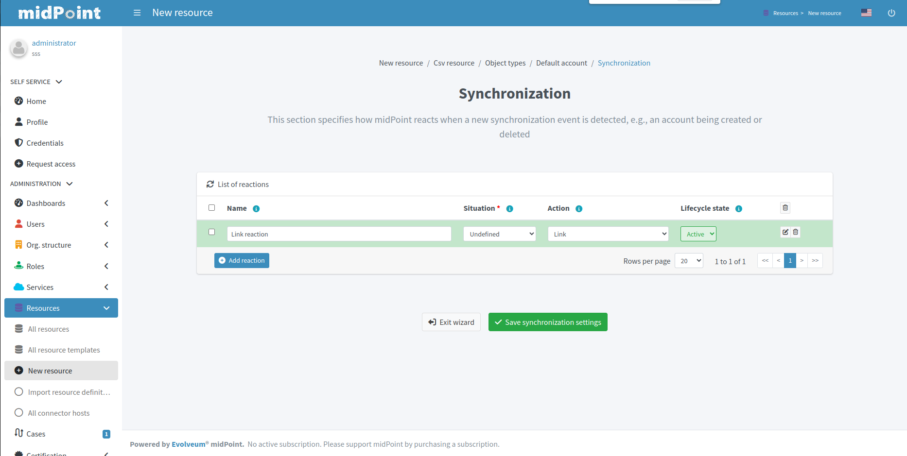

= Resource wizard: Object type synchronization
:page-nav-title: Synchronization
:page-toc: top
:page-since: "4.9"

This part of object type wizard allows you to define xref:/midpoint/reference/synchronization/situations/[synchronization situations and reactions].
These situations represent state of the resource object (e.g. account) in relation to midPoint and appropriate action that should be executed by midPoint.

For the situations you need to configure:

* *Name* of the situation/reaction configuration. This is technically not mandatory, but helps a lot during troubleshooting and when using resource template inheritance.
* *Situation* allows you to select an appropriate situation:
** *Linked* refers to situation when the resource object is linked to its midPoint owner
** *Unlinked* refers to situation when a new resource object has been found and its owner can be determined, but there is no link between the midPoint owner and resource object
** *Deleted* refers to situation when the resource object was references by midPoint owner but the resource object has been deleted
** *Unmatched* refers to situation when a new resource object has been found but midPoint cannot determine any owner for the account
** *Disputed* refers to situation when the midPoint has determined more potential midPoint owners for a single resource account or if the correlation of the resource object is not definitive (not fully trusted)
* *Action* allows you to select midPoint behavior if the resource object is in the defined Situation
** *Add focus* allows to create a new object in midPoint based on the resource data
** *Synchronize* allows to synchronize data between midPoint object and resource data based on the <<Mappings,mappings>>. This action is typical for `linked` situation.
** *Link* allows to link previously not linked resource object to midPoint object
** *Delete resource object* allows to delete resource object
** *Inactivate resource object* allows to inactivate (disable) resource object
** *Inactivate focus* allows to inactivate (disable) midPoint object
** *Delete focus* allows to delete midPoint object
** *Create correlation case* allows to resolve the situation interactively (useful for `Disputed` situation)
* *Lifecycle state* allows you to define the lifecycle state of the situation/reaction configuration. This can be used during xref:/midpoint/reference/admin-gui/simulations/[Simulations], e.g. specifying lifecycle state as `Proposed` will be used only to simulate the synchronization/reaction configuration, `Draft` disables the synchronization/reaction configuration etc.

TIP: The logic of situation and action is up to you. E.g. it is perfectly OK to have reaction `Add focus` for `Unmatched` situation for an authoritative source system such as HR. For target system, however, probably more appropriate reaction for `Unmatched` situation would be `Inactivate resource object`.

TIP: Please refer to xref:/midpoint/reference/schema/focus-and-projections/[Focus and Projections] for explanation of the term _Focus_. In the most basic scenarios when synchronizing users and their accounts, _focus_ corresponds to User object in midPoint.

More complex configuration is possible by clicking btn:[Edit] button:

[%autowidth, cols="a,a", frame=none, grid=none, role=center]
|===
| image::step-3-synch-detail-basic.png[link=step-3-synch-detail-basic.png, 100%, title=Basic configuration of synchronizatio rule]
| image::step-3-synch-detail-action.png[link=step-3-synch-detail-action.png, 100%, title=Action for synchronization rule]

| image::step-3-synch-detail-optional.png[link=step-3-synch-detail-optional.png, 100%, title=Optional attributes for synchronization rule]
|
|===

Situation/reaction configuration can be deleted by clicking btn:[Delete] button.

Click btn:[Save synchronization settings] when done to return to the previous page from which you started the synchronization editor.

include::../../configuration-resource-panels.adoc[]

include::../../how-to-use-lifecycle-state.adoc[]
