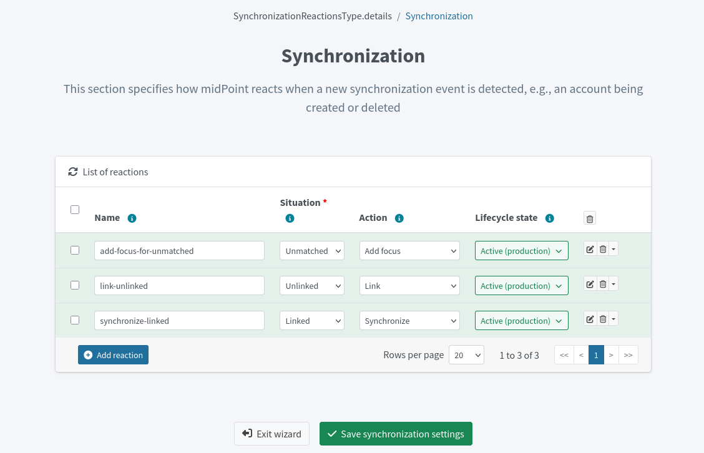

= Resource wizard: Object type synchronization
:page-nav-title: Synchronization
:page-toc: top
:page-since: "4.9"
:experimental:

You can use the synchronization rules wizard to define xref:/midpoint/reference/synchronization/situations/[reactions to synchronization situations].
These situation–action pairs represent the state of resource objects (e.g., accounts) in relation to midPoint and appropriate actions to be executed by midPoint in the particular situation.

== Set up synchronization rules

. In icon:database[] Resources > icon:database[] All Resources, select your resource.
. In icon:male[] Accounts, click icon:cog[] Configure > icon:arrows-rotate[] Synchronization.
. Click icon:circle-plus[] btn:[Add reaction] and set up the name, situation, action, and lifecycle state for each situation–action pair.
. Click icon:check[] btn:[Save synchronization settings] when done.

You can delete a reaction using the icon:trash-alt[] btn:[Delete] button.

You can access a more complex configurations for each reaction using the icon:edit[] btn:[Edit] button:

[%autowidth, cols="a,a,a", frame=none, grid=none, role=center]
|===
| image::step-3-synch-detail-basic.png[link=step-3-synch-detail-basic.png, 100%, title=Basic configuration of synchronizatio rule]
| image::step-3-synch-detail-action.png[link=step-3-synch-detail-action.png, 100%, title=Action for synchronization rule]
| image::step-3-synch-detail-optional.png[link=step-3-synch-detail-optional.png, 100%, title=Optional attributes for synchronization rule]
|===

== Possible situations and actions

For each reaction rule, you need to configure its name, situation, action, and the lifecycle state of the rule:

* *Name* of the reaction rule configuration. This is technically not mandatory but helps a lot during troubleshooting and when using resource template inheritance.
* *Situation* can be the following:
** *Linked*: The resource object is linked to its midPoint owner (focus object).
** *Unlinked*: A new resource object has been found and its owner (focus) can be determined but there is no link between them.
** *Deleted*: There is a focus in midPoint for the resource object but the resource object no longer exists.
** *Unmatched*: A new resource object has been found but midPoint cannot determine any owner (focus) for the account.
** *Disputed*: The midPoint has determined multiple potential midPoint owners (foci) for a single resource account. Alternatively, this may be a result of a xref:/midpoint/reference/correlation/[correlation] with an outcome that isn't fully trusted.
* *Action* defines what to do in a particular situation:
** *Add focus*: Create a new object in midPoint based on the resource data.
** *Synchronize*: Synchronize data between midPoint object (focus) and resource data based on xref:../mapping[object type mappings]. Typically used for the _linked_ situation.
** *Link*: Link previously not linked resource object to focus.
** *Delete resource object*: Delete resource object.
** *Inactivate resource object*: Inactivate (disable) resource object.
** *Inactivate focus*: Inactivate (disable) midPoint object.
** *Delete focus*: Delete midPoint object.
** *Create correlation case*: Create a case to let midPoint administrator resolve the situation interactively (useful for the _Disputed_ situation).
* *Lifecycle state* defines the lifecycle state of the reaction rule. Useful for xref:/midpoint/reference/admin-gui/simulations/[simulations].

[TIP]
====
The setup of reactions to situations is up to you.
For example, it's perfectly fine to have the action _Add focus_ for the _Unmatched_ situation when the resource is authoritative.
For non-authoritative target systems, though, you would probably want to use the _Inactivate resource object_ action in such a situation.
====

Refer to xref:/midpoint/reference/schema/focus-and-projections/[] for an explanation of the term _focus_. In the most basic scenarios when synchronizing users and their accounts, _focus_ corresponds to the user object in midPoint.

include::../../configuration-resource-panels.adoc[]

include::../../how-to-use-lifecycle-state.adoc[]
