= Resource wizard: Wizard for existing resource
:page-nav-title: Wizard for existing resource
:page-toc: top
:page-since: "4.9"

The resource object type wizard can be used also for editing existing resource settings.

Navigate to one of the resource object panels (*Accounts*, *Entitlements* or *Generic*), select the object type by its display name and click btn:[Configure], then select button for particular part of object type wizard.

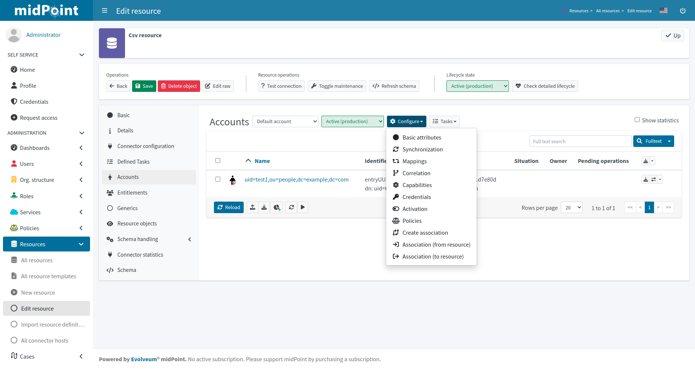

The existing association configuration can be also accessed from *Configure* menu, typically for *Accounts*.

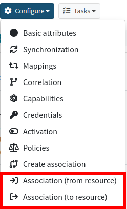

== Wizard for task creation

The resource wizard allows creation of resource-related tasks without going to "Server tasks" menu.
It allows even more: wizard-like creation of these tasks.

You can create the following types of tasks for your resource objects:

* Import from resource
* Reconciliation
* Live synchronization

All these tasks can be created as standard tasks or xref:/midpoint/reference/admin-gui/simulations/[simulated tasks].

=== Standard (non-simulated) tasks

To create a new non-simulated task within the resource wizard, navigate to one of the resource object panels (*Accounts*, *Entitlements* or *Generics*) and click btn:[Tasks], then click *Create task*.

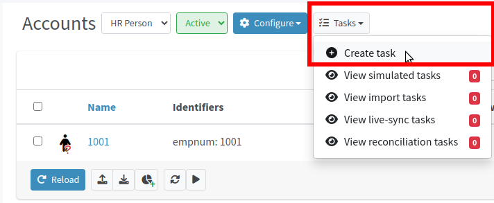

Keep the *Simulate task* switch set to *OFF*.

Select the xref:/midpoint/reference/tasks/synchronization-tasks/[task] to be created (Import, Reconciliation, Live synchronization) by clicking one of the tiles:

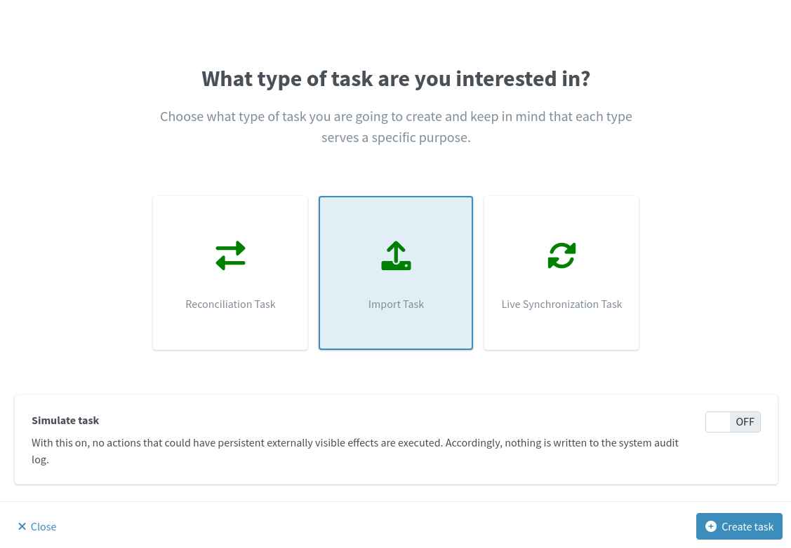

Click btn:[Create task] to start task creation wizard.

Define basic information for the task:

* *Name* will be used as the task name. If you do not define the task name, it will be generated automatically based on the task type, resource and object type display name, e.g. `Import task: HR System: HR Person`.

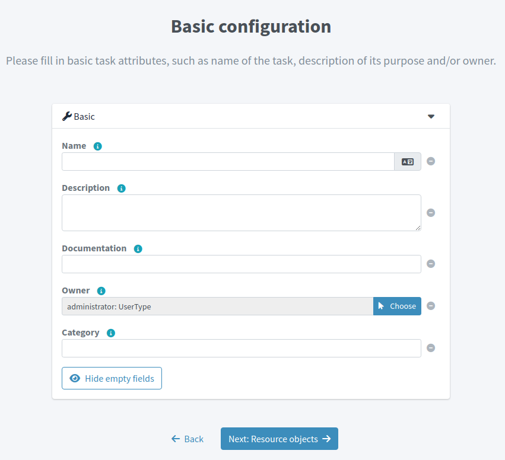

Click btn:[Next: Resource objects] to continue with the task creation.

Define resource-related information for the task.
Normally you don't need to define anything as the task creation wizard will use the information from the resource and object type, where you have started it and *Resource*, *Kind*, *Intent* and/or *Object class* will be already predefined.

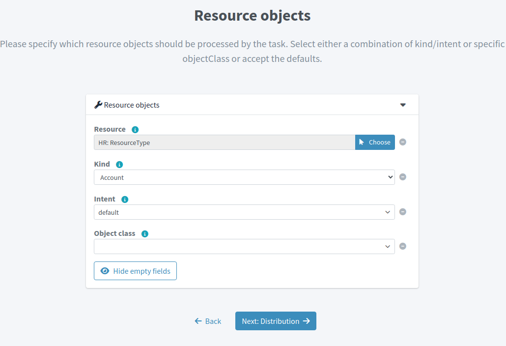

Click btn:[Next: Distribution] to continue with the task creation.

Define distribution information for the task, currently only *Worker threads* you want to use for the task run.
The default value is a single worker.

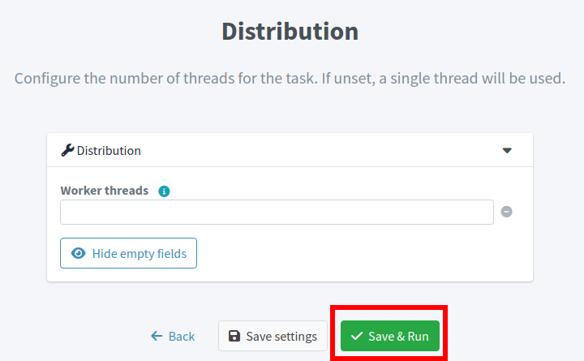

Click btn:[Save & Run] to save and start task immediately or click btn:[Save settings] to create but not start the task.

You can get to the task details either using menu:Server tasks[All tasks] or clicking *Defined tasks* menu item in the resource details.

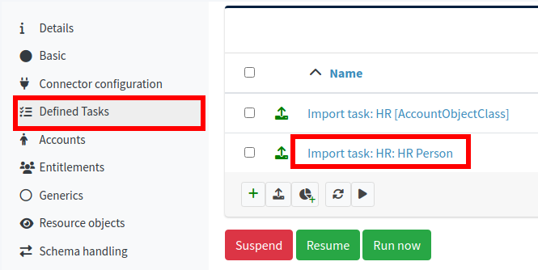

=== Simulated tasks

To create a new simulated task within the resource wizard, navigate to one of the resource object panels (*Accounts*, *Entitlements* or *Generics*) and click btn:[Tasks], then click *Create task*.

Switch the *Simulate task* to *ON*.

Select the xref:/midpoint/reference/tasks/synchronization-tasks/[task] to be created (Import, Reconciliation, Live synchronization) by clicking one of the tiles:

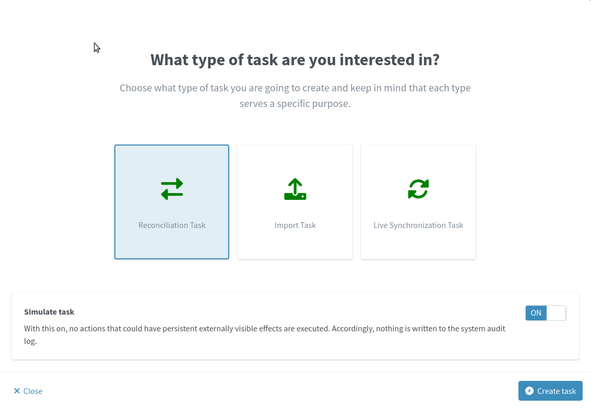

Click btn:[Create task] to start task creation wizard.

Define basic information for the task:

* *Name* will be used as the task name. If you do not define the task name, it will be generated automatically based on the task type, resource and object type display name, e.g. `Import task: HR System: HR Person`.
In the following image we are using a custom task name `Reconciliation with AD - development simulation`.

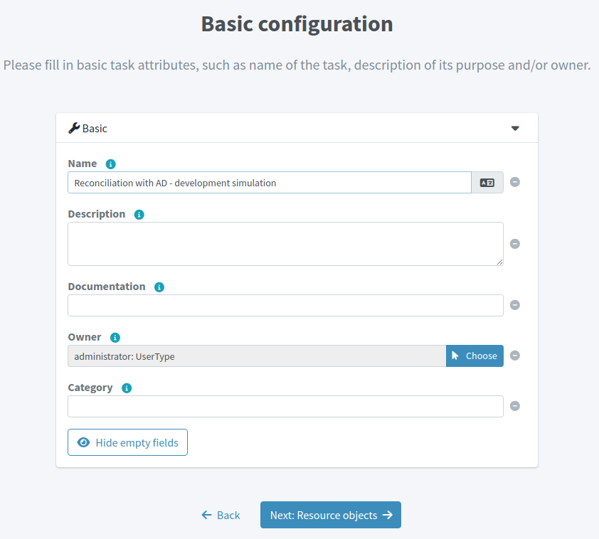

Click btn:[Next: Resource objects] to continue with the task creation.

Define resource-related information for the task.
Normally you don't need to define anything as the task creation wizard will use the information from the resource and object type, where you have started it and *Resource*, *Kind*, *Intent* and/or *Object class* will be already predefined.

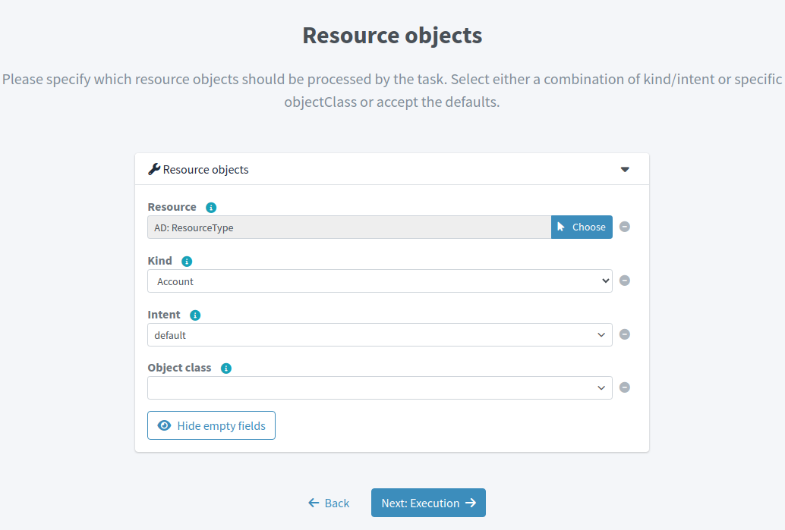

Click btn:[Next: Execution] to continue with the task creation. The "Execution" parameters can be edited only for simulated tasks.

Define execution-related information for the task.
This allows to configure the task xref:/midpoint/reference/admin-gui/simulations/[simulation parameters]:

.Execution
* *Mode* allows to specify either `Full` or `Preview` execution modes. For simulation, select `Preview` (which is automatically set as default when creating a simulated task)

.Configuration to use
* *Predefined* allows to specify the configuration that will be used for the simulation.
** *Development* allows evaluating all configuration which is in lifecycle state `Active` or `Proposed`
** *Production* allows evaluating all configuration which is in lifecycle state `Active` or `Deprecated`

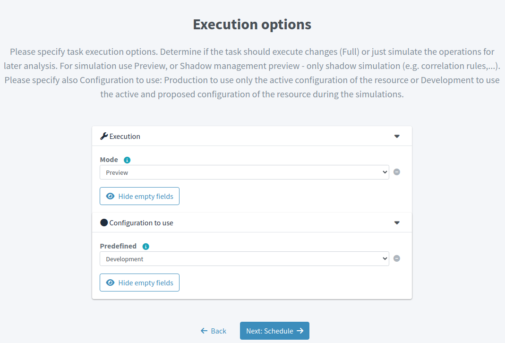

Click btn:[Next: Schedule] to continue with the task creation. The "Schedule" parameters can be edited only for reconciliation and/or live synchronization tasks.

Define scheduling-related information for the task.

TIP: Scheduling usually does not make much sense when creating a simulated task.

* *Interval* allows defining scheduling interval in seconds
* *Cron-like pattern* allows defining scheduling intervals via cron-like pattern

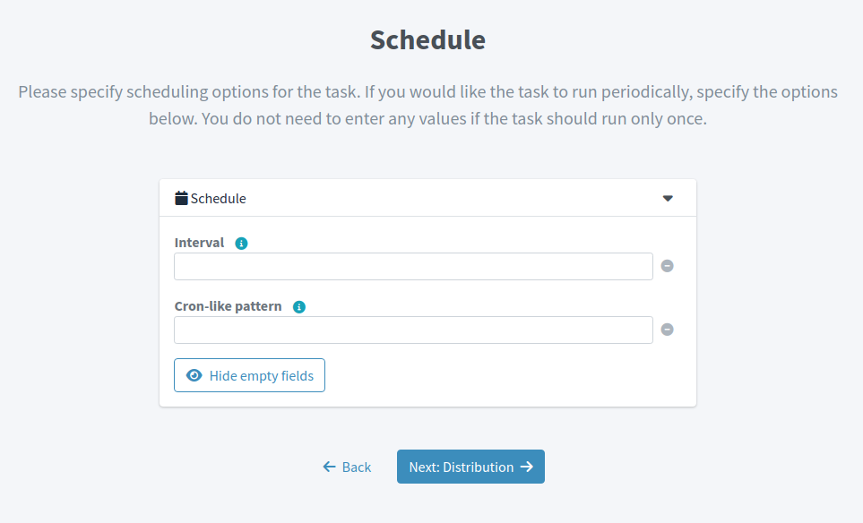

Click btn:[Next: Distribution] to continue with the task creation.

Define distribution information for the task, currently only *Worker threads* you want to use for the task run.
The default value is a single worker.

Click btn:[Save & Run] to save and start task immediately or click btn:[Save settings] to create but not start the task.

You can get to the task details either using menu:Server tasks[All tasks] or clicking *Defined tasks* menu item in the resource details.

include::../configuration-resource-panels.adoc[]
