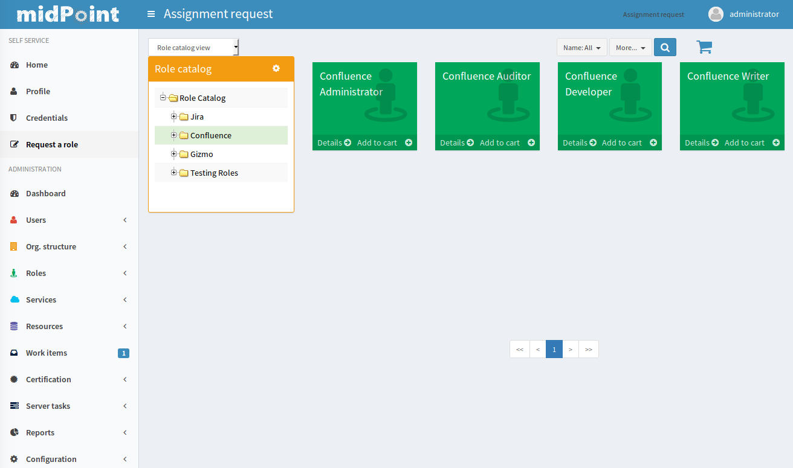
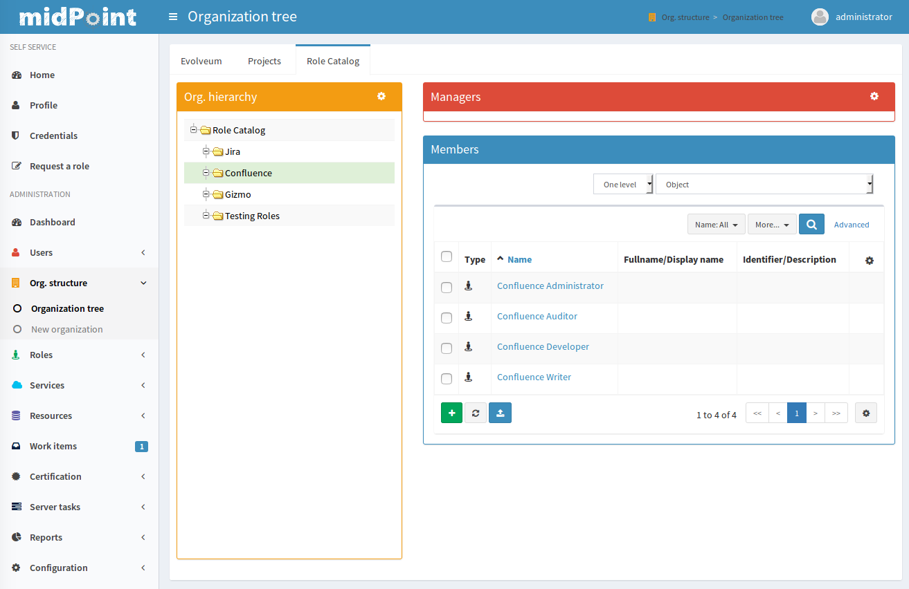

= Role Catalog
:page-wiki-name: Role Catalog
:page-wiki-id: 24085265
:page-wiki-metadata-create-user: semancik
:page-wiki-metadata-create-date: 2017-02-16T09:19:52.585+01:00
:page-wiki-metadata-modify-user: semancik
:page-wiki-metadata-modify-date: 2017-07-10T14:09:49.121+02:00
:page-since: "3.5"
:page-midpoint-feature: true
:page-alias:  [ { "parent" : "/midpoint/features/current/" }, { "parent" : "/midpoint/reference/roles-policies/" } ]
:page-upkeep-status: yellow

One of the drawbacks of the general RBAC models is that there is usually a large number of roles to choose from.
MidPoint xref:/midpoint/reference/roles-policies/rbac/[advanced hybrid RBAC model] can keep the number of roles at reasonable level.
But even in that case there is usually hundreds or even thousands of roles if the organization is considerably complex.
We need to keep this number of roles manageable for both the end users and administrators.
Therefore midPoint implements a concept of _role catalog_ to organize the roles into categories.

The role catalog has two purposes and therefore it is also presented in two slightly different ways.

== Role Catalog for End Users

The first purpose of role catalog is to make xref:/midpoint/reference/admin-gui/role-request/[role requests]  easy for *end users*. The role catalog is used to present the roles in a similar way as an e-shop presents the products.
The roles are sorted into categories and sub-categories.
The user may browse the role catalog and select the roles.
Then the user can put the roles in a xref:/midpoint/reference/admin-gui/role-request/["shopping cart"] and "buy" them.
This catalog and e-shop paradigm is quite natural for most end users and it requires little to no training.

== Role Catalog for Administrators

The second purpose of role catalog is to make *role administration* and management easy.
Role catalog is essential just an xref:/midpoint/reference/org/organizational-structure/[organizational structure] (see below).
Therefore it can be used to set up xref:/midpoint/reference/security/authorization/[fine-graned authorizations and delegated administration] of the roles.
For example the application roles may be sorted to categories that represent applications and application modules.
In that case the management of the application roles can be delegated to application or module owners.

== Role Catalog Implementation and Configuration

See xref:/midpoint/reference/admin-gui/role-catalog/configuration/[Role Catalog Configuration] page for description of role catalog implemenation and configuration details.

== See Also

* xref:/midpoint/reference/roles-policies/rbac/[Advanced Hybrid RBAC]

* xref:/midpoint/reference/org/organizational-structure/[Organizational Structure]

* xref:/midpoint/reference/admin-gui/role-catalog/configuration/[Role Catalog Configuration]

* xref:/midpoint/reference/admin-gui/role-request/[Role Request and Shopping Cart]