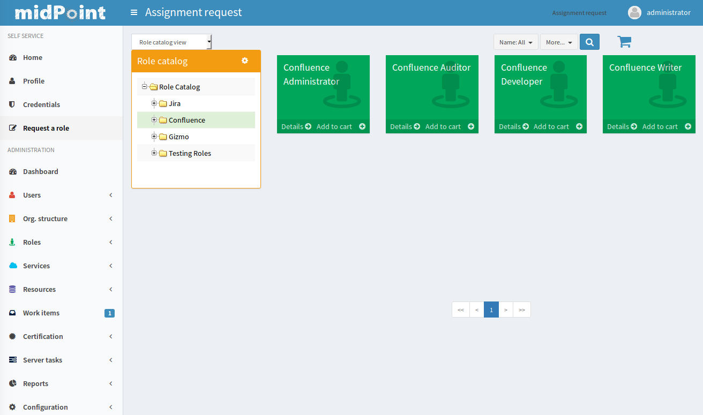

= Role Request and Shopping Cart
:page-wiki-name: Role Request and Shopping Cart
:page-wiki-id: 24674353
:page-wiki-metadata-create-user: semancik
:page-wiki-metadata-create-date: 2017-05-26T12:06:54.726+02:00
:page-wiki-metadata-modify-user: semancik
:page-wiki-metadata-modify-date: 2017-07-10T14:27:07.600+02:00
:page-since: "3.5"
:page-since-improved: [ "3.6" ]
:page-midpoint-feature: true
:page-alias: [ { "parent" : "/midpoint/features/current/" }, { "parent" : "/midpoint/reference/cases/" } ]
:page-upkeep-status: yellow
:page-deprecated-since: "4.6"
:page-replaced-by: ../request-access

== Selecting Roles

Many traditional Role-Based Access Control (RBAC) theories seem to be based on assumption that there is some kind of all-knowing authority that knows which user should have which role.
This approach works in some kind of organizations, but in reality such organizations are very rare.
In practice the knowledge about roles and role policies is not centralized.
It is rather distributed among many people in the organization: application owners have part of the knowledge, line managers have more bits of knowledge, other parts are maintained by security officers and other specialists.
It is almost impossible to analyze this knowledge and specify it in a form of an algorithm that a machine can execute.
In addition to that, such policy is constantly changing.
Implementing this a fully-automated system is almost always infeasible.

Therefore most identity management and governance systems come with an alternative approach: user are requesting role assignment.
The request is then routed through an xref:/midpoint/reference/cases/approval/[approval process]. If the request is approved, then the requested roles are assigned.

However, this approach requires _end users_ to take part in the interaction.
End users are usually not experts on RBAC and they do not have comprehensive knowledge about role design and structures used in the organization.
Therefore midPoint has a simplified view of xref:/midpoint/reference/admin-gui/role-catalog/[role catalog] that is suitable for end users.
The role catalog is used to present the roles in a similar way as an e-shop presents the products.
The roles are sorted into categories and sub-categories.
The user may browse the role catalog and select the roles.

== Requesting Roles

When user selects the role to request, she or he may put the role in a "shopping cart".
Many roles may be selected in this way.
This "catalog and shopping cart" paradigm is quite natural for most end users and it requires little to no training.
When all the requested roles are in the shopping cart the user can "buy" them.
This starts the role request process.
First, the shopping cart content is checked for any potential conflicts and policy violations, such as xref:/midpoint/reference/roles-policies/segregation-of-duties/[segregation of duties] violations.
xref:/midpoint/reference/roles-policies/policy-rules/[Policy rules] that apply to the roles are evaluated and enforced and the request is routed through an xref:/midpoint/reference/cases/approval/[approval process] as specified by the policy.

== Configuration

The "catalog and shopping cart" user interface is ready made and as most parts of midPoint user interface it automatically adapts to midPoint configuration.
For example xref:/midpoint/reference/admin-gui/role-catalog/[role catalog] set up and xref:/midpoint/reference/security/authorization/[authorizations] are automatically precessed, therefore only those roles that are actually requestable by the user are displayed.
However there are still few things that may need to be customized.
The customization of this part of the user interface is described in xref:/midpoint/reference/admin-gui/role-request/configuration/[Role Request and Shopping Cart Configuration] page.

== See Also

* xref:/midpoint/reference/admin-gui/role-catalog/[Role Catalog]

* xref:/midpoint/reference/admin-gui/role-request/configuration/[Role Request and Shopping Cart Configuration]