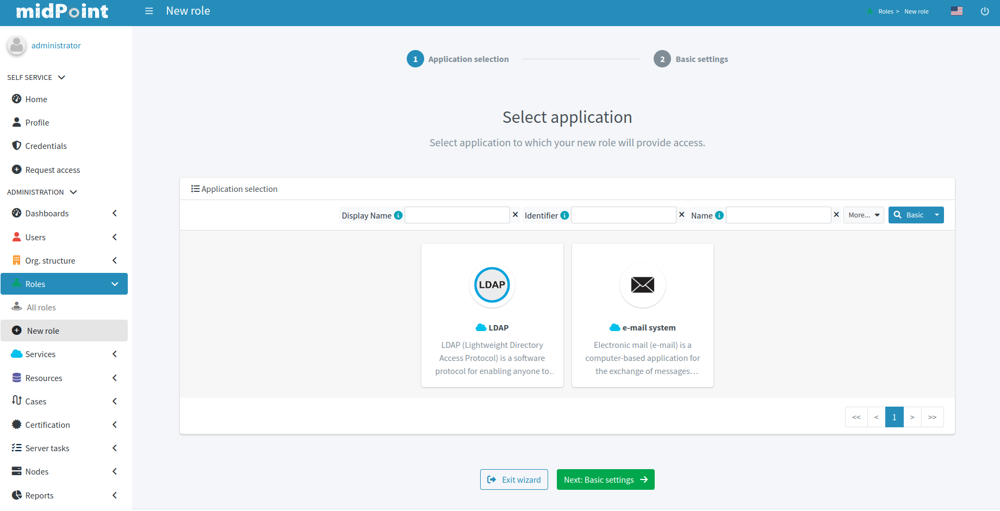
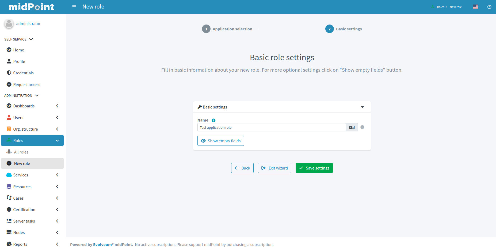
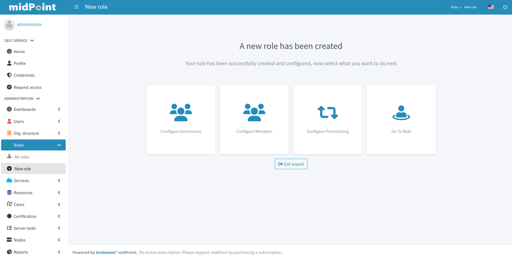
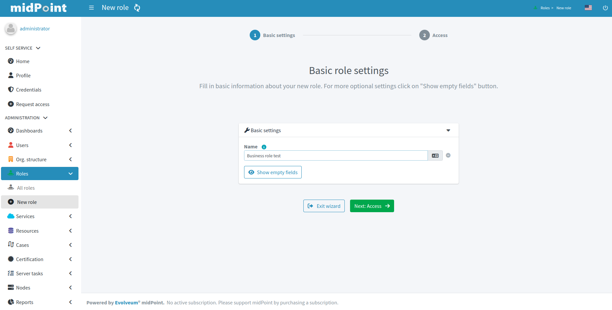
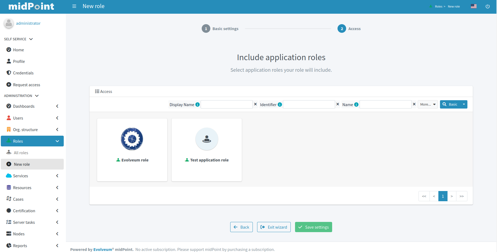
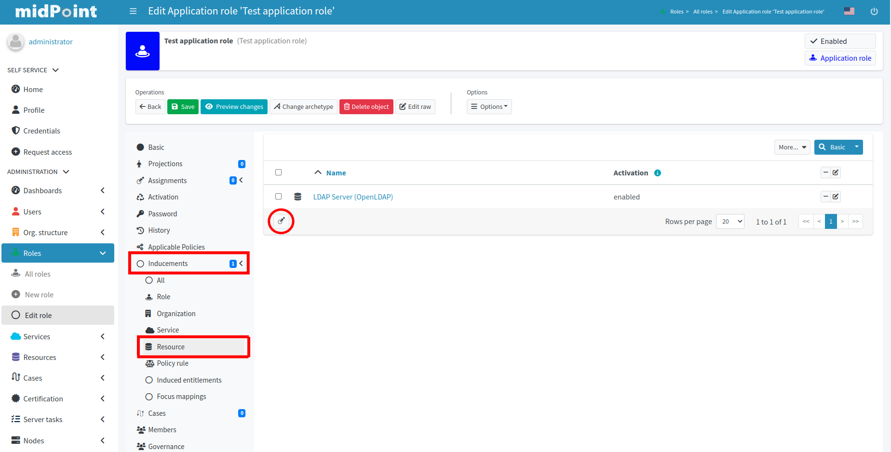

= Resource wizard
:page-toc: top
:page-since: "4.7"

Role wizard is available from midPoint version 4.6.

Some wizard panels are configurable, for more information see xref:/midpoint/reference/admin-gui/admin-gui-config/#wizard-panels[Wizard panels].

New UI takes form of some panels with choice for specific parts of resource configuration. Specific part of configuration is represented by a wizard with steps.

Midpoint support role wizard only for _Application role_ and _Business role_.

== Application role wizard
In the role wizard for the application role, we can select _Application_, set the new role's basic attributes, add users to the new role, and create a inducement for resource with associations and mappings.

We can skip the application selection and add a inducement in the step later.

.Application catalog

.Basic attributes of role

The role is created after submitting the attributes. Next, we see titles with additional possibilities.

We can add governance users, member users, create a inducement for a resource or view the currently created role.

{empty} +
Members panels:
[%autowidth, cols="a,a", frame=none, grid=none, role=center]
|===
| image::arw-step-3-governance.png[link=arw-step-3-governance.png, 100%, title=Panel for adding governance user]
| image::arw-step-3-member.png[link=arw-step-3-member.png, 100%, title=Panel for adding user as member]
|===

{empty} +
Configuration provisioning:

[%autowidth, cols="1a,1a", frame=none, grid=none, role=center]
|===
| image::arw-step-4-select-resource.png[link=arw-step-4-select-resource.png, 100%, title=Selecting of resource]
| image::arw-step-4-select-object-type.png[link=arw-step-4-select-object-type.png,100%, title=Selecting of resource object type]

| image::arw-step-4-selecting-of-association.png[link=arw-step-4-selecting-of-association.png, 100%, title=Selecting of associations]
| image::arw-step-4-configuration-of-outbound-mappings.png[link=arw-step-4-configuration-of-outbound-mappings.png, 100%, title=Configuration of outbound mappings]
|===

== Business role wizard
In the role wizard for the business role, we can set the new role's basic attributes,select _Application roles_ and add users to the new role.

.Basic attributes of role

We need to select at least one application role.

.Application role catalog

== Wizard for existing role

If we want to create a new incentive for a resource, only then we can view wizard for the provisioning configuration.

.Role detail

