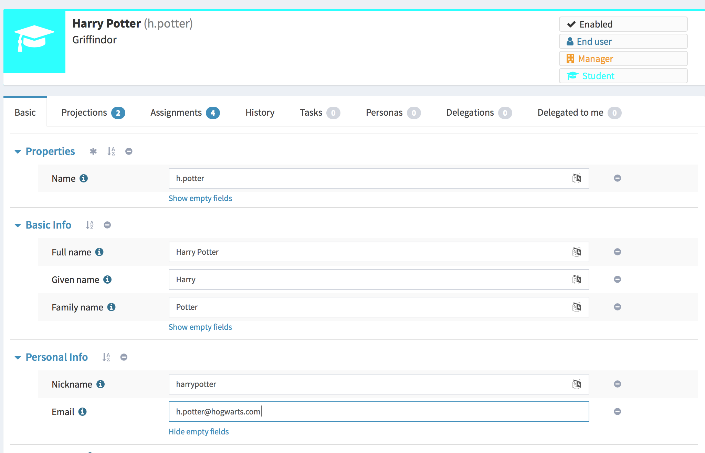

= Sections (virtual containers) in object details
:page-wiki-name: Sections (virtual containers) in object details
:page-wiki-id: 39583763
:page-wiki-metadata-create-user: katkav
:page-wiki-metadata-create-date: 2019-09-25T10:04:09.739+02:00
:page-wiki-metadata-modify-user: katkav
:page-wiki-metadata-modify-date: 2019-09-25T14:15:16.269+02:00
:page-since: "4.0"
:page-midpoint-feature: true
:page-alias: { "parent" : "/midpoint/features/current/" }
:page-upkeep-status: yellow

== Introduction

MidPoint's common data model was designed to be as general as possible to cover most of the needs of different customers.
However, there are still different environments and different requirements for the attributes needed to store.
Therefore, midPoint also provide extending the common data model using schema extension.
Some of these attributes should be shown in GUI, they need to be stored, some of them should be also searchable.
All of this is fully automated in midPoint.
It means that there is no need to do any changes in the code.

When speaking about GUI part, there is a mechanism to generate UI forms.
This mechanism is used on most parts of the GUI, at least it is used to generate forms for details pages such as edit user, edit role, edit org etc.
Imagine the user's details page.
There are different tabs and on each tab, there are different sections.
These sections are created and shown according to the midPoint schema.
This is quite nice default behaviour, which seems also logical.
However, there are situations when the sections are either too big or there is a need to divide them to smaller, more logical sections related to the environment.
Since 4.0 midPoint provides also mechanism for this.

== Configuration

Sections in object details could be achieved, as most other features in midPoint, with the correct configuration.
Below is the example of such configuration

.Sections configuration
[source,xml]
----
<systemConfiguration>
    ...
    <adminGuiConfiguration>
        ....

        <objectDetails>
           <objectDetailsPage>
               <type>c:UserType</type>
               <container>
                   <display>
                       <label>Basic Info</label>
                   </display>
                   <item>
                       <path>givenName</path>
                   </item>
                   <item>
                       <path>familyName</path>
                   </item>
                   <item>
                       <path>fullName</path>
                   </item>
               </container>
               <container>
                   <display>
                       <label>Personal Info</label>
                   </display>
                   <item>
                       <path>nickName</path>
                   </item>
                   <item>
                       <path>emailAddress</path>
                   </item>
               </container>
           </objectDetailsPage>
        </objectDetails>
        ...

    </adminGuiConfiguration>
    ...
</systemConfiguration>
----

As the example above shows, the configuration for sections takes place in the system configuration, specifically in adminGuiConfiguration/objectDetails/objectDetailsPage.
The configuration above defines two more sections on user's details page - Basic Info and Personal Info.
Each of this section defines user's attributes which belong to it.
This attributes are defined as a path to real user's attribute.
The result of the configuration above is, that on the details page, there will be 3 sections:

* Basic Info with attributes givenName, familyName, fullName

* Personal Info with attributes nickName, emailAddress

* Properties with all other common user's attributes

The screenshot below shows the impact in the GUI.

