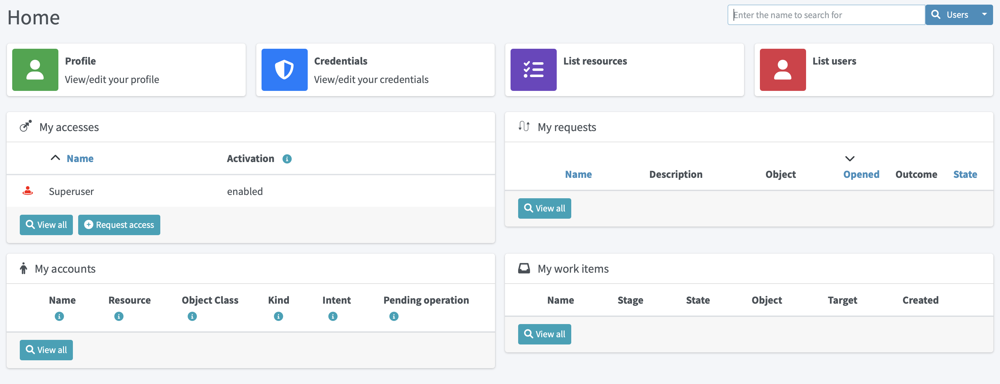
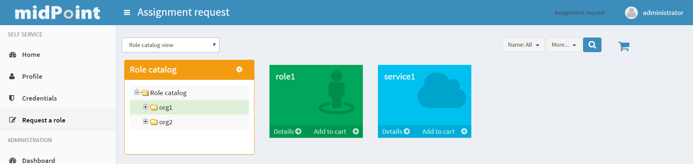

= Self-Service
:page-wiki-name: Self Services
:page-wiki-id: 22741839
:page-wiki-metadata-create-user: honchar
:page-wiki-metadata-create-date: 2016-07-14T11:08:23.035+02:00
:page-wiki-metadata-modify-user: lskublik
:page-wiki-metadata-modify-date: 2021-02-26T14:36:14.168+01:00
:page-upkeep-status: orange
:page-toc: top

To make midPoint GUI more user-friendly, especially for usual (not administrator) users, a separate section of Self Services was created.
We want the users of midPoint not to be confused about some complicated functionality of IDM system, that is why GUI for self services is simple, understandable and demonstrative.
This section is so obvious that you can easily scroll some chapters.
This documentation is created to describe some configuration opportunities or some used conditions.

Self Services section contains now the following pages: Home, Profile, Credentials and Request a role.

== Home Page

Home page consists of different configurable widgets. For now, there are two types of widgets, link widgets and preview widgets.
Link widgets can be configured and used for better and quicker navigation to desired pages (even external links are supported).
Preview widgets show concrete data, and it is also possible to define custom navigation actions.
The example of such action is _Request access_ button in _My accesses_ preview widget, which will take a user to the xref:/midpoint/reference/admin-gui/request-access[access request] process.

=== Configuration

All widgets shown on Home dashboard are configurable.
Configuration is based on `PreviewContainerPanelConfigurationType` type allowing to configure widget name, icon used for the widget, the size of the widget, data shown for the widget and more.
It is also possible to use midPoint's standard xref:/midpoint/reference/admin-gui/admin-gui-config/#how-it-works[merging mechanism] to override widgets visibility, actions, etc. with configuration in roles, archetypes or user's profile.
Therefore, be aware to fill in `identifier` attribute all the time, so it can be correctly used by the merging mechanism.
The configuration details are explained using the following example of the preview widget used to show _My accesses_ on Home dashboard with default midPoint installation.

----
<widget>
    <identifier>myAccesses</identifier>
    <display> <1>
        <label> <2>
            <orig>My accesses</orig>
            <translation>
                <key>PageSelfDashboard.myAccesses</key>
            </translation>
        </label>
        <cssClass>col-md-6</cssClass> <3>
        <icon>
            <cssClass>fe fe-assignment</cssClass> <4>
        </icon>
    </display>
    <displayOrder>10</displayOrder> <5>
    <action> <6>
        <identifier>requestAccess</identifier>
        <display> <7>
            <label>
                <orig>Request access</orig>
                <translation>
                    <key>PageRequestAccess.title</key>
                </translation>
            </label>
            <icon>
                <cssClass>fas fa-plus-circle</cssClass>
            </icon>
        </display>
        <target> <8>
            <targetUrl>/self/requestAccess</targetUrl> <6>
        </target>
    </action>
    <panelType>allAssignments</panelType> <9>
    <previewSize>5</previewSize> <10>
</widget>
----
<1> Defines different display properties for the widget
<2> Defines label used in the header of the widget
<3> Defines the width of the widget
<4> Defines icon used in the widget header
<5> Defines ordering of the widgets. Widgets are sorted according to the display order. After sorted, they are shown in this order.
<6> Defines action(s) for the widget. For now, supported are redirection actions (e.g. redirect from the widget to another page with more detailed information)
<7> Defines the name and icon fo the action. `label` and `icon/cssClass` are used as a text on the button.
<8> Defines actual action which is performed after clicking on the button. In this concrete example, user will be redirected to the xref:/midpoint/reference/admin-gui/request-access[Request access] process.
<9> Defines panel with data which is used for preview.
<10> Defines the number of records when the preview widget shows a list of records.

==== Examples

. Defining custom action with redirection to external page.
----
<widget>
    ...
    <action>
        <identifier>quickStartMidpoint</identifier>
        <display>
            <label>midPoint</label>
            <icon>
                <cssClass>fal fa-cog</cssClass>
            </icon>
        </display>
        <target>
            <targetUrl>https://docs.evolveum.com/midpoint/quickstart/</targetUrl>
        </target>
    </action>
</widget>
----

. Defining custom link widget to _Reconciliation_ tasks
----
<widget>
   <identifier>reconciliationTasksWidget</identifier>
    <display>
        <label>Reconciliation tasks</label>
        <cssClass>col-md-3</cssClass>
        <icon>
            <cssClass>fa fa-exchange-alt</cssClass>
            <color>green</color>
        </icon>
    </display>
    <panelType>linkWidget</panelType>
    <action>
        <identifier>list-tasks-widget-action</identifier>
       <target>
            <targetUrl>/admin/tasks</targetUrl>
            <collectionIdentifier>reconciliation-tasks-view</collectionIdentifier>
        </target>
    </action>
</widget>
----

. Defining _form_ like widget. On the Home dashboard widget with three defined attributes (name, fullName, emailAddress) is shown.
There is also action button which will take user to their profile (basic tab).
----
<widget>
    <identifier>basicUserInfo</identifier>
    <display>
        <label>Basic information about you</label>
    </display>
    <displayOrder>100</displayOrder>
    <container>
        <identifier>userIdentification</identifier>
        <display>
            <label>You should know about yourself</label>
        </display>
        <item>
            <path>name</path>
        </item>
        <item>
            <path>fullName</path>
        </item>
        <item>
            <path>emailAddress</path>
        </item>
    </container>
    <panelType>formPanel</panelType>
    <action>
        <identifier>viewBasic</identifier>
        <display>
            <label>Go to more details</label>
        </display>
        <target>
            <panelIdentifier>basic</panelIdentifier>
            <targetUrl>/self/profile/user</targetUrl>
        </target>
    </action>
</widget>
----

. Hiding User Dashboard Widgets

Following example can be used to customize the look of the user dashboard (home screen).

[source,xml]
----
<role>
     <name>Common User</name>
     ...
     <adminGuiConfiguration>
        <homePage>
            <widget>
                <identifier>myWorkItems</identifier>
                <visibility>hidden</visibility>
            </widget>

        </homePage>
    </adminGuiConfiguration>
</role>
----

The users that have this role won't see widget with _My work items_.

== Profile Page

On the Profile page, all the necessary information about the logged-in user (or service) are shown.
Information that are shown are influenced by the authorizations and GUI customizations.
With combining these two mechanisms, it is possible to define what kind of information will be shown to concrete (logged-in user).
It is important to have this possibility to define these restrictions, because there might be different users with different rights, e.g. end users, administrators, operators.
End user can be restricted to perform some actions, but administrator can do anything.

Since 4.6, new configuration option to customize self-service profile was introduced.
Although, it was possible to define the customization is previous version, it was configurable globally for the type (e.g. UserType), and such customizations were applied on both, self-service and administration user's details pages.
However, there might be situations when the information presented to the logged-in users can be different when looking and themselves and other users.
This was the main motivation to separate customization of self-service profile and user's details.
For example, since 4.6 it is possible to set, that the logged-in user when looking into their profile they will see theirs assignments, but after opening details of another user, no assignments will be shown.

To configure self-service profile, the same rules and same panels can be used as described in xref:/midpoint/reference/admin-gui/admin-gui-config/#object-details[object details] page.
The only different is the place, where it is configured. So it is not configured in `adminGuiConfiguration/objectDetails/*DetailsPage`, but in `adminGuiConfiguration/selfProfilePage`. The example of the configuration is listed bellow:

----
<adminGuiConfiguration>
    <selfProfilePage>
        <type>UserType</type>
        <panel>
            <identifier>history</identifier>
            <visibility>hidden</visibility>
        </panel>
    </selfProfilePage>
</adminGuiConfiguration>
----

== Credentials Page

Changing password functionality is located on the separate page to make this process easy and fast.

Old password field and Password propagation section can be configured (can be hidden) via editing Security policy object.Inside <credentials> tag of security object xml put the following xml code

[source,xml]
----
<password>
    <propagationUserControl>mapping</propagationUserControl>
    <passwordChangeSecurity>oldPassword</passwordChangeSecurity>
</password>
----

[%autowidth]
|===
| Attribute | Description | Possible values

| propagationUserControl
| Constraints that define how propagation of the credentials can be controlled by the +
user. E.g. if user can choose where the password change will be propagated.
| _mapping_ (Credentials propagation will be determined by the mappings. User cannot choose where the credentials will be propagated.The credentials propagation dialog will not be shown.)_userChoice_ (The user can choose where the credentials will be propagated.The propagation dialog will be shown.)onlyMapping(Credentials propagation will be determined by the mappings. User cannot choose where the credentials will be propagated. But the propagation dialog will be shown.)identityManagerMandatory(Identity Manager Repository will be propagated always. The user can choose where the other credentials will be propagated. The propagation dialog will be shown.)

| passwordChangeSecurity
| Additional security applied when changing a password.This applies when user is changing his own password. It does NOT applywhen administrator changes password of other user.
| _none_ (No additional security. Password can be changed by supplying new value.)_oldPassword_ (User must supply old password to change the password.)

|===

== Request access

Request a role page gives you the opportunity to assign multiple roles to user at once specifying at the same time tenant and organization for the assigned roles. This page has the following look

Left roles box element displays the roles which are available for assigning.You can select one or more roles, set tenant or organization for them (these values will be applied to all selected roles) and move them to the right box by clicking the appropriate right arrow button.

Right roles box shows what roles are already assigned to the user. To unassign the role/roles just make selection and click left arrow button (all changes are applied after Save button click).

Only requestable roles are displayed on the page. Requestable status is generated for the role according to the role's Requestable atribute value and to the user's authorizations. E.g. if the role's requestable status equals to true, this role will be displayed for the administrator user anyway (as he has all rights) and it won't be displayed for the End user (because his rights are limited).

Roles with Archived activation status are not displayed at all on the Request a role page.

There is an opportunity to use filter and search to make assigning of the roles more simple. Also, you can reset the initial state of the page with click on the Reset the list button.

=== Request a Role Page (starting from v3.5)

In v3.5 a new UI was implemented for requesting a role functionality. Now Request a role page presents a catalog of available requestable items: these items can be roles, organizations and services.

The presentation on the page can have a role catalog view. This means that roles are structurized in some structure with their parent organizations and it is comfortable to work with the roles (and other assignable objects) list like with a tree. To see such structurized roles tree on the page, it is necessary to set some organization as a parent of role catalog. For this, add the next piece of xml code to the sysconfig.xml:

[source,xml]
----
<systemConfiguration>
    ....
    <roleManagement>
        <roleCatalogRef oid="f7790792-eb80-4ecf-8bc7-893cefc10b6a" type="c:OrgType"/>
    </roleManagement>
</systemConfiguration>
----

As a result the structure of the specified organization will be displayed in role catalog view

The view also can be switched to All organizations view - to see all available organizatoins, All roles view - to see all available roles and All services view - to see all available services.

Only requestable items should be displayed on the Request a role page. Requestable is a status which is computed according to Requestable field of the assignable item and according to the authorizations of the user (for now, this requestable status is computed only for Role type objects).