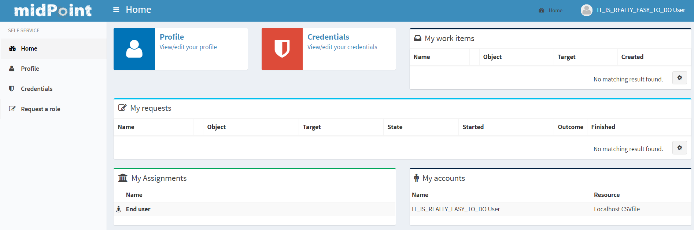

= Self-Service
:page-wiki-name: Self Services
:page-wiki-id: 22741839
:page-wiki-metadata-create-user: honchar
:page-wiki-metadata-create-date: 2016-07-14T11:08:23.035+02:00
:page-wiki-metadata-modify-user: lskublik
:page-wiki-metadata-modify-date: 2021-02-26T14:36:14.168+01:00
:page-upkeep-status: orange

To make midPoint GUI more user friendly, especially for usual (not administrator) users, a separate section of Self Services was created.
We want the users of midPoint not to be confused about some complicated functionality of IDM system, that is why GUI for self services is simple, understandable and demonstrative.
This section is so obvious that you can easily scroll some chapters.
This documentation is created to describe some configuration opportunities or some used conditions.

Self Services section contains now the following pages: Home, Profile, Credentials and Request a role pages.

== Home Page

On the Home page the user can view some assigned to him data or view the processes started by him.

In the left upper corner on that page you can see link elements which redirect you to some midPoint (also can be external) pages.
This links panel can be configured via system configuration file.
Just add the following peace of xml code to the system configuration file:

[source,xml]
----
<adminGuiConfiguration>
    <userDashboardLink>
        <targetUrl>/self/profile</targetUrl>
        <label>Profile</label>
        <description>View/edit your profile</description>
        <icon>
            <cssClass>fa fa-user</cssClass>
        </icon>
        <color>blue</color>
        <authorization>http://midpoint.evolveum.com/xml/ns/public/security/authorization-ui-3#selfProfile</authorization>
        <authorization>http://midpoint.evolveum.com/xml/ns/public/security/authorization-ui-3#selfAll</authorization>
    </userDashboardLink>
    <userDashboardLink>
        <targetUrl>/self/credentials</targetUrl>
        <label>Credentials</label>
        <description>View/edit your credentials</description>
        <icon>
            <cssClass>fa fa-shield</cssClass>
        </icon>
        <color>red</color>
        <authorization>http://midpoint.evolveum.com/xml/ns/public/security/authorization-ui-3#selfCredentials</authorization>
        <authorization>http://midpoint.evolveum.com/xml/ns/public/security/authorization-ui-3#selfAll</authorization>
    </userDashboardLink>
</adminGuiConfiguration>
----

[%autowidth]
|===
| Attribute | Description

| targetUrl
| URL of the link target. It can be absolute URL with method specification or it can be relative URL. If the URL is relative, it is assumed that it is relative to the application root URL context.

| label
| Human-readable label to display with the link (or a key to the localization file). The label should be quite short (several words). It is meant to be displayed as a menu item label, launcher label, etc.

| description
| Human-readable desciption to display with the link (or a key to the localization file). The description can be longer (several sentences). It is meant to be displayed as a multi-line description, tooltip, etc.

| icon
| Icon to display for this link.

| color
| Primary color that will be used to render this link in case that multiple color options are supported.

| authorization
| Authorizations needed to display this link.
If specified, the the link will be displayed only if the active user has one of the specified authorizations.
If no authorization is specified then the link will be always displayed.

|===

=== Profile Page

it is understandable from the name of the page that it displays user's profile data. Also, you can see user's progections, assignments and tasks there. If user has enough rights, he can also edit these data.

=== Credentials Page

Changing password functionality was located on the separate page to make this process easy and fast.

Old password field and Password propagation section can be configured (can be hidden) via editing Security policy object.Inside <credentials> tag of security object xml put the following xml code

[source,xml]
----
<password><propagationUserControl>mapping</propagationUserControl><passwordChangeSecurity>oldPassword</passwordChangeSecurity></password>
----

[%autowidth]
|===
| Attribute | Description | Possible values

| propagationUserControl
| Constraints that define how propagation of the credentials can be controlled by the +
user. E.g. if user can choose where the password change will be propagated.
| _mapping_ (Credentials propagation will be determined by the mappings. User cannot choose where the credentials will be propagated.The credentials propagation dialog will not be shown.)_userChoice_ (The user can choose where the credentials will be propagated.The propagation dialog will be shown.)onlyMapping(Credentials propagation will be determined by the mappings. User cannot choose where the credentials will be propagated. But the propagation dialog will be shown.)identityManagerMandatory(Identity Manager Repository will be propagated always. The user can choose where the other credentials will be propagated. The propagation dialog will be shown.)

| passwordChangeSecurity
| Additional security applied when changing a password.This applies when user is changing his own password. It does NOT applywhen administrator changes password of other user.
| _none_ (No additional security. Password can be changed by supplying new value.)_oldPassword_ (User must supply old password to change the password.)

|===

=== Request a Role Page (before v3.5)

Request a role page gives you the opportunity to assign multiple roles to user at once specifying at the same time tenant and organization for the assigned roles. This page has the following look

Left roles box element displays the roles which are available for assigning.You can select one or more roles, set tenant or organization for them (these values will be applied to all selected roles) and move them to the right box by clicking the appropriate right arrow button.

Right roles box shows what roles are already assigned to the user. To unassign the role/roles just make selection and click left arrow button (all changes are applied after Save button click).

Only requestable roles are displayed on the page. Requestable status is generated for the role according to the role's Requestable atribute value and to the user's authorizations. E.g. if the role's requestable status equals to true, this role will be displayed for the administrator user anyway (as he has all rights) and it won't be displayed for the End user (because his rights are limited).

Roles with Archived activation status are not displayed at all on the Request a role page.

There is an opportunity to use filter and search to make assigning of the roles more simple. Also, you can reset the initial state of the page with click on the Reset the list button.

=== Request a Role Page (starting from v3.5)

In v3.5 a new UI was implemented for requesting a role functionality. Now Request a role page presents a catalog of available requestable items: these items can be roles, organizations and services.

The presentation on the page can have a role catalog view. This means that roles are structurized in some structure with their parent organizations and it is comfortable to work with the roles (and other assignable objects) list like with a tree. To see such structurized roles tree on the page, it is necessary to set some organization as a parent of role catalog. For this, add the next piece of xml code to the sysconfig.xml:

[source,xml]
----
<systemConfiguration>
    ....
    <roleManagement>
        <roleCatalogRef oid="f7790792-eb80-4ecf-8bc7-893cefc10b6a" type="c:OrgType"/>
    </roleManagement>
</systemConfiguration>
----

As a result the structure of the specified organization will be displayed in role catalog view

image::image2017-1-16-1-34-10.png[]

The view also can be switched to All organizations view - to see all available organizatoins, All roles view - to see all available roles and All services view - to see all available services.

Only requestable items should be displayed on the Request a role page. Requestable is a status which is computed according to Requestable field of the assignable item and according to the authorizations of the user (for now, this requestable status is computed only for Role type objects).