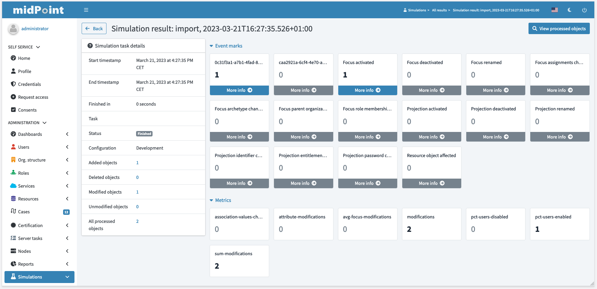
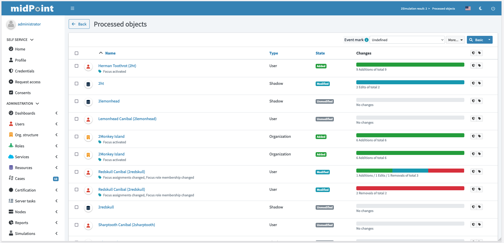
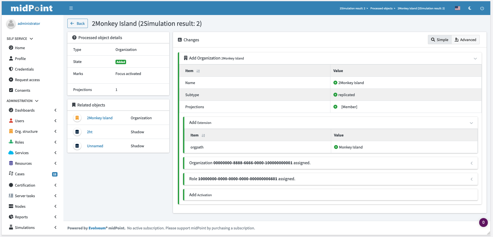
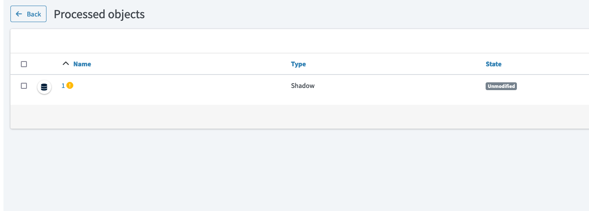
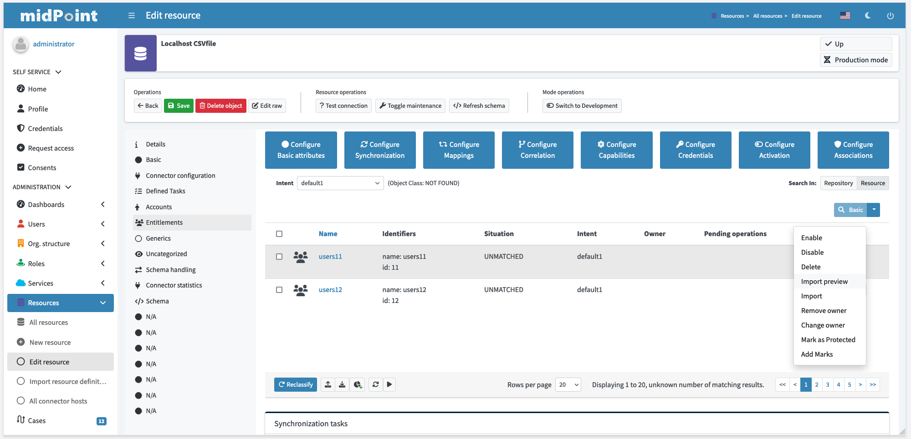

= Simulations
:page-toc: top
:page-since: "4.7"
:page-midpoint-feature: true
:page-upkeep-status: green

== Introduction

This document describes user interface for feature called simulations.
More information about how simulation works and related topics can be found in xref:/midpoint/reference/simulation[simulations] and xref:/midpoint/reference/simulation/tutorial/index.adoc[simulation tutorial].

== User interface

To display more information about executed simulations, new menu was added to main menu on the left side called _Simulations_.
This menu displays list of created simulations along with basic data about processing.

Table alows few actions for results:

* Delete processed objects - delete processed objects, but leaves simulation result with metrics and event marks data.
* Delete result - as expected, deletes whole simulation result with all processed objects and data.

.Simulation results
image::./simulations/simulation-results.png[Simulation results,100%]

Simulation result details dashboard displays summary data about state of processing.
Table on the left side display various information related to result as a whole like start/end timestamp, current status and counts of processed objects.
On the right side we can see two sets of widgets:

* Event marks - metrics counted based on predefined event marks. To see more about event marks, check xref:/midpoint/reference/mark/event-marks.adoc[event marks].
Objects processed during current simulation can be filtered based on these event marks.
* Metrics - plain metrics defined in system configuration, not backed up by marks.
These metrics can't be used to filter processed objects, they're just to precompute different counts/aggregations.

.Simulation result details

Processed objects can be searched, filtered and explored in better detail.
List of processed objects display also two sets of marks (if they exist):

* With blue tag list of event marks assigned by simulation
* With red tag icon list of current marks (currently for shadows only)

.List of processed objects

.Processed object details

List of processed objects also displays error icon after processed object name if error ocurred during processing.
User can click on it to see whole operation result.

.Processed object with error

== Running the Simulation on Foreground

Currently only place where simulation runs on foreground is when executing _Import preview_ action for one shadow.

.Import preview

This action allows you to select simulation mode:

* Simulation development
* Simulation production

After simulation of import is finished, list of objects processed during simulation is opened.

== Running Simulation on Background

Simulations can run on background using tasks, e.g. import, reconciliation and others.
This is useful during initial rounds of import and data cleanup.
Another situation, where simulation is useful, is change in configuration that needs to be validated before it's executed on real data.

There are two places that need to be configured in task.
First one is `execution` where `mode` and `configurationToUse` can be set.
Second one is `reporting` where option `simulationResult` has to be selected.

// todo screenshots