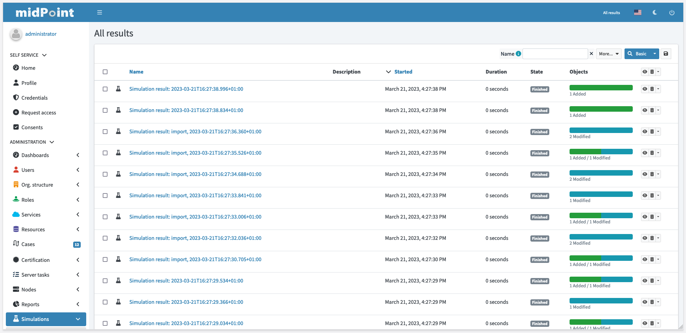

= Simulations
:page-toc: top
:page-since: "4.7"
:page-midpoint-feature: true
:page-upkeep-status: green

== Introduction

NOTE: Please see xref:/midpoint/reference/simulation/[Simulation] for the comprehensive description of the "simulation" feature.

// TODO: finish

== User interface

.Simulation results

.Simulation result details
image::./simulations/simulation-result.png[Simulation result details,100%]

.List of processed objects

.Processed object details

.Processed object with error

[#_running_the_simulation_on_foreground]
== Running the Simulation on Foreground

// TODO: finish