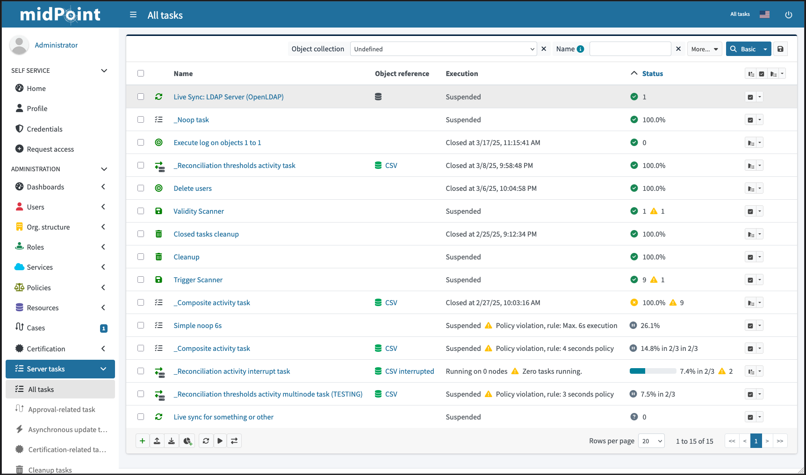

= Tasks
:page-toc: top
:page-since: "4.10"
:page-upkeep-status: green

== Task list

This page lists various tasks that are present in the MidPoint.

.List of tasks

Table contains the following columns:

* Name
* Object reference
* Execution
* Status

While the first is pretty self-explanatory, others may not be so obvious.
*Object reference* provides information about object referenced by task.
Most of the time it's a reference to resource in case of import, reconciliation, live synchronization, etc.

*Execution* columns contains information about current task state and _health_.
For example:

* Running at _NODE_IDENTIFIER_.
* Running at zero nodes.
+
This can happen for task with subtasks when root task is waiting for worker tasks.
HoweverIn case all workers are suspended/closed.
* Runnable.
+ Task is ready to be executed.
* Closed at _TIMESTAMP_.

Second, optional part of the column value contains information about task health.
It's shown in case task has some issues during execution.
For example:

* Policy violation, rule: Max duration exceeded.
* Zero tasks running.

Similar to the *Execution* column, the *Status* column contains information about task state.
It displays status of the task in terms of processed items, e.g. task operation status and progress.
Second part of the message is displayed in case there were problems with some items during processing.
Message displays warning icon + number of items with problems.
