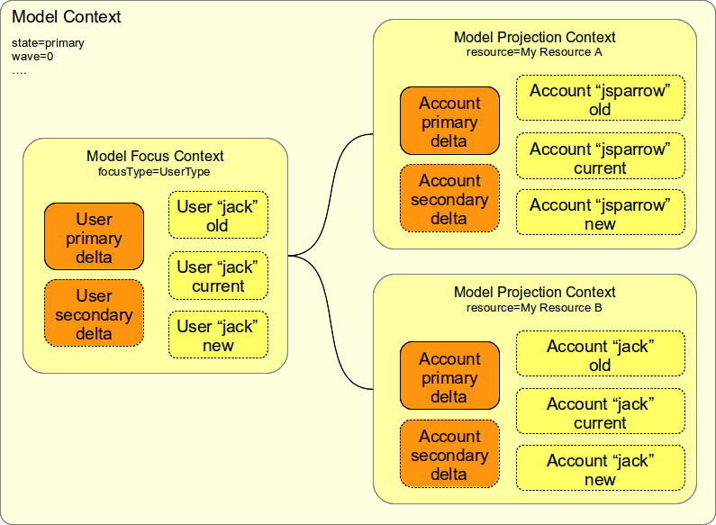

= Model Context
:page-wiki-name: Model Context
:page-wiki-id: 13074827
:page-wiki-metadata-create-user: semancik
:page-wiki-metadata-create-date: 2013-12-06T14:49:11.032+01:00
:page-wiki-metadata-modify-user: semancik
:page-wiki-metadata-modify-date: 2014-01-09T16:41:44.983+01:00
:page-upkeep-status: yellow

Model context is a complex data structure that describes the context of computation in xref:/midpoint/reference/concepts/clockwork/clockwork-and-projector/[Clockwork and Projector] components.
It is also used in xref:/midpoint/reference/concepts/clockwork/hooks/[Hooks], xref:/midpoint/reference/concepts/clockwork/scripting-hooks/[Scripting Hooks], xref:/midpoint/reference/cases/workflow-3/[Workflows (midPoint 3.x)] and other components that take part in the computation.

The model context is putting together the xref:/midpoint/reference/schema/focus-and-projections/["focus" and "projections"] that belong together.
Focus is usually a user, projections are accounts.
In such a case the model context groups together a user with all the accounts are associated with that accounts.
These are usually accounts that are linked to the user.
But it also may be a new account that was not yet created, an old account that was recently deleted, etc.
MidPoint groups all these objects together to allow efficient computation of assignments and mappings and other policies.

Model Context has three parts (see xref:/midpoint/reference/concepts/clockwork/clockwork-and-projector/[Clockwork and Projector] page for explanation of terms used here):

* The *context itself* contains information about the entire computation (such as computation state).
These can be accessed by methods invoked directly on the ModelContext.

* *Focus* part which contains information about focal object.
There is at most one focus (see xref:/midpoint/reference/schema/focus-and-projections/[Focus and Projections]).

* *Projection* part which contains information about each projection.
There may be multiple projections (see xref:/midpoint/reference/schema/focus-and-projections/[Focus and Projections]).

Focus and projection parts have similar structure.
Both of these parts contain:

* *Old object*: the object (focus or projection) as it was before the computation.
This means really the beginning of computation.
Please note that the computation can take several days e.g. if the request waits for approval.

* *Current object*: the object as it was last time the Projector loaded the object.
This is usually quite recent information (at most few seconds old).

* *New object*: the expected form of new object after the computation.
This item is here mostly for informational purposes and for diagnostics.
The actual value of the result may be slightly different (e.g. if two operations are carried out over the same object in parallel).

* *Primary delta*: The request delta.
This is the delta that was explicitly entered in the GUI, supplied to the web service or otherwise specified in xref:/midpoint/reference/interfaces/model-java/[IDM Model Interface] invocation.
This is the "command" that midPoint should execute.
This defines what user _wants_. This delta will be executed exactly as it was specified.

* *Secondary delta*: The computed delta.
Secondary delta originates from execution of mappings or hooks or other automated mechanisms.
This describes what midPoint has _computed_. This delta will be executed, but it can be recomputed several times during the process.

* *Synchronization delta*: The detected delta.
The delta that was detected by synchronization.
MidPoint assumes that this delta was already executed and all it can do is to react to this.
It is used as an input to the computation.
This delta will *not* be executed again.

All the objects and deltas are in xref:/midpoint/devel/prism/[prism representation].

== Implementation Notes

"Model Context" is a public name of this data structure as it is exposed by the xref:/midpoint/reference/interfaces/model-java/[IDM Model Interface] (midPoint Model API).
It is internally implemented by a very rich LensContext data structure.
It is designed to be serializable therefore it can be used in long-running asynchronous processes that include human tasks (such as workflows).
It is serialized in an upgradeable data format (currently XML) which allows running processes (such as workflows waiting for approval) to survive system upgrades.

== See Also

* xref:/midpoint/reference/concepts/clockwork/clockwork-and-projector/[Clockwork and Projector]

* xref:/midpoint/reference/schema/focus-and-projections/[Focus and Projections]