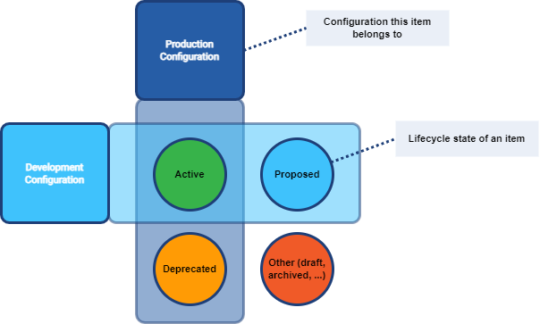

= Configuration Item Lifecycle and System Configurations
:page-upkeep-status: green

In order to simplify the evolution of its configuration, MidPoint supports the development lifecycle of individual configuration items: definition of resources, resource object types, attributes, associations, policies, abstract roles, assignments, or mappings.

Each such item can start in a `Draft` state where it's being initially formed.
When it's ready for testing, it can be switched to `Proposed` state.
The switch into production is realized via entering `Active` state.
Eventually, it can be deprecated by putting it into `Deprecated` state.
Finally, it is decommissioned by deleting or switching to `Archived` state.

Transitions between these states can be arbitrary; it's not necessary to follow the linear path.

The lifecycle of a configuration item is given by the value of its `lifecycleState` property.
There are several pre-defined values, but it's possible to define custom ones.

== System Configurations

Lifecycle states currently form the basis of perceptible *system configurations*.
A system configuration is defined as a set of configuration items that drive the system behavior.
We need distinct configurations in order to allow the system to evolve:
While it can run a defined *production configuration* for normal operations, we may need to simulate specific configuration changes to see what effect they would have if we put them into production.
The configuration used for simulations is called *development configuration*.

=== Production Configuration

The production configuration comprises all configuration items that are engaged in regular midPoint operations.
Items in the production configuration are the only ones that can cause xref:/midpoint/reference/simulation/#_persistent_effects_mode[persistent effects].

=== Development Configuration

Development configuration represents the part of the system configuration that is currently being developed.
With regard to the production configuration, some items may be added, some replaced, and finally, some may be missing.

The development configuration cannot be executed in "persistent-effects" mode.

Before midPoint 4.7, the development configuration had to reside in a separate midPoint instance, typically called the "development" or "testing" one.
Although such an approach still has its advantages, it is now possible for both configurations to share a single midPoint instance.

=== Distinguishing Production and Development Configurations

This distinction is currently made using the `lifecycleState` property on configuration items.

.Lifecycle states and configurations

.Mapping of item's lifecycle state to configuration set membership
[%autowidth]
[%header]
|===
| Lifecycle state | Production Configuration | Development Configuration
| `active` or missing | yes | yes
| `proposed` | no | yes
| `deprecated` | yes | no
| other | no | no
|===

=== Supported Configuration Items

Lifecycle state is currently supported on the following configuration items:

- resource,
- resource object class,
- resource object type,
- resource object attribute,
- resource object association,
- synchronization reaction,
- abstract roles (role, org, service, archetype),
- assignment,
- object template,
- mapping.

NOTE: For short, we will sometimes use the statement "configuration item (like a resource) is in development mode" to denote the fact that the item is part of the development configuration but not present in the production one.
On the other hand, when we say that "an item is in production mode", we mean that it is a part of the production configuration without saying anything about whether it is also part of the development configuration.

=== Examples

==== Resource in Development Configuration Only

The following resource is in development configuration only.

.Listing 1: Example of a resource in development configuration only
[source,xml]
----
<resource xmlns="http://midpoint.evolveum.com/xml/ns/public/common/common-3">
    <name>CSV resource</name>
    <!-- ... -->
    <lifecycleState>proposed</lifecycleState>
    <!-- ... -->
</resource>
----

This setting guarantees that the content of the real resource will not be touched by midPoint.
All operations that could affect this resource could only be simulated.

==== Replacing a Mapping in an Object Template

The following setup can be used to preview a migration from an old to a new organizational unit by switching mappings in an object template.

.Listing 2: Example of switching mappings in an object template
[source,xml]
----
<objectTemplate xmlns="http://midpoint.evolveum.com/xml/ns/public/common/common-3">
    <name>person-template</name>
    <mapping> <!--1-->
        <strength>strong</strength>
        <expression>
            <value>ACME</value>
        </expression>
        <target>
            <path>organization</path>
        </target>
    </mapping>
    <mapping>
        <lifecycleState>deprecated</lifecycleState> <!--2-->
        <strength>strong</strength>
        <expression>
            <value>old-unit</value>
        </expression>
        <target>
            <path>organizationalUnit</path>
        </target>
    </mapping>
    <mapping>
        <lifecycleState>proposed</lifecycleState> <!--3-->
        <strength>strong</strength>
        <expression>
            <value>new-unit</value>
        </expression>
        <target>
            <path>organizationalUnit</path>
        </target>
    </mapping>
</objectTemplate>
----
<1> No explicit lifecycle state means "active".
Hence, this mapping is part of both production and development configurations.
<2> The `deprecated` state means that this mapping belongs only to the production configuration.
<3> The `proposed` state means that this mapping belongs only to the development configuration.

The third mapping serves as a replacement for the second one in the development configuration.
Hence, when you run a persistent-effect activity (or a simulation using production configuration), users are assigned to `old-unit`.
But when running a simulation using the development configuration, the users are assigned to `new-unit` instead.

=== Limitations and Future Work

Currently, midPoint supports only two fixed configurations: production and development one.

In the future, we plan to support more independent development configurations to support e.g. more branches of development and testing on a single midPoint system.
However, it is not yet clear how we'll implement these.
The (single) `lifecycleState` property may not be sufficient.

== See Also

* xref:/midpoint/reference/simulation/[]

* xref:/midpoint/reference/concepts/object-lifecycle/[]
