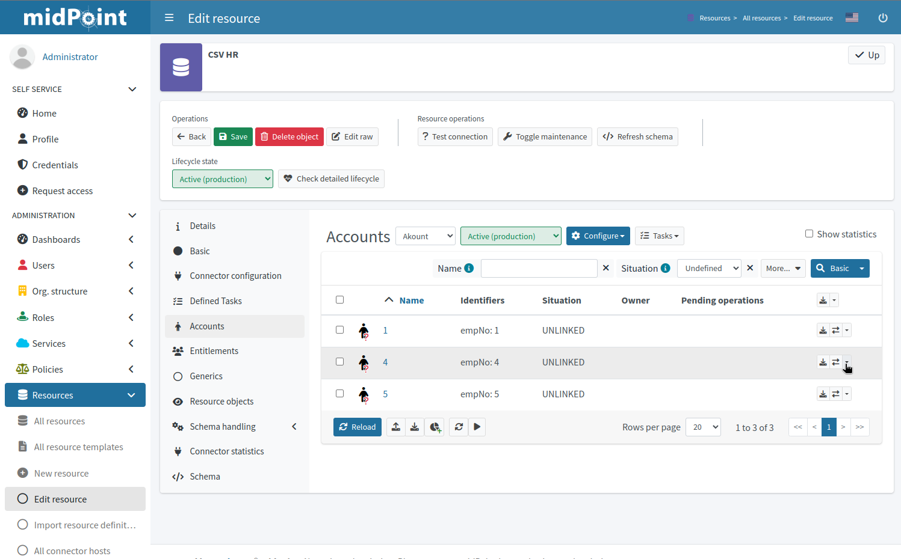
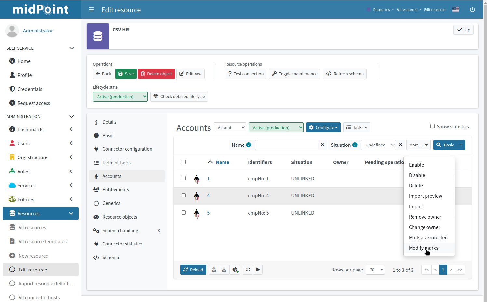
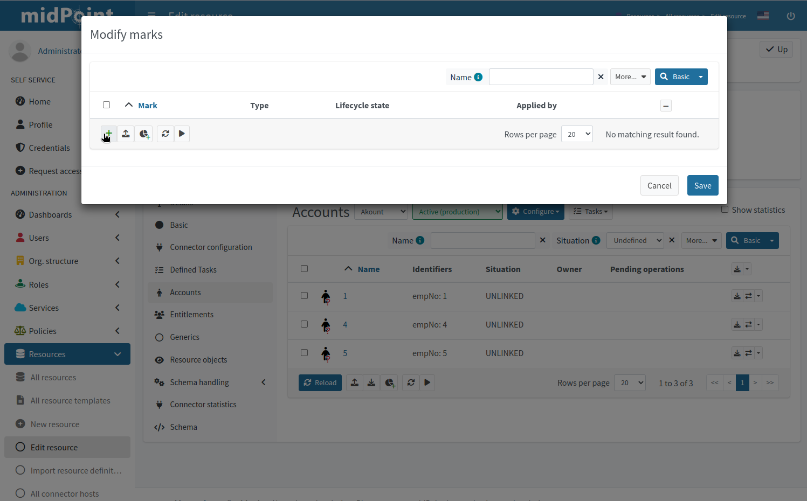
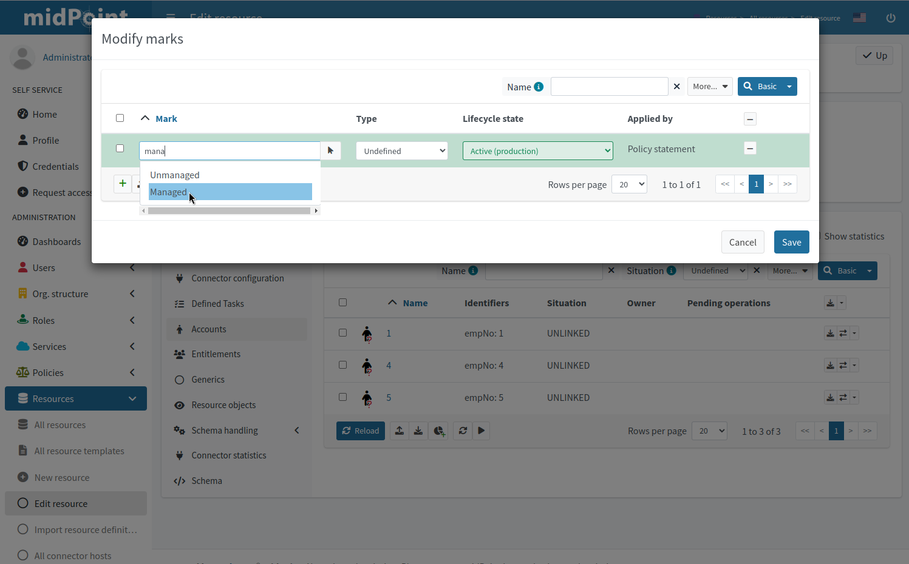
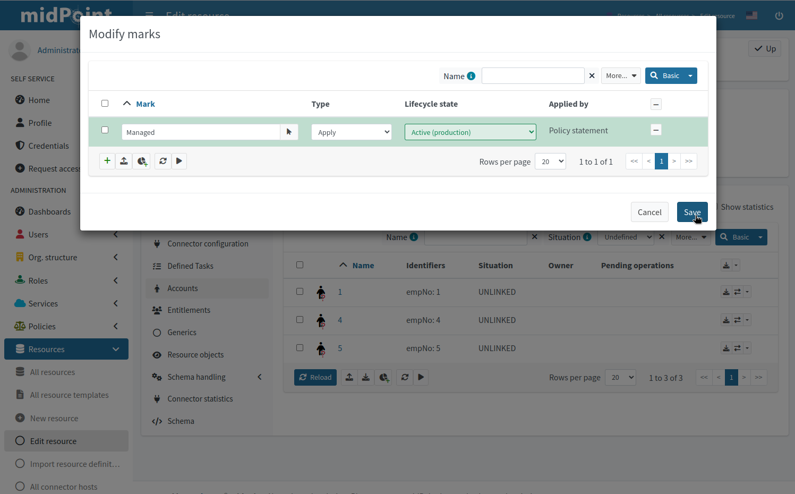
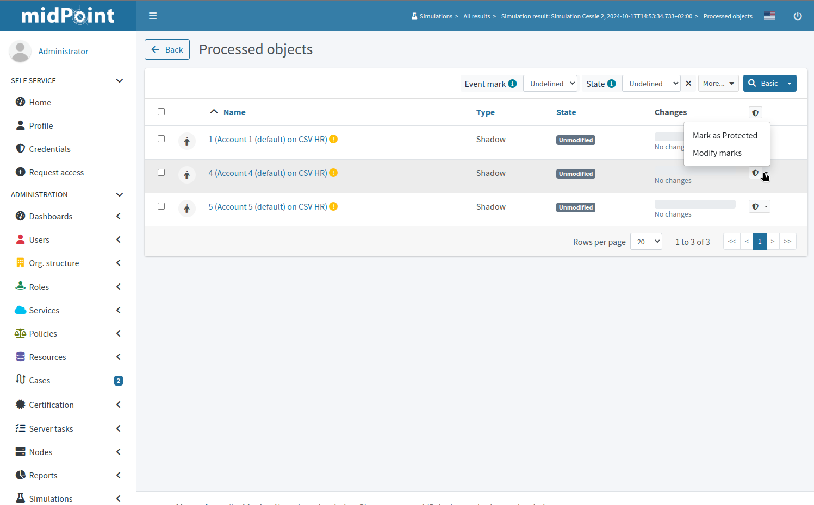
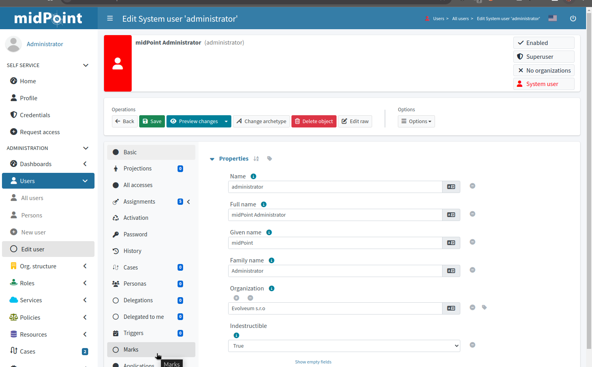
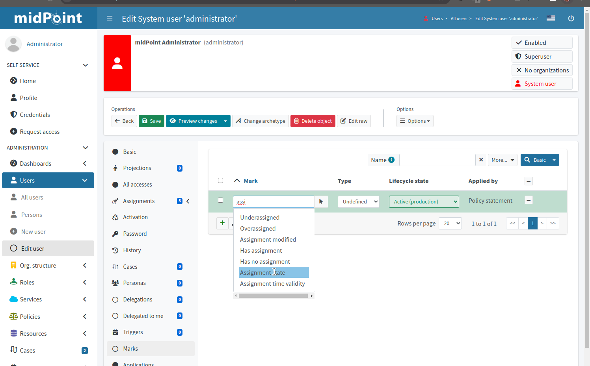

= Manual Marking using GUI

== Shadow Policy Marks

=== Marking Shadows in Resource Details

MidPoint GUI allows modifying manual marks of shadows in resource details view using *Modify Marks* action in *Accounts* and *Entitlements*.

==== Workflow screenshots

.Go to Resource -> Accounts

.Click on Menu for Shadow

.Select Modify Marks

.Click on Add Button to add mark

.Enter mark name or use select buttom

.Click save to save changes

=== Removing Shadow Marks in Resource Details

MidPoint GUI allows removing manually mark of shadows in resource details view using *Modify Marks* action (as shown previously) in *Accounts* and *Entitlements*.

=== Marking Shadows in Simulation Results

MidPoint GUI allows manually marking shadows in Simulations results -> Processed Object views.
This is done by clicking menu icon and selecting Modify Marks. Note that mark
is applied to real shadow (not simulated result). This allows for use-cases such as running simulations
and excluding particular shadows from real run.

NOTE: In Simulations GUI mark is applied to actual underlying object

==== Workflow screenshots

.Click on Menu icon for shadow and select Modify Marks

.Add Marks, change mark type and click Save
image::simulations-processed-object-02.png[]

=== Listing marked shadows across resources

In order to view all shadows marked by specific mark, you can navigate in midPoint GUI, to *Marks*, open specific object mark details and click on *Marked Shadows*.

== Object Marks

=== Marking Object in Object Details

Objects can be marked in midPoint GUI in object details view on Marks panel.

==== Workflow Screenshots

.Click on Marks panel icon in Object Details

.Add Marks, change mark type and click Save

