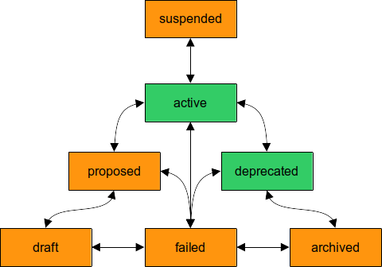

= Object Lifecycle
:page-wiki-name: Object Lifecycle
:page-wiki-id: 24084589
:page-wiki-metadata-create-user: semancik
:page-wiki-metadata-create-date: 2016-11-28T18:57:31.417+01:00
:page-wiki-metadata-modify-user: semancik
:page-wiki-metadata-modify-date: 2017-01-30T20:39:14.801+01:00
:page-upkeep-status: yellow

MidPoint contains a special property to control object lifecycle: `lifecycleState`. This property specifies current lifecycle state of the object.
It specified whether the object represents a draft, proposed definition, whether it is active, deprecated, and so on.
There are few pre-defined lifecycle states.
But custom lifecycle states may also be defined.
The pre-defined lifecycle states are designed to work in a state machine described in the following diagram.

If no explicit lifecycle state is defined then the `active` state is assumed.
In addition to the pre-defined states custom lifecycle states can be used.
However, currently all the custom lifecycle states are considered to be non-active.

== Pre-defined Lifecycle States

[%autowidth]
|===
| State | Focus active | Assignments active | Description | Examples

| draft
| no
| no
| Definition of the new object in progress.
The object is NOT active.
The definition may change at any moment.
It is not ready yet.
| Role definition in preparation (not finished yet).

| proposed
| no
| no
| Definition of a new object is ready for use, but there is still a review process to be applied (e.g. approval).
The object is NOT active.
However the definition should not change in this state.
| Finished new role definition in approval process. +
Self-registered user, not yet validated.

| active
| YES
| YES
| Active and working definition.
Ready to be used without any unusual limitations.
| Active employee. +
Role in production use.

| suspended
| no
| YES
| Suspended definition, temporarily disabled.
It is expected that the object will return to _active_ state eventually.

Available since midPoint 4.8.
| Employee on temporary leave (maternal leave, sabbatical). +
Resource temporarily disabled for maintenance.

| deprecated
| YES
| YES
| Active definition which is being phased out.
The definition is still fully operational.
But it should not be used for new assignments.
E.g. it should not be requested, it should not be approved, etc.
| Deprecated role: still working, but not intended to be assigned any more. +
Legacy resource: we still want to read the data, but we do not want to create new accounts.

| archived
| no
| no
| Inactive historical definition.
It is no longer used.
It is maintained only for historical, auditing and sentimental reasons.
| Retired employee, keeping minimal record for accounting reasons and to avoid identifier recycling. +
Phased-out role definition, kept for historical reasons.

| failed
| no
| no
| Unexpected error has occurred during object lifecycle.
Result of that event is that the object is rendered inactive.
The situation cannot be automatically remedied.
Manual action is needed.
| Role definition rejected during approvals, without obvious continuation of the process. +
Role definition identified to be in violation of the policy, immediately taken out of use. +
Resource with unexpected critical errors, requiring attention od administrators.

|===

The "Active" column specifies whether the object is active (enabled) in that particular lifecycle state.
The effective activation status will always be `disabled` in the states that are marked as not active in the above table.
In these states the object will not be active even if the activation administrative status is explicitly set to `enabled`.
See xref:/midpoint/reference/concepts/activation/[Activation] page for more details.

== Assignment Lifecycle

The same lifecycle property is also present in xref:/midpoint/reference/roles-policies/assignment/[assignment] and inducement.
The meaning of the lifecycle states is equivalent to object lifecycle:

[%autowidth]
|===
|  State | Active | Description

| draft
| no
| Definition of a new assignment in progress (e.g. being selected in the shopping cart, but not yet requested) - *EXPERIMENTAL. NOT USED.*

| proposed
| no
| Requested assignment.
The assignment was requested but it was not yet being granted.
E.g. there is a pending approval.

| active
| YES
| Active and working assignment.

| suspended
| no
| Temporarily disabled assignment.

Available since midPoint 4.8.

| deprecated
| YES
| *NOT USED*

| archived
| no
| Assignment that was active in the past but it was revoked.
It is kept for historical reasons.

| failed
| no
| Unexpected error has occurred during assignment lifecycle.
Result of that event is that the assignment is rendered inactive.
The situation cannot be automatically remedied.
Manual action is needed.

|===

As described above, the assignment state is also determined by the focus (user) lifecycle state.
When the focus (user) is in state marked as "Assignments active: no" (like `draft`, `proposed`, `archived`) then the assignments are considered inactive regardless of their lifecycle state.

== See Also

* xref:/midpoint/reference/concepts/activation/[Activation]

* xref:/midpoint/reference/roles-policies/role-lifecycle/[Role Lifecycle]
