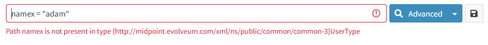
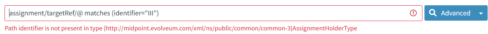
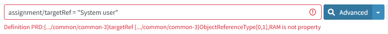
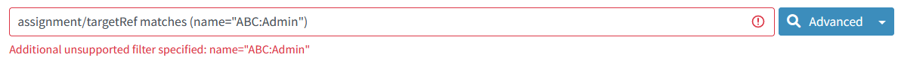
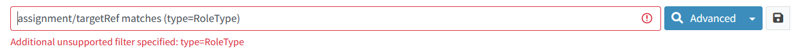
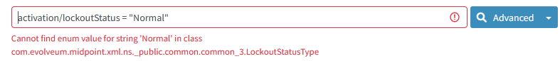
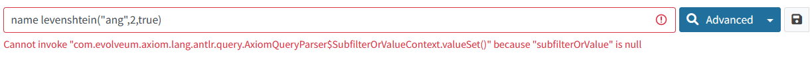
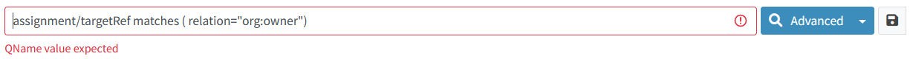

= Errors Related to midPoint Query Language
:page-nav-title: Errors while querying
:page-display-order: 500
:page-toc: top
:toclevels: 3

This page explains error messages that you may encounter while searching with midPoint Query Language (MQL), and provides troubleshooting suggestions.

In GUI, error messages are typically displayed below the query field.

== Path Is Not Present in Type

In this case, an administrator wanted to search for a user with the name "adam".

MidPoint says the `namex` attribute cannot be found in the `UserType` object type that is displayed in the view Users in which the administrator is searching.

This is the most typical error you can encounter.
It is caused by an incorrect identification of the property (attribute) in the query.
Often this error is caused by a typo in the name of the attribute.
In the example above, it is caused by the additional "x" in _name_.

`{http://midpoint.evolveum.com/xml/ns/public/common/common-3}` is the namespace of the `UserType` type.
You can ignore it here.

[cols="15h,50" width=85%]
|====
| Request
| Find users with the name "adam".

| Query
| `namex = "adam"`

| Error message
| Path namex is not present in type {http://midpoint.evolveum.com/xml/ns/public/common/common-3} UserType

| Reason
| In this case, the error was caused by a typo: `namex` vs. `name`

| Correct query
| `name = "adam"`

| Troubleshooting hints
a| * Verify, that the attribute is present in the object type in which you are searching.
You can verify it at the xref:../searchable-items.adoc[] page.
* The `name` attribute differs from the name that is displayed in GUI (the _displayName_).
Search is using the name of the attribute.
The translation between _name_ and _displayName_ is described at the xref:../searchable-items.adoc[] page.
* Verify that you do not have a typo (e.g. case mismatch) in the name of the property.
* Verify that the view is displaying the object type you want to search for.
You can see its name at the end of the error message.
|====

== Path Is Not Present in Type - Dereferencing

Another kind of the "path is not present in type" error can occur while searching in referenced objects.

[cols="15h,50" width=85%]
|====
| Request
| Find all users with an assigned role identified by the value "III" of the identifier attribute.

| Query
| `assignment/targetRef/@ matches (identifier="III")`

| Error message
| Path identifier is not present in type {http://midpoint.evolveum.com/xml/ns/public/common/common-3}AssignmentHolderType

| Reason
a| While using dereferencing, midPoint has to know the type of the referenced object to correctly process the query. +
In this query, midPoint cannot identify the type of the referenced object, and it incorrectly assumes it is of the `AssignmentHolderType` type.

| Correct query
| `assignment/targetRef/@ matches (. type RoleType and identifier="III")`

| Troubleshooting hints
a| * In this case, you need to redefine the type of the referenced object.
The code `. type RoleType` tells midPoint that the type of the referenced object is `RoleType`. MidPoint can then find the `identifier` attribute correctly.
* When the type is explicitly defined, midPoint knows the actual schema of the object.
It means that you can search for extension attributes as well. +
For example, `assignment/targetRef/@ matches (. type RoleType and extension/sapType="SAP555")` is a valid query if the `sapType` extension attribute is defined in the extension schema.
|====

== Definition Is Not Property

[cols="15h,50" width=85%]
|====
| Request
| Find all users with the "System user" role assigned.

| Query
| `assignment/targetRef = "System user"`

| Error message
| Definition PRD:{.../common/common-3} targetRef {.../common/common-3}ObjectReferenceType[0,1],RAM is not property

| Reason
a| The targetRef is a reference to an object. Not to a searchable property. +
To search for an assigned object name, you need to reference properties within the object, for example their name.

| Correct query
| `assignment/targetRef/@/name = "System user"`

| Troubleshooting hints
a| * Verify that the attribute is present in the object type you are searching. You can check it at the xref:../searchable-items.adoc[] page.
* Use the dereferencing operator "`@`" for referencing attributes of the assigned object.

|====

== Additional Unsupported Filter Specified

[cols="15h,50" width=85%]
|====
| Request
| Query all assignments of a role.

| Query
| `assignment/targetRef matches (name="ABC:Admin")`

| Error message
| Additional unsupported filter specified: name="ABC:Admin"

| Reason
a| The query should be searching in referenced objects but the dereferencing operator `@` is missing.

| Correct query
a| `assignment/targetRef/@ matches (name="ABC:Admin")`

|====

=== Additional Unsupported Filter Specified: type=...

[cols="15h,50" width=85%]
|====
| Request
| Query all users who have a role assigned.

| Query
| `assignment/targetRef matches (type=RoleType)`

| Error message
| Additional unsupported filter specified: type=RoleType

| Reason
a| The Matches filter in the query requires the "`targetType`" keyword to search for the assigned object type.

| Correct query
a| `assignment/targetRef matches (targetType=RoleType)`

| Troubleshooting hints
a| See xref:../introduction.adoc#_querying_values_of_different_types[querying values of different types].
|====

== Cannot Find Enum Value for String

[cols="15h,50" width=85%]
|====
| Request
| Find all users with the normal lockout status.

| Query
| `activation/lockoutStatus = "Normal"`

| Error message
| Cannot find enum value for string 'Normal' in class com.evolveum.midpoint.xml.ns._public.common.common_3.LockoutStatusType

| Reason
a| The schema defines an enumerated value for this attribute.
In this case, the valid values are "normal" and "locked" (lowercase).

| Correct query
| `activation/lockoutStatus = "normal"`

| Troubleshooting hints
a| Search for valid values in the xref:/midpoint/reference/schema/schemadoc.adoc[schema definition].
Select a version corresponding to your midPoint version. +
In this case, search in "common/common-3" schema for "LockoutStatusType".

|====

== Couldn't Count Objects

This error message tells you that the query failed during processing.

This message covers multiple failure scenarios.
You need to open the error message and review the subsequent messages to find the root cause of the failure.

== Unsupported Matching Rule 'stringIgnoreCase'

[cols="15h,50" width=85%]
|====
| Request
| Find all users with the locality "Edinburgh" while ignoring casing, i.e. the locality is "edinburgh", "EDINBURGH", "Edinburgh", etc.

| Query
| `locality =[stringIgnoreCase] "Edinburgh"`

| Error message
| Unsupported matching rule 'stringIgnoreCase' for value type 'PolyStringType'.

| Reason
a| The matching rules relate to the attribute type. +
`locality` is of PolystringType and the `stringIgnoreCase` matching rule is defined for strings only. +
For polystrings, you need to use the `origIgnoreCase` matching rule.

| Correct query
| `locality =[origIgnoreCase] "Edinburgh"`

| Troubleshooting hints
a| * For more information about matching rules in queries, refer to xref:../introduction.adoc#_matching_rules[matching rules].
* For a list of all matching rules, refer to the xref:/midpoint/reference/concepts/matching-rules.adoc[] page.

|====

== Cannot Invoke ..SubfilterOrValueContext.valueSet() Because "subfilterOrValue" Is Null

[cols="15h,50" width=85%]
|====
| Request
| Find all users with the name similar to "ang" using a Levenshtein distance search.

| Query
| `name levenshtein("ang",2,true)`

| Error message
| Cannot invoke "com.evolveum.axiom.lang.antlr.query.AxiomQueryParser$SubfilterOrValueContext.valueSet()" because "subfilterOrValue" is null

| Reason
a| `levenshtein` is a filter name, not a function with parameters. +
The query is missing a space between `levenshtein` and `(`.

| Correct query
| `name levenshtein ("ang",2,true)`

| Troubleshooting hints
a| xref:../introduction.adoc#_similarity_filters[Similarity search filters] require 3 attributes.
The set of attributes is enclosed in brackets.

|====

== QName Value Expected

[cols="15h,50" width=85%]
|====
| Request
| Find all owners, i.e. all users who have an owner assignment.

| Query
| `assignment/targetRef matches ( relation="org:owner")`

| Error message
| QName value expected

| Reason
| `relation` is of the `QName` type. `QName` values are included in queries without quotation marks. +

| Correct query
| `assignment/targetRef matches (relation=org:owner)`  or +
`assignment/targetRef matches (relation=owner)`

| Troubleshooting hints
a| * See xref:../introduction.adoc#_querying_values_of_different_types[querying values of different types].
* Namespaces are optional.
|====

