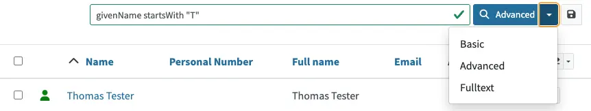

= midPoint Query Language
:page-display-order: 100
:page-toc: top
:toclevels: 3
:experimental:
:page-moved-from: /midpoint/reference/concepts/query/axiom-query-language/

_MidPoint Query Language_ (MQL) is a complex yet universal language that is designed to query xref:./searchable-items.adoc[searchable objects] in the midPoint repository.
It enables skilled users and midPoint professionals to search for objects, filter them, set up object references, etc.

The language closely follows the midPoint xref:/midpoint/reference/schema/[data model] which defines the names of properties, attributes, and all data items.

For more details, refer to xref:filters.adoc[].

[NOTE]
====
The new query language is undergoing renaming from 'Axiom' to 'midPoint Query Language' since midPoint version 4.8.
Consider _Axiom Query Language_ and _midPoint Query Language_ as synonyms.
====

== Scope of Use

MQL can be used in:

* <<gui,*GUI*>>
* <<configuration,*Configuration*>>
* <<midpoint_studio,*midPoint Studio*>>
* <<query_playground,*Query Playground*>>

[[gui]]
=== GUI

MQL is available as an advanced version of the search functionality in all views.

Access it by opening the icon:search[] search drop-down menu and selecting _Advanced_.
By default, search is set to _Basic_ to be easier to use by end users.

TIP: Try searching for all users whose given name starts with the letter "T" in the Users page.
Type the following in the search bar and click the search button: `givenName startsWith "T"`

For examples, refer to xref:/midpoint/reference/concepts/query/midpoint-query-language/query-examples[].

[[configuration]]
=== Configuration

MidPoint Query filters can be used in any configuration.
In XML configuration files, MQL is wrapped inside the `<text>` child element of the `<filter>` element.

For example, the `givenName startsWith "T"` query is stored in midPoint configuration as follows:

.midPoint Query in the XML configuration format
[source, xml]
----
<query>
  <filter>
    <text>givenName startsWith "J"</text>
  </filter>
</query>
----

.midPoint Query in the YAML configuration format
[source, yaml]
----
filter:
  text: givenName startsWith "J"
----

.midPoint Query in the JSON configuration format
[source, json]
----
"query" : {
  "filter" : {
	"text" : "givenName startsWith \"J\""
  }
}
----

[[midpoint_studio]]
=== midPoint Studio

xref:/midpoint/tools/studio[Midpoint Studio] is a great tool that helps midPoint engineers and administrators with midPoint configuration.
See how to xref:/midpoint/tools/studio/usage#_browsing_objects[use MQL in midPoint Studio].

[[query_playground]]
=== Query Playground

You can experiment with MQL queries in xref:./query-playground/index.adoc#_query_playground[].
Also, you can convert your existing configuration to MQL using xref:./query-playground/index.adoc#_query_converter[Query Converter].

== Transition from XML to MQL

MQL, formerly known as _Axiom Query Language_, was developed as a replacement for the xref:../xml-query-language/[XML-based query language] as a part of the xref:/midpoint/projects/midscale[midScale] project.
Although XML is conceptually based on xref:/midpoint/devel/axiom/[Axiom data modeling], MQL is more natural, user-friendly, and better aligned with that model.

MQL was introduced in midPoint 4.3, and except for embedded expressions, it was fully supported in midPoint 4.4 LTS.
Since midPoint 4.5, MQL is fully supported and is the recommended option.

MQL fully replaces the XML-based query language which, although still supported, is considered deprecated.
If you are using the XML-based query language, migrate to MQL as soon as possible.
