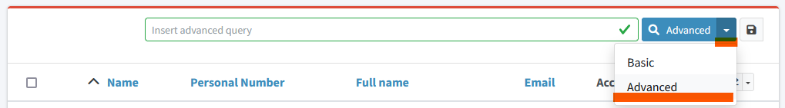

= midPoint Query Language
:page-display-order: 100
:page-toc: top
:toclevels: 3
:page-moved-from: /midpoint/reference/concepts/query/axiom-query-language/

_MidPoint Query Language_ is designed to query objects in midPoint repository.
It is a universal language used to search for objects in the repository, filter objects, set up object references and so on. It is used in all the places where we need to look for an object, not only in GUI.

The language closely follows midPoint data model.
Names of the properties, attributes and all the data items are directly taken from midPoint xref:/midpoint/reference/schema/[data model].

Not all items in midPoint objects are searchable. The list of searchable items (elements) in midPoint is provided in xref:./searchable-items.adoc[searchable items] document.

MidPoint Query language is complex. It is expected to be used by slightly skilled users and midPoint professionals.

== Using midPoint Query Language in midPoint

=== Using in GUI

Search panel is shown in GUI above each view by default.
By default, it displays basic search. This search option is designed to be easy to use by end users.

Midpoint Query Language is available in GUI as *Advanced search*. Its interface can be enabled by switching the search option from _Basic_ to _Advanced_.

You can test the queries directly in GUI. Starting in All users view. It is easy and straightforward.
As an example, to select all users with given name starting with "J" just enter `givenName startsWith "J"` to search bar and click search button.

Examples how to use the midPoint query in GUI can be found in xref:/midpoint/reference/concepts/query/midpoint-query-language/query-examples[query examples] page.

=== Using in Configuration

MidPoint Query filters can be used in any configuration place. In XML configuration files it is wrapped inside `<text>` element inside `<filter>` element.

For example query `givenName startsWith "J"` is stored in midPoint configuration this way.

.midPoint Query in XML configuration format
[source, xml]
----
<query>
  <filter>
    <text>givenName startsWith "J"</text>
  </filter>
</query>
----

.midPoint Query in YAML configuration format
[source, yaml]
----
filter:
  text: givenName startsWith "J"
----

.midPoint Query in JSON configuration format
[source, json]
----
"query" : {
  "filter" : {
	"text" : "givenName startsWith \"J\""
  }
}
----

To start with midPoint Query Language, please read xref:introduction.adoc[*Introduction to midPoint Query Language*].

=== Using in midPoint Studio

xref:/midpoint/tools/studio[Midpoint Studio] is great tool helping midPoint engineers and administrators with configuration and daily work.
You can use midPoint Query Language for xref:/midpoint/tools/studio/usage#_browsing_objects[querying of midPoint objects in midPoint Studio] as well.

=== Query Playground

To experiment with the query language, there is hardly a better place than the actual running midPoint.
MidPoint provides xref:./query-playground/index.adoc#_query_playground[query playground] feature that allows administrator more advanced experimenting with midPoint queries.

You may need to convert existing configuration using XML queries to midPoint Query Language.
There is xref:./query-playground/index.adoc#_query_converter[query converter] in midPoint that is helpful with such query conversion.

== Motivation, Origin and Future

MidPoint Query Language was developed during xref:/midpoint/projects/midscale[midScale] project. It was formerly known as Axiom query language.
The concepts of the language are based on xref:/midpoint/devel/axiom/[Axiom data modeling].
MidPoint Query Language is replacing an old xref:../xml-query-language/[XML-based query language].
The new language is more natural, user-friendly and better aligned with foundations of xref:/midpoint/devel/axiom/[Axiom data modeling].

MidPoint Query Language was introduced in midPoint 4.3.
It was almost fully supported in midPoint 4.4 LTS, except for embedded expression.
Since midPoint 4.5, midPoint Query Language is fully supported and recommended option.

The midPoint Query Language is a full replacement for XML-based language.
The XML-based language will be still supported for some time, but it will be dropped eventually.
Users of XML-based query language should migrate to midPoint Query Language as soon as possible.
