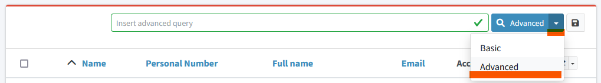
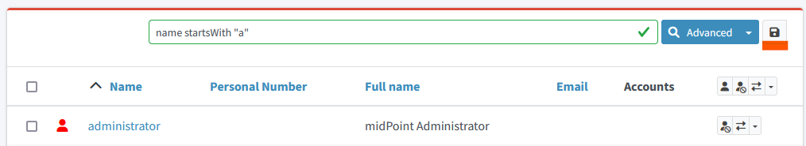

= Query Examples
:page-wiki-metadata-create-user: mspanik
:page-display-order: 550

Midpoint provides multiple mechanisms to xref:/midpoint/reference/concepts/query/[query] the data and search for information.
This document provides basic information and examples of advanced search using xref:/midpoint/reference/concepts/query/midpoint-query-language/[midPoint query language] in midPoint GUI.

The document is intended for users who understand midPoint concepts and architecture (IDM operators, administrators, engineers,...). They can use the midPoint query language in deeper analysis and searching for the objects and their relations in GUI.

== Basic Information

_MidPoint Query Language_ is designed to query objects in midPoint repository.
It is a universal language used to search for objects in the repository, filter objects, set up object references and so on. The language closely follows midPoint data model. Names of the properties, attributes and all the data items are directly taken from midPoint data model (e.g. fullName, activation/effectiveStatus).

MidPoint Query Language provides following comparison operators: "=", "!=", "<", "<=", ">", ">=" with their usual meaning. Strings may be compared also with _"startsWith"_, _"endsWith"_, _"contains"_ and _"fullText"_ operators (note: fullText operator requires configuration of fulltext index).

It provides also logical operators _"and"_, _"or"_ and _"not"_. Execution of complex queries may be ordered using brackets "(" and ")".

Objects in midPoint are bound by relations (assignments, inducements, ..). MidPoint Query Language provides dereferencing mechanism with operator "@" which allows searching objects using attributes and values in the references. See examples below for usage.

You can create complex queries also using _"matches"_ operator and _"exists"_ operator. See examples below for their usage.

More detail information and description of the operators can be found at xref:/midpoint/reference/concepts/query/midpoint-query-language/[midPoint Query Language] documentation.

== How to start

Basic search query is shown above each view by default. User can switch to advanced query by clicking the query button and selecting the _Advanced_ option.

Each query is searching objects within currently opened view in GUI. If user needs to search all objects of specific type, he has to select the relevant view (All users, All roles, All services).

Knowledge of internal structure of midPoint objects is necessary - at least basic names of attributes and basic understanding of assignment/targetRef attribute and roleMembershipRef attribute.
If the user needs to find name of specific attribute, he can use _Edit raw_ button on the object details page.

Search queries are case-sensitive. Query `givenName = "John"` is different from `givenName = "john"`

=== Saved searches

User can save predefined useful filters for future use - by using _Save filter_ button.

== Advanced Query Examples

Examples of queries using _midPoint Query Language_.

=== Search by attributes in objects and references

[options="header", cols="20, 30, 40"]
|===
|Request
|Advanced query
|Details

|Find users with specific given name
|`givenName = "John"`
|
|Find users with last name starting with specific string
|`familyName startsWith "Wo"`
|

|Find roles with name ending with specific string
|`name endsWith "LAST"`
|Searching in _All roles_ view

|Find service where _Application URL_ extension attribute contains specific string.
|`extension/appUrl contains "mycompanyname.com"`
|Attributes specific for the deployment are in objects stored as extension attributes in <extension> XML element.

To search these attributes you need to include "extension/" in the attribute name.

|Find disabled users in _All users view_
|`activation/administrativeStatus = "disabled"`
|

|Find multiple roles specified by name
|`name = ("Role A", "Role B", "Role C")`
| `=` and `!=` filters allow specifying set of values.

3+|*Search by attributes in referenced objects*

|Find User with specific assignment
|`assignment/targetRef/@/name = "End user"`
|The dereferencing operator "@" states that everything behind relates to the referenced object.

|Find User with service object indirectly assigned
|`roleMembershipRef/@/name = "SAP application"`
|The indirect assignment of service object represents "access to application"

|Find users of specific archetype
|`archetypeRef/@/name = "External Users"`
|

|Find members of a role _ABC_. Not its owner(s).
|`assignment/targetRef matches (relation = org:default and @ matches (name = "ABC"))`
|Role owner has role assigned with relation = owner. This query includes only users with default relation.

3+|*Logical operators in search*

|Find all external users with specific given name.
|`archetypeRef/@/name = "External Users" and givenName = "John"`
|

3+|*Search by dates and times*

|Find all users created after particular date
|`@metadata/storage/createTimestamp > "2022-09-21"`
|

|Find all users created on particular date (e.g. 22/10/2022)
|`@metadata/storage/createTimestamp >= "2022-10-22" and @metadata/storage/createTimestamp < "2022-10-23"`
| createTimestamp is datetime value. The value with time is larger just the date. 2022-10-22T01:05:13 that is larger than "2022-10-22"

|Find users modified in specific second
|`metadata/modifyTimestamp >= "2022-10-02T12:53:32"and metadata/modifyTimestamp < "2022-10-02T12:53:33"`
|

3+|*Search by object OID*

|Find 1 object specified by its OID
|`. inOid ("eb21455d-17cc-4390-a736-f1d6afa82057")`
|The list of OIDs may contain one or more OIDs.

|===

=== Search through assignments or other references

These searches are valid in views listing objects - users, roles, services. For searches in the object panels see chapters below.

[options="header", cols="20, 30, 40"]
|===
|Request
|Advanced query
|Details
|Find users with specific roles directly assigned
|`assignment/targetRef/@/name = "End user"`
|

|Find users with specific role assigned (directly or indirectly)
|`roleMembershipRef/@/name = "End user"`
|roleMembershipRef contains both direct and indirect assignments.

Note: roleMembershipRef may not be up-to-date if the role definition was updated and it's members were not recomputed.

|Find users without any service assigned (directly or indirectly)
|`roleMembershipRef not matches (targetType = ServiceType)`
|roleMembershipRef contains both direct and indirect assignments.

|Find users without any role or service assigned (directly or indirectly)
|`roleMembershipRef not matches (targetType = RoleType) AND roleMembershipRef not matches (targetType = ServiceType)`
|

|Roles without any inducement
|`inducement not exists`
|_exists_ operator with _not_ operator together. +
This can't be used with assignments if roles have assigned archetypes.

|Find users without any role or service directly assigned
|`assignment/targetRef not matches ( targetType = RoleType) AND assignment/targetRef not matches ( targetType = ServiceType)`
|Assignment attribute contains direct assignments only.

Query is rather complex, because each user has at least one assignment assigned - archetype assignment.

| Owners of roles (users with any role assigned as owner)
| `assignment/targetRef matches (targetType=RoleType and relation=owner)`
| Relation value is of QName type and therefore no quotation marks are used. The namespace (org:owner) is optional. +
See xref:../introduction.adoc#_matches_filter_in_references[matches filter in references].

|Users with account on specific resource
|`linkRef/@ matches ( +
. type ShadowType +
and resourceRef matches (oid = "093ba5b5-7b15-470a-a147-889d09c2850f") +
and intent = "default"
)`
|Resource is identified by OID

Note: For detail explanation of the query please check additional xref:/midpoint/reference/concepts/query/midpoint-query-language/introduction/[introduction to midPoint Query Language] page.

|Users with account on specific resource
|`linkRef/@ matches ( +
. type ShadowType +
and resourceRef/@/name = "LDAP" +
and intent = "default" )`
|Like previous query, just the resource is identified by resource name.

|Users having role with specific extension attribute assigned
|`assignment/targetRef/@ matches ( +
. type RoleType and extension/sapType="SAP555")`
|This is a complex query: Searching for all assignments of a role identified by value of specific extension attribute. +
In this case the `. type RoleType` type filter clause is necessary as midPoint need to know which type of objects to search for the extension attribute.

3+|*Searching within ORGs*

|Find all users who are members of an ORG
|`. inOrg[ONE_LEVEL] "fee70b8b-e7c3-4f62-af7c-7d5095100775"`
|Dot describes the user object. +
ONE_LEVEL matching rule limits the search to specified ORG only. If omitted, the query will search specified organization unit and its subunits. +
Doesn't matter if the user is member or manager of the ORG.

|Find all users who are members of an ORG specified by name
|`parentOrgRef/@/name = "DeptA"`
|The same query as above, just the ORG can be specified conveniently by name

|Find manager of an ORG
|`parentOrgRef matches (relation=org:manager and @ matches (name  = "DeptA"))`
|If ORG is specified by name, then `@ matches (name = "DeptA")` construction is necessary. +
Filter `relation=org:manager` must be used without quotes.

3+|*Searching in referenced objects*

MidPoint Query allows search in objects that are referenced by other objects.

|In roles view, find all roles that are assigned to specific user
|`. referencedBy (@type = UserType AND name = "adam" AND @path = assignment/targetRef)`
| Dot is important in the query. It specifies the object. +
Exact meaning of the query: "Return objects that are referenced in user named adam in attribute assignment/targetRef."

|===

=== Searching objects marked by Object marks

++++

++++

[options="header", cols="20, 30, 40"]
|===
|Request
|Advanced query
|Details

|Find all shadows with "Suspicious" object mark
|`effectiveMarkRef/@/name = "Suspicious"`
|If used within resource Accounts or Entitlements panels in GUI, the query returns shadows related to the particular resource only.

|Find all users that have shadows with "Suspicious" object mark
|`linkRef/@/effectiveMarkRef/@/name = "Suspicious"`
|Exact meaning of the query: "Return objects with linked shadows that have active object mark with name Suspicious."

|===

=== Searching in All accesses panel

View in "All accesses" panel displays content of "roleMembershipRef" attribute. So name of this attribute must be excluded from the queries.

[options="header", cols="20, 30, 40"]
|===
|Request
|Advanced query
|Details

|All assigned roles
|`. matches (targetType = RoleType)`
|You can also use ServiceType for services or OrgType for organizational units.

|All accesses starting with gallery in the display name
|`@/displayName startsWith "gallery"`
|The view shows display names of the objects. So search for name element could bring confusing results if name and displayName are different.

|All applications where the user has access
|`@/archetypeRef/@/name="Application"`
|This searches for all references with archetype named "Application". The same way you can search for "Application role" or "Business role".
|===

=== Searching in Assignments panels

Views in assignments panels display content of the "assignment" attribute. So name of this attribute must be excluded from the queries.

[options="header", cols="20, 30, 40"]
|===
|Request
|Advanced query
|Details

|All roles assigned directly
|`targetRef matches (targetType = RoleType)`
|

|All assignments (roles or other) with name starting with "C"
|`targetRef/@/name startsWith "C"`
|Dereferencing (search with @) is working in the assignment panel only when xref:/midpoint/guides/assignment-repository-search/index.adoc[repository search is enabled].
|===

=== Searching in Tasks

Standard structure of the task object was not prepared for searching.
Therefore, additional element `affectedObjects` allowing convenient searching of the tasks by affected objects and their execution mode was induced in 4.8.

[options="header", cols="20, 30, 40"]
|===
|Request
|Advanced query
|Details

|All tasks acting on users
|`affectedObjects/activity/objects/type = "c:UserType"`
|

|All tasks performing reconciliation
|`affectedObjects/activity/activityType = "c:reconciliation"`
| Include namespace specification "c:" in the activity type. +
Technically, the reconciliation tasks may be searched also via archetype.

|All tasks performing any operation with the resource XYZ
|`affectedObjects/activity/resourceObjects/resourceRef/@/name = "XYZ"`
|

|All tasks performing reconciliation on the resource XYZ
|`affectedObjects/activity/activityType = "c:reconciliation" and affectedObjects/activity/resourceObjects/resourceRef/@/name = "XYZ"`
|You can use archetype and resource OIDs as well, just using dereferenced names is easier to read.

|All simulation tasks
|`affectedObjects/activity/executionMode = "preview"`
|Simulation tasks are in the "preview" mode. Standard tasks that also execute changes have execution mode "full".

|===

=== Searching in Audit Events

You can utilize midPoint Query Language as well in Audit Log Viewer. It will allow you to review for failed events, select specific objects and operations.

Instead of basic search, there is no specific timeframe defined for each search. Please use timestamp specification while searching in audit. It will increase search speed significantly. Especially in large audit searches.

[options="header", cols="20, 30, 40"]
|===
|Request
|Advanced query
|Details

|All events initiated by specific user
|`initiatorRef/@/name = "administrator"`
|

|All events related to specific user
|`targetRef/@/name="johndoe"`
| This is also possible via object OID, without dereferencing: `targetRef matches (oid = "a560613e-ce4c-4020-a7c7-3de1af706234")`

|All events in specific day
|`timestamp >= "2023-09-18" and timestamp < "2023-09-19"`
|

|All events within specific time range
|`timestamp >= "2023-09-19T11:00:00" and timestamp < "2023-09-19T13:10:00"`
|

|All events of specific type
|`eventStage = "request"`
|

|All events where specific attribute was updated.
|`changedItem = c:fullName`
|Include "c:" prefix to the name of the attribute. +
This query finds all events where the "fullName" attribute was modified.

|All failed events since specific date
|`outcome != "success" and timestamp > "2023-09-18"`
|You can't use scripting in GUI search. Therefore, the dates must be defined explicitly and updated if necessary.

|All events related to resource "XYZ"
|`delta matches (resourceName = "XYZ")`
|This is also possible via resource OID, without dereferencing: `delta matches (resourceOid = "71dcd12f-dba3-437e-bc0d-b021d937832d" )`

|All events related to account "john" on the resource "XYZ"
|`delta matches (resourceName = "Target2-with-roles" and shadowKind = "account" and objectName = "john")`
|Delta components - "resourceName" and "objectName" contain values relevant during the event creation. These may be modified afterward.

|All events related to user "JohnDoe" on the resource "XYZ"
|`targetRef/@/name="JohnDoe" and delta matches (resourceName = "XYZ")`
|The previous select was searching of the modification of the defined account on the defined resource. This search is providing audit events on the specified resource related to specific user (not only accounts, but may be also entitlements or accounts with different names)

|All events generated by specific task (any run)
|`taskOID="4a9b055d-2d31-474a-8e39-6a2e6ac104a2"`
|

|All events generated by specific task (single run)
|`taskIdentifier = "1695198082065-43516-1"`
|The task identifier is individual for each run of the task.

|All object modifications that didn't went well
|`eventType = "modifyObject" and eventStage = "execution" and outcome != "success"`
|

3+|*Searching in audit deltas*

|All events where accounts on the resource "XYZ" were created or modified
|`delta matches (resourceName = "XYZ" and shadowKind = "account")`
|

|===

== See Also

- xref:/midpoint/reference/concepts/query/midpoint-query-language/[midPoint Query Language] - Main page of midPoint Query Language.
- xref:/midpoint/reference/concepts/query/midpoint-query-language/searchable-items/[Searchable items] - Which items/elements/attributes can be searched.
- xref:/midpoint/reference/concepts/query/midpoint-query-language/errors/[Errors while using midPoint query] - Error messages with explanation and hints how to solve them.
- xref:/midpoint/reference/concepts/query/midpoint-query-language/expressions/[Using expressions in midPoint Query language] - Expressions in midPoint Query Language.
