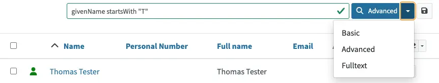

= Query - EXAMPLES
:page-wiki-metadata-create-user: mspanik
:page-since: "4.4"
:page-since-improved: [ "4.5", "4.6", "4.7", "4.8" ]
:page-display-order: 550
:experimental:
:page-toc: top

MidPoint provides multiple mechanisms to xref:/midpoint/reference/concepts/query/[query] data and search for information.
This page provides basic information and examples of advanced search using xref:/midpoint/reference/concepts/query/midpoint-query-language/[midPoint query language (MQL)] in midPoint GUI.

The page is intended for users who understand midPoint concepts and architecture (IDM operators, administrators, engineers, etc.) who can use MQL in deeper analyses, and search for objects and their relations in GUI.

== Basic Information

MQL is designed to query objects in the midPoint repository, filter objects, set up object references, and so on.
The language closely follows the midPoint xref:/midpoint/reference/schema/data-model-essentials/[data model]. Names of properties, attributes, and all data items are directly taken from the midPoint data model (e.g. fullName, activation/effectiveStatus).

MQL provides the following comparison operators: "=", "!=", "<", "<=", ">", ">=" with their usual meaning. Strings may also be compared using the _"startsWith"_, _"endsWith"_, _"contains"_ and _"fullText"_ operators.
Note that the fullText operator requires configuration of the fulltext index.

It also provides logical operators _"and"_, _"or"_ and _"not"_. Execution of complex queries may be ordered using brackets.

Objects in midPoint are bound by relations (assignments, inducements, etc.). MQL provides dereferencing mechanism with the "`@`" operator which allows searching for objects using attributes and values in references. See <<advanced_query_examples,usage examples>>.

You can create complex queries also using the _"matches"_ operator and _"exists"_ operators. See <<advanced_query_examples,usage examples>>.

For more information on operators, refer to xref:/midpoint/reference/concepts/query/midpoint-query-language/[].

== How to Start

In each view in GUI, search is set to _Basic_ by default. To be able to use MQL queries, you need to open the search options and select _Advanced_.

Each query searches for objects within the currently opened view in GUI. If you want to search for all objects of a specific type, you need to select the relevant view (All users, All roles, All services).

It is necessary to be familiar with the internal structure of midPoint objects.
You should know the basic names of attributes, have an understanding of the assignment/targetRef attribute and the roleMembershipRef attribute.
To find the name of a specific attribute, use the icon:edit[] btn:[Edit raw] button on the object details page.

Search queries are case-sensitive. For example, the query `givenName = "John"` is different from `givenName = "john"`.

=== Saved Searches

You can save filters for future use by clicking the icon:save[] btn:[Save filter] button.

[[basic_query_examples]]
[#_query_examples]
== Basic Query Examples

This section provides examples of MQL queries that can be utilized when configuring midPoint.

=== Search by Archetype Name

You can search for reports with an archetype using the archetype name:

.midPoint query
----
archetypeRef/@/name = "Report export task"
----

Where `archetypeRef/@` specifies that we are not matching a reference value but its target. In this case, it is an archetype.

=== Search by Assigned Role Name

.midPoint query
----
assignment/targetRef/@/name = "Role Name"
----

Where `assignment/targetRef/@` specifies that we are not matching a reference value but its target. In this case, it is an assigned role.

=== Users with Account on Specific Resource

You can search for users who have an account specified resource by using the default intent.

.midPoint query
----
linkRef/@ matches (
  . type ShadowType
  and resourceRef matches (oid = "ff735c0a-21e3-11e8-a91a-df0065248d2d")
  and intent = "default"
)
----

Where:

* `linkRef/@` specifies the dereference target of `linkRef`.
This behaves similarly to SQL `JOIN` and enables you to filter properties of the target.
* `matches` specifies a subfilter for the dereferenced target, i.e. the filter that `linkRef` must match.
  ** `. type ShadowType` searches for shadows on the resource.
  This is necessary to be able to use shadow properties for the filter.
  ** `resourceRef matches (oid = "..." )` matches a specific resource to which the shadow belongs.
  ** `intent = "default"` matches the shadow with the default intent.

==== All Roles which Are Assigned to System Users

.midPoint query using `UserType` in a referencedBy filter
----
. referencedBy (
  @type = UserType
  and @path = assignment/targetRef
  and archetypeRef/@/name = "System user"
)
----

.midPoint query using `AssignmentType` in a referencedBy filter
----
. referencedBy (
   @type = AssignmentType
   and @path = targetRef
   and . ownedBy (
      @type = UserType
      and @path = assignment
      and archetypeRef/@/name = "System user"
   )
)
----

==== All Roles Assigned Using Inducement
The following filter is only supported in the midPoint native repository.

.midPoint query
----
. referencedBy (
  @type = AbstractRoleType
  and @path = inducement/targetRef
)
----

==== All Roles Assigned to Administrator Using Full Text Search

.midPoint query
----
. referencedBy (
   @type = UserType
   and @path = roleMembershipRef
   and . fullText "administrator"
)
----

==== Search Assigned Role Using Full Text Search

.midPoint query
----
assignment/targetRef/@ matches (
   . fullText "secret"
)
----

[[advanced_query_examples]]
== Advanced Query Examples

See examples of MQL queries below.

=== Search by Attributes in Objects and References

[options="header", cols="20, 30, 40"]
|===
|Request
|Advanced query
|Details

|Find users with a specific given name.
|`givenName = "John"`
|
|Find users with the last name starting with a specific string.
|`familyName startsWith "Wo"`
|

|Find roles with the name ending with a specific string.
|`name endsWith "LAST"`
|Searching in _All roles_ view.

|Find services where the _Application URL_ extension attribute contains a specific string.
|`extension/appUrl contains "mycompanyname.com"`
|Attributes specific to a deployment are in objects stored as extension attributes in the <extension> XML element.

To search for these attributes, you need to include "extension/" in the attribute name.

|Find disabled users in the _All users_ view.
|`activation/administrativeStatus = "disabled"`
|

|Find multiple roles specified by name.
|`name = ("Role A", "Role B", "Role C")`
| The `=` and `!=` filters allow specifying sets of values.

3+|*Search by attributes in referenced objects*

|Find a user with a specific assignment.
|`assignment/targetRef/@/name = "End user"`
|The dereferencing operator "`@`" states that everything coming after it relates to the referenced object.

|Find users with an indirectly assigned service object.
|`roleMembershipRef/@/name = "SAP application"`
|The indirect assignment of a service object represents "access to application".

|Find users of a specific archetype.
|`archetypeRef/@/name = "External Users"`
|

|Find members (not owners) of the _ABC_ role.
|`assignment/targetRef matches (relation = org:default and @ matches (name = "ABC"))`
|The role owners have the role assigned as `relation = owner`.
This query only captures users with the default relation.

3+|*Logical operators in search*

|Find all external users with a specific given name.
|`archetypeRef/@/name = "External Users" and givenName = "John"`
|

3+|*Search by dates and times*

|Find all users created after a particular date.
|`metadata/createTimestamp > "2022-09-21"`
|

|Find all users created on a particular date (e.g. 22/10/2022).
|`metadata/createTimestamp >= "2022-10-22" and metadata/createTimestamp < "2022-10-23"`
| `createTimestamp` is a datetime value.
The value containing time is larger than the value that only contains the date, i.e. 2022-10-22T01:05:13 is larger than "2022-10-22".

|Find users modified at a specific second.
|`metadata/modifyTimestamp >= "2022-10-02T12:53:32"and metadata/modifyTimestamp < "2022-10-02T12:53:33"`
|

3+|*Search by object OID*

|Find 1 object specified by its OID.
|`. inOid ("eb21455d-17cc-4390-a736-f1d6afa82057")`
|The list of OIDs may contain one or more OIDs.

|===

=== Search Through Assignments or Other References

These searches are valid in views listing objects, such as users, roles, or services.

[options="header", cols="20, 30, 40"]
|===
|Request
|Advanced query
|Details
|Find users with directly assigned specific roles.
|`assignment/targetRef/@/name = "End user"`
|

|Find users with specific roles assigned (directly or indirectly).
|`roleMembershipRef/@/name = "End user"`
|`roleMembershipRef` contains both direct and indirect assignments.

Note that `roleMembershipRef` may not be up-to-date if the role definition was updated, and if its members were not recomputed.

|Find users without a service assigned (directly or indirectly).
|`roleMembershipRef not matches (targetType = ServiceType)`
|`roleMembershipRef` contains both direct and indirect assignments.

|Find users without a role or service assigned (directly or indirectly).
|`roleMembershipRef not matches (targetType = RoleType) AND roleMembershipRef not matches (targetType = ServiceType)`
|

|Find roles without inducements.
|`inducement not exists`
|This combines the `exists` and `not` operators.
Cannot be used with assignments if roles have assigned archetypes.

|Find users without a directly assigned role or service.
|`assignment/targetRef not matches ( targetType = RoleType) AND assignment/targetRef not matches ( targetType = ServiceType)`
|The assignment attribute only contains direct assignments. +
The query is complex because each user has at least one assignment (the archetype assignment).

|Find owners of roles, i.e. users with roles to which they are assigned as owners.
| `assignment/targetRef matches (targetType=RoleType and relation=owner)`
| The relation value is of the QName type and therefore no quotation marks are used. +
The namespace (org:owner) is optional. +
See xref:../filters.adoc#_Matches_Filter_in_References[Matches filter in references].

|Find users with accounts in a specific resource.
|`linkRef/@ matches ( +
. type ShadowType +
and resourceRef matches (oid = "093ba5b5-7b15-470a-a147-889d09c2850f") +
and intent = "default"
)`
|The resource is identified by OID.

|Find users with an account in a specific resource.
|`linkRef/@ matches ( +
. type ShadowType +
and resourceRef/@/name = "LDAP" +
and intent = "default" )`
|Same as the previous query, only in this case, the resource is identified by its name.

|Find users who have roles with specific extension attributes assigned.
|`assignment/targetRef/@ matches ( +
. type RoleType and extension/sapType="SAP555")`
|This is a complex query that searches for all assignments of a role identified by the value of a specific extension attribute. +
In this case, the `. type RoleType` type filter clause is necessary as midPoint needs to know which type of object to search for using the extension attribute.

3+|*Searching within ORGs*

|Find all users who are members of an ORG.
|`. inOrg[ONE_LEVEL] "fee70b8b-e7c3-4f62-af7c-7d5095100775"`
|The dot describes the user object. +
The ONE_LEVEL matching rule limits the search to the specified ORG only. If omitted, the query will search for a specified organization unit and its subunits.
It makes no difference if the user is a member or manager of the ORG.

|Find all users who are members of an ORG specified by its name.
|`parentOrgRef/@/name = "DeptA"`
|The query is the same as the previous query, only in this case, the ORG is conveniently specified by its name.

|Find a manager of an ORG.
|`parentOrgRef matches (relation=org:manager and @ matches (name  = "DeptA"))`
|If the ORG is specified by its name, then the `@ matches (name = "DeptA")` construction is necessary. +
The `relation=org:manager` filter must be used without quotes.

3+|*Searching in referenced objects*

With MQL, you can search in objects that are referenced by other objects.

|In the roles view, find all roles that are assigned to a specific user.
|`. referencedBy (@type = UserType AND name = "adam" AND @path = assignment/targetRef)`
| The dot is important in the query as it specifies the object. +
The exact meaning of the query is: "Return objects that are referenced in the user named "adam" in the attribute assignment/targetRef."

|===

=== Searching in All Accesses Panel

View in the "All accesses" panel displays the content of the "roleMembershipRef" attribute.
This means that you need to exclude the attribute name from your queries.

[options="header", cols="20, 30, 40"]
|===
|Request
|Advanced query
|Details

|Find all assigned roles.
|`. matches (targetType = RoleType)`
|You can also use ServiceType for services or OrgType for organizational units.

|Find all accesses starting with the gallery in the display name.
|`@/displayName startsWith "gallery"`
|The view shows display names of objects, i.e. searching for a name element could return confusing results if the name and displayName are different.

|Find all applications to which a user has access.
|`@/archetypeRef/@/name="Application"`
|This searches for all references with the "Application" archetype.
You can search for "Application role" or "Business role" in the same way.
|===

=== Searching in Assignments Panels

Views in assignments panels display the content of the "assignment" attribute, i.e. you need to exclude the name of this attribute from queries.

[options="header", cols="20, 30, 40"]
|===
|Request
|Advanced query
|Details

|Find all directly assigned roles.
|`targetRef matches (targetType = RoleType)`
|

|Find all assignments (roles or other) with the name starting with "C".
|`targetRef/@/name startsWith "C"`
|Dereferencing (searching with "`@`") only works in the assignment panel when xref:/midpoint/guides/assignment-repository-search/index.adoc[repository search is enabled].
|===

=== Searching in Tasks

The standard task object structure is not designed for searching.
Therefore, an additional `affectedObjects` element is used since midPoint 4.8.
This enables you to search for tasks by affected objects and their execution mode.

++++

++++

[options="header", cols="20, 30, 40"]
|===
|Request
|Advanced query
|Details

|Find all tasks running on users.
|`affectedObjects/activity/objects/type = "c:UserType"`
|

|Find all tasks that perform reconciliation.
|`affectedObjects/activity/activityType = "c:reconciliation"`
| Include namespace specification "c:" in the activity type. +
Technically, the reconciliation tasks may be searched also via archetype.

|Find all tasks that perform an operation with the XYZ resource.
|`affectedObjects/activity/resourceObjects/resourceRef/@/name = "XYZ"`
|

|Find all tasks that perform reconciliation on the XYZ resource.
|`affectedObjects/activity/activityType = "c:reconciliation" and affectedObjects/activity/resourceObjects/resourceRef/@/name = "XYZ"`
|You can use archetypes or resource OIDs, however, dereferenced names are easier to read.

|Find all simulation tasks.
|`affectedObjects/activity/executionMode = "preview"`
|Simulation tasks are in the "preview" mode.
Standard tasks that also execute changes have the "full" execution mode.

|===

=== Searching in Audit Events

You can utilize MQL also in Audit Log Viewer which enables you to review failed events, select specific objects and operations.

There is no specific timeframe defined for _Advanced_ search.
In audit searches, especially if they are extensive, it is recommended to specify timestamps for better performance.

++++

++++

[options="header", cols="20, 30, 40"]
|===
|Request
|Advanced query
|Details

|Find all events initiated by a specific user.
|`initiatorRef/@/name = "administrator"`
|

|Find all events related to a specific user.
|`targetRef/@/name="johndoe"`
| This is also possible via object OID, without dereferencing: `targetRef matches (oid = "a560613e-ce4c-4020-a7c7-3de1af706234")`

|Find all events in a specific day.
|`timestamp >= "2023-09-18" and timestamp < "2023-09-19"`
|

|Find all events within a specific time range.
|`timestamp >= "2023-09-19T11:00:00" and timestamp < "2023-09-19T13:10:00"`
|

|Find all events of a specific type.
|`eventStage = "request"`
|

|Find all events in which a specific attribute was updated.
|`changedItem = c:fullName`
|Include the "c:" prefix in the name of the attribute. +
This query finds all events in which the "fullName" attribute was modified.

|Find all failed events since a specific date.
|`outcome != "success" and timestamp > "2023-09-18"`
|You cannot use scripting in GUI searches.
Therefore, the dates must be defined explicitly and updated if necessary.

|Find all events related to the "XYZ" resource.
|`delta matches (resourceName = "XYZ")`
|You can also use the resource OID, without dereferencing: `delta matches (resourceOid = "71dcd12f-dba3-437e-bc0d-b021d937832d")`

|Find all events related to the "john" account in the "XYZ" resource.
|`delta matches (resourceName = "Target2-with-roles" and shadowKind = "account" and objectName = "john")`
|The delta components `resourceName` and `objectName` contain values relevant during the event creation.
These may be modified at a later point.

|Find all events related to user "JohnDoe" in the "XYZ" resource.
|`targetRef/@/name="JohnDoe" and delta matches (resourceName = "XYZ")`
|While the previous query was searching for modifications of an account in a resource, this query provides audit events in the specified resource related to a specific user (not only accounts but potentially also entitlements or accounts with different names).

|Find all events generated by specific task (any run).
|`taskOID="4a9b055d-2d31-474a-8e39-6a2e6ac104a2"`
|

|Find all events generated by a specific task (single run).
|`taskIdentifier = "1695198082065-43516-1"`
|The task identifier is unique for each run of the task.

|Find all object modifications that did not go well.
|`eventType = "modifyObject" and eventStage = "execution" and outcome != "success"`
|

3+|*Searching in audit deltas*

|Find all events in which accounts in the "XYZ" resource were created or modified.
|`delta matches (resourceName = "XYZ" and shadowKind = "account")`
|

|===

[[filtering_all_objects_of_specified_type]]
=== Filtering All Objects of Specified Type

Sometimes, in configuration files, you need to select all objects of a specific object type.
An example of such a case would be selecting all users in midPoint through an object collection.

To select all objects, just omit the `<filter>` element in the query, or the entire query.

The object collection below lists all roles (all objects of RoleType) in midPoint.

[source,XML]
----
<objectCollection oid="72b1f98e-f587-4b9f-b92b-72e251dbb255">
    <name>All roles</name>
    <type>RoleType</type>
</objectCollection>
----

== See Also

- xref:/midpoint/reference/concepts/query/midpoint-query-language/[midPoint Query Language] - The main page of MQL.
- xref:/midpoint/reference/concepts/query/midpoint-query-language/searchable-items/[Searchable items] - Which items/elements/attributes can be searched.
- xref:/midpoint/reference/concepts/query/midpoint-query-language/errors/[Errors while using midPoint query] - Error messages with troubleshooting suggestions.
- xref:/midpoint/reference/concepts/query/midpoint-query-language/expressions/[Using expressions in midPoint Query language] - Expressions in MQL.
