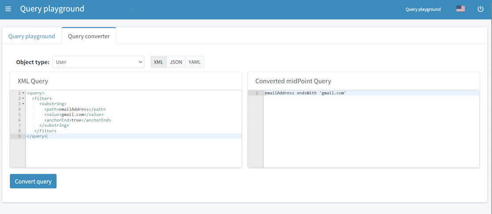

= Query Playground and Query Converter
:page-nav-title: Query playground and converter
:page-display-order: 600
:experimental:
:page-toc: top

This page shows you how you can experiment with midPoint Query Language (MQL) directly in midPoint, in *Query playground*, and how you can convert your XML queries to MQL in *Query converter*.

[#_query_playground]
== Query Playground

image:query-playground.png[Query playground]

To experiment with a query:

. Log into midPoint GUI as an administrator and select icon:search[] btn:[Query playground] at the bottom of the main menu on the left.
. In Query playground, select the *Object type* from which the query will be selecting.
    When searching in GUI, the object type is defined by the currently opened view.
    In Query playground, you need to define it manually. +
    Check *Distinct* if you only want to return unique objects, i.e. midPoint will eliminate duplicates and display each object only once.
. Type your query into the text area, or use a predefined query by selecting it in the *Or use an example* drop-down menu.
. Click btn:[Translate to SQL query] to preview the SQL query and parameters, or click btn:[Translate and execute] to run the query directly.

[NOTE]
Container value queries are not supported in Query playground.

[IMPORTANT]
====
The *distinct* option is often essential to get the correct count of objects when searching in the Generic repository.
This is caused by the SQL `LEFT JOIN` clause which is used when traversing to multi-value containers.
For example, using a filter on `assignment/targetRef` causes each object with multiple assignments to be returned multiple times.
Using the Exists filter does not fix this in the Generic repository as that repository also uses `LEFT JOIN` internally.

Contrary to the Generic repository, the newer xref:/midpoint/reference/repository/native-postgresql/[Native repository] does not have these problems as it always uses the SQL `EXISTS` clause both in the Exists filter, and when traversing to multi-value containers.
The Native repository ignores the *distinct* option if there is no `JOIN` in the final query, as the returned raws must be distinct.
Native repository uses `LEFT JOIN` only to traverse across single-valued containers and references and their targets.
That is why using the *distinct* option with the Native repository can potentially lead to lower SQL performance.
====

=== Fluent API Script Translation

Query playground has a feature that translates queries from fluent API scripts.
This enables you to debug the Groovy code for an expression directly in the GUI before using it:

. Check *Translate from Query API script*, the expression text area will appear.
. Enter the code as an expression, for example:
+
[source, groovy]
----
import com.evolveum.midpoint.xml.ns._public.common.common_3.*

def query = midpoint.queryFor(UserType.class, "name startsWith 'a'")
----
+
You can use older XML-like query definitions as well: +
+
[source, groovy]
----
import com.evolveum.midpoint.xml.ns._public.common.common_3.*

prismContext.queryFor(FocusType.class)
    .item(FocusType.F_NAME).startsWith("a").build()
----
+
. Select the *Object type* like you would for any other query.
In our example, we are using the type from the `queryFor(...)` call, i.e. `FocusType`.
. In the *Language* drop-down menu, select the language in which the script is written (_XML_/_JSON_/_YAML_).
. Press *Translate and execute*.
This executes the query in the expression and also shows the query in the selected language.

Using expressions requires proper imports.
Depending on the complexity of the script, you may need additional imports from packages like `com.evolveum.midpoint.schema`, `com.evolveum.midpoint.prism.query`, or others.

[NOTE]
====
* If the query does not provide expected results, check that you have selected the correct object type.
* When using expressions, do not add lines that perform the actual searches (e.g. midpoint.searchObjects(query)) in the query builder to prevent conversion failures.
====

[#_query_converter]
== Query Converter

Midpoint can help you convert your old-fashioned XML queries to MQL in *Query converter* which is available in a tab next to the *Query playground* tab.

To convert an XML query:

. Select the *Object type* from which the query will be selecting.
. Paste your full original query, i.e. starting with the `<query>` element, into the *XML Query* text area.
    Make sure you remove namespaces from XML elements, or define them in the `<query>` element.
. Press *Convert query*.

.An example without namespaces
[source,xml]
----
<query>
    <filter>
        <substring>
            <path>emailAddress</path>
            <value>gmail.com</value>
            <anchorEnd>true</anchorEnd>
        </substring>
    </filter>
</query>
----

.An example with a namespace definition
[source,xml]
----
<query xmlns:q="http://prism.evolveum.com/xml/ns/public/query-3">
    <q:filter>
        <q:substring>
            <q:path>emailAddress</q:path>
            <q:value>gmail.com</q:value>
            <q:anchorEnd>true</q:anchorEnd>
        </q:substring>
    </q:filter>
</query>
----
