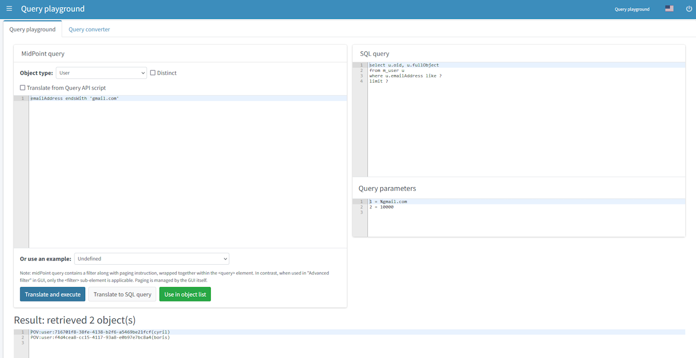

= Query Playground and Query Converter
:page-nav-title: Query playground and converter
:page-display-order: 600

To experiment with the query language, there is hardly a better place than the actually running midPoint.

[#_query_playground]
== Query playground

Log in the GUI as administrator and choose *Query playground* in the main menu on the left, all the way down, just above *About*.

To test the query, you have to:

. Select the *Object type*,
** Object type defines type of objects the query will be selecting from. While searching in GUI the object type is defined by actually opened view. In query playground you need to define it manually.
** check *Distinct* if needed (first try without it),
. write the *query* into the text area,
. press *Translate and execute*.

Alternatively use an existing example from the selection box below.

You can either execute the query or just simulate it.
In both cases you will see the translated SQL query (or HQL for the old Generic repository) and the parameter values.

[NOTE]
Container value queries are not yet supported by the Query playground.

[IMPORTANT]
====
The *distinct* option is often essential to get the right count of objects when searching in the Generic repository.
This is caused by `LEFT JOIN` used even when traversing to multi-value containers.
E.g., filter on `assignment/targetRef` causes each object with multiple assignments to be returned multiple times.
Using Exists filter (see later) does not fix this in the Generic repository either, as it also uses `LEFT JOIN` internally.

The new xref:/midpoint/reference/repository/native-postgresql/[Native repository] does not suffer
by these problems as it always uses SQL `EXISTS` when traversing to multi-value containers and also for Exists filter.
Native repository actually *ignores distinct* if there is no `JOIN` in the final query, as the returned raws must be distinct.
Native repository uses `LEFT JOIN` only to traverse across single-valued containers and references and their targets,
so even then the distinct option is useless and, when honoured, can potentially hurt SQL performance.
====

=== Fluent API script translation

Query playground offers an option to translate queries from fluent API scripts.
This way you can debug the Groovy code for an expression directly in the GUI before using it.

To do this, follow these steps:

* Check *Translate from Query API script*, the expression text area will appear.
* Enter the code as an expression, e.g.:
+
[source, groovy]
----
import com.evolveum.midpoint.xml.ns._public.common.common_3.*

def query = midpoint.queryFor(UserType.class, "name startsWith 'a'")
----

** You can use older XML like query definitions as well:

[source, groovy]
----
import com.evolveum.midpoint.xml.ns._public.common.common_3.*

prismContext.queryFor(FocusType.class)
    .item(FocusType.F_NAME).startsWith("a").build()
----

* Select the *Object type*, just like for any other query.
Just use the type from `queryFor(...)` call, in our example `FocusType`.
If the query does not provide expected results, very likely the object type selection is not right.
* Press *Translate and execute*.

This will execute the query in the expression and also shows the query in the text area for
XML/JSON/YAML query - in the language currently chosen.

Using the expression requires proper imports - depending on the complexity of the script you
may need additional imports from packages like `com.evolveum.midpoint.schema`,
`com.evolveum.midpoint.prism.query` or others.

NOTE: While using expressions, do not add lines performing the search itself (e.g. midpoint.searchObjects(query)) in query builder. The conversion can fail.

[#_query_converter]
== Query converter

Midpoint can help you convert your old-fashioned XML queries to midPoint Query Language.
Query converter allows such conversion.

*Query converter* is available on the second tab of *Query playground*.

image:query-converter.png[Query converter]

To convert the XML query, just:

. Select the *Object type*,
. Write or paste your original XML query into the query converter text area
. Press *Convert query*.

Following *hints* can help you while converting:

* Select correct object type. The resulting query depends on object type.
* When entering XML query please enter whole query starting with `<query>` element as seen on the picture above or example below.
* Remove namespaces from XML elements, or define required namespaces in `<query>` element. See examples below.

.Example without namespaces
[source,xml]
----
<query>
    <filter>
        <substring>
            <path>emailAddress</path>
            <value>gmail.com</value>
            <anchorEnd>true</anchorEnd>
        </substring>
    </filter>
</query>
----

.Example with namespace definition
[source,xml]
----
<query xmlns:q="http://prism.evolveum.com/xml/ns/public/query-3">
    <q:filter>
        <q:substring>
            <q:path>emailAddress</q:path>
            <q:value>gmail.com</q:value>
            <q:anchorEnd>true</q:anchorEnd>
        </q:substring>
    </q:filter>
</query>
----
