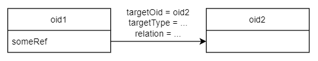
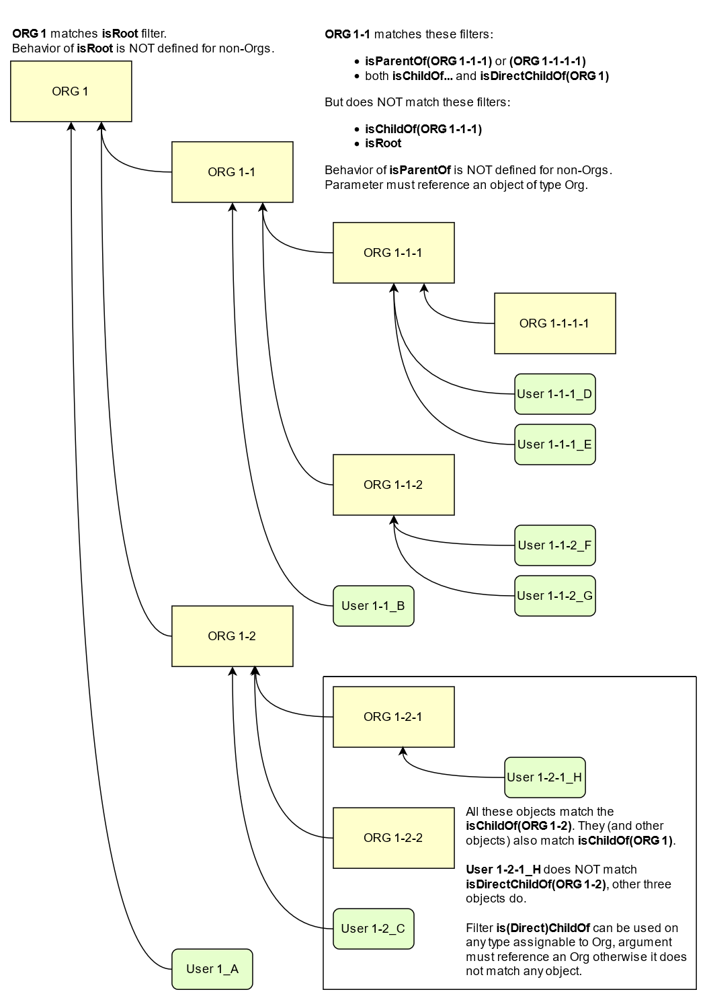
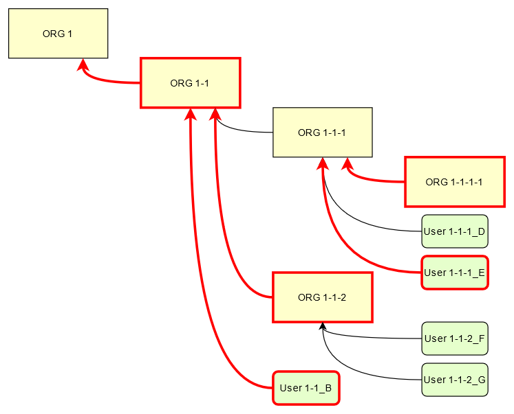

= Query concepts
:page-nav-title: Query Concepts
:page-display-order: 300
:page-toc: top
:toclevels: 3

This document contain advanced documentation describing concepts of querying in midPoint and midPoint Query language building blocks. New midPoint users and engineers may find this information hard to follow and confusing.

If you are starting with midPoint query, the xref:../midpoint-query-language/index.adoc[midPoint Query Language] document will be more helpful.

== Introduction

MidPoint works with *objects* of various types.
These objects can be part of the running process (in memory),
stored persistently in xref:/midpoint/reference/repository/[midPoint Repository], or can represent
objects on the xref:/midpoint/reference/resources/[Resources].

MidPoint *query* allows us to select only the objects that match specified criteria.
These criteria are formulated as a *filter* and are part of the *query*.
Both query and filter are part of the midPoint Query API described in this document.

[NOTE]
Query language is defined in Prism project in link:https://github.com/Evolveum/prism/blob/master/infra/prism-impl/src/main/resources/xml/ns/public/query-3.xsd[query-3 schema].

=== Prism and Resource objects refresher

MidPoint works with data structures called xref:/midpoint/devel/prism/data-structures/[Prism objects].
These are used for midPoint internal data, but they can also represent remote objects stored on the xref:/midpoint/reference/resources/[Resources], e.g. accounts and groups.
Prism objects are stored in the xref:/midpoint/reference/repository/[Repository] to preserve long-term midPoint state.
Collections of Prism objects in memory are worked with frequently too.

Each Prism object is conceptually a tree.
Tree nodes are called prism items: containers, references and properties.
Each item has one or more values: container values, reference values or property values.
See xref:/midpoint/devel/prism/data-structures/[Prism Data Structures] for more.
Some items are strictly single-valued, others may contain multiple values.

The resource objects are represented as xref:/midpoint/reference/resources/shadow/[Shadow objects] inside midPoint.
Remote attributes of interests are stored in a single-valued container called `attributes`.
You can either query Shadow objects, which is a query against the repository, or you can query remote resource objects.
But resources generally don't understand midPoint Query language, and the query must be translated.
For instance, when a xref:/midpoint/reference/resources/connid/[ConnId Connector] is used, the Query is translated for the ConnId framework.
Limitations are mentioned in this document later.

== Queries

You can query various types of objects (in a very general terms), e.g. midPoint objects,
container values, or even references - which affects the form of the query result.
You can also query various subsystems - like repository or provisioning.
It is possible to narrow down your search with various filters.
And this all can be specified using various representations, like
*xref:/midpoint/reference/concepts/query/midpoint-query-language[midPoint query language]* (formerly known as Axiom) or *XML*.

NOTE: The _midPoint Query Language_ was in versions prior 4.8 known as _Axiom Query Language_. It was renamed in version 4.8. If you find term _Axiom Query Language_ in some older documentation, please consider it as synonym to _midPoint Query Language_.

To start with an example, here is a simple filter in two very distinct forms:

[source,midpoint-query]
----
name = "jack"
----

[source,xml]
----
<equal>
    <path>name</path>
    <value>jack</value>
</equal>
----

In both cases we're searching for an object with the name "jack".

But this is just a filter, which is probably the most used part of the query - but it's not all.
So let's start with various query types, and then we will look at the query parts.

=== Types of query result

We recognize the following types of queries based on the returning type:

* An *object query*, targeted at one or more object classes, for example:

** "give me all users with a given name",
** "give me all the objects with a given name" (not just users),
** "give me all focal objects with a given assignment", etc.

* A *container value query*, often called just "container query".
+
Such queries are targeted at container values.
These are being introduced in the context of special objects, like certification campaigns
and lookup tables, or even in cases when no parent object exists, like audit events.
Examples of queries:

** "give me all certification cases related to this reviewer, irrespective to in which campaign they are contained",
** "give me all rows for this particular lookup table that start with this prefix",
** "give me all work items allocated to particular user".

* A *reference query*, for example:

** "give me all the role membership references for all the users",
** "give me all projection (link) refs for a given resource".

Container value queries were introduced for the following reasons:

* Querying the objects would still return all the container values, even non-matching.
Container value query only returns the values we need, with their parent objects as necessary.
Simply put, object query filters _based on_ container values, but does not filter the container values.
With the object query we would still need to filter the container values in memory somehow.
But post-query in-memory filtering makes any reliable pagination impossible.

* While not the same as the previous point, but often related - performance.
Sometimes we need a dozen of container values from a few objects, while these objects have
many thousands of such container values in total.
We don't want these values, we don't want to load them from the repository and process them to filter them out.

* Also, some containers are standalone and have no parent objects ("owner").
This is the case of xref:/midpoint/reference/security/audit/[audit records].

Reference queries were introduced for similar reasons.
References can be directly filtered based on the target and/or owner criteria.
This better supports reports or screens with proper pagination of the results.

=== Object selection

Midpoint performs queries over defined set of objects.
In GUI, the set is defined by actually opened view.

The object type must be *explicitly specified* for the query in configuration.

[source,XML]
----
    <activity>
        <work>
            <recomputation>
                <objects>
                    <type>UserType</type>
                    <query>
                        <q:filter>
                            <q:text>name = "XYZ"</q:text>
                        </q:filter>
                    </query>
                </objects>
            </recomputation>
        </work>
    </activity>
----

=== Query anatomy

Each query consists of two parts:

* *Filter* specifying which records (objects, container values) are to be retrieved using various conditions.
Filter can be primitive or complex, we will talk about various filter types in the following sections.
* *Paging instruction* saying how to sort the results and what range, or page, should be obtained, e.g. those with numbers 100-199.

Both parts are optional and the query can actually be empty.

Few more pieces of information are needed for successful query execution.
These are typically delivered together with the query, but are not part of it:

* Type of the object or container value we want to query.
* Additional options fine-tuning the search and retrieval process.
Options can specify what optional pieces to fetch and also whether `distinct` should be applied to the results.

This additional information is either implied or can be provided close to the query as needed,
for instance as additional parameters to the repository call, etc.

=== Query representation

Query can be represented in multiple ways and formats:

* Many configuration objects contain queries or filters in many places.
These are typically written in the same format as the object, for instance XML.
* Some places (advanced GUI filters or query playground mentioned below) allow input in various serialization formats, e.g. XML, YAML or JSON.
* Filters can be also written in xref:/midpoint/reference/concepts/query/midpoint-query-language[midPoint query language]
which can be used on GUI or embedded in other filters via `text` element.
* Finally, filters and queries can be written using fluent Java-based API, which is useful not only for
hard-core customizations (e.g. with xref:/midpoint/reference/deployment/maven-overlay-project.adoc[midPoint Overlay] mechanism)
but also for xref:/midpoint/reference/expressions/expressions/script/[script expressions] written typically in Groovy language.

Here is an example of the same filter in various representations:

[source,midpoint-query]
----
( costCenter > "100000" and costCenter < "999999" )
or
( costCenter >= "X100" and costCenter <= "X999" )
----

[source,xml]
----
<filter>
    <or>
        <and>
            <greater>
                <path>costCenter</path>
                <value>100000</value>
            </greater>
            <less>
                <path>costCenter</path>
                <value>999999</value>
            </less>
        </and>
        <and>
            <greaterOrEqual>
                <path>costCenter</path>
                <value>X100</value>
            </greaterOrEqual>
            <lessOrEqual>
                <path>costCenter</path>
                <value>X999</value>
            </lessOrEqual>
        </and>
    </or>
</filter>
----

[source,java]
----
prismContext.queryFor(UserType.class) // fluent API starts with query
    .block()
        .block()
            .item(FocusType.F_COST_CENTER).gt("100000")
            .and()
            .item(FocusType.F_COST_CENTER).lt("999999")
        .endBlock()
        .or()
        .block()
            .item(FocusType.F_COST_CENTER).ge("X100")
            .and()
            .item(FocusType.F_COST_CENTER).le("X999")
        .endBlock()
    .endBlock()
    .build(); // returns ObjectQuery, for ObjectFilter use .buildFilter()
----

[source,yaml]
----
---
filter:
  or:
    and:
    - greater:
        path: "costCenter"
        value: "100000"
      less:
        path: "costCenter"
        value: "999999"
    - greaterOrEqual:
        path: "costCenter"
        value: "X100"
      lessOrEqual:
        path: "costCenter"
        value: "X999"
----

[source,json]
----
"filter" : {
  "or" : {
    "and" : [ {
      "greater" : {
        "path" : "costCenter",
        "value" : "100000"
      },
      "less" : {
        "path" : "costCenter",
        "value" : "999999"
      }
    }, {
      "greaterOrEqual" : {
        "path" : "costCenter",
        "value" : "X100"
      },
      "lessOrEqual" : {
        "path" : "costCenter",
        "value" : "X999"
      }
    } ]
  }
}
----

Please, note, that in some situations the syntax of XML requires more strict usage of namespaces.
In this guide we will not use namespaces to make the examples shorter.
The namespaces are mostly not necessary, just be ready to add them if the parser complains.

// TODO more about how to start and end Java, example of Groovy inside XML
// TODO mention that most of the examples will omit build/buildFilter calls, but keep the intro (just to clarify the type)

== Filters

=== Trivial filters

These filters don't actually test the objects, they either match none or all of them.
They are rarely useful on their own.
When empty filter is provided where filter is expected, typically `all` filter is implied.

[%autowidth]
|===
| Filter | Description

| None filter
| Passes no values, i.e. always evaluates to "false".

| All filter
| Passes all values, i.e. always evaluates to "true".

| Undefined filter
a| Treated like nonexistent or invisible filter.
For all filters `F1` and `F2` the following holds:

* `F1 && Undefined = F1`
* `F2 \|\| Undefined = F2`

|===

=== Value filters

These filters decide on value(s) of a given property, reference or container.

Generally, they are characterized by:

* A left-side *item path*, pointing to a property or a reference.
The item can be single-value or multi-value.
There are generally no surprises for single-value items.
Multi-value items can have various limitations for some operations depending on the query engine (provisioning, repository...).

* A right-side *constant value(s)* or *item path*, used as the other operand for the filter operation.
Item path on the right side has a limited support only for repository engine.

* Optionally, a xref:/midpoint/reference/concepts/matching-rules/[matching rule].

// ==== Item paths in filters
// TODO

==== Overview of value filters

The following table summarizes filters that are based on the object/container or its items.
Most of the filters use an item path to an item on the "left side", but some of these filters
work with the whole object (or container) because the path is either not relevant or implied.

[%autowidth]
|===
| Filter | Applicable left-side items for repo queries | Applicable left-side items for resource queries | Applicable right-side constant values | Applicable right-side path-pointed values | Description

| Equal filter
| property
| property
| null, single-value, limited multi-value support (see description)
| limited support for repository: single-valued property
a| For null filter value: Accepts if property has no values, e.g. `IS NULL` for SQL repository.

For single filter value: Accepts if one of the left-hand property values is the same as filter value.

* If left-hand item is a single-value property, it is simple _equals_ semantics.

* If left-hand item is a multi-value property, it is _any equals_ semantics.

* If left-hand item is single-value property in multi-value container, it is _any equals_ semantics.

For multiple filter values: Accepts if one of the left-hand property values is the same as any of the filter values.

* If left-hand item is a single-value property, this is equivalent to SQL `IN` operation.

* If left-hand item is a multi-value property, it means _any in_ semantics when repository and in-memory query engine is used.
*For the resource query, the filter accepts if the attribute contains _all_ the filter values.*

Combinations with multiple filter values have *limited support* with the new Native repository.
There is no official support for this when using the old Generic repository.
See the section after this table.

Resource and in-memory queries *do not support items on the right side* of an operator.
Only constant values may be present there.

| Greater, Less filter
| property, limited multi-value support
| property
| single, non-null
| singleton
| Accepts if one of property values is greater/greater-or-equal/less/less-or-equal in comparison to the filter value.
For null-valued singleton items always returns false.

Repository has *limited support* for multi-value properties on the left-hand side.
See the section after this table.

| Substring filter
| property, limited multi-value support
| property
| single, non-null
| -
| Accepts if the filter value is a substring of one of the property values (optionally specifying
if the property value should start or end with the filter value).

Repository has *limited support* for multi-value properties on the left-hand side.
See the section after this table.

| Ref filter
| reference
| -
| single or multivalued, nullable
| -
a| For null filter values: Accepts if the reference is empty.

For non-null filter values: Accepts if one of the reference values match the filter value
(or one of filter values, if there are more than one), which means:

. OID matches,

. Referenced type matches, here `null` means "any type".

. Relation matches, `null` (or omitted) is equivalent to `org:default`.
To match any relations, use `PrismConstants.Q_ANY`.

| Org filter
| applicable to object as a whole
| -
| single, non-null (or null with `isRoot` flag)
| -
| Accepts if the object is direct child or any descendant (this is configurable) of the referenced org.
Alternatively, passes if the object is the root of the tree.

Although technically not a Value filter, this filter can be seen as a special case of Ref filter
using `parentOrgRef` as the item to be tested, and with some advanced options (`scope`, `isRoot`).

The Org filter relation is supported only for the `directChildOf` and `childOf` queries.
It is silently ignored for `parentOf` queries.
It is interpreted as a relation of the last (lowest) reference in the path, i.e. if we are looking
for a user that is a child of org O1 with the relation of manager, we are looking for a user that
is a manager of an org O2, which is either O1 itself or is any of its descendants.

See the dedicated section about Org filter at the end of this document and examples there.

| InOid filter
| applicable to object/container value as a whole
| -
| multivalued, non-null
| -
a| Accepts if object OID (or ID for container values) is among filter values.

[NOTE]
Question is if we should treat querying by ID/OID in the same way as querying by property, i.e. via Equal filter.
ID/OID would be treated as a special kind of property.
This would eliminate the need for InOid filter, but it might require deeper changes (e.g. there is no itemDefinition for ID/OID, etc).
So, querying by ID/OID is done via InOid filter, not Equal filter.

| Full-text filter
| applicable to object as a whole
| -
| single string value
| -
| Repository support only.

|===

[IMPORTANT]
====
.Relation interpretation in Reference vs Org filter
Ref filter and Org filter can specify a relation to be looked for.
It is specified as a relation on the reference value passed to the filter.
However, for historical reasons, the null relation value is treated differently:

* For Ref filter, null relation means default relation.
If you need to check for any relation, you have to provide a value of q:any there.

* For Org filter, null relation means any relation.
Of course, q:any can be used as well, and is recommended for clarity.
====

// TODO - this is the simple case, complex case with target filter is fully documented lower:
//==== Ref filter
//Let's consider two objects, one referencing the other:
//
//

==== Org filter

// TODO enhance with multi-source examples

[NOTE]
Java Query API is used in this section for brevity.

First we reiterate the information from above:

* Org filter is used for the whole object.
Query can return organizations or other types assignable to organizations, depending on the filter
specifics (see the table below).
* Org filter works only for repository queries.
* With `is(Direct)ChildOf` filters it is possible to filter on `relation` value as well.
If relation is not stated, it matches any relation (this is different from normal ref filters).
* Parameter of the `is(Direct)ChildOf` and `isParentOf` is an OID of another organization.
With `isParentOf` it's not possible to search for organizations above, let's say, a user.

[%autowidth]
|===
| Org filter | Possible `queryFor` type | Parameter | Notes

| `isRoot`
| `OrgType` only, not defined on non-org query
| none
| Matches orgs without any parent organization.
Does not take any parameter.

| `isChildOf`
| `OrgType` or any type assignable to organization
| `OrgType` specified by OID or as `PrismReferenceValue`
| Matches any object that is directly or indirectly under the organization specified in the parameter.
If `relation` is specified (`isChildOf` with `PrismReferenceValue` parameter must be used for this)
it filters the objects with their parent-org reference having the specified relation (the reference
closest to the returned object, see picture below for example).

Query does not return object used as a parameter (object is not considered a child of itself).

| `isDirectChildOf`
| `OrgType` or any type assignable to organization
| `OrgType` specified by OID or as `PrismReferenceValue`
| Matches any object that is directly under the organization.
Technically, this means that the returned object must have a parent-org reference with the target
pointing to the organization specified in the parameter of the filter.
Just as in `isChildOf`, optional `relation` can be specified, here the semantics is obvious as there
is only a single ref leading from possibly returned object to the org specified in the parameter.

Query does not return object used as a parameter (an org is not considered a child of itself).

| `isParentOf`
| `OrgType` only, not defined on non-org query
| `OrgType` specified by OID or as `PrismReferenceValue`
| Matches any organization that is direct or indirect parent (ancestor) of the organization
specified in the parameter.
It is not possible to filter by `relation`, it is ignored if specified.

Query does not return object used as a parameter (an org is not considered a parent of itself).

|===

Few examples of matching and not-matching filters are shown in the following picture.
Note, that symbolic names are used as parameters instead of the actual OIDs of the objects.
Also, relations are not covered by this example, see the next section for a thorough treatment.

Assuming a query for `OrgType` the following filter matches only `ORG 1`:

[source,xml]
----
<org>
    <isRoot>true</isRoot>
</org>
----

[source,java]
----
ObjectFilter filter = prismContext.queryFor(OrgType.class).isRoot().buildFilter();
----

Assuming a query for `OrgType` the following filter matches all the descendant organizations
(direct and indirect) of the one defined by `oid` in the `orgRef` element:

[source,xml]
----
<org>
    <orgRef>
        <oid>12345678-1234-1234-1234-0123456789abcd</oid>
    </orgRef>
    <scope>SUBTREE</scope> <!-- this is the default -->
</org>
----

[source,java]
----
ObjectFilter filter = prismContext.queryFor(OrgType.class)
    .isChildOf("12345678-1234-1234-1234-0123456789abcd").buildFilter();
----

Similar to the previous example, but only direct children match this filter:

[source,xml]
----
<org>
    <orgRef>
        <oid>12345678-1234-1234-1234-0123456789abcd</oid>
    </orgRef>
    <scope>ONE_LEVEL</scope>
</org>
----

[source,java]
----
ObjectFilter filter = prismContext.queryFor(OrgType.class)
    .isDirectChildOf("12345678-1234-1234-1234-0123456789abcd").buildFilter();
----

===== Relation matching examples

Examples above do not consider relations of the references pointing to the organizations.
It is possible to specify the desired relation of the `parentOrgRef` reference.

Let's consider the following filter now:

[source,java]
----
ObjectFilter filter = prismContext.queryFor(ObjectType.class)
    .isChildOf(prismContext.itemFactory().createReferenceValue(oidOrg1, relationX))
    .buildFilter();
----

Let's use this simple organization structure where red arrows designate parent-org references with *X* relation:

Query with this filter returns objects with red border because the parent-org references they
own have relation *X* (these would appear in object's serialized form as `parentOrgRef` elements).
Other objects have references with different relations and are not returned.
If `isChildOf(oidOrg1)` was used instead without specifying the relation, query would return all
objects under *ORG 1*.

Now let's change the object type for the query to `UserType`:

[source,java]
----
ObjectFilter filter = prismContext.queryFor(UserType.class)
    .isChildOf(prismContext.itemFactory().createReferenceValue(oidOrg1, relationX))
    .buildFilter();
----

The query returns *User 1-1-1_E* and *User 1-1_B* because only these have the right relation
in their immediate (owned) parent-org reference and are of the requested type.

Similarly, only the orgs with red border would be returned if `OrgType` was used instead.

[IMPORTANT]
====
Only the parent-org reference *owned by the potentially matching object* is consulted.
This does not mean that only leaves of the tree are returned, as demonstrated by *ORG 1-1* being
returned (because its parent-org ref has the specific *X* relation).

Notice, that *User 1-1-1_D* also has parent-org ref with relation *X* _somewhere on the path_ to
the *ORG 1* (parameter of the `isChildOf` filter), but this does not matter as the reference it
owns (the one pointing to *Org 1-1-1*) has different relation.
====

==== Full-text filter

[NOTE]
Full-text search must be enabled in the system, see xref:/midpoint/reference/concepts/query/full-text-search.adoc[this document] for more information.

Full-text filter is applied to the object itself; instead of item path, it uses an internal full-text index.
The object matches the filter if all the "words" provided as a single string value.
Provided words don't have to be complete words, rather, each is tested using case-insensitive contains (substring) filter.

The full-text index is word based, there is no way to test for sequence of words.
All the provided "words" must match the full-text index.
If "any" semantics is needed, use multiple full-text filters inside an OR filter.

==== Notes about value filters in repository queries

The following notes are based on the xref:/midpoint/reference/repository/native-postgresql/[Native PostgreSQL repository] implementation.

Repository engine is probably used most for the queries in midPoint, repository also provides the richest filtering support.
But there are some inherent limitations:

* Queries in midPoint can be totally arbitrary and some queries work faster and some may be slow.
It is virtually impossible to optimize for all cases, given the filtering flexibility.

* Queries are translated to the repository natural language - which is SQL.
Things like collation can affect some operations, especially ordering and comparison of strings.
Results can be different from expected, e.g. collation may be case-insensitive (default collation actually is).

* Support for possible filter types (operations) for multi-value items depends on how they are stored in the DB.
There is a full support for _equals_ operation without any matching rule, regardless of the implementation.
Support for substring and comparison operations is more tricky, depending on the storage mechanism for the item.

* Multi-value items stored as text array columns (e.g. `subtype`) support all available operations.
Collation can affect the expected results, as mentioned above.

* Multi-value extension or attribute items stored in JSONB columns support most of the operations,
depending on the type of the stored item.
Text, numeric and date-time properties support all the operations.
Enumerations do not support comparison operations, because the meaning is unclear, but EQ works as expected.
Multi-value poly-strings currently (4.4+) support only EQ operation.
Check also xref:/midpoint/reference/schema/custom-schema-extension/#data-types-supported[supported data types for extensions]
for more information.

=== Complex filters

Complex filters do contain other filters.
For some complex filters the nested filter is optional.

There are the following complex filters:

* Logical filters: `and`, `or`, `not`
* *Type* filter - to narrow the type of the searched object.
* *Exists* filter - to apply multiple conditions on each value from a multi-value item.
* *Ref* filter with target filter - for complex conditions on the multi-value references and their targets.
* *OwnedBy* filter - for container and reference searches with conditions on their parents.
* *ReferencedBy* filter - for object searches with conditions on other objects that reference them.

==== Logical filters

And, Or and Not filters are quite self-explanatory.

==== Type filter

Type filter with parameters `type` and optional `filter` accepts if the object is of type `type` and `filter` passes on the object.

For example, imagine that the original query asked for an ObjectType.
Then it is possible to set up Type filter with type=UserType, filter=(name equals "xyz") to find only users with the name of "xyz":

.XML
[source,xml]
----
<type>
  <type>UserType</type>
  <filter>
    <equal>
      <path>name</path>
      <value>xyz</value>
    </equal>
  </filter>
</type>
----

==== Exists filter

Exists filter with parameters `item` and optional `filter` accepts if there is a value
in the specified `item` and the value matches the provided `filter`.
Exists inner filter works for container items and reference targets; reference targets are supported only in the repository.

For example, the filter is useful to find an assignment with a given tenantRef and orgRef.

// TODO simplify/clarify

First of all, how should be individual value filters evaluated?

For example,

* *equal(name, 'xyz')*

means "the value of object's name is xyz".
Simple enough.

In a similar way,

* *ref(assignment/tenantRef, oid1)*

means "there is an assignment with a tenantRef pointing to oid1".

But what about this?

* *and(ref(assignment/tenantRef, oid1), ref(assignment/orgRef, oid2))*

This one could be interpreted in two ways:

. There should be an assignment $a that has $a/tenantRef = oid1 and $a/orgRef = oid2.

. There should be assignments $a1, $a2 (potentially being the same) such that $a1/tenantRef = oid1 and $a2/orgRef = oid2.

// TODO review and cleanup for 4.0 and later only
Up to and including midPoint 3.3.1, the query is interpreted in the first way (one assignment satisfying both conditions).

But the interpretation should be following:

* Each condition is interpreted separately.

* So `ref(assignment/tenantRef, oid1)` should be read as "There is an assignment/tenantRef that points to oid1".

* Therefore, the above complex filter should be interpreted in the second way:
There should be assignments `$a1`, `$a2` (potentially being the same) such that `$a1/tenantRef = oid1` and `$a2/orgRef = oid2`.

If it's necessary to say that one particular value of an item (presumably container) satisfies
a complex filter, we use *Exists* filter.

The above complex filter - if needed to be interpreted in the first way - should be written like this:

* `exists ( assignment , and ( ref (tenantRef, oid1), ref (orgRef, oid2) ) )`

Written in XML:

[source,xml]
----
<exists>
  <path>assignment</path>
  <filter>
    <and>
      <ref>
        <path>tenantRef</path>
        <value>
          <oid> ...oid1... </oid>
        </value>
      </ref>
      <ref>
        <path>orgRef</path>
        <value>
          <oid> ...oid2... </oid>
        </value>
      </ref>
    </and>
  </filter>
</exists>
----

This feature is a part of midPoint 3.4 and above.

[WARNING]
====
While `exists` works as expected with complex combination of conditions for the common multi-value container
(like assignment in the example above), `not` with `exists` behavior works properly only with the new Native repository.
Native repository translates `exists` filter to SQL `EXISTS` and `NOT`
is applied to the SQL `EXISTS` resulting in `NOT EXISTS` query, which works as expected.

`exists` for the old Generic repo was implemented using `LEFT JOIN` which works fine for positive
conditions, but does not work with `NOT` as usual in SQL.
In the Generic repo, `not` with `exists` is interpreted as "any of the entries does not match the condition inside".
See bug:MID-7203[].
====

// TODO example with nesting exists, show the need for .block() in fluent API (see sqale search test)

==== Ref filter with target filter

[IMPORTANT]
Ref filter with nested target filter is supported only for repository searches.

.Ref filter reference
[%autowidth]
|===
| Subelement | Description

| `path` | item path to the reference item
// TODO is note about @, .. support needed or desired here?

| `value` | Required value of the reference with attributes `oid`, `type` and `relation`, at least one attribute should be provided.
Multiple values can be provided, filter matches when any of the values match.

optional, multiple values supported (with mixed attribute usage allowed)

| `filter` | Optional nested _target filter_ that is applied on the target object (the object that the reference points to).
Any filter allowed for objects can be written inside.
Without the target filter, `ref` filter is just common non-complex value filter.
|===

`Ref` filter can optionally contain a nested *target filter* which is applied to the target of the reference.
When the `filter` element is present, it is applied as an additional test for each possible value.

With fluent API it is also possible to construct a ref filter without any value, only with the nested target filter - this works fine in repository queries.
// TODO remove the note, if/when fixed
Currently, it is not possible to construct such a filter with XML/JSON/YAML or in midPoint Query Language.
As a workaround, it is possible to use `value` element with `type` attribute only.
Alternatively, `exists` with path of the ref followed by the dereference segment (`@`) can be used, e.g. `assignment/targetRef/@`.

Ref filter with included target filter is especially important for multi-value references, because
it truly enforces that all conditions are met on any of the references *and* their targets.
For example, for single value reference we can say something like this:

.Construct with `and` works well only for single value refs!
[source,xml]
----
<filter>
    <and>
        <ref>
            <path>someSingleValueRef</path>
            <value type="UserType"/>
        </ref>
        <exists>
            <path>someSingleValueRef/@</path>
            <filter>
                <!-- filter for the object that the reference points to -->
            </filter>
        </exists>
    </and>
</filter>
----

But the same filter would not work predictably for the multi-value references.
Although the `and` filter is used, it would be enough if one of the references was for `UserType`
and another reference value pointed to an object (possibly of different type) that matches the `exists` filter.
That is definitely not, what the user expects.

[WARNING]
*Multi-value refs are not supported for the old generic repository!*
While the query seemingly works, it uses two different ``JOIN``s for the value conditions and target filter which may lead to surprising and incorrect results.

===== Ref filter with one value and target filter

To be able to apply both reference conditions (provided as `value` elements) and a `filter`
for the target of the same reference value we can use the complex `ref` filter that includes
target `filter` as part of the `ref` filter.
For example, we can filter users that are members of roles with names starting with the specified string like this:

[source,midPoint-query]
----
roleMembershipRef matches (
    targetType = RoleType
    and
    // @ represents ref target, target filter is inside (...)
    @ matches (
        name startsWith[origIgnoreCase] "super" ) )
----

[source,xml]
----
<filter>
    <ref>
        <path>roleMembershipRef</path>
        <value type="RoleType"/>
        <filter>
            <substring>
                <path>name</path>
                <value>super</value>
                <anchorStart>true</anchorStart>
                <matching>origIgnoreCase</matching>
            </substring>
        </filter>
    </ref>
</filter>
----

[source,java]
----
prismContext.queryFor(UserType.class)
    .ref(FocusType.F_ROLE_MEMBERSHIP_REF, RoleType.COMPLEX_TYPE)
    .item(ObjectType.F_NAME).startsWith("super").matching("origIgnoreCase")
----

[source,yaml]
----
filter:
  ref:
    path: "roleMembershipRef"
    value:
      type: "RoleType"
    filter:
      substring:
        path: "name"
        value: "super"
        anchorStart: "true"
        matching: "origIgnoreCase"
----

[source,json]
----
"filter" : {
  "ref" : {
    "path" : "roleMembershipRef",
    "value" : {
      "type" : "RoleType"
    },
    "filter" : {
      "substring" : {
        "path" : "name",
        "value" : "super",
        "anchorStart" : "true",
        "matching" : "origIgnoreCase"
      }
    }
  }
}
----

Note, that not mentioning the `relation` implies `c:default` relation.
If the relation is not important, `relation="q:any"` has to be provided explicitly.

Value can also specify OID of the target object, although the combination with target `filter` is questionable in this case.

===== Ref filter with multiple values and target filter

Just like for the `ref` filter without a target filter, multiple values can be provided.
The semantics is the same, the `ref` filter accepts the object if the value of the reference
matches any of the provided values (that is `IN` semantics).
For multi-value references, the `ref` filter accepts, if any of the actual reference values
match any of the provided values (that is `ANY IN` semantics).
With the target filter added, the reference value (or any of the values of the multi-value reference)
must match any of the provided values *and* the target object for the matching reference value must also match the target filter.

==== OwnedBy filter

[IMPORTANT]
This filter is supported only for repository searches.

.OwnedBy filter reference
[%autowidth]
|===
| Subelement | Description

| `type` | type of the owner object/container (the object enclosing the searched container), mandatory

| `path` | item path from the owner to the searched container, mandatory

| `filter` | Optional nested filter applied to the owner object (not the objects we search for).
Any filter legal for objects/containers of the specified type can be written inside.
|===

This filter is related to containers and is practical in container searches.
It allows searches like "give me all assignments for any user" or "for any user with name starting with 'a'".

OwnedBy filter is a generalization and simplification of a few existing mechanisms:

* `inOid` filter with `considerOwner` set to true - which allows to find containers for an object with specified OID;
* `exists` filter on `..` (`T_PARENT`) path, where, again, one can use `inOid` (without `considerOwner`
this time), but also other conditions;
* or a value filter with an item in the parent, e.g. `../costCenter = "001"`.

OwnedBy filter allows to specify necessary basic information about the owner object and add filter on it as well.

Let's start with an example of filtering assignments for a user with specified name:

[source,midPoint-query]
----
. ownedBy (
    @type = UserType
    and @path = assignment
    and name = "user-3"
)
----

[source,xml]
----
<filter>
    <ownedBy>
        <type>UserType</type>
        <path>assignment</path>
        <filter>
            <equal>
                <path>name</path>
                <value>user-3</value>
            </equal>
        </filter>
    </ownedBy>
</filter>
----

[source,java]
----
prismContext.queryFor(UserType.class)
    .ownedBy(UserType.class, F_ASSIGNMENT)
    .item(F_NAME).eq("user-3")) // nested filter for ownedBy
----

[source,yaml]
----
filter:
  ownedBy:
    type: "UserType"
    path: "assignment"
    filter:
      equal:
        path: "name"
        value: "user-3"
----

[source,json]
----
"filter" : {
  "ownedBy" : {
    "type" : "UserType",
    "path" : "assignment",
    "filter" : {
      "equal" : {
        "path" : "name",
        "value" : "user-3"
      }
    }
  }
}
----

Example demonstrates unique features of the `ownedBy` filter - that is the embedded `path`
and `type` information - note that these are prefixed with `@` in the midPoint query language.

===== Container path in the owning object

OwnedBy filter logically resolves a previous limitation in filtering assignments vs inducements.
These are both of `AssignmentType` and selecting them by parent is not enough to select only one or the other.
To qualify the actual container, `ownedBy` filter allows us to specify the `path` for the container in the parent.
This was previously not possible and allows to query only for container values on that path - even if the same object type has other containers of the same type.
Currently, this is relevant only for assignments and inducements (and only for subtypes of `AbstractRoleType`
where `inducement` container is defined), but it makes the filter more flexible in general.
The path is optional in cases with no ambiguity, e.g. `CaseWorkItem` is used only by a single container in the `CaseType`.

===== Owner type

OwnedBy filter mandates specifying the `type` of the owning object.
This is more efficient than adding a `type` filter into `exists(..)` filter.
Even though the parent type is obvious for some container types (`AccessCertificationCaseType`,
`AccessCertificationWorkItemType` and `CaseWorkItemType`) it is a required parameter of the filter.

It is always preferred to specify the most concrete type possible - for instance, when searching
for assignments of the administrator user, one can use inner filter `name = "administrator"`
and specify `type = FocusType`, assuming there is no other focus object with that name.
But it is both clearer and more efficient to specify `type = UserType`.
Of course, if owners of various types are checked, usage of the common super type is perfectly fine.

===== Searching by owner ID

Filtering by the owner using universal filter is
When searching by owner ID (object OID, unless the containers are deeply nested like `AccessCertificationWorkItemType`)
one can use `inOid` filter in the inner `filter`:

////
[source,midPoint-query]
----
. ownedBy (
    @type = UserType
    and . inOid "299a0b60-564a-42cb-b471-8e4c90272cd4" // failing, bug, # = "..." works
)
----
////

[source,xml]
----
<filter>
    <ownedBy>
        <type>CaseType</type>
        <filter>
            <inOid>
                <!-- OID of a concrete case, multiple values possible -->
                <value>299a0b60-564a-42cb-b471-8e4c90272cd4</value>
            </inOid>
        </filter>
    </ownedBy>
</filter>
----

[source,java]
----
prismContext.queryFor(CaseWorkItemType.class)
    .ownedBy(CaseType.class)
    .id(case1Oid)
----

Of course, the `ownedBy` filter can be combined with other filters applied to the container itself
(e.g. you want only work items with `closeTimestamp` before specified time), typically by wrapping
all the filters inside the `and` filter.

.Nested containers example
It is possible to nest `ownedBy` filters to search by the "parent's parent".
This is handy when we search containers that are nested in another container.
Typical example is `AccessCertificationWorkItemType` that is under `AccessCertificationCaseType`
container of the object type `AccessCertificationCampaignType`.

The following example shows the search for all `AccessCertificationWorkItemType` containers that
are part of an object with specified OID:

[source,xml]
----
<filter>
    <ownedBy>
        <type>AccessCertificationCaseType</type>
        <filter>
            <ownedBy>
                <type>AccessCertificationCampaignType</type>
                <filter>
                    <inOid>
                        <value>a4397437-db99-413d-ae60-a437624dc8c8</value>
                    </inOid>
                </filter>
            </ownedBy>
        </filter>
    </ownedBy>
</filter>
----

[source,java]
----
prismContext.queryFor(AccessCertificationWorkItemType.class)
    .ownedBy(AccessCertificationCaseType.class)
    .ownedBy(AccessCertificationCampaignType.class)
    .id(accCertCampaign1Oid)
----

The next example shows a similar search, but this time limited to the work items under a single
`AccessCertificationCaseType` container specified by its container ID in addition to the object OID:

[source,xml]
----
<filter>
    <ownedBy>
        <type>AccessCertificationCaseType</type>
        <filter>
            <and>
                <inOid>
                    <!-- container ID of owning AccessCertificationCaseType -->
                    <value>1</value>
                </inOid>
                <ownedBy>
                    <type>AccessCertificationCampaignType</type>
                    <filter>
                        <inOid>
                            <!-- OID of the owning object -->
                            <value>37f1f742-37e9-49ed-96e5-4b28a2b6bed8</value>
                        </inOid>
                    </filter>
                </ownedBy>
            </and>
        </filter>
    </ownedBy>
</filter>
----

[source,java]
----
prismContext.queryFor(AccessCertificationWorkItemType.class)
    .ownedBy(AccessCertificationCaseType.class)
    .block()
        .id(1) // container ID of owning AccessCertificationCaseType
        .and()
        .ownedBy(AccessCertificationCampaignType.class)
        .id(accCertCampaignOid) // OID of the owning object
    .endBlock()
----

===== When to use other filters?

Sometimes the `ownedBy` filter can be replaced by one of existing filters - and often it is more efficient.
(Perhaps in the future you can write `ownedBy` filter, and it will be optimized for you, but it is not the case yet.)
The following filters can often do the same job:

* `exists` filter with `..` path,
* `inOid` filter with `considerOwner` flag set to true, when only parent's ID/OID is important.

For instance, the last nested `ownedBy` filter that only specified parent object OID can be written
using existing `inOid` filter with `considerOwner` flag, so there is no need for the inner `ownedBy`:

[source,xml]
----
<filter>
    <ownedBy>
        <type>AccessCertificationCaseType</type>
        <filter>
            <and>
                <inOid>
                    <value>1</value>
                </inOid>
                <inOid>
                    <value>817dba10-9d5f-4ff2-ad76-88a6d85cb3e2</value>
                    <considerOwner>true</considerOwner>
                </inOid>
            </and>
        </filter>
    </ownedBy>
</filter>
----

[source,java]
----
prismContext.queryFor(AccessCertificationWorkItemType.class)
    .ownedBy(AccessCertificationCaseType.class)
    .block()
        .id(1)
        .and()
        .ownerId(accCertCampaign1Oid)
    .endBlock()
----

As an implementation note, this query is more efficient, because it internally uses the `ownerOid`
column from the `AccessCertificationCaseType` container table instead of checking the `oid` column
on the parent table, so it's "one less join" (in very simplified terms).
This may not warrant optimization for this particular query, but may be noticeable for others.

Even the outer `ownedBy` filter can be replaced in the previous examples:

[source,xml]
----
<filter>
    <exists>
        <path>..</path>
        <filter>
            <and>
                <inOid>
                    <value>d1ae23ed-dfa2-4b5c-807d-6611e7831b8f</value>
                    <considerOwner>true</considerOwner>
                </inOid>
                <inOid>
                    <value>1</value>
                </inOid>
            </and>
        </filter>
    </exists>
</filter>
----

[source,java]
----
prismContext.queryFor(AccessCertificationWorkItemType.class)
    .exists(T_PARENT)
    .block()
        .ownerId(accCertCampaign1Oid)
        .and()
        .id(1)
    .endBlock()
----

In other words: Search for access certification work items which belong to ("for which exists")
the access certification case with container id 1 (`inOid` without `considerOwner`) and belong
to the object (access certification) with the specified OID (`inOid` with `considerOwner` set to true).

===== OwnedBy summarization

* OwnedBy filter is similar to `exists` with `..` (`T_PARENT` in Java API) with a few extensions.
* It allows to narrow the `type` (`@type` in midPoint query) which is more efficient than adding a `type` filter
inside the `exists ..` filter.
* It allows to specify the item path for the owned container (the path from the owning object/container).
This is a unique feature that allows to distinguish between assignments and inducements
where it was previously not possible.
* If simple check on parent's ID/OID is needed, prefer `inOid` filter with `considerOwner` flag.
Using `inOid` for the filtered owning object itself works equally well with both `ownedBy` and `exists ..`.
* It is possible to use value filters with item paths containing parent (`..`) segment for simple cases,
but ambiguous cases (assignments vs inducements) will complain about the parent definition.
In these cases you have to use `ownedBy` filter instead.

[NOTE]
Technically, the filter can be used in object searches.
For instance, it can be used inside the `exists` filter for container path.
However, this is meaningless, because the same conditions can be applied directly on the searched object.

==== ReferencedBy filter

[IMPORTANT]
This filter is supported only for the xref:/midpoint/reference/repository/native-postgresql/[Native repository].

.ReferencedBy filter reference
[%autowidth]
|===
| Subelement | Description

| `@type` | type of the referencing object/container (the object pointing to the searched object), mandatory

| `@path` | item path from the referencing object to the searched object, mandatory

| `@relation` | Optional filter for relation of the reference pointing to the searched object.
If not stated, any relation matches (equivalent of `q:any`).

| `filter` | Optional nested filter applied to the referencing object (not the objects we search for).
Any filter allowed for objects/containers can be written inside.
|===

Referenced-by is a unique filter that allows search for objects that are referenced by other objects
specified by their type, reference path and optionally additional filter that the referencing object must match.
Previously existing ref filters and dereferencing (`@`) allowed navigation in the direction of the reference.
This filter now allows to navigate and filter on the referencing object in the other direction.

Let's consider two objects, one referencing the other:

With filters before 4.6, we could find object with _oid1_ by various criteria on the _someRef_
reference or, with dereference, even on the target object (_oid2_).
But to find objects like _oid2_ by another object referencing it (_oid1_), we need a new mechanism;
and that is `referencedBy` filter.

We need to know:

* Type of the object(s) (_oid1_) referencing our object(s) of interest  (_oid2_).
* Item path of the reference, `someRef` in our example.
* Optionally we can specify the relation of the reference; in contrast with the `ref` filter,
no relation stated means we don't care about the relation (as if `q:any` was used).
If only `c:default` is desired, it must be stated explicitly in the filter.
* Finally, we can optionally add any filter on the referencing object, we can narrow it down
by its name or full-text search, etc.

Note, that the `targetType` of the reference is not considered, any mention of the `type` in this
filter is related to the type of the referencing object (and implies subtypes as well).

Let's see a realistic example now - we want to find organizations having a particular user assigned.
Relation is not specified, which means that it does not matter:

[source,midPoint-query]
----
. referencedBy (
    @type = UserType
    and @path = parentOrgRef
    and . inOid '2b1fd02e-db31-4896-95e9-82192df00c42'
)
----

[source,xml]
----
<filter>
    <referencedBy>
        <type>UserType</type>
        <path>parentOrgRef</path>
        <filter>
            <inOid>
                <value>2b1fd02e-db31-4896-95e9-82192df00c42</value>
            </inOid>
        </filter>
    </referencedBy>
</filter>
----

[source,java]
----
prismContext.queryFor(OrgType.class)
    .referencedBy(UserType.class, ObjectType.F_PARENT_ORG_REF)
    .id(user4Oid)
----

This seems similar to `isParentOf` variant of the `org` filter - but that one actually cannot do this,
because only another organization can be used as its parameter (here it's user).
Also, we use OID of the user here, but we could as well use their name, or ask for organizations
with users having their names starting with a specified string.
Any legal filter is allowed inside the `referencedBy` filter.

////
TODO more examples, .id above is a true nested filter, but rather simple:
.midPoint Query using `UserType` as referencedBy
----
. referencedBy (
  @type = UserType
  and @path = assignment/targetRef
  and archetypeRef/@/name = "System user"
)
----

.midPoint Query using `AssignmentType` for referencedBy
----
. referencedBy (
   @type = AssignmentType
   and @path = targetRef
   and . ownedBy (
      @type = UserType
      and @path = assignment
      and archetypeRef/@/name = "System user"
   )
)
----
////

=== Differences in filter interpretation

These are the "query engines" that interpret filters and queries:

[%autowidth]
|===
| Name | Description | Data types

| repository
| Interprets queries issued against repository objects.
| almost all, except the ones described below

| provisioning (connectors)
| Interprets queries issued against resource objects, i.e. objects that reside on particular resources (AD, LDAP, CSV, ...).
| ShadowType (some parts of them)

| in-memory evaluator
| Interprets queries/filters issued against objects already loaded into memory.
Typically used for authorization evaluation.
| all

|===

These engines differ in capabilities and supported options.
Due to historical reasons they might even interpret some filters in a slightly different way; this is unwanted and will be eventually fixed when discovered.

Let us summarize main differences here.
Note that "ok" means "fully supported".
"N/A" means "not applicable", i.e. not supported at all.

[%autowidth]
|===
| Filter | Repository | Provisioning (connectors) | In-memory

| Equal
| ok
| Right-side items are not supported.
| Right-side items are not supported.

| Greater, Less
| ok
| N/A
| N/A

| Substring
| ok
| ok
| ok

| Ref
| ok
| N/A
| ok

| Org
| ok
| N/A
| N/A

| InOid
| ok
| N/A
| ok

| And, Or, Not
| ok
| ok
| ok

| Type
| ok
| N/A
| supported but not much tested

| Exists
| ok
| N/A
| ok

|===

Additionally, there are two parameters driving the behavior of Reference filters with null oid and targetType: `oidNullAsAny` and `targetTypeNullAsAny`.
These are currently honored by memory and Native repository interpreters, not by Generic repository and connectors.
These parameters are considered *experimental* and should be avoided as their meaning and/or existence is still debated.

General constraint for provisioning queries: It is not possible to mix both on-resource and repository items in one query, e.g. to query for both `c:attributes/ri:something` and `c:intent`.

For authoritative information about provisioning filter interpretation, see link:https://github.com/Evolveum/midpoint/blob/master/provisioning/ucf-impl-connid/src/main/java/com/evolveum/midpoint/provisioning/ucf/impl/connid/query/FilterInterpreter.java[FilterInterpreter] and related classes.

=== Filter examples

// TODO merge with parts above, create sections for missing filters, keep one filter on a single place including examples

Filters can be created using Fluent Java API or via XML (or equivalentYAML/JSON).

The following samples are taken from link:https://github.com/Evolveum/midpoint/blob/master/infra/schema/src/test/java/com/evolveum/midpoint/schema/TestQueryConverter.java[TestQueryConvertor] class.
XML versions are in the files named `test*.xml` in link:https://github.com/Evolveum/midpoint/tree/master/infra/schema/src/test/resources/queryconverter[this directory].

==== Primitive filters

===== AllFilter

[source,xml]
----
<all/>
----

[source,java]
----
ObjectFilter filter = prismContext.queryFor(UserType.class)
    .all()
    .buildFilter();
----

Note that `QueryBuilder` can return either whole query when `.build()` is used, or just a filter - with `.buildFilter()`.

None and *Undefined* filters are created similarly.

Just for completeness, the whole query looks like this:

[source,xml]
----
<query xmlns="http://prism.evolveum.com/xml/ns/public/query-3">
    <filter>
        <all/>
    </filter>
</query>
----

The corresponding Fluent Java API call is:

[source,java]
----
ObjectQuery query = prismContext.queryFor(UserType.class)
    .all()
    .build();
----

To be concise, we'll show only filters (no wrapping queries) in the following examples.

==== Value filters

===== EqualFilter

[source,xml]
----
<equal>
    <matching>polyStringOrig</matching>
    <path>c:name</path>
    <value>some-name</value>
</equal>
----

[source,java]
----
ObjectFilter filter = prismContext.queryFor(UserType.class)
      .item(UserType.F_NAME).eqPoly("some-name", "somename").matchingOrig()
      .buildFilter();
----

Another example (we'll show only XML and fluent Java API from this point on):

[source,xml]
----
<equal>
    <path>c:employeeType</path>
    <value>STD</value>
    <value>TEMP</value>
</equal>
----

[source,java]
----
ObjectFilter filter = prismContext.queryFor(UserType.class)
      .item(UserType.F_EMPLOYEE_TYPE).eq("STD", "TEMP")
      .buildFilter();
----

Comparing item to another item:

[source,xml]
----
<equal>
    <path>c:employeeNumber</path>
    <rightHandSidePath>c:costCenter</rightHandSidePath>
</equal>
----

[source,java]
----
ObjectFilter filter = prismContext.queryFor(UserType.class)
      .item(UserType.F_EMPLOYEE_NUMBER).eq().item(UserType.F_COST_CENTER)
      .buildFilter();
----

===== Comparisons

[source,xml]
----
<greater>
    <path>c:costCenter</path>
    <value>100000</value>
</greater>
----

[source,java]
----
ObjectFilter filter = prismContext.queryFor(UserType.class)
      .item(UserType.F_COST_CENTER).gt("100000")
      .buildFilter();
----

Or a more complex example:

[source,xml]
----
<or>
    <and>
        <greater>
            <path>c:costCenter</path>
            <value>100000</value>
        </greater>
        <less>
            <path>c:costCenter</path>
            <value>999999</value>
        </less>
    </and>
    <and>
        <greaterOrEqual>
            <path>c:costCenter</path>
            <value>X100</value>
        </greaterOrEqual>
        <lessOrEqual>
            <path>c:costCenter</path>
            <value>X999</value>
        </lessOrEqual>
    </and>
</or>
----

[source,java]
----
ObjectFilter filter = prismContext.queryFor(UserType.class)
      .item(UserType.F_COST_CENTER).gt("100000")
          .and().item(UserType.F_COST_CENTER).lt("999999")
      .or()
      .item(UserType.F_COST_CENTER).ge("X100")
          .and().item(UserType.F_COST_CENTER).le("X999")
      .buildFilter();
----

===== Substring filter

[source,xml]
----
<or>
    <substring>
        <path>c:employeeType</path>
        <value>A</value>
    </substring>
    <substring>
        <path>c:employeeType</path>
        <value>B</value>
        <anchorStart>true</anchorStart>
    </substring>
    <substring>
        <path>c:employeeType</path>
        <value>C</value>
        <anchorEnd>true</anchorEnd>
    </substring>
    <substring>
        <matching>polyStringOrig</matching>
        <path>c:name</path>
        <value>john</value>
        <anchorStart>true</anchorStart>
    </substring>
</or>
----

[source,java]
----
ObjectFilter filter = prismContext.queryFor(UserType.class)
      .item(UserType.F_EMPLOYEE_TYPE).contains("A")
      .or().item(UserType.F_EMPLOYEE_TYPE).startsWith("B")
      .or().item(UserType.F_EMPLOYEE_TYPE).endsWith("C")
      .or().item(UserType.F_NAME).startsWithPoly("john", "john").matchingOrig()
      .buildFilter();
----

===== Ref filter

"Canonical" form is the following:
// TODO the whole or is canonical, or any of the ref shown is canonical? (probably the latter) YES, rework

[source,xml]
----
<or>
    <ref>
        <path>c:resourceRef</path>
        <value oid="oid1" />
    </ref>
    <ref>
        <path>c:resourceRef</path>
        <value oid="oid2" type="c:ResourceType" />
    </ref>
    <ref>
        <path>c:resourceRef</path>
        <value oid="oid3" type="c:ResourceType" relation="test"/>
    </ref>
</or>
----

[source,java]
----
PrismReferenceValue reference3 = new PrismReferenceValue("oid3", ResourceType.COMPLEX_TYPE);
reference3.setRelation(new QName("test"));

ObjectFilter filter = prismContext.queryFor(ShadowType.class)
      .item(ShadowType.F_RESOURCE_REF).ref("oid1")
      .or().item(ShadowType.F_RESOURCE_REF).ref("oid2", ResourceType.COMPLEX_TYPE)
      .or().item(ShadowType.F_RESOURCE_REF).ref(reference3)
      .buildFilter();
----

Semantics of individual 'or'-conditions is:

// TODO clarify relation = (empty), because it likely means default here
. resourceRef should contain: target OID = 'oid1', relation = (empty), and the type of target object (stored in the resourceRef!) can be any;

. resourceRef should contain: target OID = 'oid1', relation = (empty), type of target (stored in the resourceRef!) must be 'ResourceType';

. resourceRef should contain: target OID = 'oid1', relation = 'test', and type of target (stored in the resourceRef!) must be 'ResourceType'.

The reference target type, if used, must match exactly.
So e.g. if the references uses `RoleType`, and the filter asks for `AbstractRoleType`, the value would not match.

It is suggested to avoid querying for target object type, if possible.

XML can be written also in alternative way:

[source,xml]
----
<or>
    <ref>
        <path>c:resourceRef</path>
        <!-- items stored as elements -->
        <value>
            <c:oid>oid4</c:oid>
            <c:type>c:ResourceType</c:type>
        </value>
    </ref>
</or>
----

===== InOid

[source,xml]
----
<inOid>
    <value>00000000-1111-2222-3333-444444444444</value>
    <value>00000000-1111-2222-3333-555555555555</value>
    <value>00000000-1111-2222-3333-666666666666</value>
</inOid>
----

[source,java]
----
ObjectFilter filter = prismContext.queryFor(UserType.class)
    .id("00000000-1111-2222-3333-444444444444",
        "00000000-1111-2222-3333-555555555555",
        "00000000-1111-2222-3333-666666666666")
    .buildFilter();
----

This one selects container values with ID 1, 2 or 3, having owner (object) with OID of "00000000-1111-2222-3333-777777777777".

[source,xml]
----
<and>
    <inOid>
        <value>1</value>
        <value>2</value>
        <value>3</value>
    </inOid>
    <inOid>
        <value>00000000-1111-2222-3333-777777777777</value>
        <considerOwner>true</considerOwner>
    </inOid>
</and>
----

[source,java]
----
ObjectFilter filter = prismContext.queryFor(UserType.class)
      .id(1, 2, 3)
      .and().ownerId("00000000-1111-2222-3333-777777777777")
      .buildFilter();
----

==== Logical filters

An artificial example:

[source,xml]
----
<and>
    <or>
        <all/>
        <none/>
        <undefined/>
    </or>
    <none/>
    <not>
        <and>
            <all/>
            <undefined/>
        </and>
    </not>
</and>
----

[source,java]
----
ObjectFilter filter = prismContext.queryFor(UserType.class)
      .block()
         .all()
         .or().none()
         .or().undefined()
      .endBlock()
      .and().none()
      .and()
         .not()
            .block()
               .all()
               .and().undefined()
            .endBlock()
      .buildFilter();
----

==== Type filter

[source,xml]
----
<type>
    <type>c:UserType</type>
    <filter>
        <equal>
            <path>c:name</path>
            <value>somename</value>
        </equal>
    </filter>
</type>
----

[source,java]
----
ObjectFilter filter = prismContext.queryFor(ObjectType.class)
    .type(UserType.class)
        .item(UserType.F_NAME).eqPoly("somename", "somename")
    .buildFilter();
----

==== Exists filter

An example: *Find all certification cases that have at least one missing response for a given reviewer.*

So we are looking for a certification case, that has a decision D for which:

. D's reviewer is the given one,

. D's stage number is the same as case's stage number (because certification case contains decisions from all the stages),

. D's response is either null or 'noResponse'

It looks like this:

[source,xml]
----
<exists>
    <path>c:decision</path>
    <filter>
        <and>
            <ref>
                <path>c:reviewerRef</path>
                <value oid="123456" xsi:type="t:ObjectReferenceType"/>
            </ref>
            <equal>
                <path>c:stageNumber</path>
                <rightHandSidePath>../c:currentStageNumber</rightHandSidePath>
            </equal>
            <or>
                <equal>
                    <path>c:response</path>
                </equal>
                <equal>
                    <path>c:response</path>
                    <value>noResponse</value>
                </equal>
            </or>
        </and>
    </filter>
</exists>
----

[source,java]
----
ObjectFilter filter = prismContext.queryFor(AccessCertificationCaseType.class)
        .exists(AccessCertificationCaseType.F_DECISION)
        .block()
            .item(AccessCertificationDecisionType.F_REVIEWER_REF).ref("123456")
            .and().item(AccessCertificationDecisionType.F_STAGE_NUMBER)
                .eq().item(PrismConstants.T_PARENT, AccessCertificationCaseType.F_CURRENT_STAGE_NUMBER)
            .and().block()
                .item(AccessCertificationDecisionType.F_RESPONSE).isNull()
                .or().item(AccessCertificationDecisionType.F_RESPONSE).eq(NO_RESPONSE)
            .endBlock()
        .endBlock()
        .buildFilter();
----

==== Expression filter

// TODO midPoint query expression example

.XML
[source,xml]
----
<substring>
    <matching>polyStringNorm</matching>
    <path>name</path>
    <expression>
        
    </expression>
    <anchorStart>true</anchorStart>
</substring>
----

This example returns all objects with a name starting with "C".

==== Date filtering

.XML
[source,xml]
----
<and>
    <greater>
        <path>extension/EndDate</path>
        <expression>
            
        </expression>
    </greater>
    <less>
        <path>extension/EndDate</path>
        <expression>
            
        </expression>
    </less>
</and>
----

This example returns all objects with extension attribute "EndDate" (type of XMLGregorianCalendar), which is set since 31 December last year to 01 January of this year.

=== Special symbols in item paths (`..`, `@`, `#`)

// TODO move higher somewhere to value filters and discuss item paths thoroughly.
// there is a place for it... "Item paths in..."
// TODO definitely make .. non-experimental for all the basic and currently well-supported cases.

[NOTE]
This section is not up-to-date with midPoint 4.4 LTS version.
The use of `@` to traverse to reference target ("dereference") is safe and well-supported.
Using `..` and `#` is *experimental*, was introduced for internal reasons and the support is limited.

// TODO, start with @
// TODO mention limitations for multi-value ref with @ in generic repo

An example: *Find all active certification cases for a given reviewer.*

An active certification case is one that is part of a campaign that is in a review stage, and whose current stage number is the same as the owning campaign current stage number.

.XML
[source,xml]
----
<and>
    <ref>
        <path>c:currentReviewerRef</path>
        <value oid="1234567890" type="c:UserType" xsi:type="t:ObjectReferenceType"/>
    </ref>
    <equal>
        <path>c:currentStageNumber</path>
        <rightHandSidePath>../c:stageNumber</rightHandSidePath>
    </equal>
    <equal>
        <path>../c:state</path>
        <value>inReviewStage</value>
    </equal>
</and>
----

[source,java]
----
ObjectFilter filter = prismContext.queryFor(AccessCertificationCaseType.class)
        .item(F_CURRENT_REVIEWER_REF).ref(reviewerRef)
        .and().item(F_CURRENT_STAGE_NUMBER).eq().item(T_PARENT, AccessCertificationCampaignType.F_STAGE_NUMBER)
        .and().item(T_PARENT, F_STATE).eq(IN_REVIEW_STAGE)
        .buildFilter();
----

The `..` symbol denotes "owning campaign", `T_PARENT` (defined in `PrismConstants`) has the same meaning in Java fluent API.

Following example uses `@` symbol to dereference `linkRef` to `ShadowType` in user object.
This allows e.g. filtering users that have projection on specified resource.
Please note, that `@` has limitation towards general (any object type) usage and will work with
statically defined types like `ObjectType`, `FocusType`, `ShadowType`.

.XML
[source,xml]
----
<filter>
    <ref>
        <path>linkRef/@/resourceRef</path>
        <value oid="7754e27c-a7cb-4c23-850d-a9a15f71199a"/>
    </ref>
</filter>
----

Another examples:

.XML
[source,xml]
----
<filter>
    <equal>
        <path>assignment/targetRef/@/name</path>
        <value>CN=AD-group,OU=Groups,DC=evolveum,DC=com</value>
    </equal>
</filter>
----

UserType: `linkRef/@/resourceRef/@/name` contains 'CSV' (norm).

.Java
[source,java]
----
ObjectQuery query = prismContext.queryFor(UserType.class)
    .item(UserType.F_LINK_REF, PrismConstants.T_OBJECT_REFERENCE,
        ShadowType.F_RESOURCE_REF, PrismConstants.T_OBJECT_REFERENCE, F_NAME)
    .containsPoly("CSV").matchingNorm().build();
----

== Paging (pagination)

Limiting the number of returned entries, offset, etc., can be configured using paging.
Following table shows paging options:

[%autowidth]
|===
| Option | Possible values | Default value | Description

| `orderBy`
| property path (e.g. `name`)
| arbitrary search
| Property by which the results should be sorted.
Only one property is supported by the query language at this moment.
// TODO this is query schema limitation only, repo can do more: SqlQueryContext#processObjectPaging
// TODO but iterative searches are now limited to a single orderBy
The item to order by should be a single-value item, logically, ordering by multi-value item is ambiguous.

| `ascending`
| ascending/descending
| ascending
| Direction of ordering (ascending or descending).
Only valid if `orderBy` is specified.

| `offset`
| any Integer
| 0
| The index of the first returned entry, starting with zero.
If 0 specified, resulting list will start with first entry.
If 1 specified, resulting list will start with second entry.

| `maxSize`
| any Integer
| 2147483647
| The maximum number of entries returned.
The operation may return specified number of entries or less.

|===

Following is the example for using paging in the query.

.Paging example
[source,midPoint-query]
----
<q:query xmlns:q="http://prism.evolveum.com/xml/ns/public/query-3">
    <q:filter>
        <q:text>activation/administrativeStatus="enabled"</q:text>
    </q:filter>
    <q:paging>
        <q:orderBy>name</q:orderBy>
        <q:offset>0</q:offset>
        <q:maxSize>10</q:maxSize>
    </q:paging>
</q:query>
----

[source,xml]
----
<q:query xmlns:q="http://prism.evolveum.com/xml/ns/public/query-3">
    <q:filter>
        <q:equal>
            <q:path>activation/administrativeStatus</q:path>
            <q:value>enabled</q:value>
        </q:equal>
    </q:filter>
    <q:paging>
        <q:orderBy>name</q:orderBy>
        <q:offset>0</q:offset>
        <q:maxSize>10</q:maxSize>
    </q:paging>
</q:query>
----

Using example above will return first 10 records ordered by `name` where `administrativeStatus` is set to `enabled`.

[NOTE]
Ordering objects by items inside multi-value container have unclear semantics and is not supported.

// TODO == Container query, what are the supported types, what is delivered by the search?
// Also link /midpoint/guides/assignment-repository-search/[GUI: Assignment Repository Search] guide as an example

== Reference query

[IMPORTANT]
====
* Reference query is only supported with the xref:/midpoint/reference/repository/native-postgresql/[Native repository].
* As of 4.7, only `roleMembershipRef` and `linkRef` is searchable.
====

Reference query is not just any query with a `ref` filter - it is a special query returning references.
This is useful for multi-value references or references inside multi-value containers.
Let's start with an example of the simplest reference search:

[source,midPoint-query]
----
. ownedBy (
    @type = UserType
    and @path = roleMembershipRef )
----

[source,xml]
----
<ownedBy>
    <type>UserType</type>
    <path>roleMembershipRef</path>
</ownedBy>
----

[source,java]
----
prismContext.queryForReferenceOwnedBy(UserType.class, UserType.F_ROLE_MEMBERSHIP_REF)
    // ... build() or buildFilter()
----

The examples above show just the filter for the reference search.
There is no need to specify the type of the return object, because it always is `ObjectReferenceType`.
On the other hand, there are some requirements for the reference search filter:

* At minimum, there must be an `ownedBy` filter present, because it specifies the path to the reference.
** It can also narrow down the type of the owning object, which is also used in the example above.
Role membership references can appear on any `AssignmentHolderType`, but the filter above clearly
states that we are interested only in the references owned by users (`UserType`).
** The mandatory `ownedBy` filter can also contain nested filter and further narrow the search,
e.g. only for users with name starting with "a" - see xref:#ownedby-filter[OwnedBy filter] for more.

* Additional `ref` filters can be added for the searched reference.
In this case, the top level filter must be `and`, it has to contain exactly one `ownedBy` filter
specifying the path to the reference.
** All the `ref` filters must use "self" path represented by `.` in the midPoint Query Language.
In XML you can use either `<path>.</path>`, but empty path `<path/>` is technically the more
proper representation of the self path in XML - and is also shorter.
** Ref filters can contain the target filter - see xref:#ref-filter-with-target-filter[this section] for more.

Because of the specifics of this search, you may notice that the fluent Java API for the reference
search starts differently than other searches.
It requires the information for the `ownedBy` filter right at the start and creates the filter for you.
You can then continue either with the nested filter or the ref filter - we will show examples later.

=== What is returned?

Reference search on either `ModelService` or `RepositoryService` returns a result list of `ObjectReferenceType`.

Let's say we have two users with the following ``roleMembershipRef``s:

[%autowidth]
|===
| User (ref owner) | Relation | Target

| administrator | default | Superuser (role)
| administrator | default | System user (archetype)
| jack | default | businessRole (role)
| jack | default | appService (service)
| jack | manager | department1 (org)
|===

If we want to process all the indirect assignments with `default` relation we can use this filter:

[source,midPoint-query]
----
. ownedBy (
    @type = UserType
    and @path = roleMembershipRef )
and
. matches ( relation = default ) // ref filter
----

[source,xml]
----
<and>
    <ownedBy>
        <type>UserType</type>
        <path>roleMembershipRef</path>
    </ownedBy>
    <ref>
        <path/>
        <value relation="default"/>
    </ref>
</and>
----

[source,java]
----
prismContext.queryForReferenceOwnedBy(UserType.class, UserType.F_ROLE_MEMBERSHIP_REF)
    .and() // and here jumps out of ownedBy filter
    // null for target type means we don't care what it is, we want orgs, services, roles...
    .ref(ItemPath.SELF_PATH, null, SchemaConstants.ORG_DEFAULT)
----

This search returns only the first 4 lines from the references shown above; the `manager` reference is not returned.

Now, this is great, with more results we would also have the proper pagination which is not possible,
if we used normal object search and then filtered the refs in memory.
We can also order by the target object name, or by owner name (only one order-by is allowed).
The following example shows the latter.

[source,xml]
----
<query>
    <filter>
        <and>
            <ownedBy>
                <type>UserType</type>
                <path>roleMembershipRef</path>
            </ownedBy>
            <ref>
                <path/>
                <value relation="default"/>
            </ref>
        </and>
    </filter>
    <paging>
        <orderBy>../name</orderBy>
        <!-- probably some maxSize/offset as well -->
    </paging>
</query>
----

[source,java]
----
ObjectQuery query = prismContext
    .queryForReferenceOwnedBy(UserType.class, UserType.F_ROLE_MEMBERSHIP_REF)
    .and()
    .ref(ItemPath.SELF_PATH, null, SchemaConstants.ORG_DEFAULT)
    .asc(PrismConstants.T_PARENT, UserType.F_NAME)
    // probably some maxSize/offset as well
    .build();
----

Path segment `..` designates the owning container, which is the user object in this case.
There is no midPoint query example, because the ordering is not part of the midPoint Query Language, only filter is.

==== How to get to the owning object?

Great, we obtained our references as `ObjectReferenceType`.
We can easily resolve the target in the script, e.g. with the following code:

[source,groovy]
----
def targetObject = midpoint.resolveReferenceIfExists(reference)
----

But how do we get to the owner object?
Without it a lot of the context is lost - reference without its owner is often virtually useless!
Luckily, there are some ways.
There is no direct access to the owner object via `ObjectReferenceType` but we can use
xref:/midpoint/devel/prism/data-structures/[Prism data structures] - as in this example:

[source,groovy]
----
import com.evolveum.midpoint.prism.PrismValueUtil

def prismRefValue = reference?.asReferenceValue() // ObjectReferenceType -> PrismReferenceValue
def parentPrismObject = PrismValueUtil.getParentObject(prismRefValue) // PrismObject<?>
def parentObject = parentPrismObject?.asObjectable() // some ObjectType

// or as one-liner (getRealValue() works like asObjectable() here):
def parentObject = PrismValueUtil.getParentObject(reference?.asReferenceValue())?.realValue
----

Now you can access anything from the object that contains the found reference.

=== Complex reference search example

The following example shows search for users' ``roleMembershipRef``s where:

* User with the reference was created in the last 30 days.
* Reference target is role (but not other abstract role types like org or service).
* Target role name starts with "super".
* Unspecified reference relation implies `c:default` - use `c:any` if you want any relation.

[source,midPoint-query]
----
. ownedBy (
    @type = UserType
    and @path = roleMembershipRef
    and metadata/createTimestamp > groovy`basic.fromNow("-P30D")`
    )
and
. matches (
    targetType = RoleType
    and
    @ matches ( name startsWith[origIgnoreCase] "super" ) )
----

[source,xml]
----
<and>
    <ownedBy>
        <type>UserType</type>
        <path>roleMembershipRef</path>
        <filter>
            <gt>
                <path>metadata/createTimestamp</path>
                <expression>
                    
                </expression>
            </gt>
        </filter>
    </ownedBy>
    <ref>
        <path></path>
        <value type="RoleType"/>
        <filter>
            <substring>
                <path>name</path>
                <value>super</value>
                <anchorStart>true</anchorStart>
                <matching>origIgnoreCase</matching>
            </substring>
        </filter>
    </ref>
</and>
----

[source,java]
----
ObjectQuery query = prismContext
    .queryForReferenceOwnedBy(UserType.class, UserType.F_ROLE_MEMBERSHIP_REF)
    .item(F_METADATA, MetadataType.F_CREATE_TIMESTAMP).gt(XmlTypeConverter.fromNow("-P30D"))
    .and()
    .ref(ItemPath.SELF_PATH, RoleType.COMPLEX_TYPE, null) // relation default implied
    .item(F_NAME).startsWithPoly("super").matchingOrig()
    .build();
----

// TODO mention extensions, xref:/midpoint/reference/schema/custom-schema-extension/
