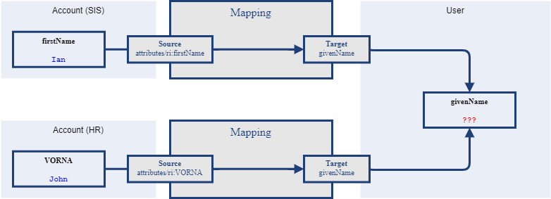
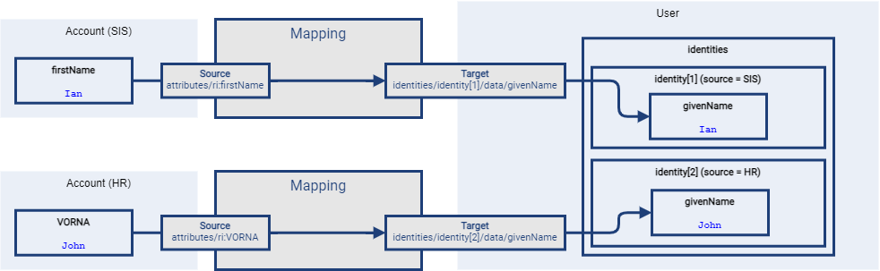

= Multiple Identity Data Sources
:page-experimental: true
:page-toc: top
:page-since: "4.6"

The advanced correlation needs often go hand in hand with the situations when there are multiple sources of the identity data.

== An Example

A university may have the following systems:

.Source systems in a sample university installation
[%header]
[%autowidth]
|===
| System | Description
| Student Information System (SIS)
| Provides data on students and faculty.
| Human Resources (HR)
| Keeps records of all staff - faculty and others.
| External persons (EXT)
| Maintains data about visitors and other persons related to the university in a way other than being a student or employee.
|===

While the data about a given person are usually consistent, there may be situations when they differ.
For example, the given name may be recorded differently in SIS and HR systems.
Or the title may be forgotten to be updated in HR.
An old record in the "external persons" system may be out-of-date altogether.

== Requirements

Potential data inconsistencies lead to two kinds of requirements:

. When processing data from these systems, midPoint has to somehow decide which ones are "authoritative", that is, which ones to propagate to the "official" user data stored in the repository and provisioned to target systems afterwards.
. When correlating, we may want to match data from all systems for the candidate owners.
(Not only the "official" user data.)

Starting with 4.6, midPoint supports both of them.

== Selecting the Authoritative Data

Before 4.6, the first requirement was resolvable only using a custom code.
A typical solution was that inbound mappings put the resource-specific values (like given name, family name, and so on) into temporary properties, present often in the user extension.
This was followed by an object template mapping that selected the right values and putting them into `givenName`, `familyName` and other properties of the user.

Actually, the current solution in 4.6 is an adaptation of this approach.
This time, however, it is implemented right inside midPoint.

=== Configuration

When selecting the most appropriate data, there is no magic available.
It is the engineer who must provide an algorithm for this.
MidPoint provides two levels at which this can be done:

. the whole object (e.g. user),
. an individual item (e.g. `givenName`).

Working at the level of the whole object is probably easier, and maybe sufficient for the majority of installations.

==== Declaring Multi-Source Data

Usually, not all object properties are to be handled in this "multi-source" style.
The selection of the ones that should be treated so is done in the object template.

An example:

.Listing 1. Setting up four multi-source properties
[source,xml]
----
<objectTemplate>
    ...
    <item>
        <ref>givenName</ref>
        <multiSource/>
    </item>
    <item>
        <ref>familyName</ref>
        <multiSource/>
    </item>
    <item>
        <ref>honorificPrefix</ref>
        <multiSource/>
    </item>
    <item>
        <ref>honorificSuffix</ref>
        <multiSource/>
    </item>
    ...
</objectTemplate>
----

This declaration "redirects" inbound mappings for the properties mentioned.
It means that instead of the traditional flow of data show in figure 1, they will flow like indicated in figure 2.

.Traditional inbound mappings

.Redirected inbound mappings for multi-source items

And here comes the question:
_How should the data (and which ones) flow from the `identities` container to their destination places?_

Although we said it is often easier to decide this question at once for the whole object, let us explain that the way around:
from individual items up.

==== Selecting Authoritative Values for an Individual Item

It is no surprise that midPoint selects the authoritative data for the individual item (like `givenName`) using ordinary object template mapping.
Although the mapping could be written just like any other, there is a nicer, shortened form available.

An example:

.Listing 2. Selecting authoritative value for the given name
[source,xml]
----
<objectTemplate>
    ...
    <item>
        <ref>givenName</ref>
        <multiSource>
            <selection>
                <expression>
                    
                </expression>
            </selection>
        </multiSource>
    </item>
    ...
</objectTemplate>
----

The content of the `selection` element is a mapping.

It has two default sources, and other ones can be added by the engineer.

.Default sources for the item-selection mapping
[%header]
[%autowidth]
|===
| Source | Type | Description
| `identity`
| a collection of `FocusIdentityType`
| The content of `identities/identity` multivalued container.
It contains all "incoming" identity data from the inbound mappings.
It is the primary source of information from which we have to select the one we need.

| `defaultAuthoritativeSource`
| `FocusIdentitySourceType`
| The source for identity data that was determined to be the default one for the user.
(See the next section.)
|===

The mapping is executed just like any other object template mapping.
The value(s) it produces are put right into the target property - in this case it is `givenName`.

In our example above we used `midpoint.selectIdentityItemValues` method.
It is a utility method to aid in selecting values from the multiple sources.
It has three parameters:

.Parameters of `midpoint.selectIdentityItemValues` method
[%header]
[%autowidth]
|===
| Parameter | Type | Description
| `identity`
| `Collection<FocusIdentityType>`
| A collection of identities where we search for the data.
In particular, we look for the values with sub-path of `itemPath` (see the third parameter) in the `identity[x]/data` container.

| `source`
| `FocusIdentitySourceType`
| Specification of the source we are looking for.
The source is currently matched using resource OID, kind, intent, and tag.
The `null` value of `source` means "take values from all sources".

| `itemPath`
| `ItemPath`
| Item that should be provided.
|===

If no item selection mapping is provided (which is the usual case), the following one is used automatically by midPoint.
This is why we do not need to specify these mappings explicitly.

.Listing 3. Automatically-applied item selection mapping
[source,xml]
----
<objectTemplate>
    ...
    <item>
        <ref>(somePath)</ref>
        ...
        <multiSource>
            <selection>
                <expression>
                    
                </expression>
            </selection>
        </multiSource>
    </item>
    ...
</objectTemplate>
----

This leads us to the question of how the `defaultAuthoritativeSource` value is computed.

==== Selecting Authoritative Values for the Whole Object

As probably expected, there is again a template mapping for this.
In a way similar to the previous mappings, it could be specified as a regular mapping, but it is better to use the special configuration option for it.

An example:

.Listing 4. Selecting the default authoritative data source
[source,xml]
----
<objectTemplate>
    ...
    <multiSource>
        <defaultAuthoritativeSource>
            <expression>
                
            </expression>
        </defaultAuthoritativeSource>
    </multiSource>
</objectTemplate>
----

Here we have three source resources, SIS, HR, and EXT.
We would like to implement a rule of "data from SIS are more authoritative than data from HR, and these are more authoritative than data from EXT".
(In the real world the rules may be more complex.)

Although we could use `FocusIdentitySourceTypeUtil.defaultAccount` and `resourceObject` methods to construct the sources explicitly, it is also possible to re-use source values already present in the `identity` collection.
That's exactly what is done in the example above.

The mapping has only single default source:

.Default source for the source-selection mapping
[%header]
[%autowidth]
|===
| Source | Type | Description
| `identity`
| a collection of `FocusIdentityType`
| The content of `identities/identity` multivalued container.
It contains all "incoming" identity data from the inbound mappings.
|===

It returns the `FocusIdentitySourceType` object that may be used for selecting the values of individual items, as we have seen in the previous section.

If such a mapping does not exist or if it returns no value, the default behavior is to select all values from all sources (for a given item); as we have seen as well.
footnote:[Note that this is also the behavior of regular inbound mappings.
There is a small difference, though.
In regular mappings, we do not always take inbounds from all projections - only from currently loaded ones plus the ones that are loaded on demand.
In these value-selection mappings, we always consider all projections that had their inbounds evaluated: now or in the past.
Outputs of inbound mappings for those projections that are currently not loaded are stored in the `identities/identity` containers.]

== Limitations

. This feature is supported only for standard focus properties present at the root level (like `givenName`, `familyName`) and all extension properties at root level only. (I.e., not in containers in the extension).
. It must be used along with archetypes, i.e., the object template must be declared in an archetype.
. When an account is deleted, or unlinked from the user, the inbound mappings are *not executed*.
(An exception is an explicit and direct deletion of an account requested by the user.)
This means that the values provided by the mapping previously are not removed when the account is gone.
This is going to be resolved in the future.
+
As an workaround, one could create a script that would go through all users, check their identity data (beware that they must be retrieved using `include` option, as they are not fetched by default), and compare them with the actual accounts the user has.

== Future Work

This mechanism is intentionally consistent with the work that was done during the xref:/midpoint/projects/midprivacy/phases/01-data-provenance-prototype/[Phase 1 of the midPrivacy project: Data provenance prototype].
The implementation is different, because the value metadata implementation is not in production state yet.
But we eventually may unify the two.
