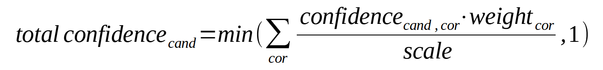
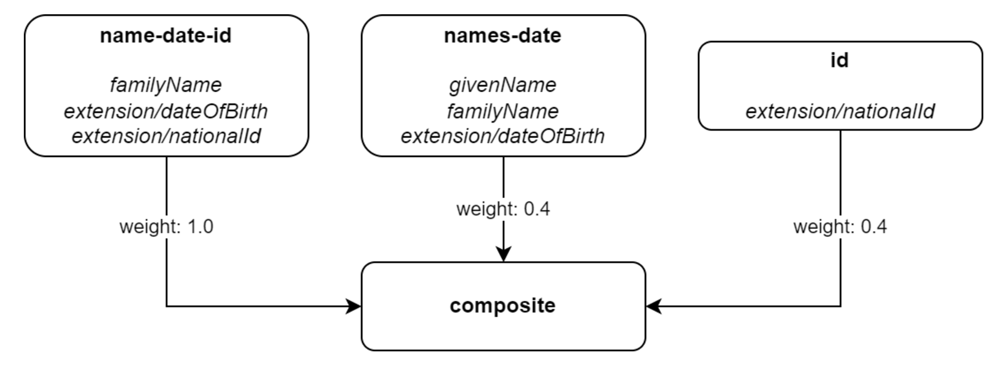
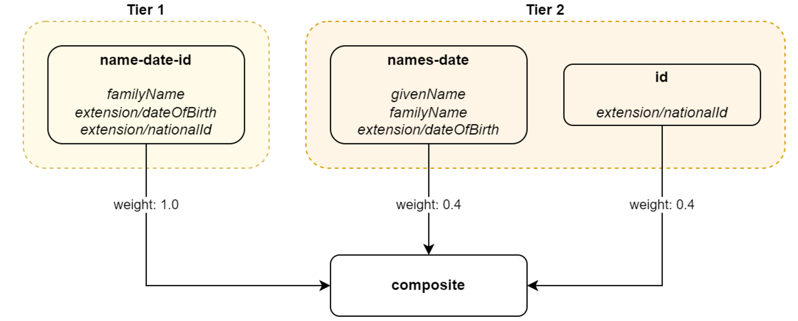

= Rule Composition
:page-toc: top
:page-since: "4.6"

== Correlators (Correlation Rules)

The basic element of the correlation configuration is the definition of _correlation rules_ (or _correlators_).

NOTE: The _correlation rule_ is more user-oriented term, while _correlator_ is more implementation-oriented one.
See also the xref:/midpoint/reference/correlation/[overview document].
Risking a bit of confusion, let us use the term _correlator_ in this document.

Correlators are hierarchical, with a specified default algorithm for combining their results.

In midPoint 4.6 we support only the flat hierarchy: a composite correlator defined on top, with component correlators right beneath it.
Please see <<Limitations>> section at the end of this document.

== Composition Algorithm Outline

Individual correlators are evaluated in a defined order (see <<Tiers and Rule Ordering>>).

Each correlator produces a set of _candidates_ having zero, one, or more objects.
Each candidate has a (local) _confidence_ value from the interval of (0, 1].
Each correlator has its own _weight_ that is used as a multiplication factor for the local confidence values produced by the correlator.
(For convenience, a global _scale_ can be defined. It can be used to re-scale the confidence values to the interval of (0, 1].)

After the evaluation, a union of all candidate sets is created, and the overall confidence for each candidate is computed:

Where

- _total confidence~cand~_ is the total confidence for candidate _cand_ (being computed),
- _confidence~cand,cor~_ is the confidence of candidate _cand_ provided by child correlator _cor_,
- _weight~cor~_ is the weight of child correlator _cor_ in the composition (a parameter of the composition; default is 1),
- _scale_ is the scale of the given composite correlator (a parameter of the composition; default is 1).

== A Naive Example

=== Rules

Let us have rules like these:

.Sample set of correlation rules
[%header]
[%autowidth]
|===
| Rule name | Rule content | Weight
| name-date-id
| Family name, date of birth, and national ID exactly match.
| 1.0
| names-date
| Given name, family name, and date of birth exactly match.
| 0.4
| id
| The national ID exactly matches.
| 0.4
|===

.Graphic representation of the sample set of correlation rules

=== Configuration

.Listing 1. Configuration defining the sample set of correlation rules
[source,xml]
----
<correlators>
    <items>
        <name>name-date-id</name>
        <item>
            <ref>familyName</ref>
        </item>
        <item>
            <ref>extension/dateOfBirth</ref>
        </item>
        <item>
            <ref>extension/nationalId</ref>
        </item>
        <!-- Weight of 1.0 is the default -->
    </items>
    <items>
        <name>names-date</name>
        <item>
            <ref>givenName</ref>
        </item>
        <item>
            <ref>familyName</ref>
        </item>
        <item>
            <ref>extension/dateOfBirth</ref>
        </item>
        <composition>
            <weight>0.4</weight>
        </composition>
    </items>
    <items>
        <name>id</name>
        <item>
            <ref>extension/nationalId</ref>
        </item>
        <composition>
            <weight>0.4</weight>
        </composition>
    </items>
</correlators>
----

=== Example Computation

// Looks like the colors don't work in our generated HTML (yet)

Let us assume we are correlating [blue]`Ian Smith, 2004-02-06, 040206/1328` and the candidate is [blue]`John Smith, 2004-02-06, 040206/1328`.

- The `name-date-id` correlator matches with a local confidence of [blue]*1.0*. Having weight of [red]*1.0*, the overall confidence increment is [purple]*1.0*.
- The `names-date` correlator does not match. Therefore, there is no confidence increment from it.
- The `id` correlator matches with a local confidence of [blue]*1.0*. Having weight of [red]*0.4*, the overall confidence increment is [purple]*0.4*.

The total confidence is [purple]*1.4*, cropped down to [purple]*1.0*.

.Computation in a tabular form
[%header]
[%autowidth]
|===
| Rule | Matching | Local confidence | Weight | Confidence increment | Total so far
| `name-date-id` | `Smith`, `2004-02-06`, `040206/1328` | 1.0 | 1.0 | 1.0 | 1.0
| `names-date` | - | - | 0.4 | - | 1.0
| `id` | `040206/1328` | 1.0 | 0.4 | 0.4 | 1.4 -> 1.0
|===

== "Ignore if Matched by" Flag

We see that the match of the rule `name-date-id` implies the match of the rule `id`.
Hence, each candidate matching `name-date-id` gets a confidence increment *1.4*.
This is, most probably, not the behavior that we expect.
(While not necessarily incorrect, it is quite counter-intuitive.)

Therefore, we have introduced a mechanism to mark rule `id` as being ignored for those candidates that are matched by rule `name-date-id` before.

=== Configuration

It is done by setting `ignoreIfMatchedBy` like this:

.Listing 2. Ignoring `id` rule for candidates matching `name-date-id`
[source,xml]
----
<correlators>
    ...
    <items>
        <name>id</name>
        <item>
            <ref>extension/nationalId</ref>
        </item>
        <composition>
            <weight>0.4</weight>
            <ignoreIfMatchedBy>name-date-id</ignoreIfMatchedBy>
        </composition>
    </items>
</correlators>
----

=== Example Computation

Now, when correlating `Ian Smith, 2004-02-06, 040206/1328` with the candidate being `John Smith, 2004-02-06, 040206/1328`,

- The `name-date-id` correlator matches with a local confidence of *1.0*. Having weight of *1.0*, the overall confidence increment is *1.0*.
- The `names-date` correlator does not match.
- The `id` correlator matches with a local confidence of *1.0*. However, it is ignored, because of the match of `name-date-id`.

The total confidence is thus `1.0`.

.Computation in a tabular form
[%header]
[%autowidth]
|===
| Rule | Matching | Local confidence | Weight | Confidence increment | Total so far
| `name-date-id` | `Smith`, `2004-02-06`, `040206/1328` | 1.0 | 1.0 | 1.0 | 1.0
| `names-date` | - | - | 0.4 | - | 1.0
| `id` | `040206/1328` | 1.0 | 0.4 | (ignored) | 1.0
|===

== Tiers and Rule Ordering

Looking at our previous example, we feel that after rule `name-date-id` is evaluated and finds exactly one candidate (`John Smith`) with the confidence of *1.0* (certain match), we can stop right there. We don't need to evaluate any other rules.
For such situations, rules can be grouped into _tiers_ and even _ordered_ within them.

In our particular example, we will put the first rule into a separate tier with the number of *1*.
The other rules will be put into tier *2*.

The overall algorithm is the following:

. Tiers are processing sequentially, from the lower numbers to the higher ones. The unnumbered tier - if present - is evaluated last.
. All correlators in a given tier are processed.
Their order can be specified using explicit `order` property (usually need not be used).
Unspecified order means "last".
Correlators with the same order are sorted according to their dependencies given by `ignoreIfMatchedBy` information.
. After each tier is processed, we look if we have exactly one certain candidate. (See <<Using the Resulting Confidence Values>>.)
If we do, we finish the computation.
If there is no certain candidate, we continue.
We continue also in case there are multiple certain candidates, although this situation indicates there is something wrong with the correlation rules.

=== Example Computation

Now, when correlating `Ian Smith, 2004-02-06, 040206/1328` with the candidate being `John Smith, 2004-02-06, 040206/1328`,

- The `name-date-id` correlator matches with a local confidence of *1.0*. Having weight of *1.0*, the overall confidence increment is *1.0*.
- As this concludes the first tier, and a certain match was found, the processing stops here.

.Computation in a tabular form
[%header]
[%autowidth]
|===
| Rule | Matching | Local confidence | Weight | Confidence increment | Total so far
| `name-date-id` | `Smith`, `2004-02-06`, `040206/1328` | 1.0 | 1.0 | 1.0 | 1.0
6+| Evaluation of other rules is skipped
|===

== Using the Resulting Confidence Values

In midPoint 4.6, the resulting aggregated confidence values for individual candidates are compared with two _threshold values_:

.Threshold values
[%header]
[%autowidth]
|===
| Value | Description
| _Definite match threshold_ (`DM`)
| If a confidence value is equal or greater than this one, the candidate is considered to definitely match the identity data.
(If, for some reason, multiple candidates do this, then human decision is requested.)
| _Candidate match threshold_ (`CM`)
| If a confidence value is below this one, the candidate is not considered to be matching at all - not even for human decision.
|===

Said in other words:

. If there is a single candidate with confidence value &ge; `DM` then it is automatically matched.
. Otherwise, all candidates with confidence value &ge; `CM` are taken for human resolution.
. If there are none, "no match" situation is assumed.

=== Default values

.Default values for the threshold
[%header]
[%autowidth]
|===
| Threshold | Default value
| Definite match (`DM`) | 1.0
| Candidate match (`CM`) | 0.0
|===

=== Configuration

.Listing 3. Setting the thresholds
[source,xml]
----
<correlation>
    <correlators>
        ...
    </correlators>
    <thresholds>
        <definite>0.75</definite>
        <candidate>0.25</candidate>
    </thresholds>
</correlation>
----

== Limitations

Although it is possible to configure arbitrary combination of the correlators, and such a combination will most probably work, for practical reasons there are the following limitations of what is "officially" supported. Everything beyond this is considered to be xref:/midpoint/versioning/experimental/[experimental] functionality:

. ID Match correlator cannot be combined with other correlators.
. Filter-based correlators cannot be combined with the other ones.
. Expression-based correlators are experimental altogether.
. Composite correlator can be provided at the top level only.

Said in other words, only the `items` correlators can be combined.
The use of other ones in the composition is considered experimental.
