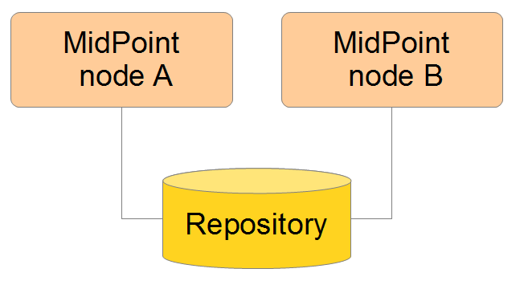

= Achieve High Availability with Clustering
:page-nav-title: High Availability with Clustering
:page-wiki-name: Clustering / high availability setup
:page-wiki-id: 11075783
:page-wiki-metadata-create-user: mederly
:page-wiki-metadata-create-date: 2013-06-28T10:24:03.273+02:00
:page-wiki-metadata-modify-user: mederly
:page-wiki-metadata-modify-date: 2020-09-23T16:15:32.817+02:00
:page-upkeep-status: yellow
:page-toc: top

== Introduction

You can achieve xref:/midpoint/reference/tasks/task-manager/[high availability] by setting up cluster of several midPoint nodes working with a common midPoint repository.

In order to do this, it is necessary to set a couple of parameters in midPoint configuration.

When using the default PostgreSQL database:

[source,xml]
----
<repository>
  <repositoryServiceFactoryClass>com.evolveum.midpoint.repo.sql.SqlRepositoryFactory</repositoryServiceFactoryClass>
  <database>postgresql</database>
  <jdbcUsername>midpoint</jdbcUsername>
  <jdbcPassword>.....</jdbcPassword>
  <jdbcUrl>jdbc:postgresql://..../midpoint</jdbcUrl>
  <hibernateHbm2ddl>none</hibernateHbm2ddl>
  <missingSchemaAction>create</missingSchemaAction>
</repository>
<taskManager> <1>
  <clustered>true</clustered>
</taskManager>
----
<1> Typically, you set only the `<clustered>` parameter to signify the installation uses clustered (failover) mode.
Default is `false`.
If you need clustering for failover, set this to `true` as shown in this example.

.Clustering needs to be enabled on all nodes
[WARNING]
====
If you have more nodes sharing a repository, all of them must have the parameter `clustered` set to `true`.
Otherwise, tasks will not be scheduled and distributed correctly.
MidPoint disables scheduling tasks on non-conformant nodes, i.e., on non-clustered nodes that are parts of such a system.
The best way how to avoid configuration discrepancy like this is to have common configuration file.
If that is not possible or practical, make sure that all nodes have the same settings.
====

In some circumstances, the Quartz component in task manager needs to use a separate database.
If that's the case, proper configuration is needed.

In either case, when deploying clustered nodes, ensure your *system time is synchronized* across all node members (using NTP or similar service).
Otherwise, unexpected behaviour may occur such as tasks restarting on different nodes.

== Other Cluster Configuration Items

You can either use the `config.xml` file to hold your configuration (see the Configuration parameter table column below).
In this case, place the configuration keys directly under the `<midpoint>` element.

Alternatively, you can specify the configuration via link:https://en.wikipedia.org/wiki/Command-line_interface[CLI] parameters in the form of `-Dkey=value`. See the Command-line parameter table column below.
Refer to xref:/midpoint/reference/deployment/midpoint-home-directory/overriding-config-xml-parameters/[] for details.

Configuration items are:

[%autowidth]
|===
| Command-line parameter | Configuration parameter | Description

| `-Dmidpoint.nodeId`
| `nodeId`
| The node identifier.
The default is `DefaultNode` for non-clustered deployments.
For clustered ones, either `nodeId` or `nodeIdSource` must be used.

| `-Dmidpoint.nodeIdSource`
| `nodeIdSource`
| Source of the node identifier.
It is applied if explicit node ID is not defined.
The source can be either `hostname`, meaning that the host name is used as the node identifier, or `random`, meaning that the random value for node ID is generated when the node is started.

| `-Dmidpoint.hostName`
| `hostName`
| Overrides the local host name information.
If not specified, the operating system is used to determine the host name.

Normally, you do not need to specify this information.

| `-Dmidpoint.httpPort`
| `httpPort`
| Overrides the local HTTP port information.
If not specified, Tomcat/Catalina is queried to determine the HTTP port information.
This information is used only to construct URL address used for intra-cluster communication (see below).

If you run a node behind a reverse proxy or link:https://en.wikipedia.org/wiki/Network_address_translation[NAT], for instance, you need to specify the port to the node based on the network configuration.
That means you always need to specify the port number under which other nodes can see the particular node from their point of view.
Normally, you do not need to specify this information.

If you want to run midPoint under a custom port, use `-Dserver.port=xxx` instead.

| `-Dmidpoint.url`
| `url`
| Overrides the intra-cluster URL information (see below).
, you do not need to specify this information.

|===

[NOTE]
====
Since midPoint 4.0, nodes communicate over HTTP instead of JMX among themselves.
====

=== How Intra-Cluster URLs Are Determined

In order to minimize the configuration work needed while keeping the maximum level of flexibility, the node URLs used for intra-cluster communication (e.g., `https://node1.acme.org:8080/midpoint`) are derived from the following items in the order listed here:

. `*<urlOverride>*` property in the node object in the repository.
. `*-Dmidpoint.url*` / `*<url>*` information (CLI parameter or `config.xml` file).
. Computed based on the information in the `*infrastructure/intraClusterHttpUrlPattern*` property, if defined. +
    This property can use the following macros:
    ** `*$host*` for host name: obtained dynamically from the OS or overridden by the `-Dmidpoint.hostname` or `<hostname>` config properties.
    ** `*$port*` for HTTP port: obtained dynamically from Tomcat objects or overridden by `-Dmidpoint.httpPort` or `<httpPort>` config properties.
    ** `*$path*` for midPoint URL path: obtained dynamically from the servlet container.
. Computed based on the protocol scheme obtained dynamically from the Tomcat objects, host name, port, and servlet path as `scheme://host:port/path`.

When troubleshooting these mechanisms, you can set logging to `DEBUG` for `com.evolveum.midpoint.task.quartzimpl.cluster.NodeRegistrar` (or the whole task manager module).

== Test Cluster Configuration on a Single Host

To test a cluster configuration on a single host (with nodes running on different ports),
use the configuration below.
This configuration allows more nodes to use a single IP address,
so that cluster containing nodes on a single host can be formed.
This feature is experimental.

[source,xml]
----
<taskManager>
  <localNodeClusteringEnabled>true</localNodeClusteringEnabled>
</taskManager>
----

In CLI, use `-Dmidpoint.taskManager.localNodeClusteringEnabled=true`.

== Communication Among Nodes

Midpoint needs to have an intra-cluster HTTP URL pattern specified.
This should be the HTTP pattern which is used by midPoint nodes to communicate among themselves.
The pattern is a URL prefix pointing to the root URL of the application.
The pattern is specified in the system configuration object as present in the example below.
// NOTE: I'm intentionally using HTTP instead of HTTPS because the protocol is, per se, HTTP.
//      Regardless of whether or not it is secured by a TLS or SSL, those being different technologies. @dakle 2025-07-09

[source,xml]
----
<systemConfiguration>
  ...
  <infrastructure>
    <intraClusterHttpUrlPattern>https://$host/midpoint</intraClusterHttpUrlPattern>
  </infrastructure>
  ...
</systemConfiguration>
----

Cluster nodes primarily communicate with the central Quartz component.
This component is responsible for creating worker tasks, which are then picked up by the nodes.
The data on which nodes operate are stored in the central database.
However, there are occasions when the nodes need to communicate with each other directly.

One such occasion is *cache invalidation*.
When a node changes data in the midPoint database, the node informs other nodes about the need to invalidate their cache.

.Technical insight into cache
[NOTE]
====
MidPoint uses two levels of cache: global and local.

The local cache is per task thread.
It holds query objects with results, all touched objects, and version cache, which consists of all versions of modified objects.
(Every time an object is modified, a new version of it is created.)

The global cache is per node and holds objects that don't change often but are accessed very often.
These are, for example, system configuration, archetypes, object templates.
These objects are cheap to keep because they don't change often, but saving them in cache saves a lot of resources.
It doesn't save user objects because they change often, but are rarely needed.
====

Another case when nodes communicate directly is handling user sessions.
For example, when a node changes roles for a user, it informs the other nodes about the new permission scope of the user.

On the other hand, if a node runs a task to creates a report, for example, the resulting report file is saved on the local file system of the node.
If user sitting on a different node requests the report for download, the node the user is on asks the central DB where the report is and then redirects the user to the node which generated the report.
Hence, no inter-node communication occurs in such a case.

== Common Issues and Fixes

These are critical critera your configuration must meet:

* Use a shared repository, i.e., all nodes must connect to the same repository.
* Define node URLs like `<midpoint><url>...</midpoint>` or `intraClusterHttpUrlPattern` in the system configuration to ensure nodes can discover each other.
* Clustering in production requires an link:https://evolveum.com/services/support-subscriptions/[active subscription] (log error: _Clustering is not supported in production mode without a subscription_).

Here are a few common issues, their possible causes, and tips on how to resolve them:

. *Unauthorized errors (401)*
    ** Cause: Missing or invalid subscription ID or misconfigured REST authentication.
    ** Fix: Set a valid subscription ID in System > System Configuration > Deployment Information. Ensure nodes can authenticate via REST (e.g., shared secrets or OAuth2 if configured). 
. *Node discovery failures*
    ** Cause: Incorrect `intraClusterHttpUrlPattern` setting or firewall rules blocking HTTP(S) traffic.
    ** Fix: Check your deployment configuration and all possibly related network settings. Test connectivity between nodes using `curl` or a similar tool. 
. *Sticky sessions*
    ** Cause: Load balancer is not using sticky sessions (e.g., `ip_hash` in NGINX).
    ** Fix: Configure the load balancer to maintain session affinity (e.g., by using sticky cookie or source IP). 
. *Database locks or task scheduling issues*
    ** Cause: Inconsistent `clustered=true` settings across nodes.
    ** Fix: Ensure all nodes have the consistent `clustered=true`. 

== Limitations

Clustering functionality assumes *homogeneous* cluster environment.
That means each cluster node must have the same environment, configuration, connectivity (e.g., to load balancers), connectors and so on.
Clustering implementation assumes that a task can be executed on any cluster node, giving the same result regardless.
Any configuration differences between cluster nodes are likely to cause operational issues.
Following aspects must be the same on all cluster nodes:

* The same version of the following on all nodes:
    ** MidPoint
    ** Connectors
    ** Schema extension
    ** Keystore
* Network access to all configured resources
* Access to filesystems, including network filesystems (e.g. for CSV resoruces)
* Network configuration, including routing and DNS configuration
