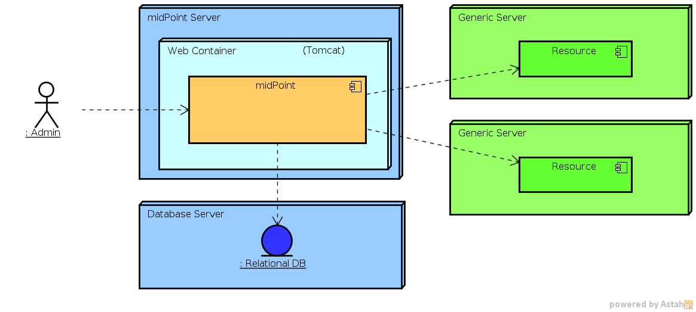
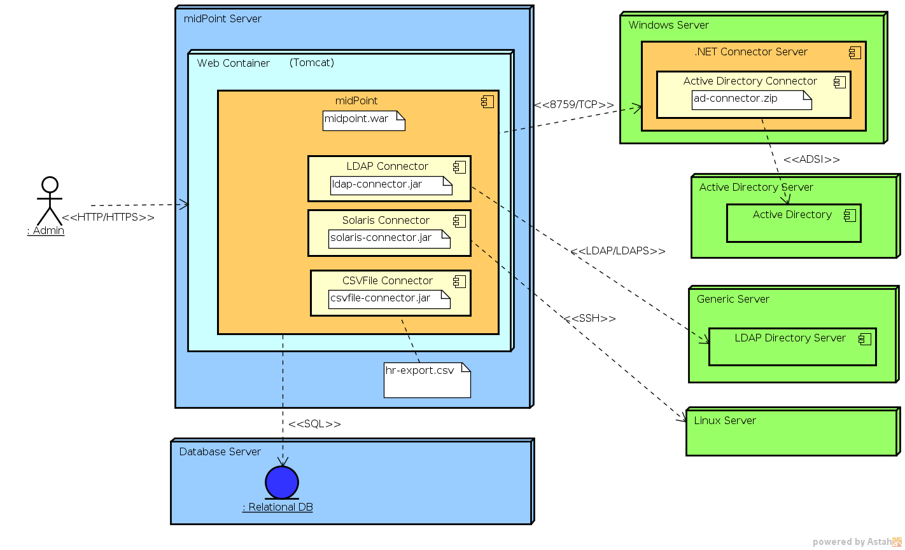
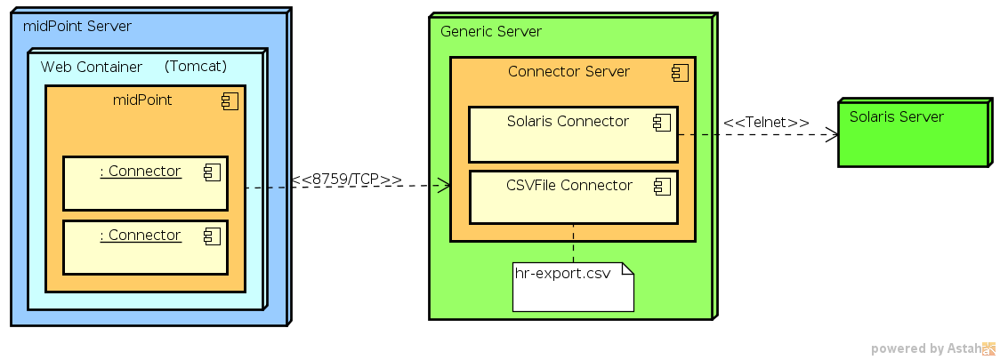

= Deployment Concepts
:page-wiki-name: Deployment Concepts
:page-wiki-id: 7667781
:page-wiki-metadata-create-user: semancik
:page-wiki-metadata-create-date: 2013-02-28T13:24:40.085+01:00
:page-wiki-metadata-modify-user: semancik
:page-wiki-metadata-modify-date: 2019-01-31T11:05:34.367+01:00
:page-upkeep-status: red
:page-toc: top

== Introduction

Simply speaking midPoint is a Java web application.
It is delivered in a single WAR archive and all that is needed for running it is to use appropriate tool to deploy it to the web container.
An external database is usually needed so it also needs to be configured.
But that's basically all what you need.
This minimal deployment is illustrated in the following diagram.

The diagram illustrates the following scenario: MidPoint is a web application that is deployed in a web container.
The web container is Apache Tomcat in this case and it runs on a dedicated server.
MidPoint is configured to use external relational database that runs on a separate server.
MidPoint is configured to connect to two resources.
MidPoint administrators are accessing the web-based administration console directly on the midPoint instance.

[TIP]
.Color Code
====
All the diagrams use similar color code.
The shades of yellow, orange and brown are used for parts of the code midPoint installation.
Blue colors are used for standard infrastructure components, standard protocol and interfaces and so on.
Green is used to denote the integrated systems (resources), custom component, etc.
====

But the devil is in the detail and there are many alternative configurations that can be used for midPoint deployment.
Following sections will provide detailed information about deployment alternatives.

== Repository

MidPoint needs a database to store its own data.
This includes data about users, accounts and links, policies and also a configuration such as resource definitions.
Although midPoint comes with an embedded database engine this is not supposed to be used for a production environment.
Therefore an external SQL database is usually needed for most midPoint deployments.

Most of midPoint configuration is stored in the database.
However for obvious reasons the database configuration needs to be outside the database.
It is stored in the `config.xml` file in xref:/midpoint/reference/deployment/midpoint-home-directory/[midPoint home directory].
The xref:/midpoint/reference/repository/configuration/[Repository Configuration] page describes the configuration of database access.

== Connectors

Connectors are midPoint workhorses.
They provide connectivity to target and source systems that are called _resources_ in midPoint terminology.
Connectors are usually quite short and simple pieces of code that needs to be "deployed" to midPoint.
The deployment is usually just copy of the connector package to the appropriate directory and restarting midPoint.

Connectors are usually written in Java and are distributed as a JAR files.
Such connectors may be used inside midPoint by deploying them directly to midPoint instance.
This is the usual case.
Some of the frequently-used connectors are also bundled directly with midPoint to ease the deployment process.
MidPoint has the ability to use several versions of the same connector at once which is useful for slowly testing and rolling out new connector versions.
See xref:/midpoint/reference/upgrade/connectors/[Connector Upgrade] page for more details.

=== Remote Connector Server

Connectors sometimes need to be placed on different servers than that the midPoint is using.
One of the reasons may be that the connector needs platform and/or libraries that are not available from midPoint, e.g. Microsoft proprietary libraries.
Other reason might be that the connector needs local access to resources that reside on other servers, e.g. access to local files.
Whatever the reason might be there is an option to run connectors over the network.
The component that allows that is _Remote Connector Server_. There are two implementations of Remote Connector Server.
One is using Java platform, the second uses .NET Framework.

See xref:/connectors/connid/1.x/connector-server/[Connector Server] page for more details.

==== Java Remote Connector Server

Java Remote Connector Server is using the same kind of connectors as midPoint is using itself.
The Java Remote Connector Server is used in situations where a connector needs local access to some resource.
Otherwise is not able to work with it.
It is usually used for connectors that require local access to files such as xref:/connectors/connectors/com.evolveum.polygon.connector.csv.CsvConnector/[CSV Connector].
This approach avoids the need to copy the file using FTP or a similar mechanism which is difficult to do in a proper way and it is quite error-prone, e.g. problems with partially downloaded files, error handling, atomicity, etc.
Java Remote Connector Server is also used in situations that require firewall traversal or securing insecure communication protocol.

See xref:/connectors/connid/1.x/connector-server/java/[Java Connector Server] page for more details and for installation instructions.

==== .NET Remote Connector Server

.NET Remote Connector Server is a xref:/connectors/connid/1.x/connector-server/[Connector Server] that runs on Windows machines using the .NET framework.
Perhaps the only practical purpose of this connector server is to provide environment for Windows-specific connectors.
Connectors such as xref:/connectors/connectors/Org.IdentityConnectors.ActiveDirectory.ActiveDirectoryConnector/[Legacy Active Directory Connector (.NET)] require proprietary libraries that are only available on Microsoft platforms (.NET) and cannot be used from Java.
Therefore midPoint cannot use such libraries in a local connector (or remote Java connector for that matter) and a .NET-based remote connector server is required.

image::Remote-Connector-Server-Deployment.png[]

See xref:/connectors/connid/1.x/connector-server/dotnet/[.NET Connector Server] page for more details and for installation instructions.

== Reverse Proxy

TODO

== High Availability

TODO

== Keystore

TODO

See also xref:/midpoint/reference/security/crypto/#keystore[here].

== Recommendations

TODO: use existing database +
TODO: do not deploy midPoint with other complex applications in the same container +
TODO: works well in virtual environment +
TODO: use Sun Java JDK/JRE +
TODO: Tomcat is a recommended container (lightweight, opensource, well tested).
Use apache as reverse proxy for flexibility.

== See Also

TODO