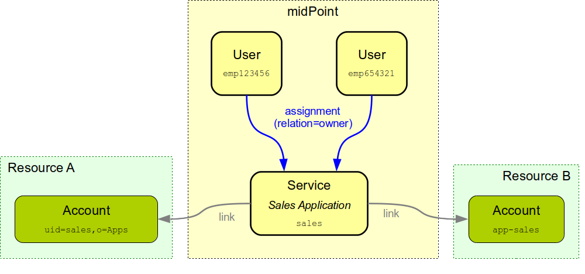

= Service Account Management
:page-wiki-name: Service Account Management
:page-wiki-id: 24676268
:page-wiki-metadata-create-user: semancik
:page-wiki-metadata-create-date: 2017-12-18T15:36:33.921+01:00
:page-wiki-metadata-modify-user: semancik
:page-wiki-metadata-modify-date: 2019-02-08T13:29:52.467+01:00
:page-upkeep-status: yellow

== Motivation

Vast majority of accounts in a typical information system are person accounts.
Those accounts belong to and represent physical users of the system.
And midPoint is the perfect tool to manage such accounts.

However, not all the accounts are people accounts.
There are accounts that represent hard-coded system administration accounts such as `root` or `administrator`. Such accounts are sensitive.
But usually, there is no big trouble with those accounts.
Organizations that follow security best practices are not using those accounts for day-to-day administration.
Those accounts are usually reserved for emergency situations.
Therefore there is not much need to manage those.
The only real concern is to prohibit changes to those accounts.
And midPoint has a xref:/midpoint/reference/resources/resource-configuration/protected-accounts/[protected accounts] mechanism to make sure those accounts are not changed.
That is usually good enough for majority of organizations.

But there is a third type of accounts: service accounts.
Those accounts are not used by people.
Service accounts are used by services: applications, scripts, integration tools and so on.
Those accounts often has elevated privileges.
And unlike the hard-coded administration accounts the service accounts are very dynamic.
Service accounts change quite often.
There may be a need for a new service account if a new application or tool is introduced.
Service account password may get exposed and there is a need to change that password.
There may be a change in service account privileges when a new version of the application is installed.
And finally, when the application lifecycle is over, the service account needs to be deprovisioned.
And even more importantly: there should be a process to check if the service account is still needed.

With hundreds or thousands of applications, tools, scripts, integration paths, data pumps, proxies and other elements in your information system it is very difficult to keep track of all the service accounts.
But keeping track of accounts is something that IDM systems were designed for.

== Service and Accounts

MidPoint implements a xref:/midpoint/reference/misc/services/[concept of services] for a several years already.
Services are special type of objects and it is possible for accounts to be linked to services in a similar way how accounts are linked to users.
Therefore midPoint can already keep track of service accounts.
MidPoint can also easily support several xref:/midpoint/reference/resources/shadow/kind-intent-objectclass/[account types] and therefore it can distinguish service accounts and behave accordingly.

The idea is that a xref:/midpoint/reference/misc/services/[service] object in midPoint represents applications, tools, scripts and other components that need service accounts.
Service accounts are linked to those xref:/midpoint/reference/misc/services/[service definitions] in midPoint.
Therefore it will be clear which account belongs to which service (even if the service needs accounts in many systems).
The xref:/midpoint/reference/misc/services/[service] in midPoint is a very flexible object.
It can do almost all of the tricks that user, org and role can.
Therefore it may have an owner, its lifecycle can be managed, it may be subject to xref:/midpoint/reference/roles-policies/policies/policy-rules/[policy rules] and so on.
This is a very natural, smooth and extremely powerful way to manage services and service accounts.

== Synchronization Sorter

Important part of service account management is an ability to reclassify accounts.
Service accounts are often indistinguishable from ordinary user accounts, therefore service accounts may be easily mis-classified as user acounts.
MidPoint 3.9 introduced xref:/midpoint/reference/synchronization/synchronization-sorter/[synchronization sorter] mechanism that allows automatic (algorithmic) reclassification of accounts.
Manual (GUI-based) reclassification is xref:/midpoint/features/planned/service-account-management/[planned to be implemented later].

== Limitations

However, there are still some limitations and missing pieces:

* There is a concept of service ownership.
This concept is using the same mechanism as role ownership.
However, the service-specific processes are not implemented.

* There is no mechanism to prevent accidental changes to service accounts.
Of course, service accounts may have different mappings than ordinary accounts.
However, as account type (_intent_) is determined very early in account processing there may be change that mappings from person accounts may be accidentally used on service accounts that are mis-detected.

* There is an issues with xref:/midpoint/reference/roles-policies/roles/assignment/assigning-vs-linking/[assigning vs linking]. Service accounts are often just linked to the services and not assigned.
The processes that handle those transitions for service accounts are missing.

* Service itself can be subject to xref:/midpoint/reference/roles-policies/policies/certification/[certification] processes.
But the process is not tailored specifically for service accounts and there may be missing pieces.

* Account reclassification is supported only in fully automated mode, without any GUI support.

All of this can be improved.
Management of service accounts is perfectly aligned with midPoint architecture and design.
Just some implementation pieces are missing.
And those gaps may be filled in if needed - assuming a funding for this work is provided.
MidPoint xref:/support/subscription-sponsoring/[subscription] is the method to provide the funding.

See xref:/midpoint/features/planned/service-account-management/[Service Account Management Improvements] for more details and plans.

== See Also

* xref:/midpoint/reference/misc/services/[Services]

* xref:/midpoint/features/planned/service-account-management/[Service Account Management Improvements]

* xref:/midpoint/reference/synchronization/generic-synchronization/[Generic Synchronization]

* xref:/midpoint/reference/resources/resource-configuration/protected-accounts/[Protected Accounts]

* xref:/midpoint/reference/synchronization/synchronization-sorter/[Synchronization Sorter]
