= Log Viewer
:page-wiki-name: Log Viewer
:page-wiki-id: 22282648
:page-wiki-metadata-create-user: mederly
:page-wiki-metadata-create-date: 2016-02-23T08:17:39.198+01:00
:page-wiki-metadata-modify-user: oskar.butovic@ami.cz
:page-wiki-metadata-modify-date: 2018-02-23T14:19:21.062+01:00
:page-experimental: true
:page-tag: guide
:page-toc: top
:page-upkeep-status: green

In order to facilitate viewing large log files we have created a tool called midPoint Log Viewer.
It is an Eclipse plugin that displays log files in a well-arranged way, mainly by utilizing Eclipse Outline and Problems views.

== Features

=== Showing log outline

Log Viewer can provide a tree view of a (large) log file, giving quick overview of its content and allowing to drill down to details we are interested in.
The viewer provides a default configuration showing some standard levels.
However, it also allows to change their arrangement, as well as to add new outlining rules based on substring and regular expressions matching.

Standard levels are:

[%autowidth]
|===
| Level | Content | Description

| 10
| System startup header
| Marks the "system startup" event, recognized by the header that is printed out on startup.

| 20
| Individual test method level
| Useful for viewing test logs.
Expects individual tests to be marked by "TestUtil): =====[ ..... ]=====" text.
For production logs, this outline level is simply not used.

| 25
| Test method parts
| Delineates When and Then parts of the test method execution.

| 30
| Execution summary
| Shows summaries of individual operations, marked by "###[ CLOCKWORK SUMMARY ]###" text.

| 40
| Model context dump
| Shows model context dumps provided as part of executing particular operations.
These are marked by texts such as "---[ PROJECTOR ... ]---" or "---[ CLOCKWORK ... ]---".

| 50
| Projection context dump
| Projection contexts that are part of the model context dumps.

| 50
| Delta execution
| Record of a delta execution, either in repository or on a resource.
Marked by "---[ Going to EXECUTE delta ... ]---" text.

| 50
| Mapping evaluation
| Summary of evaluation of a mapping, marked by "---[ MAPPING ... ]---" text.
Note this is on the same level as a projection context, just below model context dump.

| 70
| Expression evaluation
| Summary of evaluation of an expression (in the context of a mapping or standalone).
Marked by "---[ EXPRESSION ... ]---" text.

| 80
| Script execution
| Summary of execution of a script - usually in the context of expression evaluation.
Marked by "---[ SCRIPT ...]---" text.

|===

An example - showing the result of the workflow module tests:

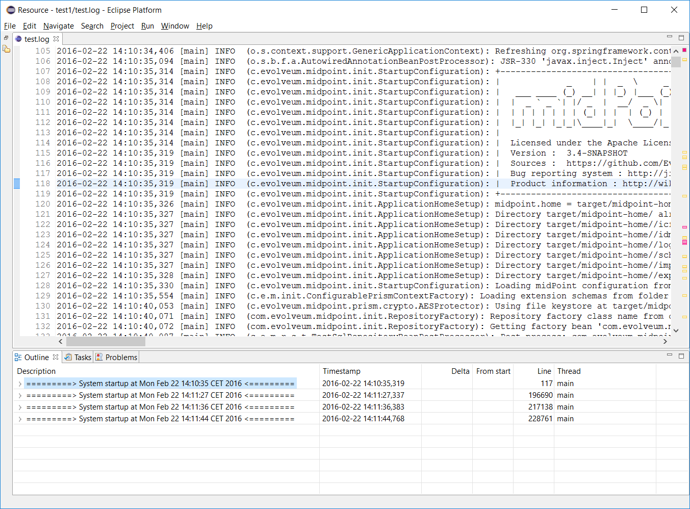

We can see there are four system runs.
For example, the first one starts at 14:10:35 and is covered by lines 117-196689.
After clicking on a line in the outline the cursor in main window jumps to appropriate log line.

Now we can explore the system run by expanding e.g. the first system startup node.
We see there is a couple of test methods executed.

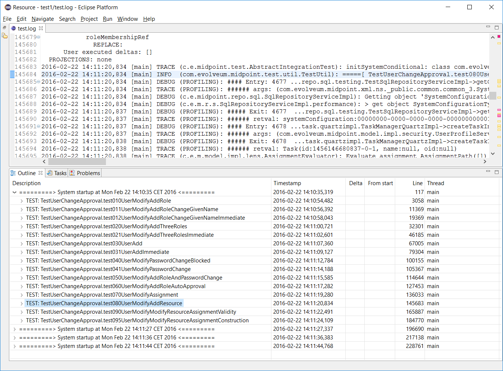

So we select e.g. the test080 and expand its node.
There is one operation execution; after expanding it we see the following:

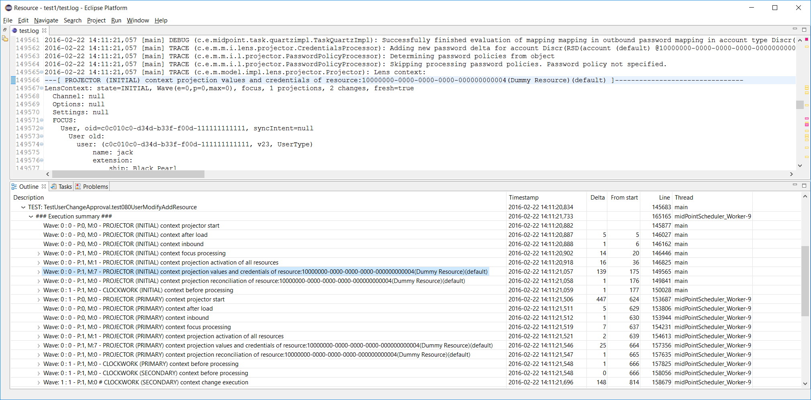

There is a lot of context dumps, as the operation traverses through specific execution stages.
Columns have the following means:

[%autowidth]
|===
| Column / field | Description

| Wave *m* : *n*
| Execution (m) and projection (n) wave number (0, 1, ...)

| P: *n*
| Number of projections in this context dump

| M: *n*
| Number of mappings evaluated since last context dump

| #
| Indicates there are some executions since last context dump

| Delta
| Time since last context dump - useful to diagnose performance problems

| From start
| Time since first context dump in this operation

| Thread
| Thread in context of which this log line was recorded.

|===

Threads can be especially problematic when analyzing log files.
The outline is currently not adapted to reasonably display output from more than one thread at once (i.e. the tree structure and related information will most probably look like nonsense).
That's why we show Thread column in the outline.
The user can then simply select which threads he wants to display in the outline by using %show-in-outline instruction (in the future, also GUI option will be provided).

In this particular case mixing threads is not a problem, because during workflow tests first part of processing (INITIAL stage) occurs in the context of calling thread, but other parts (starting with PRIMARY stage) occur in the background; the serialized nature of processing is preserved.

Other levels are similar to this:

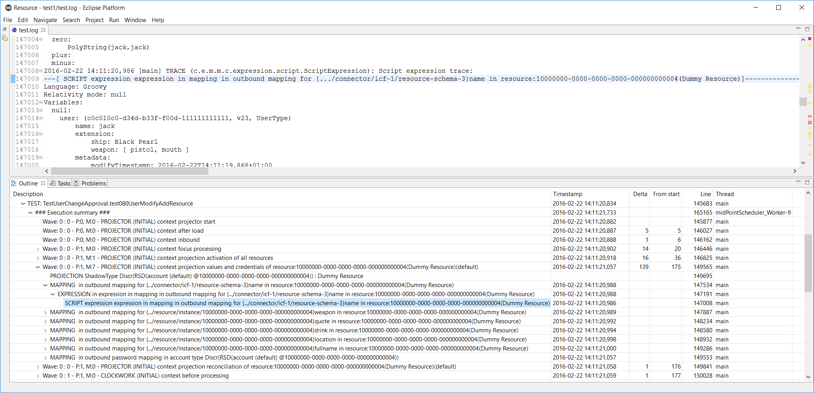

==== Configuring the outline

This is the standard configuration:

[source]
----
%outline startup 10
%outline test 20
%outline test-part 25
%outline operation-summary 30
%outline operation-context 40
%outline projection-context 50
%outline execution 50
%outline mapping 50
%outline expression 70
%outline script 80
----

You can remove some of these levels or reorganize them.
For example, if you prefer more flat structure, you could put some of the definitions to the same level.
E.g. startup and test.
Or operation-summary with operation-context.
Some combination do not make sense, and some could make sense but the viewer was not tested with them.
So it is not guaranteed that the output would be meaningful in all cases.

You can also add custom levels.
For example, the following are definitions equivalent to %outline startup and %outline test ones:

[source]
----
%outline custom containing 'Product information : https://docs.evolveum.com/midpoint/' 10 '=========> System startup at ${date} <========='
%outline custom matching '.*TestUtil\\): =====\\[ (\\w+\\.\\w+) \\]======================================.*' 20 'TEST: ${group:1}'
----

"Containing" is a keyword that selects a line containing a given text.
"Matching" does the same, but interprets the text as a regular expression.
10 and 20 are the levels.
Strings at line ends denote the labels that would be shown in the outline.
(${date} means date and time from the log line; ${group:1} means first group after successfully matching given regex.)

As said above, you can specify which lines to include into or exclude from the outline.
An example:

[source]
----
%show-in-outline header contains '[Thread-21]' on
%show-in-outline header contains '[Thread-22]' on
%show-in-outline off
----

This instructs viewer to make outline only from lines that have either "[Thread-21]" or "[Thread-22]" in their corresponding "log line header" (i.e. first line of the - potentially multiline - log entry).
All other items will not be shown in the outline, as prescribed in the third instruction.

[TIP]
.Syntax description
====
[source]
----
%outline <keyword> <level>
----

Cause lines of give <type> outlined at give <level>.
Type = (startup, test, test-part, operation-summary, operation-context, projection-context, execution-mapping, expression, script).
Note: recommended to use approximately in this order; projection-context, execution and mapping should be one level below operation-context.

[source]
----
%outline custom <condition> <level> <title>
----

Lines fulfilling condition are displayed in outline at given <level> with given <text> in outline.

[source]
----
%show-in-outline [<condition>] on/off
----

Lines fulfilling condition (or all lines if condition is not specified) are included in the outline, or excluded from it.

Condition can consist of a set of atomic condition clauses connected by "and":

[source]
----
<condition> = <atomic-condition-1> and <atomic-condition-2> and ... <atomic-condition-N>
<atomic-condition> = <item> <operator> <text>
<item> = line, entry, header (optional)
<operator> = containing, not-containing, matching, not-matching
<text> = text enclosed in apostrophes ('), quotes (") or square brackets ([])
----

Item specifies what is to be taken into account when evaluating the condition.
It is either current line, whole log entry, or header (first line) of the log entry.
If not specified, a reasonable default is used (most often "line", but e.g. in %kill-entry the whole entry is considered by default).

Text is either plain text (for containing/not-containing operator) or a regular expression (for matching/not-matching operator).
Do not forget to include `.*` at beginning and end if you want to match for something inside a line/entry.

====

=== Showing error, warning and information messages

Sometimes it is useful to see whether something went wrong during midPoint execution.
Traditionally we search through the logfile for strings like "ERROR", "Exception" etc., browsing through false alarms to find the cause of a problem we fight with.

Log viewer can display errors, and even warnings and selected information messages in Eclipse "Problems" view as errors, warnings and infos.
Like this:

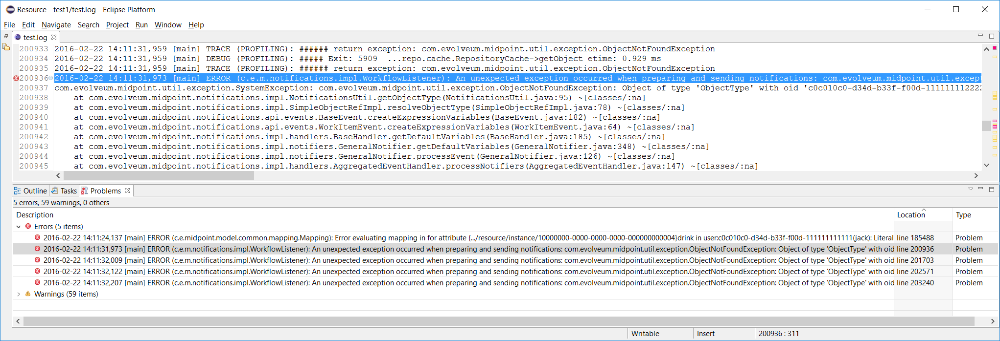

In order to eliminate false alarms, this feature is configurable, with the default of:

[source]
----
%mark-error containing 'ConnectorFactoryIcfImpl): Provided Icf connector path ' none
%mark-error containing 'No system configuration found, skipping application of initial system settings' none
%mark-error containing 'HHH000315: Exception executing batch [could not execute batch]' none
%mark-error error
----

Rules 1-3 inhibit often-occurring errors.
Rule 4 tells the viewer to display log errors as Eclipse errors.
Warnings and information messages are not shown by default.

Another example could be:

[source]
----
%mark-line containing 'ObjectNotFoundException' warn
%mark-line containing '22226666-2200-6666-6666-444400004444' and header not-containing '(PROFILING)' info
----

The result would be that all lines with the given exception are show as warnings.
Second rule states that lines with given OID which are *not* a part of profiling logging entries (those that have "PROFILING" in the first line of the log entry) are shown as infos.

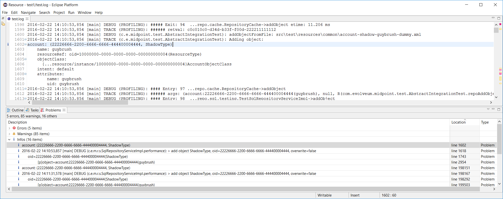

Another example: diagnosing failed TestSecurity.test204 test: wanting to quickly browse through security-related subtests.
So added this

[source]
----
%mark-line containing 'SSSSS=> Trying ' info
----

and got this:

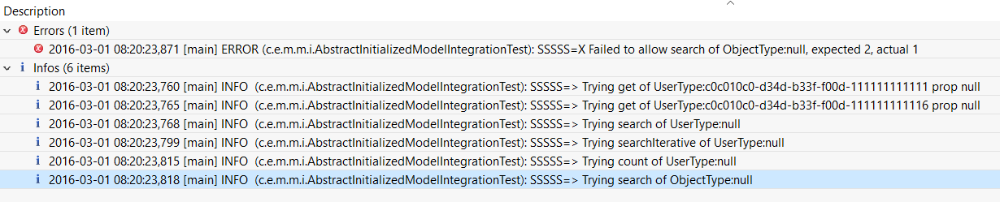

A special case is marking all lines that took longed than N milliseconds to appear either as errors, warnings or infos.
This is quite rudimentary way of diagnosing potential or real performance problems.

An example:

[source]
----
%mark-delay 1000 warn
----

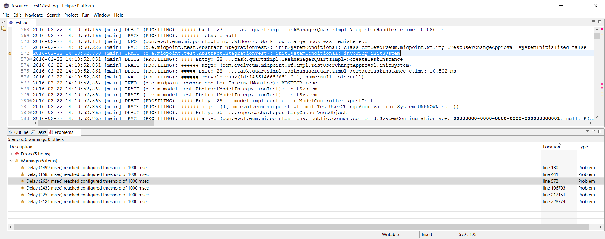

[TIP]
.Syntax description
====
[source]
----
%mark-delay <n> <severity>
----

If delay between successive log lines is at least <n> milliseconds, marks the line as <level> (error, warn, info).

[source]
----
%mark-error [<condition>] <severity>
%mark-warn [<condition>] <severity>
%mark-info [<condition>] <severity>
%mark-line <condition> <severity>
----

Marks ERROR/WARN/INFO lines (optionally fulfilling a condition) as <severity> (error, warn, info, none).

Marks arbitrary lines fulfilling a condition as <severity>.

====

=== Folding (collapse + expand)

Structures in log files - like context dumps - can be quite extensive and complex.
It is useful to be able to collapse and later expand back parts of these structures.

There are three kinds of folding available:

. Folding of multi-line log entries - available on log entry header lines.

. Folding of indented structures (like context dumps, operation result dumps etc) - available at each indentation level.

. Folding of profiling entry/exit pairs: Some operations (like getObject in provisioning) may take hundreds of log lines.
By clicking on 'collapse' button of particular "#### Entry" line everything gets collapsed up to corresponding "##### Exit" line.

An example of indented structure folding (hiding user old & current, keeping user new):

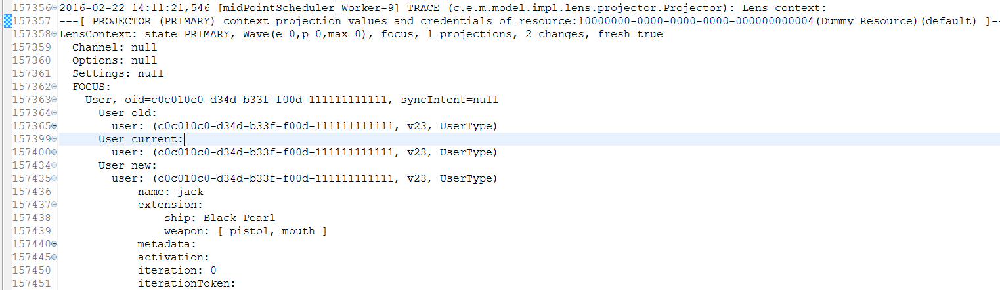

An example of collapsed entry-exit pair #74 (provisioning getObject call):

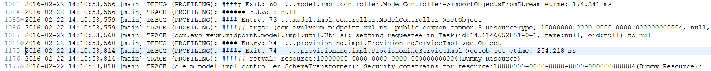

Folding can be also done declaratively.
E.g. we could tell Log Viewer to automatically collapse all log entries related to ResourceManager:

[source]
----
%collapse-entry header containing '(com.evolveum.midpoint.provisioning.impl.ResourceManager)'
----

Or collapse all profiling information related to calls Provisioning->getObject:

[source]
----
%collapse-line containing 'ProvisioningServiceImpl->getObject'
----

[TIP]
.Complete syntax
====
[source]
----
%collapse-line <condition>
%collapse-entry <condition>
%expand-line <condition>
%expand-entry <condition>
----

Collapses or expands given line or whole entry.
(Actually, collapse-entry can be written also as collapse-line, when the line in question is entry header one.
However, distinguishing between the two leads to easier understanding.)

====

=== Permanently removing unnecessary lines

Sometimes there are lines that clutter the log and we know we won't need them any more.
We can delete them using %kill instruction, like this:

[source]
----
%kill-line containing 'TRACE (c.e.m.model.impl.controller.SchemaTransformer): applySecurityConstraints'
%kill-entry containing 'Assignment evaluation finished:'
----

The algorithm to remove individual lines can be improved - in current state killing many lines in large files can take a quite long time (minutes).

[TIP]
.Complete syntax
====
[source]
----
%kill-line <condition>
%kill-entry <condition>
----

Kills given lines or whole entries.

====

=== Objects and threads dictionary

Log viewer scans through the log file and automatically extracts a list of known objects as well as a list of threads.
It looks like this:

[source]
----
%oid c0c010c0-d34d-b33f-f00d-22220004000e : default : account [elaine]
%oid c0c010c0-d34d-b33f-f00d-222211111112 : default : account [hbarbossa]
%oid 358cad0c-abf6-47d0-914c-693b67b6e2a5 : default : account [jack]
%oid 22226666-2200-6666-6666-444400004444 : default : account [guybrush]
%oid 116b23fd-ce80-4a10-a3c2-26ee56cfb43b : default : account [elisabeth]
%oid c3ef0869-9ddc-4a20-84d0-0471c33f5333 : default : connector [ICF com.evolveum.icf.dummy.connector.DummyConnector v2.0]
%oid 10000000-0000-0000-0000-000000000002 : default : objectTemplate [Default User Template]
%oid 00000000-1345-3213-4321-432435432034 : default : org [test1]
%oid 10000000-0000-0000-0000-000000000004 : default : resource [Dummy Resource]
%oid 00000001-d34d-b33f-f00d-000000000010 : default : role [Role R10]
%oid 00000001-d34d-b33f-f00d-000000000003 : default : role [Role3]
%oid 00000001-d34d-b33f-f00d-000000000002 : default : role [Role2]
%oid 00000001-d34d-b33f-f00d-000000000001 : default : role [Role1]
%oid 00000001-d34d-b33f-f00d-000000000004 : default : role [Role4]
%oid 00000000-0000-0000-0000-000000000004 : default : role [Superuser]
%oid 20000000-0000-0000-3333-000000000072 : default : shadow [guests]
%oid 20000000-0000-0000-3333-000000000002 : default : shadow [testers]
%oid d5343c27-30d4-413f-a1ae-5e0f6703af6a : default : shadow [jack, null]
%oid 00000000-0000-0000-0000-000000000001 : default : systemConfiguration [SystemConfiguration]
...
----

Each line contains an OID, object type (e.g. account), name (e.g. elaine) and color in which this OID has to be displayed (default).
Name and color can be edited.
This information is used to highlight these OID in the logfile, as well as to show object name by hovering the cursor over object OID in log file text.

And for threads:

[source]
----
%thread Thread-7                                          #       2 records
%thread midPointScheduler_Worker-6                        #    2067 records
%thread midPointScheduler_Worker-5                        #    1751 records
%thread main                                              #   59351 records
%thread midPointScheduler_Worker-4                        #    2860 records
%thread midPointScheduler_Worker-3                        #     739 records
...
----

This is fine for quick orientation, and for selection which threads should be included in/excluded from the outline, or even removed from the logfile completely.

=== OID highlighting and associated information display

As described above, log viewer displays OIDs in bold fond, and optionally with a different color.

For example, if we would like to trace occurrences of jack and barbossa, we could tell Log Viewer to display their OIDs in red and blue, respectively:

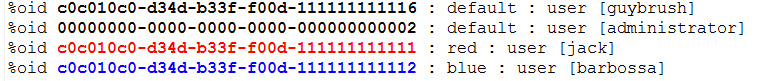

Then the log could look like this:

image::image2016-3-1-0-56-49.png[]

...giving immediate visual information useful to quickly recognize relevant objects in the log file.

Also, when encountering unknown OID, you can just hover the cursor over it, and you'll see the type and name of particular object (if known):

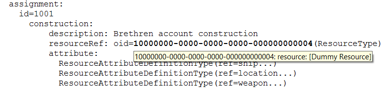

=== Logfile preprocessing: LogTrimmer tool

Large log files are awkward to process in test editors, especially in complex ones like Eclipse editor.
So it may be useful to preprocess them by removing unimportant information.

LogTrimmer tool has the following usage:

[source]
----
java com.evolveum.logviewer.utils.trimmer.LogTrimmer <instructions-file> <output-file> <input-file-1> ... <input-file-N>
----

Where:

. instructions-file contains instructions that have to be carried out on the input

. input-file-1..N are input files; there can be more of them because large logs are usually split into smaller parts (~ 100 MB each)

. output-file is the name of resulting file - merged and processed input ones

Currently there are the following instructions available:

[source]
----
trim "Log header text" <lines-to-keep>
select-test "part of test name"
----

First one (trim) is used to shorten selected log entries.
"Lines to keep" is the number of lines that should be kept from the log entry.
Examples:

[source]
----
trim "Returning resource from cache:" 3
trim "Retrieved repository object" 3
trim "Script expression trace:" 3
trim "Expression trace:" 3
----

Second one (select-test) is used to preserve only given test (from a log that contains a set of tests).
Example:

[source]
----
select-test "test113JackRenameFull"
----

TODO - use similar definition language as in Log Viewer (e.g. %kill instruction).

=== Logfile erasing: Truncater tool

On MS Windows systems it is quite hard to truncate open files.
There is a PowerShell command to do that:

[source]
----
powershell clear-content idm.log
----

...but on systems without PowerShell there is this Truncater tool to do the same:

[source]
----
java com.evolveum.logviewer.utils.truncater.Truncater idm.log
----

== Installation

The log viewer is now part of Eclipse plugin.
For installation instructions, please see xref:/midpoint/reference/legacy/eclipse-plugin/install/install/[Eclipse plugin installation HOWTO].

Note: when working with any non-trivial log files, increase the heap for Eclipse to at least 2 GB.
The larger files, the bigger heap is required.
Also, obtain appropriately fast CPU ☺

== Use

First, create an empty project in Eclipse.
Then copy a log file to it (recommended is to create a subfolder if there would be more log files viewed).
Note that log files have to have .log suffix to be recognizable.

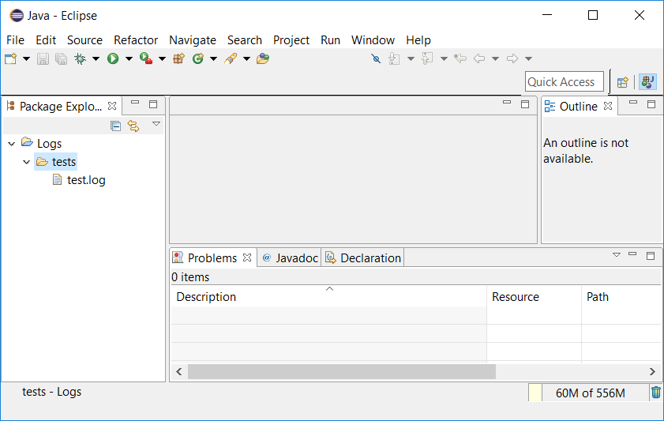

Now open the file in Eclipse log viewer by choosing Open With -> Evolveum Log Viewer:

image::image2016-3-1-10-48-41.png[]

When a log file is first opened, OID and threads dictionary is created, and default configuration is appended to the file.
You'll see that the file is marked as "modified".
It is advisable to save the file at this point.
(E.g. for OID name display to work.)

Now you can work with the file.

Notes:

. The outline is not updated automatically.
So, if you edit the file (or change outline definitions), always save the file afterwards.
Save causes recomputation of the outline.

. Because building outline, setting regions, etc is quite time-consuming, selected actions - namely, application of %kill, %expand, %collapse instructions and color highlighting of OIDs - can be invoked by selecting "Apply Evolveum Log Viewer Configuration" from editor context menu (or pressing *ALT+F3*).

. In order to see errors/warnings/infos only from the currently open file, it is advisable to configure Problems view to include markers on selected element only:

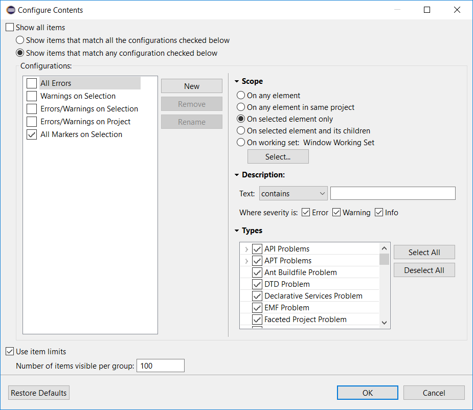

=== Performance tuning

Log viewer is a powerful tool to find certain classes of performance problems.
To ensure completeness of the data it is advised to have only following class loggers in logging configuration:

[source]
----
<classLogger>
	<level>TRACE</level>
    <package>com.evolveum.midpoint.model</package>
</classLogger>
<classLogger>
	<level>TRACE</level>
	<package>com.evolveum.midpoint.provisioning</package>
</classLogger>

----

Other class loggers of type `com.evolveum.midpoint.model.*` should be removed from systems configuration
as they would interfere with `classLogger` for `com.evolveum.midpoint.model`.

== Concluding remark

This plugin is currently just a prototype.
It may or may not work as expected.
We would be grateful for any comments, suggestions, or error reports.
