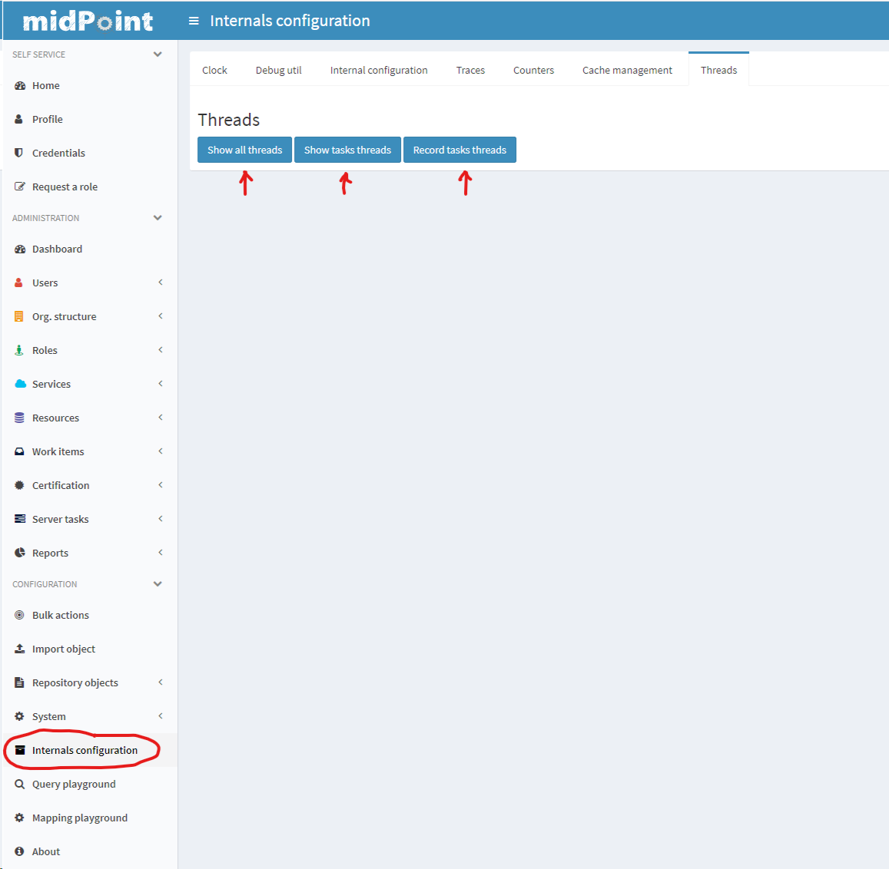
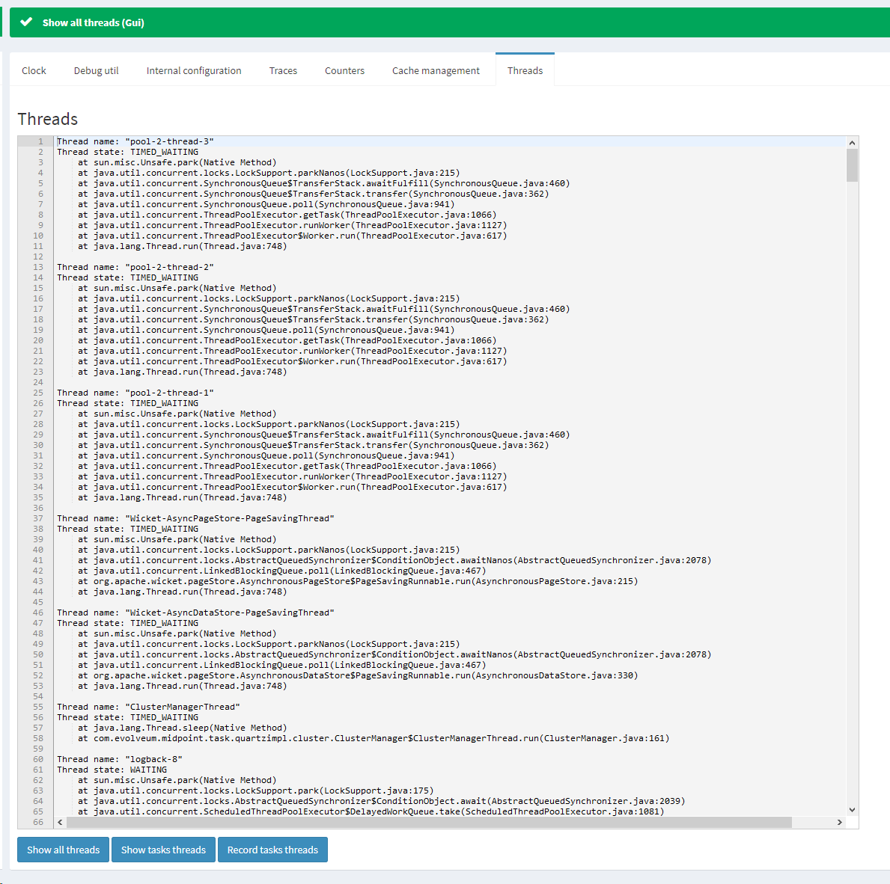
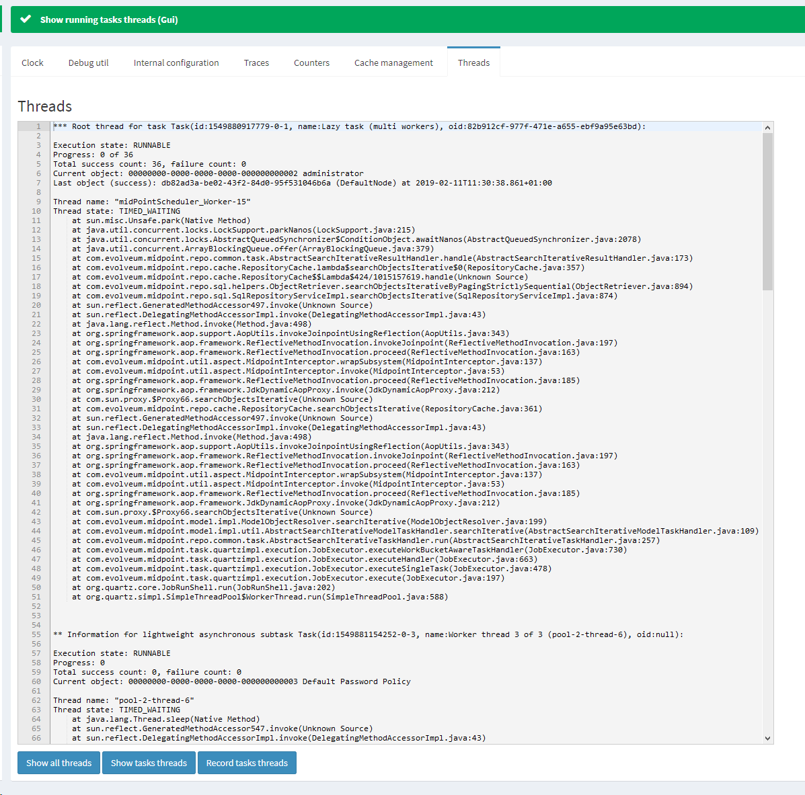
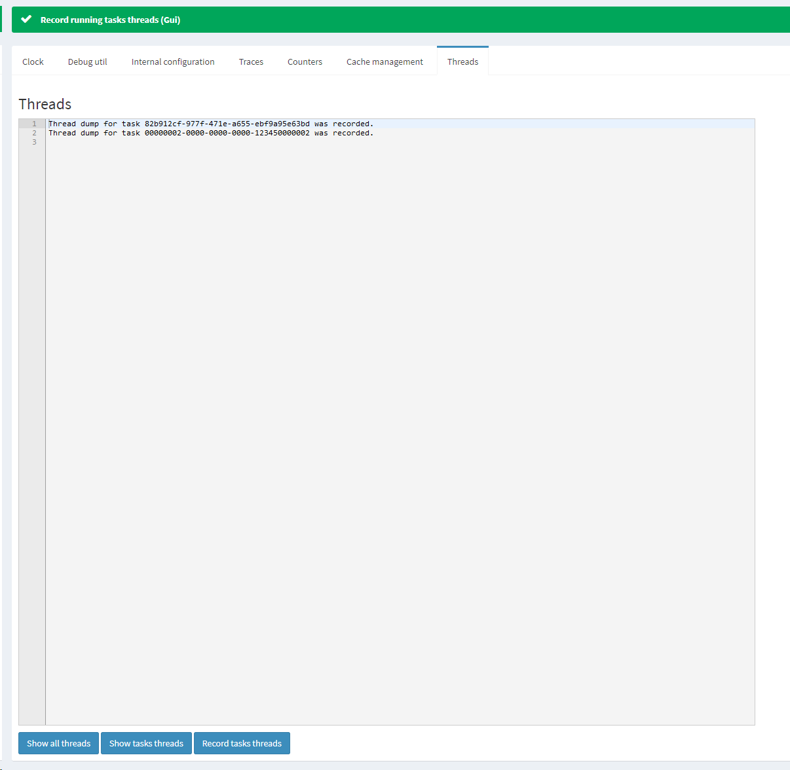
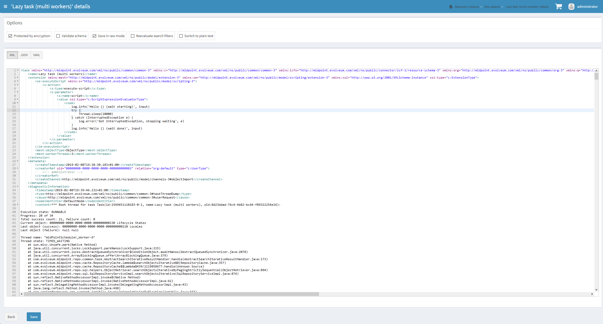

= Thread Dump Collection And Inspection
:page-wiki-name: Thread dump collection and inspection HOWTO
:page-wiki-id: 27820193
:page-wiki-metadata-create-user: mederly
:page-wiki-metadata-create-date: 2019-02-11T11:47:17.431+01:00
:page-wiki-metadata-modify-user: mederly
:page-wiki-metadata-modify-date: 2019-02-11T11:47:17.431+01:00
:page-since: "4.0"
:page-upkeep-status: yellow

Sometimes a task gets stuck, presenting as being in `STALLED` state.
Often the cause lies in a connector not responding in a timely manner (or never).
The best way how to diagnose these situations is to take and inspect a thread dump.
However, this usually requires an link:https://dzone.com/articles/how-to-take-thread-dumps-7-options[access to the server console], which is not always available.

Therefore in 4.0 midPoint has a new (a bit experimental) functionality: showing and recording thread dumps.

== Showing thread dumps from GUI

The functionality is available from the *Internals configuration* menu item:

You can either show all threads in JVM:

Or show only threads corresponding to the tasks currently executing on this node (this is probably the most useful option):

Or you can request that thread dumps of currently executing tasks are attached to those tasks in the form of `<diagnosticInformation>` property.
You can inspect these elements by exporting the task repository objects or showing them via GUI.

You can test this feature e.g. using the following samples containing long-running tasks:

* link:https://github.com/Evolveum/midpoint-samples/blob/master/samples/tasks/task-scheduling.xml#L53[https://github.com/Evolveum/midpoint-samples/blob/master/samples/tasks/task-scheduling.xml#L53] (use Task2, maybe modified by prolonging the time to run by enlarging the `delay` parameter)

* link:https://github.com/Evolveum/midpoint-samples/blob/master/samples/tasks/bulk-actions/script-delay-for-testing-thread-dumps.xml[https://github.com/Evolveum/midpoint-samples/blob/master/samples/tasks/bulk-actions/script-delay-for-testing-thread-dumps.xml] (waits 10 seconds for each object found in repo)

== Getting thread dumps via REST

Sometimes the system might be unreachable via GUI e.g. because of resource shortage.
If at least the REST interface is working you can get thread dump like this:

[source,bash]
----
curl --user administrator:5ecr3t http://localhost:8080/midpoint/ws/rest/threads -v
curl --user administrator:5ecr3t http://localhost:8080/midpoint/ws/rest/tasks/threads -v
curl --user administrator:5ecr3t http://localhost:8080/midpoint/ws/rest/tasks/00000002-0000-0000-0000-123450000002/threads -v
----

The first command retrieves all the threads, the second one gives threads related to all running tasks (on this node), and the third one gives threads related to a specific running task (again, it must be running on the node receiving the REST request).

== Getting thread dumps automatically

Current midPoint setting is that as soon as it detects that the task is stalled, it records the threads dump into the task's `<diagnosticInformation>` property.
This is repeated each hour until the task starts making progress or is stopped.

The current (hard-wired) setting is that the last 5 dumps are kept for each task.
