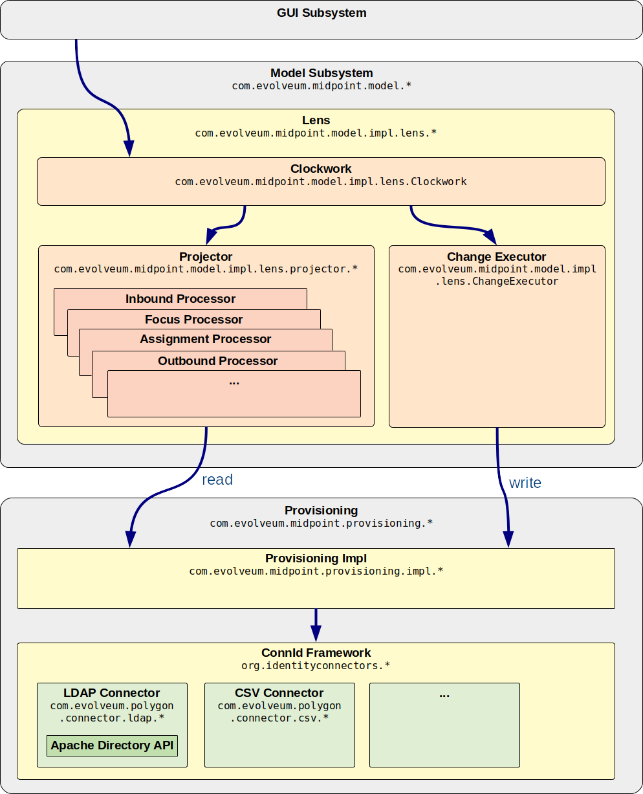

= Troubleshooting Mappings
:page-wiki-name: Troubleshooting Mappings
:page-wiki-id: 20709417
:page-wiki-metadata-create-user: semancik
:page-wiki-metadata-create-date: 2015-08-20T11:40:15.928+02:00
:page-wiki-metadata-modify-user: semancik
:page-wiki-metadata-modify-date: 2020-01-02T14:16:34.834+01:00
:page-alias: { "parent" : "/midpoint/reference/expressions/mappings/", "title" : "Troubleshooting", "display-order" : 800 }
:page-tag: guide
:page-toc: top
:page-upkeep-status: yellow

== Introduction

This page describes the most efficient steps to find out what is wrong with your xref:/midpoint/reference/expressions/mappings/[mapping] setup.
The mappings are the most efficient mechanism to do almost everything in midPoint.
Mapping mechanism is very powerful, but the mapping configuration and interactions may be get very complex.
This page describes a method to use to figure out what is wrong, why the mappings are not behaving as expected and how to efficiently find where is the problem.

== How Mappings Work

It is essential to understand how mappings are executed in midPoint.
Otherwise it is very easy to get lost during troubleshooting.
MidPoint is a comprehensive system that deals with a very complex problems of data synchronization.
MidPoint can be set to xref:/midpoint/reference/diag/logging/[a very fine logging]. But this will produce an ocean of logging entries and it is extremely difficult to find anything meaningful in such an information overload.
Therefore the best strategy is to selectively turn on and off the logging only in some parts of the system.

To do this efficiently one needs to know how are the mappings processed in midPoint.
The basic flow goes like this:

[source]
----
Model -> Clockwork -+-> Projector -> Projector processors -> Mapping -> Expression
                    +-> Provisioning -> ConnId framework -> Connector -> Resource
----

This is the same flow illustrated using components and packages:

xref:/midpoint/architecture/[MidPoint architecture] is designed in such a way that all important requests pass through the xref:/midpoint/architecture/archive/subsystems/model/[IDM Model Subsystem]. This makes sure that all requests are processed consistently, that xref:/midpoint/reference/security/authorization/[authorization] is properly applied, that the request is xref:/midpoint/reference/security/audit/[audited], etc.

Internal implementation of the xref:/midpoint/architecture/archive/subsystems/model/[IDM Model Subsystem] heavily relies on xref:/midpoint/reference/concepts/clockwork/clockwork-and-projector/[Clockwork and Projector] components.
The Clockwork drives processing of the request.
It does so in two big steps:

. Clockwork invokes projector to compute the changes.
E.g. Changes in user can be mapped to accounts and it is a responsibility of the projector to compute these (secondary) changes.
Projector is a relatively big component.
To make it maintainable it is internally divided to "processors".
There is an InboundProcessor for xref:/midpoint/reference/expressions/mappings/inbound-mapping/[inbound mappings], OutboundProcessor for xref:/midpoint/reference/expressions/mappings/outbound-mapping/[outbound mappings], FocusProcessor that deals with xref:/midpoint/reference/expressions/object-template/[object template] and so on.
Each of the processors are invoking the same code to process xref:/midpoint/reference/expressions/mappings/[mappings]. The mapping code in turn invokes xref:/midpoint/reference/expressions/expressions/[expression] code to run scripts, value generators, etc.

. Clockwork invokes provisioning to execute the changes.
When projector computes the changes then Clockwork invokes xref:/midpoint/architecture/archive/subsystems/provisioning/[Provisioning Subsystem] to execute the changes.
Provisioning internally invokes the xref:/midpoint/reference/resources/connid/[ConnId connector framework]. ConnId dispatches the invocation to a proper connector code, which executes the operation on the resource.

This description is somehow simplified.
The reality is much more complex.
E.g. there are some loops in this process.
Normally projector is called to compute secondary (outbound) changes.
Then these changes are executed.
Then the projector is called again to process any side-effect inbound changes that might happen during the previous execution.
We call this a wave.
This can be repeated several times, e.g. if xref:/midpoint/reference/resources/provisioning-dependencies/[provisioning dependencies] are used.
There are also hooks that can take place at some stages of the processing.
The hooks may interrupt or change the processing.
E.g. xref:/midpoint/reference/cases/approval/[approvals] and xref:/midpoint/reference/misc/notifications/[notifications] are implemented as hooks.
However the simplified description is enough for basic understanding of the troubleshooting process.

=== Troubleshooting steps

[TIP]
.Lazy Hunter
====
There is a story about a lazy hunter that wanted to catch a fox.
He didn't like the idea of blindly walking up and down the forest until he can catch a glimpse of the fox.
He wanted a more reliable way.
So he divided the forest in two parts by a big fence.
Then he observed the rabbits.
The part where the rabbits disappeared was the part with the fox.
So he divided that part to two smaller parts.
And so on ... until only a very small part remained.
And that one had to contain the fox.

====

=== Clockwork Summary

The key to efficient troubleshooting is to proceed in a systematic way and quickly locate the parts that cause the problem.
The ideal way to start troubleshooting is the Clockwork component.
It is in the middle of the processing.
Clockwork has a very convenient xref:/midpoint/reference/diag/logging/useful-loggers/[logging] output:

.com.evolveum.midpoint.model.impl.lens.Clockwork: DEBUG
[source]
----
###[ CLOCKWORK SUMMARY ]######################################
Triggered by focus primary delta ObjectDelta(UserType:c0c010c0-d34d-b33f-f00d-111111111111,MODIFY:
 PropertyDelta( / {.../common/common-3}organizationalUnit, REPLACE), PropertyDelta(metadata / {.../common/common-3}modifyTimestamp, REPLACE))
Focus: focus(user:c0c010c0-d34d-b33f-f00d-111111111111(jack))
Projections (1):
 account(ID {.../connector/icf-1/resource-schema-3}uid = [ jack ], type 'default', resource:10000000-0000-0000-0000-000000000104(Dummy Resource Red)): KEEP
Executed:
 ObjectDelta(UserType:c0c010c0-d34d-b33f-f00d-111111111111,MODIFY: PropertyDelta( / {.../common/common-3}organizationalUnit, REPLACE), PropertyDelta(metadata / {.../common/common-3}modifyTimestamp, REPLACE)): SUCCESS
 ObjectDelta(ShadowType:a3ebbe89-227b-42ff-9d00-f42bee3cf151,MODIFY: PropertyDelta(attributes / {.../resource/instance-3}ship, REPLACE), PropertyDelta(metadata / {.../common/common-3}modifyTimestamp, REPLACE)): SUCCESS
##############################################################
----

This is the summary of clockwork process.
The output above can be interpreted as follows:

* The process was triggered by the request to modify organizationalUnit (and metadata) for user with username jack and OID c0c010c0-d34d-b33f-f00d-111111111111.
This is the primary delta.

* The process consisted of recomputing one xref:/midpoint/reference/schema/focus-and-projections/[projection] (account) with identifier uid with value jack.
The account was on resource Dummy Resource Red.
The projector decided to KEEP the account (do not delete it).

* The following changes were computed and then also executed:

** Modification of user to replace organizationalUnit and metadata.

** Modification of a shadow (resource object) that replaces the value of attribute ship and metadata.

* All the operations resulted in a success.

This information is an ideal starting point for troubleshooting.
Have a look at the information.
Is it as you expect it? Especially focus on this:

* If the request (primary delta) really what you have intended to do?

* Does the list of projections (accounts) make sense? Are all accounts that are supposed to be active in KEEP state? Are there any BROKEN projections? Is some projection missing entirely from the list?

* Do the executed operations make sense? Are the correct properties and attributes modified?

* Are all the operations successful?

If everything makes sense and yet the resulting state of the resource is wrong (e.g. account is not really created) the the likely cause of the problem is in the provisioning branch of clockwork process.
Also if there are operation failures then the cause is most likely in the provisioning branch.
In all other cases the likely cause is in the projector branch of the clockwork process.

=== Model Context

The most important data structure for any deeper troubleshooting of clockwork and project is xref:/midpoint/reference/concepts/clockwork/model-context/[Model Context] (also called Lens Context in the implementation).
This data structure contains complete state of the computation.
Projector, clockwork and all other related components record results of the computation into the xref:/midpoint/reference/concepts/clockwork/model-context/[Model Context]. Even intermediary results are sometimes recorded in the model context, therefore it is a very valuable source of troubleshooting information.

The model context is dumped into logs after each major step in the computation.
To enable the model context dump use the following loggers:

[%autowidth]
|===
| Component | Logger | Level

| Clockwork
| com.evolveum.midpoint.model.impl.lens.Clockwork
| TRACE

| Projector
| com.evolveum.midpoint.model.impl.lens.projector.Projector
| TRACE

|===

The lens context dump looks like this:

[source]
----
---[ PROJECTOR (INITIAL) context projection values and credentials of resource:10000000-0000-0000-0000-000000000204(Dummy Resource Blue)(default) ]--------------------------------
LensContext: state=INITIAL, Wave(e=0,p=0,max=0), focus, 1 projections, 2 changes, fresh=true
  Channel: null
  Options: null
  Settings: assignments=FULL
  FOCUS:
    User, oid=c0c010c0-d34d-b33f-f00d-111111111116, syncIntent=null
      User old:
        user: (c0c010c0-d34d-b33f-f00d-111111111116, v5, UserType) name: guybrush .....
----

The xref:/midpoint/reference/concepts/clockwork/model-context/[Model Context] page provides the details how is the model context structured and how to understand the information from the model context dumps.

== Projector Branch

The primary purpose of the Projector is to take input deltas (user changes or synchronization deltas), apply them to the current state and try to figure out what effects those changes have.
There are many ways how the input deltas can influence the output: xref:/midpoint/reference/expressions/mappings/inbound-mapping/[inbound mappings], xref:/midpoint/reference/expressions/object-template/[object template], xref:/midpoint/reference/roles-policies/roles/rbac/[roles], xref:/midpoint/reference/expressions/mappings/outbound-mapping/[outbound mappings], etc.
Each of these steps provide part of the data for the computation.
Therefore also projector is internally divided into several "processors".
Each of the processors takes care of one part of the computation:

* Context Loader loader retrieves all the necessary information from midPoint repository and resources.
E.g. it loads the current state of the user and accounts (if necessary).

* Focus Processor takes care of applying changes to the xref:/midpoint/reference/schema/focus-and-projections/[focus] (usually xref:/midpoint/architecture/archive/data-model/midpoint-common-schema/usertype/[UserType]). It takes care of xref:/midpoint/reference/expressions/mappings/inbound-mapping/[Inbound Mapping] and xref:/midpoint/reference/expressions/object-template/[Object Template] processing.
It is internally composed from other processors such as InboundProcessor and ObjectTemplateProcessor and AssignmentProcessor.
xref:/midpoint/reference/roles-policies/roles/rbac/[Roles and Orgs (RBAC)] is also pre-computed in this stage.
Although we only care whether a specific xref:/midpoint/reference/schema/focus-and-projections/[projection] is legal or not.
We do not process the projection attributes yet.

* Activation Processor determines which xref:/midpoint/reference/schema/focus-and-projections/[projections] should exist and what is their activation state (enabled/disabled, time constraints, etc.)

* Then each xref:/midpoint/reference/schema/focus-and-projections/[projection] is processed individually:

** Projection Values Processor will evaluate attribute values specified in xref:/midpoint/reference/roles-policies/roles/rbac/[roles and Orgs (RBAC)] and xref:/midpoint/reference/expressions/mappings/outbound-mapping/[outbound mappings]. All the mappings are evaluated and the values are consolidated into deltas.

** Credentials Processor will take care of proper propagation of credentials, generating of passwords, etc.

** Reconciliation Processor will compare the computed values with real values that are stored in the resource.
It will create additional deltas (or eliminate computed deltas) to make sure that the attribute values are compliant with the policies after the operation is executed.
Reconciliation processor is working with real values from the resource and getting these values may be a performance hit.
Therefore Reconciliation Processor is only executed if there is a reason or opportunity for it.
E.g. it will be executed if explicit reconciliation is requested.
But it will also be executed if we have already retrieved the values from the resource previously and we still have fresh values in memory because in that case there is almost no overhead.

This process is repeated in several waves if necessary, selecting the correct projections for each wave.
Computation in waves is needed e.g. if there are xref:/midpoint/reference/resources/provisioning-dependencies/[provisioning dependencies] and the resources must be processed in a strict order.
However the computation is usually done at least in "one and a half wave".
The last half-wave is added to make sure that the results of the provisioning operations are correctly reflected to the xref:/midpoint/reference/schema/focus-and-projections/[focus] by the means of xref:/midpoint/reference/expressions/mappings/inbound-mapping/[inbound mappings].

This describes the current implementation of the projector.
However the implementation of the projector may change in time.
And it really does change in time.
The individual processors may be added, removed, merged or otherwise modified.
This already happened several times in the past.
Even though the details may change the basic principle should remain the same.
Therefore even if processor names and ordering may slightly change, this description should remain more-or-less accurate and should be well usable for getting a general understanding of how things work under the Projector hood.

=== Projector Tracing

The best overview of the projection operation is given the the xref:/midpoint/reference/concepts/clockwork/model-context/[Model Context] dumps (see above).
Projector dumps the model context at strategic places during the computation.
Therefore the best strategy to troubleshoot generic projector problems is

. Enable xref:/midpoint/reference/concepts/clockwork/model-context/[Model Context] dumps from projector (com.evolveum.midpoint.model.impl.lens.projector.Projector: TRACE)

. Execute the operation

. Look at the log files and follow projector dumps at each state of the computation.
Check the data and try to figure out the moment when the operation goes wrong.

This is usually enough to fix majority of problems.
Seeing what happens during the computation should give you enough data to figure out what's wrong.
If this is not enough then you need to look closer.
Given the above example try to figure out what "processor" may be responsible for the problem.
Then enable the TRACE logging in that processor.
The best source for projector list is the source code:

link:https://github.com/Evolveum/midpoint/tree/master/model/model-impl/src/main/java/com/evolveum/midpoint/model/impl/lens/projector[https://github.com/Evolveum/midpoint/tree/master/model/model-impl/src/main/java/com/evolveum/midpoint/model/impl/lens/projector]

If you are getting really desperate then enabling TRACE logging for the entire com.evolveum.midpoint.model.impl.lens package is almost certain to provide the necessary information.
However please keep in mind that this is a huge amount of data and it is easy to get lost in it.
You have been warned.

Understanding Deltas and Triples in Projector

MidPoint is based on xref:/midpoint/reference/concepts/relativity/[the principle of relative changes]. Therefore midPoint will deal with operations as if they add or remove something.
Sometimes midPoint also cares about the values that are present in the property before the operation (e.g. for reconciliation), but added and removed values are much more important for midPoint.
Therefore almost all Projector components work with xref:/midpoint/devel/prism/concepts/deltas/[deltas] and xref:/midpoint/devel/prism/concepts/triple/[triples]. The basic process is like this:

. Input deltas are recorded in xref:/midpoint/reference/concepts/clockwork/model-context/[Model Context] as primary deltas or synchronization deltas

. xref:/midpoint/reference/expressions/mappings/[Mappings] are evaluated.
Mappings take deltas as input.
Mappings produce xref:/midpoint/devel/prism/concepts/triple/[triples] for each affected values as output.

. Triples from several mappings are merged together.

. Merged triples are converted back to deltas.
These are secondary deltas.

Therefore watch the log files for dumps of the xref:/midpoint/devel/prism/concepts/triple/[triples]. There are usually intermediary results that may provide clue what's wrong.
They look like this:

[source]
----
Account squeezed attributes:
  {...connector/icf-1/resource-schema-3}name =>
    DeltaSetTriple:
      zero:
      plus: ItemValueWithOrigin: itemValue: jack mapping: M({...connector/icf-1/resource-schema-3}name = PVDeltaSetTriple(zero: [PPV(String:jack)]; plus: []; minus: []; ), strong) construction: Construction(Discr(RSD(account (default) @10000000-0000-0000-0000-000000000004)) in resource:10000000-0000-0000-0000-000000000004(Dummy Resource))
      minus:
----

This specific snippet tells about the attribute "name".
It describes a triple, where the zero set of the attribute is empty, plus set contains one value ("jack") and minus set is also empty.
This means that is this triple is processed it will cause that one new value ("jack") will be added to attribute "name".
This dump also contains meta-data, e.g. we can see that this triple has originated from a mapping that is defined for "account (default)" in resource 10000000-0000-0000-0000-000000000004(Dummy Resource).
Which means that this value is produced by outbound mapping for object where kind=account and intent=default.
If you follow such traces you can find out where your problem is and from where has midPoint taken the definition that caused it.

Similar logic also applies to processing xref:/midpoint/reference/roles-policies/roles/assignment/[assignments]. There are also triples that describe which assignments will be added or removed.
However, you may need to enable TRACE logging for com.evolveum.midpoint.model.impl.lens.projector.AssignmentProcessor to get it.
It looks like this:

[source]
----
TRACE (c.e.m.m.i.lens.projector.AssignmentProcessor): evaluatedAssignmentTriple:
DeltaSetTriple:
  zero:
    EvaluatedAssignment:
      isValid: true
      Constructions:
        DeltaSetTriple:
          zero:
            Construction: (no object class definition)
              resourceRef / kind / intent: objectRef oid=10000000-0000-0000-0000-000000000204 type={...common/common-3}ResourceType / ACCOUNT / null
              isValid: true
              auxiliary object classes: (null)
              AssignmentPath: (1)
                AssignmentPathSegment(1:C: user:c0c010c0-d34d-b33f-f00d-111111111116(guybrush) Constr 'null' )
          plus:
          minus:
        Present in old object: true
        Present in current object: true
  plus:
  minus:
    EvaluatedAssignment:
      isValid: true
      Roles:
        DeltaSetTriple:
          zero:
            EvaluatedAbstractRole:
              Role:
                role: (b189fcb8-1ff9-11e5-8912-001e8c717e5b, v0, RoleType)
                name: Thief
                policyConstraints:
                  exclusion:
                    id=null
                      description: A thief cannot be a pirate at the same time. At least not openly.
                      enforcement: ENFORCE targetRef: oid=12345111-1111-2222-1111-121212111111(RoleType)
                inducement:
                assignment:
                authorization:
              Assignment: PCV(2):[PrismReference({.../common/common-3}targetRef):[PRV(oid=b189fcb8-1ff9-11e5-8912-001e8c717e5b, targetType={.../common/common-3}RoleType)]]
          plus:
          minus:
      Target: role:b189fcb8-1ff9-11e5-8912-001e8c717e5b(Thief)
      Present in old object: true
      Present in current object: true
----

This specific trace tells that there is one assignment in the zero set (which is a direct assignment of resource with OID 10000000-0000-0000-0000-000000000204), there are no assignments in plus set and there is one assignment in minus set (assignment of role with OID 12345111-1111-2222-1111-121212111111).
Which means that the direct assignment will stay and the role assignment will be removed.
Data like these may provide clues what is happening.
E.g. if you see your assignment in the wrong set you can look at the log entries before that point to see what was the reason that midPoint has put the assignment in that set.
MidPoint is usually quite verbose and it provides a lot of data when set to TRACE log level.

Note: Do not get confused by the triples that are inside the assignment triples in the above example.
Sometimes midPoint needs to process the changes in such a complex way.
E.g. if a whole new assignment is added, then it will appear in the outer plus set.
But when existing assignment is modified, the it will appear in the outer zero set, but the changes that are caused by the modification will be distributed in the inner minus/zero/plus sets.
Later in the processing midPoint will flatten such triples-inside-triples when computing the final deltas.

=== Expression and Mapping Trace

It may happen that you suspect issues with one specific mapping or expression.
For example the expression is not evaluated as you think it should be.
MidPoint contains a code that can be used to trace execution of mappings and expressions on a very detailed level.The trace shows inputs and outputs and deltas that are taken into consideration when the expression or mapping is evaluated.
There are two options how to enable this tracing.

First option is to enable the tracing globally for all expressions and mappings by setting one or more of the following loggers:

[%autowidth]
|===
|  Logger name | Scope | Recommended log levels | Description | Verbosity

| com.evolveum.midpoint.model.common.mapping.Mapping
| *Mapping Trace*
| TRACE
| Logs summary of execution for each mapping. +
This is quite high-level mapping evaluation.
| Medium

| com.evolveum.midpoint.model.common.expression.Expression
| *Expression Trace*
| TRACE
| Logs summary of expression evaluation. +
This is lower-level trace of the expression with input and output dumps.
It is quite verbose.
| High

| com.evolveum.midpoint.model.common.expression.script.ScriptExpression
| *Script Expression Trace*
| TRACE
| Logs a lot of details about script expression evaluation (Groovy, JavaScript, ...) +
Provides a lot of details
| Very high

|===

The second option can be used to enable tracing for any particular mapping:

[source,xml]
----
<mapping>
      ....
      <trace>true</trace>
      ...
</mapping>
----

or expression:

[source,xml]
----
<mapping>
      ....
      <expression>
          <trace>true</trace>
          ...
      </expression>
      ...
</mapping>
----

This is a nice method to look at one particular troublesome mapping without flooding the log files with traces of all the mappings in the system.

The mappings also have an optional property to specify mapping name:

[source,xml]
----
<mapping>
      <name>my-ugly-mapping</name>
      ...
</mapping>
----

This is a very useful feature that helps you to locate the logs for a particular mapping.
MidPoint will use mapping name in logs and error messages.

=== Logging Inside Script Expressions

If you find out the problem is somewhere inside a xref:/midpoint/reference/expressions/expressions/script/[Script Expression] code then there is way how to troubleshoot that.
MidPoint has xref:/midpoint/reference/expressions/expressions/script/functions/[script expression functions] that can be used to log messages from the scripting code.
It works like this:

[source,groovy]
----
log.error('The {} is broken, {} is to blame', resource, reason)
----

See xref:/midpoint/reference/expressions/expressions/script/functions/[Script Expression Functions] page for more details.

== Provisioning Branch

=== Change Executor

The provisioning operations are usually executed by the `com.evolveum.midpoint.model.impl.lens.ChangeExecutor` class.
This kind of a "terminal station" where the xref:/midpoint/reference/concepts/clockwork/model-context/[model context] arrives to be executed.
At this time the model context should contain all the original (primary) deltas and all the computed (secondary) deltas prepared for execution.
The `ChangeExecutor` will log all the deltas that is executes:

[source]
----
---[ EXECUTED delta of UserType ]---------------------
Channel: null
Wave: 0
ObjectDelta<UserType>(UserType:c0c010c0-d34d-b33f-f00d-111111111111,MODIFY):
  telephoneNumber
    REPLACE: 555-1234
    OLD: 555-1234
  activation/effectiveStatus
    REPLACE: ENABLED
  activation/enableTimestamp
    REPLACE: 2016-08-30T16:41:45.655+02:00
  iteration
    REPLACE: 0
  iterationToken
    REPLACE:
  metadata/modifyTimestamp
    REPLACE: 2016-08-30T16:41:46.442+02:00
Result: SUCCESS: null
--------------------------------------------------
----

The ChangeExecutor will execute the changes on xref:/midpoint/reference/schema/focus-and-projections/[focal objects] directly in midPoint repository.
However the changes on resource objects (shadows) are passed to the provisioning subsystem.

One curious thing here is that the ChangeExecutor will log the operation in this nice way only after it is executed.
That is necessary because we also want to log the operation result here which is (obviously) not available before the operation is executed.
Therefore if you look for the details of operation execution you should look in front of this log entry, not behind it.

=== Provisioning Subsystem

The responsibility of the provisioning subsystem is to communicate with the resources.
If a provisioning subsystems gets the (shadow) deltas, it will try to execute the changes on the resource by using appropriate connector.
This is usually quite a straightforward operation.
However, sometimes it may get a bit complicated.
Therefore the provisioning mechanisms deserves some explanation.
The sequence of events is usually roughly like this:

. Resource definition (xref:/midpoint/architecture/archive/data-model/midpoint-common-schema/resourcetype/[ResourceType]) is retrieved.
It is used to determine correct connector type.

. Provisioning computes additional operations needed to execute the delta.
E.g. there may be xref:/midpoint/reference/resources/resource-configuration/simulated-disable/[simulated activation] or xref:/midpoint/reference/resources/entitlements/[entitlement associations] to process.

. New instance of a connector is initialized by using the configuration in the resource definition.
This is skipped if existing instance already exists.
In that case existing instance is reused.

.. Connector initialization usually includes opening a new connection to the resource.
The connector may also need to retrieve resource configuration or schema at this step.
The initialization may take some time.

. Connector instance is used to carry out the operation specified in the delta.
E.g. new LDAP account is created.

. xref:/midpoint/reference/resources/entitlements/[Entitlement associations] are processed again.
If the association operations require modification of other objects (typically groups) then these additional operations are executed.
This also includes processing of referential integrity (if needed).

MidPoint does not communicate with the connectors directly.
The connectors are managed by the ConnId framework.
Therefore midPoint invokes the ConnId framework and the ConnId framework then invokes the appropriate connector:

[source]
----
Provisioning -> ConnId Framework -> Connector -----(network)----> Resource
----

You can trace all provisioning operations by enabling the `com.evolveum.midpoint.provisioning` logger.
However this will produce a lot of log entries.
This approach is usually *not* necessary unless you are hunting down some really nasty issue with simulated capabilities or entitlement associations.
Much better approach is to start from the connector operations by using the ConnId logging (see below).

=== Tracing ConnId Operations

Mail article: xref:/midpoint/reference/diag/troubleshooting/connectors/[Troubleshooting Connectors]

The ConnId connector framework stand between midPoint and the connectors.
It knows about every operation that midPoint invokes on every connector and it knows about all the return values.
Some time ago we have added ability to log all the operations that are passing through the connector framework.
This can be easily enabled by using the following log configuration:

....
org.identityconnectors.framework: TRACE
....

The ConnId operation traces look like this:

[source]
----
TRACE (org.identityconnectors.framework.api.operations.SearchApiOp): method: search msg:Enter: search(ObjectClass: inetOrgPerson, null, com.evolveum.midpoint.provisioning.ucf.impl.ConnectorInstanceIcfImpl$2@643dc940, OperationOptions: {ALLOW_PARTIAL_ATTRIBUTE_VALUES:true,PAGED_RESULTS_OFFSET:1,PAGE_SIZE:20})
....
TRACE (org.identityconnectors.framework.api.operations.SearchApiOp): method: search msg:Return: org.identityconnectors.framework.common.objects.SearchResult@a90221a
----

This is a very useful mechanism.
It will log every operation of every connector.
If you suspect that the connector is not executing the right operation this is the right place to check it.
You can see what is the operation that the midPoint is passing to the connector.
If that operation looks good then the problem is most likely in the connector (see below).
If the operation does not make sense then the problem is usually in the provisioning (see above).

However, the operation is logged by the ConnId framework on relatively high level and the operation is still quite abstract.
If you need more details about what really gets executed you have to rely on the connector logging.
See xref:/midpoint/reference/diag/troubleshooting/connectors/[Troubleshooting Connectors] for more details.

=== Connector Traces

Mail article: xref:/midpoint/reference/diag/troubleshooting/connectors/[Troubleshooting Connectors]

Most connectors log at least some information about the operations.
Some connectors are really good, such as the LDAP connector (and its subclasses).
The LDAP connector will log all the LDAP operations if you set the `com.evolveum.polygon.connector.ldap.OperationLog` logger to `DEBUG` level (also see xref:/connectors/connectors/com.evolveum.polygon.connector.ldap.LdapConnector/troubleshooting/[LDAP Connector Troubleshooting]):

[source]
----
2016-08-30 17:14:20,043 [main] DEBUG : method: null msg:ldap://localhost:10389/ Add REQ Entry:
Entry
    dn: uid=jack,ou=People,dc=example,dc=com
    objectClass: inetOrgPerson
    uid: jack
    userPassword: deadmentellnotales
    sn: Sparrow
    cn: Jack Sparrow
    description: Created by IDM
    givenName: Jack
    l: Black Pearl
    displayName: Jack Sparrow

2016-08-30 17:14:20,091 [main] DEBUG : method: null msg:ldap://localhost:10389/ Add RES uid=jack,ou=People,dc=example,dc=com:         Ldap Result
            Result code : (SUCCESS) success
            Matched Dn : ''
            Diagnostic message : ''
----

Some connectors will barely log anything.
This is all connector-dependent.
If the connector author did a good job you will get what you are looking for.
If the author did a poor job you are mostly out of luck.
But one way or another this is the best chance to learn what the connector is doing.
If that fails you have to resort to packet sniffer and similar tools.

Each connector has its own logger names.
The most reliable way to find out what it is to look at the connector documentation or connector source code.
But as rule of thumb the connectors usually use logger names matching their Java package.
This is supposed to be the same as the package prefix used in the `connectorType` property (see xref:/midpoint/architecture/archive/data-model/midpoint-common-schema/connectortype/[ConnectorType]), e.g. `com.evolveum.polygon.connector.ldap`.

== Extra Tips

* Enable xref:/midpoint/reference/security/audit/[Auditing] to a log file, including the auditing details.
This will log all the deltas that are requested to execute from the user interface and other interfaces.
Sometimes the problem is in the request delta.
The audit is the easiest way to check that.

== See Also

* xref:/midpoint/reference/diag/troubleshooting/connectors/[Troubleshooting Connectors]

* xref:/midpoint/reference/diag/troubleshooting/troubleshooting-with-traces/[]

* xref:/midpoint/reference/expressions/[Mappings and Expressions]

* xref:/midpoint/reference/diag/troubleshooting/usual-troubleshooting-steps/[Usual Troubleshooting Steps]

* xref:/midpoint/devel/bugfixing/[Bugfixing and Support]
