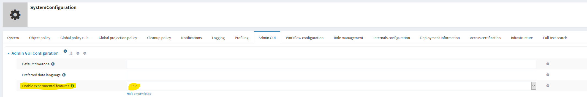
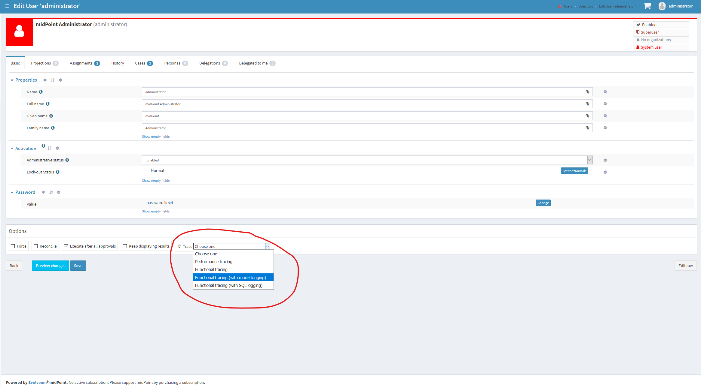
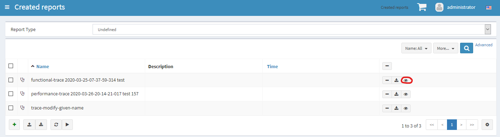
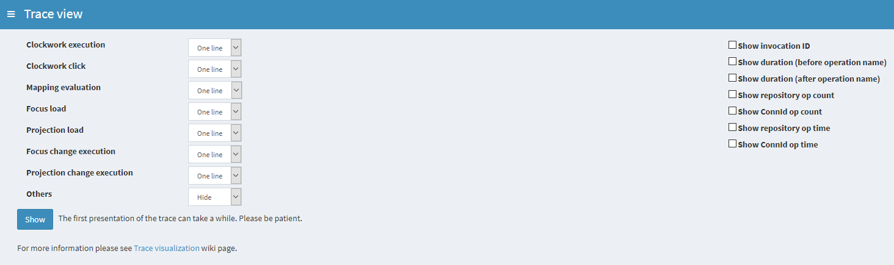

= Troubleshooting With Traces
:page-wiki-name: Troubleshooting with traces
:page-wiki-id: 39583935
:page-wiki-metadata-create-user: mederly
:page-wiki-metadata-create-date: 2019-10-14T15:14:28.716+02:00
:page-wiki-metadata-modify-user: mederly
:page-wiki-metadata-modify-date: 2020-08-25T17:40:02.348+02:00
:page-experimental: true
:page-tag: guide
:page-upkeep-status: yellow

.TL;DR
[TIP]
====
. Enable experimental features in GUI.
Logout + login.

. Select tracing profile e.g. "functional" when invoking an operation.

. Find the trace in "Reports created" and click on "eye" icon.

. Enjoy!
====

== Overview

_Tracing_ is an unofficial and highly experimental feature of midPoint troubleshooting.
The principle is very simple: any operation in midPoint can be recorded into a special _trace file_, and that file can be later analyzed.

Recording can be done in the following ways:

. By requesting it via GUI when starting an operation.
(Supported for majority - but not all - operations: those that have "options bar" available.)

. By requesting regular tracing (each N processed objects) in background tasks.

. By turning on tracing of _all_ operations in midPoint.

Analysis can be carried out via:

. midPoint GUI (via _Created reports_ page - since 4.1),

. Eclipse plugin (but only using unpublished version in _feature/tracing_ branch - and this plugin is already deprecated),

. IntelliJ IDEA plugin (but this feature is not finished there).

== Enabling experimental features

To record (via GUI) or to view traces you have to enable experimental features of midPoint GUI:

After the change, please log out and log in, in order to apply the changed settings.

== Recording traces via GUI

Now you can execute any operation in "traced mode" like this:

There are two basic flavors of tracing:

. *Functional tracing.* It is used to troubleshoot functional issues like misbehaving mappings.
There is a lot of information collected, and therefore this can have a significant performance impact.
It is often advisable to include logging information in recorded traces, e.g. model, provisioning, or SQL logging.

. *Performance tracing.* This one is suitable to pinpoint performance issues.
Here we collect only basic information, so the impact on performance is quite low.

After operation is complete, the trace is stored in `trace`  subdirectory of midPoint home directory.
It can be obtained either directly from there, or downloaded/viewed from within _Created reports _menu item (see below).

== Recording traces for background tasks

A task can record the trace(s) for objects being processed by including the following configuration snippet (adapted as needed):

[source,xml]
----
<task ...>
    <extension ...>
        <mext:tracing xmlns:mext="http://midpoint.evolveum.com/xml/ns/public/model/extension-3">
            <interval>1</interval> <!-- we will trace each object processed -->
            <tracingProfile>
                <collectLogEntries>true</collectLogEntries>
                <loggingOverride>
                    <levelOverride>
                        <logger>com.evolveum.midpoint.model</logger>
                        <level>TRACE</level>
                    </levelOverride>
                </loggingOverride>
                <tracingTypeProfile>
                    <level>normal</level>
                </tracingTypeProfile>
                <fileNamePattern>trace %{timestamp} %{testNameShort} %{focusName} %{milliseconds}</fileNamePattern>
            </tracingProfile>
        </mext:tracing>
        ...
    </extension>
    ...
</task>
----

== Analyzing traces via GUI

First you need to open _Created reports_ page:

After clicking on "eye" icon you get the _Trace view_ page:

Now you can configure the view you'd like to obtain and click the _Show_ button.
As the trace file is usually quite large (tens or hundreds of megabytes) it will take a few seconds before displaying.
But subsequent visualizations of the same trace (with changed parameters) should be quite fast.
(Also make sure you get enough heap when opening large traces.
☺)

More information about the Trace view is on xref:/midpoint/reference/diag/troubleshooting/troubleshooting-with-traces/trace-visualization/[Trace visualization] page.

== Analyzing traces via IDEA plugin

TODO

== Tracing customization

Tracing profiles are available in the system configuration.
If you need to change them (typically if you need to include more logging), you can update the configuration.

An example of adding workflow module logging:

[source,xml]
----
<profile>
    <name>functional-model-workflows-logging</name>
    <displayName>Functional tracing (with model and workflows logging)</displayName>
    <visible>true</visible>
    <fileNamePattern>functional-trace %{timestamp} %{focusName}</fileNamePattern>
    <createRepoObject>true</createRepoObject>
    <compressOutput>true</compressOutput>
    <collectLogEntries>true</collectLogEntries>
    <loggingOverride>
        <levelOverride>
            <logger>com.evolveum.midpoint.model</logger>
            <logger>com.evolveum.midpoint.wf</logger>
            <level>TRACE</level>
        </levelOverride>
    </loggingOverride>
    <tracingTypeProfile>
        <level>normal</level>
    </tracingTypeProfile>
</profile>
----

== Authorizations

TODO