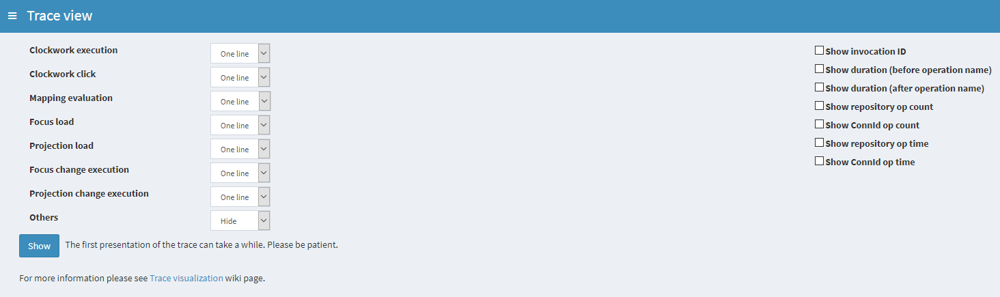
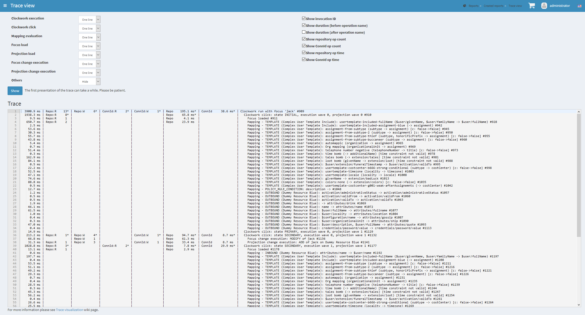

= Trace visualization
:page-wiki-name: Trace visualization
:page-wiki-id: 48824461
:page-wiki-metadata-create-user: mederly
:page-wiki-metadata-create-date: 2020-03-26T19:23:04.479+01:00
:page-wiki-metadata-modify-user: mederly
:page-wiki-metadata-modify-date: 2020-03-27T10:11:51.163+01:00
:page-experimental: true
:page-tag: guide
:page-upkeep-status: yellow

A _trace_ contains a record of a midPoint operation execution.
Traces are used to diagnose either functional or performance issues.
For a broader context please see xref:/midpoint/reference/diag/troubleshooting/troubleshooting-with-traces/[Troubleshooting with traces] page.

Here we describe how a trace can be viewed using midPoint GUI.

The Trace view contains the following options:

The trace itself is a _tree_. Nodes in this tree are records of executions of individual operations.
(Technically these are `OperationResultType` objects).

Any higher-level operation is decomposed into lower-level ones.
For example, a clockwork execution is decomposed into individual clockwork clicks, and each click is decomposed into load operations for focus and projections, execution of mappings, and optionally application of resulting changes (besides others).
Even load operation itself can be decomposed into e.g. repository cache `getObject`  call (delegated further to SQL repository `getObject`  call), and so on.

Usually, you don't need (or want) to see the full decomposition.
It is simply too technical.
So you can select what nodes to view - and to what detail.

This prototype version of trace viewer allows you to select visibility for the following types of nodes:

. clockwork execution - this is usually the root of the operation,

. clockwork click - this is one execution of the clockwork, typically in a sequence of INITIAL, PRIMARY, SECONDARY, FINAL; in one or more so called _waves_,

. mapping evaluation,

. loading focus and projections,

. application of changes to focus and projections,

. other nodes (_a lot_ of them).

The visibility can be:

[%autowidth]
|===
| Visibility | Meaning

| One line
| The operation is displayed on a single line, trying to compress all substantial information to it.

| Brief
| The operation is displayed on multiple lines, selecting the most important parts.
Applicable to mappings, object load and delta execution.
Only non-operational data is shown in these cases (where implemented correctly).

| Full
| The operation is displayed on multiple lines, showing everything that can be shown.

| Detailed
| Currently implemented for mappings only.
This is something between Brief and Full.

| Hide
| Operation of this type is not shown at all.
(But its children are, assuming they have visibility other than Hide.)

|===

On the right side you have some extra options:

[%autowidth]
|===
| Option | Meaning

| Show invocation ID
| Each operation has its own identifier.
You can display these and then use them e.g. to locate particular operations in `trace.xml` file when opening in a text editor (typically to see details that are not shown in the trace viewer).

| Show duration
| Shows how long did the operation take.
You can show this information either on the beginning of the line or at the end.
(Choose what you like more.)

| Show repository/ConnId op count
| Shows the number of repository or ConnId operation calls.

| Show repository/ConnId op time
| Shows the time spent in repository or ConnId operation calls.

|===

The output then looks like this:

The columns on the left side correspond to the options you selected:

. The first contains the duration of the selected operation (including its suboperations, of course).

. "Repo:R" is the number of repository read operations (get, search).

. "Repo:W" is the number of repository write operations (add, modify, delete).

. "ConnId:R" is the number of ConnId read operations.

. "ConnId:W" is the number of ConId write operations.

. "Repo" is the time spent in the repository.

. "ConnId" is the time spent in ConnId.

Normaly, these numbers indicate the count/time for repo/ConnId operations invoked directly by the operation being shown on particular line.
So you see that e.g. Focus loaded (ID 911) used single repository read that took 4.1 milliseconds.

But there's an exception for clockwork run and click lines: they show _aggregate_ information for the whole subtree rooted at them.
This is indicated by an asterisk displayed after the particular data.

You can experiment with changing these display parameters to find the most relevant view for your particular purposes.

Be a bit cautious when interpreting performance data captured using functional-grade tracing.
They will be more or less influenced by the process of gathering the detailed data, so they will be greater than in normal operation.
So if you are trying to diagnose performance, use "performance" tracing profile.

A final note: There's much more to show than was possible to implement in this prototype text-based visualizer.
More information can be found either manually in trace files, or using IDEA or Eclipse trace viewer.
In the future we might be able to improve this text-based viewer, or add maybe HTML-based or graphical one.