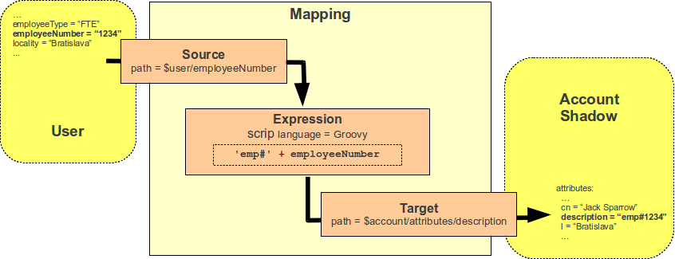

= MidPoint Expressions and Mappings
:page-wiki-name: Mappings and Expressions
:page-wiki-id: 655372
:page-wiki-metadata-create-user: semancik
:page-wiki-metadata-create-date: 2011-04-29T11:48:39.838+02:00
:page-wiki-metadata-modify-user: semancik
:page-wiki-metadata-modify-date: 2017-07-13T15:00:55.639+02:00
:page-nav-title: Expressions and Mappings
:page-display-order: 200
:page-upkeep-status: green
:page-moved-from: /midpoint/reference/expressions/introduction/

== Introduction

Expressions and mappings are very powerful mechanisms, supporting flexibility and customization of midPoint deployment.
Mappings drive synchronization and transformation of values between midPoint and its surroundings, which is one of the primary function of any identity management system.
Expressions are used to customize many parts of midPoint functionality, from the data transformation in mappings, all the way to the data presentation in the user interface.
All in all, expressions and mappings give midPoint its flexibility.

However, with great power comes great responsibility.
Expressions and mappings are very powerful, there are many possibilities, options, settings and overall variability.
This makes expressions and mappings quite complicated.
Use of mappings and expressions can be intimidating at first.
Yet, there is method in this madness.
The mechanisms are built on consistent principles and solid concepts.
This part of the documentation site tries to explain the mechanisms, from the high-level concepts to all the low-level details.

== Mapping

Mapping is a complex solution for reflecting one value to the other.
E.g. a mapping is used to reflect a value of user's family name to the `sn` LDAP account attribute.
It can also be used together with expressions for form complex transformations, combine a value from several sources, set a value based on a condition, or it can do almost any imaginable action.
Mappings are very flexible.
There are options for specifying fixed values, point to other attributes using path or even using script expressions.
Mappings are the "brain" of all xref:/midpoint/reference/synchronization/[synchronization functions], they are used in xref:/midpoint/reference/roles-policies/roles/rbac/[role structures] and xref:/midpoint/reference/expressions/object-template/[object templates], they are everywhere.

.Mapping structure overview

Mappings are intelligent.
Mappings are not only aware of the source values, but they also know how the source values are changed and can efficiently reflect that change to the target values.
Therefore maintaining the xref:/midpoint/reference/concepts/relativity/[relative change model] through the entire midPoint system.
The mapping also knows what are its sources and targets and therefore also compensates for correct data type conversions.
Mapping is the best tool to customize midPoint behavior.
It is used e.g. in xref:/midpoint/reference/expressions/mappings/outbound-mapping/[outbound mappings], xref:/midpoint/reference/expressions/mappings/inbound-mapping/[inbound mappings], xref:/midpoint/reference/roles-policies/roles/assignment/[assignments], xref:/midpoint/reference/roles-policies/roles/rbac/[roles],
  xref:/midpoint/reference/expressions/object-template/[object templates] and so on.

See xref:/midpoint/reference/expressions/mappings/[Mapping] page for more details.

== Expression

Expression is the part of midPoint that contains simple piece of logic or algorithm.
It usually used to transform one value to another, expression is used as a condition to control conditional role assignment or to generate a value.

.Expression example
[source,xml]
----
<expression>
    
</expression>
----

Expression is often part of a mapping, it can be used in xref:/midpoint/reference/synchronization/correlation-and-confirmation-expressions/[correlation and confirmation expressions], and for many other purposes.
Expressions are very flexible, with many options to choose from including the use of literal values, paths to data objects, scripting languages, value generators and more.
Scripting expressions can be written in several scripting languages, Groovy being the most popular choice.

See xref:/midpoint/reference/expressions/expressions/[Expression] page for more details.

== More Information

Following pages describe concepts related to expressions, mappings and data processing and transformation in general.

++++

++++

include::../_reference-disclaimer.adoc[]

== See Also

* link:/book/practical-identity-management-with-midpoint.html#_mappings["Mappipngs" section in midPoint book]

* xref:/midpoint/reference/expressions/mappings/[Mapping]

* xref:/midpoint/reference/expressions/expressions/[Expression]

* xref:/midpoint/reference/expressions/mappings/mapping-evaluation-examples/[Mapping Evaluation Examples]

