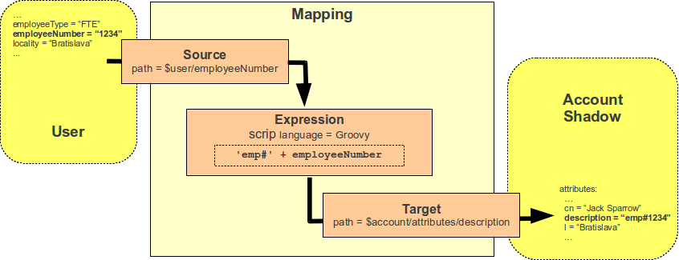
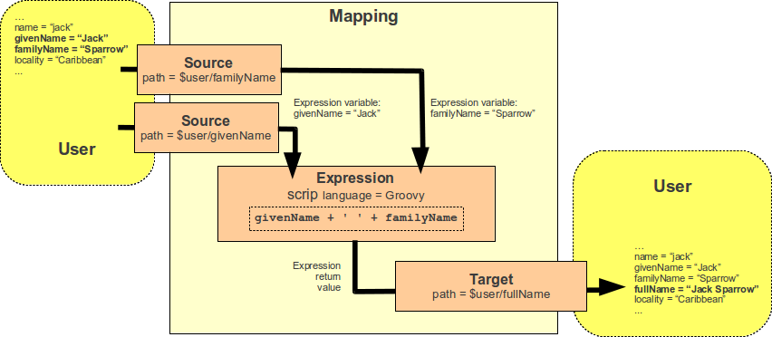

= Mappings
:page-wiki-name: Mapping
:page-display-order: 70
:page-upkeep-status: orange
:page-toc: top

== Introduction

_Mapping_ is a mechanism that is used at many places through midPoint to map value of a source property (or properties) to a target property.
It is a very flexible mechanism that allows to use expressions (including scripting), direct variable references, value generators and other _evaluators_ for the value.
It is used for example in wiki:Outbound+Mapping[outbound mapping], wiki:Inbound+Mapping[inbound mapping], wiki:Assignment[assignments], wiki:Advanced+Hybrid+RBAC[roles] and so on.

=== The Basics

Mapping definition consists of the three basic parts:

* *Source* part defines the data sources of the mapping.
These are usually understood as mapping input variables.
Source defines where mapping gets its data.

* *Expression* part defines how the data are transformed, generated or passed on to the "other side".
This is the most flexible part of the mapping as it contains logic.
There is a broad variety of possibilities that are described in the wiki:Expression[Expression] page.

* *Target* part defines what to do with the results of the mapping, where the computed values should go.

The three parts of the mapping as well as the basic principle is illustrated in the following figure:

The figure shows simple mapping that takes `employeeNumber` user property and transforms it to `description` account attribute by using a simple Groovy script expression.

The source part of the mapping defines that there is a single source which is based on `employeeNumber` user property.
Source definitions are important for the mapping to correctly process relative changes (deltas), mapping dependencies, etc.
The source definition tells mapping that the value of `employeeNumber` user property should be passed to an expression.

The expression part contains a simple Groovy script that prepends the prefix `emp#` to the employee number value specified by the source definition.
The expression part of the mapping is very flexible and there is a lot of way that can be used to transform a value, generate new value, use a fixed value, pass a value without any change and so on.
Because expressions are so flexible they are documented in a separate wiki:Expression[Expression] page.

The target part defines how the result of the expression should be used.
In this case the result is to be used as a `description` account attribute.
The target definition is necessary so the mapping can locate appropriate definition of the target property and therefore make sure that the expression produces a correct data type (e.g. string vs wiki:PolyString[polystring] and that other schema constraints are maintained (e.g. single vs multiple values).

This example mapping can be expressed in XML using the same structure:

.Simple mapping
[source,xml]
----
<mapping>
    <source>
        <path>$focus/employeeNumber</path>
    </source>
    <expression>
        
    </expression>
    <target>
        <path>$projection/attributes/description</path>
    </target>
</mapping>

----

Not all parts of the mapping are mandatory.
If the expression is not present then a "as is" expression is assumed that just copies the source to target without any change.
Some parts of the mapping may be implicitly defined by the surrounding context, e.g. the target is implicit in wiki:Outbound+Mapping[outbound mapping definition]. Similarly a source is implicitly defined in wiki:Inbound+Mapping[inbound mapping]. Therefore for outbound and inbound mappings it is usually sufficient to define either source or target:

.Simple outbound and inbound mapping
[source,xml]
----
<attribute>
    <ref>ri:sn</ref>
    <outbound>
        <source>
             <path>$focus/familyName</path>
        </source>
    </outbound>
    <inbound>
        <target>
             <path>$focus/familyName</path>
        </target>
    </inbound>
</attribute>

----

Both source and target are implicit in outbound/inbound mappings of standard properties such e.g. inside `activation` or `credentials` containers.
Therefore the very minimal form of mapping definition is an empty mapping which copies implicit source to the implicit target without any change:

.Empty outbound mapping
[source,xml]
----
<outbound/>
----

=== Slightly Complex Scenario

Following figure illustrates a mapping that takes two arguments: given name and a family name.
The mapping produces a full name by concatenating these value with a space in between.
This is the kind of mapping that is frequently used in the user template.
While the mapping may seem simple there are some sophisticated mechanisms hidden inside.

The mapping is represented in the XML form as follows:

.Simple mapping
[source,xml]
----
<mapping>
    <source>
        <path>$focus/givenName</path>
    </source>
    <source>
        <path>$focus/familyName</path>
    </source>
    <expression>
        
    </expression>
    <target>
        <path>$focus/fullName</path>
    </target>
</mapping>
----

There are two sources specified by the source definitions: user properties `givenName` and `familyName`. The mapping combines them to create a single value which is used to populate user's `fullName` property.

The two sources are passed to the expression as a variables with names `givenName` and `familyName` respectivelly.
The interesting part is that the mapping will be evaluated only if one of the sources changes or if a full reconciliation is requested.
In case that neither `givenName` not `familyName` changes there is no need to re-evaluate that expression.
This is the primary reason for requiring explicit source definition in the mappings.
Without such definitions it is not (realistically) possible to reliably determine when and how the expression should be re-evaluated.
The expression evaluators get full information regarding what was changed and how it was changed (deltas) therefore they may recompute the value accordingly.
E.g. in case of replacing a familyName with a new value the provided Groovy script might be executed for both the old and new to correctly determine the delta (but in fact that may not really happen here because midPoint can optimizing that as all the properties are single-value).
This is the way how mapping fully and correctly supports relative changes.

== Source and Target Definitions

Source and target definitions have similar syntax.
The most important part of the definitions is specification of the *path*. The path is in a form of usual wiki:Prism+Path[prism path] and can be either relative or absolute variable-based path.
The variable-based paths are bound to the specific context in which the mapping is executed.
But the `$user` variable is almost always present.
The relative paths are interpreted as relative to source or target _contexts_ of the mapping.
The contexts are described by the following table which also provides some examples of path usage.

[%autowidth,cols="h,1,1,1,1"]
|===
| Mapping |  | Variables | Default Context | Examples

| Outbound
| Source
| $focus +
$projection
| $focus
| $focus/givenName +
givenName

| Outbound
| Target
| N/A +
fixed to account attribute
| N/A +
fixed to account attribute
|

| Inbound
| Source
| N/A +
fixed to account attribute, presented as `input` variable
| N/A +
fixed to account attribute
|

| Inbound
| Target
| $focus +
$projection
| $focus
| $focus/givenName +
givenName

| User template
| Source
| $focus
| $focus
| $user/givenName +
givenName

| User template
| Target
| $focus
| $focus
| $focus/givenName +
givenName

|===

[TIP]
.$user and $account variables
====
The variable `$focus` and `$projection` were introduced in midPoint 3.0 as a consequence of the wiki:Generic+Synchronization[Generic Synchronization] feature.
The objects that the expression works with might no longe be just user or account.
Therefore a generic concepts of wiki:Focus+and+Projections[focus and projections] were introduced and the variable names were changed to reflect that.
The old variables `$user` and `$account` can still be used, but their use is deprecated.
====

=== Source Name

Source definition has one additional element: a name.
The `name` element explicitly specifies the name that the source will take when used as an expression variable.
Each source has an implicit name which is derived from the last segment of the path.
E.g. a source that has path of `$user/givenName` will have an implicit name `givenName`. Also the implicit sources has a special name `input` that can be used in the (inbound) mapping.
The name of the source can be specified explicitly if needed by using a `name` element:

.Explicit specification of source name
[source,xml]
----
<source>
    <name>lastName</name>
    <path>$user/familyName</path>
</source>
----

This source will be accessible under the name `lastName` in the mapping expression.

Please note that the names of expression variables are QNames (strictly speaking).
This usually makes little difference in practice, but may cause some issues with expression script languages that are name namespace-sensitive such as XPath.
See wiki:Expression[Expression] page for more details.

=== Mapping Domain

++++

++++

The _domain_ of a mapping (in a mathematical sense) is a set of values that are valid inputs of the mapping.
The mapping will operate only on the values that belong to its domain.
Other values will be ignored.
By default the mapping has unlimited domain: all possible values are processed by the mapping.
The mapping domain can be specified by using a `set` declaration in its source:

[source,xml]
----
    <mapping>
        <authoritative>true</authoritative>
        <source>
            <path>organization</path>
            <set>
                <condition>
                    
                </condition>
            </set>
        </source>
        <expression>
            ...
        </expression>
        <target>
            <path>assignment</path>
        </target>
    </mapping>
----

The above mapping will only operate on input values that starts with "AUTO-". Other values will be ignored by the mapping.

The domain definition is a very practical mechanism if there are several mappings that work on the same source and/or target and that need a different expression.
It is also useful if we want to provide output values only for some input values.
This cannot be easily achieved by using mapping condition, as the condition will activate or deactivate entire mapping.
The condition does not work for individual values.

The domain is very useful especially for automatic wiki:Assignment[assignment] expressions in wiki:Object+Template[object template].

=== Mapping Range

++++

++++

The _range_ of a mapping (in a mathematical sense) is a set of values that are considered to be valid outputs of the mapping.
The range definition does *not* influence mapping inputs or expression.
The range is used when the mapping outputs are processed.
The range defines what are the possible outputs of the mapping.
The wiki:Clockwork+and+Projector[projector] can use this information to determine what values to remove when the mapping is authoritative.

Range specification makes sense only for authoritative mappings.
If the range is specified then the mapping will scan existing values of the target property.
It will look for values that are there and that are also in the range of the mapping.
If such values are not in the expression results, then such values will be removed (placed in the minus set).

The mapping range can be specified by using a `set` declaration in its target:

[source,xml]
----
        <mapping>
            <expression>
                ...
            </expression>
            <target>
                <set>
                    <condition>
                        
                    </condition>
                </set>
            </target>
----

Above mapping is an assignment mapping.
The range definition tells that the mapping is authoritative for all assignments where target relation is _manager_. Therefore if there is any manager assignment that is not result of this mapping then midPoint knows that such assignment may be removed.

See also discussion about removing values below.

Since midPoint 4.0 there is also an option to define sets using pre-defined specifications:

[source,xml]
----
        <mapping>
            <expression>
                ...
            </expression>
            <target>
                <set>
                    <predefined>all</predefined>
                </set>
            </target>
----

The `predefined` element can take following values:

* `all`: All possible elements will be part of the range.
Which means that all other values (those not given by mappings) will be removed.
This is also known as _non-tolerant_ behavior.

* `none`: No value will be part of the range.
The range is empty.
Which means that no values will be removed.
This is also known as _tolerant_ behavior.

== Expression

Expression is the part of the mapping that contains transformation logic.
It can contain a script expression, direct path expression, fixed value expression, generator or other expression type.
There are many possibilities and they are described in wiki:Expression[Expression] page.

All expression types work with _variables_ as an input.
Mapping is passing all the _sources_ as expression variables.
The variable names are either implicitly derived or explicitly specified as described above.
Also all the other context variables are passed to an expression.
But there is a slight difference how expression handle sources and other variables.

The return value of an expression is used as value for the target.

== Constraints and Condition

The application of a mapping can be affected by using constraints and condition.
These mechanisms can influence when the mapping is applied and when it is not.

=== Constraints

Constraints limit the use of a mapping only to certain situations.
In such a situation the mapping is applied as usual in other situations the system will pretend that the mapping is not there.

The only applicable constraint is currently *channel constraint*. Application of a mapping can be limited to a specific wiki:Channels[channel]. If the evaluation is done in the context of that channel the mapping will be applied.
If the channel is different the system will ignore the mapping.
This constraint is usually used in wiki:Inbound+Mapping[inbound mappings] to limit them to the import channel and therefore use them only for initial import.

.Channel constraint example
[source,xml]
----
<inbound>
    <strength>strong</strength>
    <channel>http://midpoint.evolveum.com/xml/ns/public/provisioning/channels-3#import</channel>
    <expression>
    ...
    </expression>
    ...
</inbound>

----

Other constraints will be most likely added in the future.

=== Time Constraints

Special category of constrains are time constraints.
The presence of a time constraint limits the applicability of a mapping to a specific time.
There are two time constraints: `timeFrom` and `timeTo`. These limits the applicability of the mapping to a specified mapping interval.
If the current time is in the interval the mapping will be applied normally.
If the time is outside the interval then the mapping will be ignored.

The mapping below will be applied only in time interval that starts 10 day after the `disableTimestamp` and ends 3 months after `disableTimestamp`.

.Time-constrained mapping
[source,xml]
----
<mapping>
    <timeFrom>
        <referenceTime>
            <path>activation/disableTimestamp</path>
        </referenceTime>
        <offset>P10D</offset>
    </timeFrom>
    <timeTo>
        <referenceTime>
            <path>activation/disableTimestamp</path>
        </referenceTime>
        <offset>P3M</offset>
    </timeTo>
    <expression>
        <asIs/>
    </expression>
</mapping>
----

Each time constraint has two parts:

* `referenceTime` specified the quasi-fixed point in time.
This is a kind of a time-wise "base" for the mapping.
The reference time is specified as a path (pointer) to a property that holds the actual timestamp.

* `offset` specifies a time interval relative to the reference time.
It can be positive or negative.
It is specified in link:https://www.w3schools.com/xml/schema_dtypes_date.asp[XSD duration data type format (ISO 8601)]. The offset is applied to the reference time to get a final time.

Any combination of `timeFrom` and `timeTo` can be present in a mapping (none of them, any of them, both of them).

The mapping time constraint are slightly more that just mapping evaluation constraints.
The presence of a time constraint does not only limits the evaluation of a mapping but it usually also makes sure that the mapping will be re-evaluated at the right time.
MidPoint is using a system of triggers to make sure the mappings for re-evaluation are located quickly and efficiently.
Therefore it is much better to use a time constraint instead of simple mapping condition.

[TIP]
.Why do we need reference time?
====
The mappings are usually evaluated when a change happens.
It may be tempting to try to use current time of the evaluation as a reference time.
E.g. specifying something like "10 days after the account status was evaluated to be

`disabled`". However there are cases when the mapping is evaluated or re-evaluated much later, e.g. in case of reconciliation or recompute.
If we would use the current time of evaluation the result of evaluation may be different each time we re-evaluate the mapping.
E.g. in the "10 days after

`disabled`" case the notion of "10 days after" may change each time the mapping is evaluated.
Such approach will setting it to 10 days from the current time every time it is re-evaluated.
Therefore  we usually cannot just use the current time of mapping evaluation as a reference.
We want to use something more stable instead.
Enable/disable timestamps which are stored in midPoint repository are usually good candidates.
Or even create/modify timestamps from the object metadata.
Using such values for reference time will make sure the result of the mapping evaluation is consistent even if it is re-evaluated.

====

==== Time Constraint Expressions

++++

++++

The timestamp to be used for the time constraint can be determined by an expression.
E.g. scripting expressions can be used to set the time constraint in a very flexible manner:

[source,xml]
----
    <mapping>
        <timeFrom>
            <expression>
                
            </expression>
        </timeFrom>
        ...
    </mapping>
----

The expression above returns a timestamp that is based on object creation timestamp, delayed by three months and rounded down to the midnight.

If referenceTime specification is used together with expression, the reference time value will be passed to the expression in `referenceTime` variable.
If both expression and offset are used, the offset is applied to the timestamp produced by the expression.
If the expression returns null then the time constraint will be considered unsatisfied.
Which is a similar behavior as if reference time was not set.

=== Condition

Condition is a special kind of wiki:Expression[expression] in the mapping that influences whether the mapping will be applied or not.
If a condition evaluates to `true` value the mapping will be applied.
If it evaluates to `false` then the mapping is not considered to be active.
The condition can be used to set conditional property values, conditionally assign roles, define mapping constraints and so on.

For example an condition may be used in the mapping to apply the mapping only if the input value is non-empty:

[source,xml]
----
<inbound>
    <expression>...</expression>
    <target>...</target>
    <condition>
        
    </condition>
</inbound>

----

 One condition per mapping can be defined.

The processing of a condition fully supports the relative change model.
Therefore the system accounts for conditions being flipped (true-to-false or false-to-true) and will reflect that in a mapping result.
E.g. if an value is by a mapping that used to have `true` condition but that changed to `false` the system will generate appropriate deltas to remove such value.
Therefore the mapping is ideal to give and remove target values.

[source,xml]
----
<inbound>
    <expression>...expression that assigns a role...</expression>
    <target>assignment</target>
    <condition>
        
    </condition>
</inbound>

----

The mapping above adds the assignment when `hrJobCode` is `1234` and removes the assignment when the code is different.
This is a very useful behavior.
However, especially when working with assignments, it may be slightly difficult to do properly.
If there are several ways how the target can be modified then it is crucial to correctly set up mapping range (see below).
Mapping range will be applied even if mapping condition evaluates to `false`. The range controls how "authoritative" the mapping is, and the mapping will not stop to be authoritative just because the condition evaluates to `false`. This approach also provides the most flexible approach, allowing midPoint to handle variety of cases with just a couple simple mechanisms.

[NOTE]
.Conditions and ranges in midPoint 4.0 and earlier
====
In midPoint 4.0 and earlier, the mapping range was *not* applied consistently when the condition was `false`. Some mappings in some cases applied the range, other mappings did not.
This was incorrect behavior (bug) and it was corrected in midPoint 4.1.

The incorrect behavior was perhaps based on the approach that if the condition evaluates to `false` then the system will "pretend that the mapping does not exist at all".
This was even documented in this page in earlier versions of midPoint.
However, this approach was a leftover from the times when midPoint did not have mapping ranges and the documentation was incorrect.
We understand that some deployments relied on this behavior and we would like to apologize for any inconvenience.
However, our policy is not to maintain "compatible bugs", therefore we have corrected the behavior of mappings in all the places to make midPoint behavior consistent.

If you need to "turn off" the mapping completely, the proper way is to set the condition both in the `condition` part of the mapping and in the range specification, i.e. making the mapping non-authoritative (having empty range) when the condition is false.
====

== Examples

Following example provides wiki:Outbound+Mapping[outbound] mapping that is using wiki:Mappings+and+Expressions[script expression] written in Groovy language.
The expression concatenates two string literals and the value of `name` property from the `user` variable.
The mapping in _weak_ which means it will only be applied if there is no value already present (it constructs _default_ value).

.Example of outbound mapping
[source,xml]
----
<attribute>
    <ref>icfs:name</ref>
    ...
    <outbound>
        <strength>weak</strength>
        <source>
            <name>name</name>
            <path>$user/name</path>
        <source>
        <expression>
            
    </expression>
    <target>
        <path>$user/fullName</path>
    </target>
</mapping>
----

// TODO: conditional mapping example

See also wiki:Mapping+Evaluation+Examples[Mapping Evaluation Examples] page.

== Expression Evaluators

See wiki:Expression[Expression] page.

== Mapping Options

Mapping options modify the way how the mapping is used when constructing properties and attributes.
They do not influence how the value is computed, e.g. they do not influence evaluation of the expressions.
The options may specify that the value is more important that others, that is has to be used as a default, etc.

=== Mapping Strength

Strength of the mapping defines how aggressively will the mapping be applied.
The strongest mappings are applied all the time (regardless of the consequences) and the weakest mappings are applied only if nothing else can be applied.
Following table summarizes mapping strengths.

[%autowidth,cols="h,1,1,1"]
|===
| Strength | Description | Use in operations | Use in reconciliation

| Strong
| Always applied, regardless of context.
Strong mappings _enforce_ particular values.
| Mapping is always used.
The value from mapping is merged with any other deltas for the same target.
This may cause errors, e.g. if user requested to set a different value that the mapping sets for a single-value attribute.
| The value produced by mapping is required to be present in the target property.
If it is not then reconciliation will add it.

| Normal
| Apply the mapping unless there is a more specific change.
| Mapping is used unless user requested a more specific change.
E.g. Mapping from user's fullName to an account will be normally used to set account attribute `cn`. But this mapping will not be applied if the administrator explicitly specifies a different value for the attribute `cn`.
| Mapping is used in reconciliation only if the target attribute does not have any value.
The information whether administrator provided a more specific value is not present during reconciliation any more.
Therefore the mapping cannot be reliably applied if the attribute already has a value.

| Weak
| Apply the mapping only if there is a no other change on target property and the target property does not have any value.
This mapping strength is use to set initial (default) values for attributes and properties.
| Mapping will *not* be used if the target already has a value or if user has requested a any other change.
| Mapping is used in reconciliation only if the target attribute does not have any value.

|===

Unless otherwise specified the default strength of a mapping is *normal*.

[TIP]
.Mappings and reconciliation
====
Please note that the only mappings that will reliably overwrite a value during reconciliation are *strong* mappings.
Weak and normal mappings will not overwrite or delete a value.
This may be a slightly surprising behavior of normal mappings, but this is done by purpose.
Normal mappings are based on processing relative changes.
But during reconciliation there is no change in the source data.
Therefore there is also no reason to apply normal mappings.

Normal-strength mappings are the default setting in midPoint.
As usual, midPoint has conservative default settings that try to avoid destroying the values on target systems.
This is a good setting when midPoint is deployed, new systems are connected or when midPoint operates in semi-authoritative mode.
But once the midPoint is fully authoritative and the policies are properly defined and tested the mappings are usually switched to `strong` setting.
====

=== Exclusive Strong

When set to false then both strong and normal mapping values are merged to produce the final set of values.
When set to true only strong values are used if there is at least one strong mapping.
Normal values are used if there is no strong mapping.

The default value for exclusiveStrong flag is *false*.

=== Authoritative

Authoritative flag controls the way how mapping is used to *remove* values.
It does not influence adding of values.
If mapping is authoritative then it will add value and also remove the value.
If mapping is not authoritative it will only add the value.

Non-authoritative mappings are used if there are several possible sources for a particular value.
E.g. the value may be added by the mapping and also added directly on the resource by system administrator.
In this case midPoint cannot remove the value when the assignment (or role) containing the mapping is removed because the value might have been added manually.
Other settings, such as _tolerance_ may apply on attribute level.

The default value for authoritative flag is *true*.

=== Exclusive

Exclusive mapping may be applied only as a single mapping for a particular target property.
If an exclusive mapping is applied together with any other mapping it results in an error.

The default value for exclusive flag is *false*.

=== Tolerant

When set to true, allows attribute/property values that are set outside of this mapping.
I. e. it allows other values that set by this mapping.
The default value for tolerant setting depends on when the mapping is used.
It is assumed to be true in inbound mappings, it is assumed to be false in other mappings.
This default setting was chosen to maintain behaviour which is compatible with previous midPoint versions.
Support for this setting is currently *EXPERIMENTAL*. Use the tolerant setting for resource attribute when needed.

=== Channel

Limits application of this mapping only to specific channel.
If the channel is listed then the mapping will be applied.
If it is not then it will not be applied.
If no channel is specified then no limitations apply and the mapping will be applied for all channels.

=== Except Channel

Limits application of this mapping except for channel specified.
If the channel is listed then the mapping will be not applied in this channel.
If it is not then it will be applied.
If no channel is specified then no limitations apply and the mapping will be applied for all channels.

=== Range

Specifies the range of the mapping (in mathematical sense).
I.e. this specifies the values that the mapping can produce.
Range specification makes sense only for authoritative mappings.
If the range is specified then the mapping will scan existing values of the target property. +
It will look for values that are there and that are also in the range of the mapping.
If such values are not in the expression results, then such values will be removed (placed in the minus set).

=== Time From

TODO: Describe it.

=== Time To

TODO: Describe it.

=== Mapping State Properties

++++

++++

Mappings can have state properties that are maintained through entire execution of the mappings.
Those properties are shared by all the expressions in the mapping.
The properties can be accessed by the scripts in the mapping:

[source,xml]
----
                <outbound>
                    <source>
                        <path>title</path>
                    </source>
                    <expression>
                        
                    </expression>
                    <target>
                        <set>
                            <condition>
                                
                            </condition>
                        </set>
                    </target>
                </outbound>
----

== Mapping Evaluation Order

It is possible to define more mappings that affect single attribute.
For example, one mapping can be defined as inbound mapping in schemaHandling of specific resource and another one can be defined separately in objectTemplate.
In similar cases, mappings are evaluated in this order:

*inbound mappings => objectTemplate => activation => assignments + roles + outbound mappings => reconciliation*

Which mappings will be applied to specific parameter during mapping evaluation can be easily modified using mapping strength options and mappings based on conditions.

When defining multiple mappings for single-valued attribute, every next applied mapping in order rewrites the value of attribute.
Be sure to check, if this is what you want.
In case of multiple-value attributes, mappings simply add next values to the attribute values list.

== Handling Multiple Values

The mapping mechanism is designed to be easy to use both for single-value properties and multi-value properties.
The single-value case is quite straightforward: the (single) value is passed to mapping as an input.
If there is no value then `null` is passed.
The mapping is supposed to produce (single) value.
That value is stored to target.
If no value or null is produced then it is assumed that the target should have no value.
That's all easy.

However, it all gets much more complex when multiple values are used.
But most of the complexity is hidden inside midPoint.
The mappings are deliberately designed in such a way that the mapping expression will be invoked for each input value individually.
Therefore if the input has three values, then the expression will be invoked three times: once for each input value.
The expression is supposed to produce output value - or even more values.
All the output values are collected together.
And this collection will be applied to the mapping target.

Therefore mapping expression still works with single-value input and output - even in the case of multi-value properties.
MidPoint will execute the expression as many times as needed and feed in each individual value.
The responsibility of the expression is to transform that specific value.

One-to-one value mapping is the usual case both in single-value and multi-value cases.
One input value usually translates to one output value.
No input value usually translates to no output value.
But midPoint mappings can also handle the unusual cases.
Input value may be translated to no output value.
The expression just need to return no value (`null` or empty list).
One input value may also be translated to several output values.
In that case the expression should return list of values.
MidPoint will process the result and collect the values.
This is all easy to do when expression is evaluated separately for each input value.

There is one special case when multiple values have to be transformed to single value or a different number of values.
The usual evaluate-per-input-value approach will not work here.
The _absolute_ evaluation mode can be used in this case.
The absolute evaluation mode means that that list of all values is passed to the expression as input.
In this case the expression is supposed to produce a list of all output values.

The description above mostly applies to wiki:Script+Expression[script expressions]. Other expression types can deal with multi-value properties in a very natural way.
Such as `asIs` expressions that simply copy the input to the output regardless of the number of values.
But even non-script expressions have behavior similar to the mechanism described above.
For example `assignmentTargetSearch` expressions will handle multi-valued input in the same way: it will execute search filter for each value individually and it will collect the results.

== Relativity

Evaluation of each value separately is a very convenient from a configuration and customization point of view.
However, there is even a much deeper reason for this approach.
Evaluation of each value individually supports midPoint's wiki:Relativity[relativity principle]. This is best explained using an example.
Let's have a mapping that transforms all input values to upper case:

[source,xml]
----
<mapping>
    <source>
        <path>invar</path>
    </source>
    <expression>
        
    </expression>
    <target>
        <path>outvar</path>
    </target>
</mapping>
----

Let's assume that both `invar` and `outvar` are multi-valued.
This is the case when the relativity mechanism is most interesting.

It is all very simple when a new object is created (we have wiki:Deltas["add" delta]). Everything is new at that point, we know complete state of all the objects and everything is simple.
Therefore if the input is [a, b, c], then the output will be [ A, B, C ].

The things get more interesting when the object is modified (we have wiki:Deltas["modify" delta]). Let's supposed that value "c" is removed from the input and values "d" and "e" are added to the input.
The mapping still transforms all the values individually.
Therefore it will be invoked five times: for both the old and new values.
However, when the expressions are evaluated midPoint remembers whether the input value was added, removed or whether it stayed the same.
MidPoint then applies the same operation to the value which is the output of an expression.
Therefore:

* Value "a" was not changed in the input.
Therefore transformed value "A" will be left unchanged in the output.

* Value "b" was not changed in the input.
Therefore transformed value "B" will be left unchanged in the output.

* Value "c" was removed from the input.
Therefore transformed value "C" will be removed from the output.

* Value "d" was added to the input.
Therefore transformed value "D" will be added to the output.

* Value "e" was added to the input.
Therefore transformed value "E" will be added to the output.

This may seem obvious when we know complete state of all objects and we are absolutely sure about it.
But that is not always the case.
MidPoint can work with resources that do not support transactions or any kind of locking.
Therefore what we know for sure is what has been changed (wiki:Deltas[delta]). But we are not sure about the values that are present in target resource when we are about to apply the change (which may be several days later due to wiki:Approval[approval process]). The good news is that this algorithm works also in these cases.
What the algorithm does is that it transforms the input delta of [-c, +d, +e] to output delta [-C, +D, +E].
This output delta can be applied even to a changed target value.
Let's suppose that there was a change on the target and the target value is now [X, B, C] instead of [A, B, C].
But when the [-C, +D, +E] is applied to the [X, B, C] value we still get the correct result of [X, B, D, E].

What is needed for this to happen is to have multi-value property with a large number of values that are changed quite often and where change happens by several asynchronous semi-independent channels.
You may think that a situation like this does not happen often.
But it does.
In identity management we have a lot of properties that behave exactly like this: groups, privileges, projects, tags, ...

Again, the description above mostly applies to wiki:Script+Expression[script expressions]. Expressions such as `asIs` have natural way how to deal with deltas and no value-by-value transformation is needed.
But again, non-script expressions such as `assignmentTargetSearch` will follow the same relativity principle: the search will get executed even for the removed valued so midPoint will know which assignment has to be removed.

=== Why are the expressions and conditions evaluated several times?

The short answer is: because of wiki:Relativity[relativity]. The long answer is indeed quite long and it is perhaps best explained using an example.
Let's have the same mapping as above that transforms lowercase characters to uppercase.
Now consider a situation when invar was changed from "a" to "b".
Simple thinking would suggest that we need to execute the expression for the input of "b", which will give us "B" and that's it.
But in the language of relativity a change from "a" to "b" actually means: remove value "a" and add value "b".
We can denote that as wiki:Deltas[delta] [ -a, +b ]. Therefore the expression is invoked twice.
First invocation transforms value "a", so we know that we have to remove "A" from the output.
Second invocation transforms value "b", so we know that we have to add value "B" to output.
The result is delta [ -A, +B ]. This mechanism is designed to work well with multi-value properties (see above) and it often can be optimized for single-value properties.
Some of these optimizations are already implemented in midPoint, some are not (please consider a link:https://evolveum.com/services/[subscription] to make those optimizations complete).
Therefore midPoint may sometimes evaluate a value just to discard it moments later.
But the final result should be correct in any case.

Relativity is the reason for multiple execution of expressions, which is perhaps not that difficult to understand.
But what often comes as a surprise is that also mapping conditions are executed several times.
There is also a good reason for that and it is also based in relativity.
And once again it is best to explain using an example.
Therefore let's complicate our mapping a bit by adding a condition:

[source,xml]
----
<mapping>
    <source>
        <path>invar</path>
    </source>
    <source>
        <path>gate</path>
    </source>
    <expression>
        
    </expression>
    <target>
        <path>outvar</path>
    </target>
    <condition>
        
    </condition>
</mapping>
----

Now the mapping is not supposed to produce any value if property gate in does not have value "open".
Simple thinking would suggest that midPoint will evaluate the condition once and if the result is false then the mapping is ignored.
But that would not work well in all cases.
E.g. if this is an wiki:Outbound+Mapping[outbound mapping] to a tolerant resource attribute.
During the previous operation the inputs were invar=[b,c], gate=open and the target property already contained value [A].
So now the target property has values [A, B, C].
Now what happens if we change `gate` from open to closed? If the mapping is simply ignored then nothing would change on the resource.
The mapping would behave as if it is not there, therefore there is no output, therefore there is no output delta.
And as the target property is tolerant nothing is removed.
But that is not what we want.
The gate is closed.
The target should not have the values "B" and "C", should it?

Fortunately, midPoint is smart.
As everything in the midPoint even mapping conditions are relativistic.
MidPoint is relativistic and it knows that the value of gate changed from "open" to "closed".
Therefore what midPoint really does is that it executes the condition twice.
The condition is executed once for the old value of the `gate` variable which results in true.
Then it is executed for new value of `gate` variable, which results in `false`. Therefore midPoint knows that the condition has just changed from `true` to `false`. And therefore any values that this mapping produces are in fact to be _removed_ from the target.
In case that the value of invar is still [b,c], the output of the mapping is delta [-B, -C].
What that delta is applied to the target property value [A, B, C] the result is correct value [A].

Thanks to the relativity mapping conditions can be used to conditionally add values, but they work equally well for removing values.
This may seem overly complicated at the first sight.
But it has enormous benefits.
For example this approach allows easy automatic assignment of roles in wiki:Object+Template[object template]. In that case the role assignment is the expression and the condition tells when the role should be assigned.
When that condition becomes `false` then the role is unassigned.
And no special mechanism was needed to implement this.
It is all given by the relativistic behavior of mappings.

In fact, this description is a bit simplified.
The real complexity is unleashed when there is a change in both source variables.
So now we have two deltas on the input that are supposed to produce single output delta.
And now imagine that there may be any number of input variables and that midPoint does not really know which of them are used in expression or condition.
We will not confuse the reader with a detailed explanation of the algorithm and we will refer extremely curious readers to midPoint source code.
The source code is the most precise documentation anyway.

== Replacing Values

Mappings are designed in such a way so that it is easy to merge output from several mappings.
This is ideal method to support multi-valued data in a relativistic way (as described above).
But there are cases when we need to do more than just relativistically transform input to output.
MidPoint also needs a way how to _reconcile_ values.
E.g. midPoint needs a method how to say which values of a resource attribute are legal and which are illegal.
For that we need to compute a state of attribute values as it _should be_. This is reconciliation, therefore in this case there is no delta, no change to process in a relativistic way.
But there are also similar cases that apply even in a case of relativistic processing, e.g. if a mapping won't produce a value that it has produced before.

There cases are all about removing existing values.
Currently midPoint does not record wiki:Data+Provenance[data provenance], therefore we do not know whether a specific value was produced by the mapping or entered by the user.
Therefore we do not have a simple and reliable way how to decide whether to remove a particular value or not.
But even if we had support for data provenance there would always be corner cases such as migrations, connecting of a new resources, data errors and so on.
Therefore a mechanism is needed for a mapping to decide when to remove a particular value and when to keep it.
And indeed, there is such a mechanism: mapping _range_.

As described above, mapping _range_ is used to define a set of value that the mapping is supposed to produce.
This can be used to define whether mapping should remove particular existing value or whether the value should be kept unchanged.
Let's demonstrate that using an example.
Let's have a property with existing values [ A, B ]. And let's have a mapping that targets this property.
The mapping will produce values [ B, C ]. It is quite clear that values B and C should be in the output.
But what about value A? Should it be removed or should it be kept? The answer depends on how mapping range is defined.

Mapping range is empty by default.
Strictly speaking, empty range would mean that mapping is not supposed to produce any values at all, but we are not mathematicians and therefore we are not that strict.
We allow mapping to produce values that are not part of its range.
Empty range really means that mapping is not "authoritative" for any value.
In our case mapping is not authoritative for value A, therefore it is not removed.
And the result will be [ A, B, C ].

However, the result will be different if we change range definition to include all the values.
This can be done simply by changing the range expression to always return `true`. In that case the mapping is considered authoritative for all values.
In that case mapping is considered to be authoritative for value A. And since value A was not produced as mapping output it will be removed.
And the result is [ B, C ].

Clever definition of ranges can be a very powerful tool how to merge results of mappings that are overlapping - mappings that may produce the same values.
Clever reader will undoubtedly find a lot of examples for this.

Most applications of ranges apply to multi-valued properties.
However, there is one more consequence of using ranges that apply particularly to single-valued case.
And that is a case when mapping output is empty.
In a single value case the mapping usually overwrites existing value.
Although this may be not entirely correct from a mathematical point of view, but it is very practical.
The target can have only one value.
Therefore it makes perfect sense to replace that value with a value produces by (relativistic) mapping as that value is almost certain to be fresher and more relevant.
However, what should happen in case that mapping produces nothing? Should the existing value of the property be kept? Or should it be removed? In fact, both cases are valid.
We may want to keep the old value.
Maybe it is a value set by the user.
Maybe it is a reasonable default.
Maybe we want to give another mapping a chance to produce the value.
But on the other hand, we may want to remove the value.
We may want to clear existing value to restore a "clean slate" state.
Both cases are valid and both cases are possible.
It is a range definition that makes the difference.
By default the range is empty, therefore the mapping will not remove existing value.
But if the range definition is change to include the old value then such value will be removed.

== Absolute Script Evaluation Mode

The relative evaluation mode described above is the default behavior of mappings because it works well in vast majority of cases.
But there may be cases when we need to process all the values and output a new set of values.
This may be needed because the values depend on each other, because we want to select just one of several values to map multi-value input to a single-value output or for other exotic cases.
In cases like this the mapping may be switched to _absolute_ mode:

[source,xml]
----
<inbound>
    <expression>
        
    </expression>
    <target>
        <path>name</path>
    </target>
</inbound>
----

The `determineLdapSingleAttributeValue()` function above accepts a list of all LDAP attribute values as an input.
It will then select only one value and return that as an output.
Therefore this approach can be used to reduce typical LDAP multi-value attributes to a single-value midPoint properties.

== TODO

[TIP]
.TODO
====
This page may need to be expanded - especially with more examples and more detailed explanation.
However, documentation work is similar to the development work in that it takes time and that it needs funding. +
If you are midPoint link:https://evolveum.com/services/[subscriber], you can request that we complete this section and we will do that as soon as possible.
====

==  See Also

* wiki:Mappings+and+Expressions[Mappings and Expressions]

* wiki:Mapping+Evaluation+Examples[Mapping Evaluation Examples]

