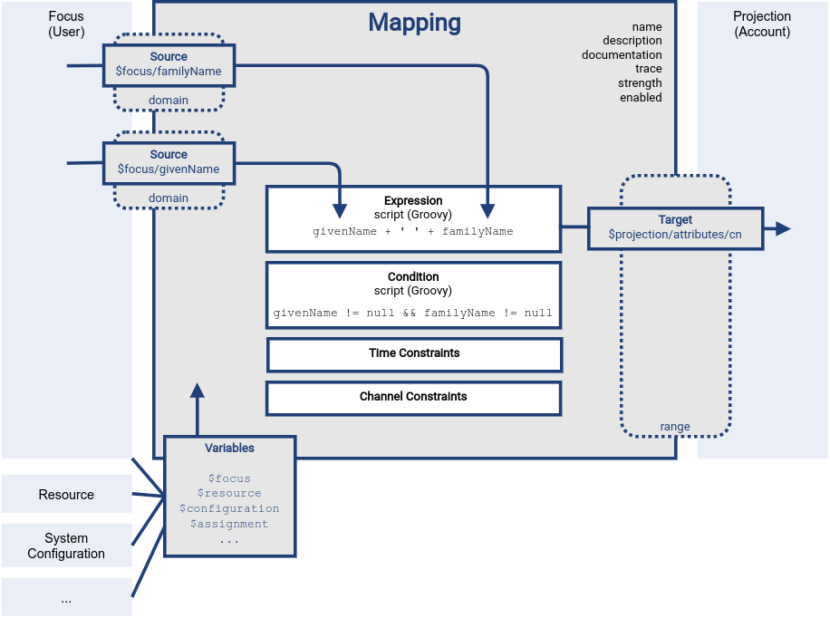

= Mappings
:page-wiki-name: Mapping
:page-wiki-id: 5931015
:page-wiki-metadata-create-user: semancik
:page-wiki-metadata-create-date: 2012-09-18T11:01:45.947+02:00
:page-wiki-metadata-modify-user: semancik
:page-wiki-metadata-modify-date: 2020-11-18T15:35:10.215+01:00
:page-display-order: 70
:page-upkeep-status: red
:page-toc: top

== Introduction

_Mapping_ is a mechanism that is used at many places through midPoint to map value of a source property (or properties) to a target property.
It is a very flexible mechanism that allows to use expressions (including scripting), direct variable references, value generators and other _evaluators_ for the value.
It is used for example in xref:/midpoint/reference/expressions/mappings/outbound-mapping/[outbound mapping], xref:/midpoint/reference/expressions/mappings/inbound-mapping/[inbound mapping], xref:/midpoint/reference/roles-policies/assignment/[assignments], xref:/midpoint/reference/roles-policies/rbac/[roles] and so on.

.Reference documentation
NOTE: This is a reference documentation, explaining all the details and complexities.
It is intended for engineers with some experience with midPoint and mappings.
This documentation is meant to explain all the principles of midPoint mappings, leading to deeper understanding.
This documentation may not be suitable for beginners.
xref:/book[MidPoint book] may be a good starting point instead.

== Basic Structure

Mapping consists of five basic parts:

* *Name* defines unique name of mapping. Name (with other additional attributes) is used in metadata to uniquely identify values emitted by this mapping. See xref:/midpoint/reference/concepts/metadata/[Metadata] page about details. This value should not be changed. (See <<Renaming a Mapping>> chapter if name needs to be changed.)

* *Source* part defines the data sources of the mapping.
These are usually understood as mapping input.
Source defines where mapping gets its data from.

* *Expression*, *condition* control data transformation.
This part controls the way data are transformed or generated.
This is usually the most flexible part of the mapping, employing short scripts.
There is a broad variety of possibilities that are described in the xref:/midpoint/reference/expressions/expressions/[Expression] page.

* *Condition*, *constraints* and some other settings control data flow.
This part influences whether the data will flow at all, when they will flow, at what time, under which conditions.

* *Target* part defines what to do with the results of the mapping, where the computed values should go.
This part also controls how the mapping output should be used in relation to other values.

The basic parts of the mapping as well as the basic principle is illustrated in the following figure:

The figure shows a mapping that takes `givenName` and `familyName` values from user to compute a `cn` attribute of an account.

The mapping is using a Groovy expression to concatenate the two values with a space in the middle.
There is also a condition that makes sure the mapping is applied only if it has meaningful inputs.

The mapping is represented in the XML/JSON form as follows:

[source,xml]
----
<mapping>
    <name>givenName-familyName-to-cn</name>
    <source>
        <path>$focus/givenName</path>
    </source>
    <source>
        <path>$focus/familyName</path>
    </source>
    <expression>
        
    </expression>
    <condition>
        
    </condition>
    <target>
        <path>$projection/attributes/cn</path>
    </target>
</mapping>
----

[source,json]
----
{
    "mapping" : {
        "name" : "givenName-familyName-to-cn",
        "source" : [
            {
                "path" : "$focus/givenName"
            },
            {
                "path" : "$focus/familyName"
            }
        ],
        "expression" : {
            "script" : {
                "code" : "givenName + ' ' + familyName"
            }
        },
        "condition" : {
            "script" : {
                "code" : "givenName != null &amp;&amp; familyName != null"
            }
        },
        "target": {
            "path" : "$projection/attributes/cn"
        }
    }
}
----

Mappings are xref:mapping-relativity/[relativistic], reactive to changes in mapping sources in a smart way.

NOTE: This mapping that takes user's `givenName` and `familyName` to produce `cn` of an account should be considered only an example, an illustration, not a best practice.
Computing `cn` attribute in such a direct way is not a good idea.
In most cases, `givenName` and `familyName` should be used to compute user's `fullName`, which should be a used as a source for `cn` mapping.

== Sources

Sources form primary inputs for a mapping.
Mapping source definitions point to data items that the mapping works with.
The mapping will react to changes of source data, triggering re-evaluation of the mapping.

The most important part of mapping source definitions is specification of the xref:/midpoint/reference/concepts/item-path/[item path].
The path refers to an item in an object, which is part of xref:/midpoint/reference/concepts/clockwork/clockwork-and-projector/[clockwork/project] computation, which is usually a _focus_ or a _projection_.

.Mapping source definition
[source,xml]
----
<source>
    <path>$focus/familyName</path>
</source>
----

.Mapping source definition
[source,json]
----
{
    "source" : {
        "path" : "$focus/familyName"
    }
}
----

For the mapping to operate correctly, the sources must point to an object appropriate for the clockwork phase in which the mapping is evaluated.
E.g. source of _inbound_ mapping must point to a _projection_, source of _outbound_ mapping must point to a focus.
The appropriate object is usually set up as _default context_ for the mapping, which means that relative item paths should be conveniently used to point to appropriate object:

.Mapping source definition (relative path)
[source,xml]
----
<source>
    <path>familyName</path>
</source>
----

.Mapping source definition (relative path)
[source,json]
----
{
    "source" : {
        "path" : "familyName"
    }
}
----

More details about mapping context is provided below.

=== Relativity of Sources

Mappings are xref:mapping-relativity/[relativistic] in several ways.
Mappings will react to changes in source values, triggering re-evaluation of mappings as needed.
In the above example, the mapping will be re-evaluated if either of the sources change (`givenName` or `familyName`), or in case that full recompute is requested (e.g. in case of full reconciliation).
In case that neither of the sources have changed there is no need to re-evaluate that mapping.

However, midPoint assumes that re-evaluation of mapping is usually cheap, assuming we have all the input data ready.
Therefore, midPoint may re-evaluate the mapping even in case that neither of the sources have changed, as it helps to make sure that the data are still consistent.

Smart reaction to changes is one of the reasons for requiring explicit definition of sources in the mappings.
Without such definitions it is not (realistically) possible to reliably determine how and when the expression should be re-evaluated.

The sources themselves are delta-aware.
The source does not specify the value only, it also specifies previous value, and the way how the value changed (xref:/midpoint/devel/prism/concepts/deltas/[delta]).
This allows mapping to be smart, re-computing only some values.
Even more importantly, source deltas are taken into consideration when mapping is evaluated.
Therefore, mapping can figure out how target value have changed, and apply the changes in a smart way (see xref:mapping-relativity/[]).

Mappings can have several sources, each of the sources can have many values.
All the values of all the sources are taken into consideration when a mapping is evaluated.

=== Source Name

Mapping sources are specified using xref:/midpoint/reference/concepts/item-path/[item path], which may be quite long and complex.
Yet, almost all the scripting languages require simple strings to denote variables, parameters and inputs.
Therefore, each source has assigned a simple name.
The name is derived from the last segment of item path of the source.
Hence a source with path of `$focus/activation/administrativeStatus` will be accessible as `administrativeStatus` in the scripts.
The two sources in the above example are passed to the expression as a variables with names `givenName` and `familyName` respectively.

Automatic derivation of source name usually works well.
However, there is `administrativeStatus` in `$focus/activation/administrativeStatus`, but also on `$focus/assignment/activation/administrativeStatus`.
If both of them are used as two sources of one mapping, one of them has to be renamed.

For that purpose, source definition has one additional element: a name.
The `name` element explicitly specifies the name that the source will take when used as an expression variable:

.Explicit specification of source name
[source,xml]
----
<source>
    <name>lastName</name>
    <path>$focus/familyName</path>
</source>
----

.Explicit specification of source name
[source,json]
----
{
    "source" : {
        "name" : "lastName",
        "path" : "$focus/familyName"
    }
}
----

This source will be accessible under the name `lastName` in the mapping expression.

In some cases, the primary input to an expression is accessible under name `input`.
This approach is applied in cases when there is only a single source for a mapping (by definition), such as _inbound_ mappings applied to a single attribute.
Similar approach is applied to stand-alone expression, where there is no obvious name for expression input.

=== Mapping Domain

The _domain_ of a mapping (in a mathematical sense) is a set of values that are valid inputs of the mapping.
The mapping will operate only on the values that belong to its domain.
Other values will be ignored.
By default, the mapping has unlimited domain: all possible values are processed by the mapping.
The mapping domain can be specified by using a `set` declaration in its source:

.Specification of mapping domain
[source,xml]
----
    <mapping>
        <authoritative>true</authoritative>
        <source>
            <path>organization</path>
            <set>
                <condition>
                    
                </condition>
            </set>
        </source>
        <expression>
            ...
        </expression>
        <target>
            <path>assignment</path>
        </target>
    </mapping>
----

The above mapping will only operate on input values that starts with `AUTO-`.
Other values will be ignored by the mapping.

The domain definition is a very practical mechanism if there are several mappings that work on the same source and/or target, each of the mappings using a different expression.
In this case mapping domains can be set in such a way that they do not overlap, making sure only one of the mapping is processing any particular value.
Domain is also useful if we want to provide output values only for some input values.
This cannot be easily achieved by using mapping condition, as the condition will activate or deactivate entire mapping, it applies to all the values processed by a mapping.
The condition does not work for individual values.

The domain is very useful especially for automatic xref:/midpoint/reference/roles-policies/assignment/[assignment] expressions in xref:/midpoint/reference/expressions/object-template/[object template].

== Target

Mapping target specifies were and how is the output of a mapping used.
Specification of mapping target is much more than a mere assignment of mapping output value to some property.
The target _binds_ output property to the mapping, it indirectly specifies the type of output values, its multiplicity, it may also imply set of valid output values.
The nature of mapping target influences the way how relative changes are processed and how deltas are formed.
Mapping range specified together with the target is a powerful tool to influence other values of target item.
All in all, understanding how mapping is bound to its target is a crucial aspect in understanding how mappings work.

Formally, target definition is very similar to definition of mapping source.
The most important part is _item path_, binding the mapping to the target item.

.Mapping target definition
[source,xml]
----
<target>
    <path>fullName</path>
</target>
----

.Mapping target definition
[source,json]
----
{
    "target" : {
        "path" : "fullName"
    }
}
----

Unlike mapping sources, there can be only one mapping target.

=== Mapping Range

The _range_ of a mapping (in a mathematical sense) is a set of values that are considered to be valid outputs of the mapping.
Definition of mapping range is not important for evaluation of mapping expression.
However, it is important for application of mapping outputs.

The mapping is considered to be authoritative for all values in its range.
If the target item contains values that belong to the mapping range, it is assumed that the values were created by the mapping.
I.e. if the mapping contains any values that belong to the mapping range, and the mapping does not produce such values as its output, the values are removed.

The range defines what are the possible outputs of the mapping.
The xref:/midpoint/reference/concepts/clockwork/clockwork-and-projector/[projector] can use this information to determine what values to remove when the mapping is authoritative.

The range definition does *not* influence mapping inputs or expression.
The range is used when the mapping outputs are processed.

Default range (if no explicit range is specified) are only values emmited by this mapping (as identified by xref:/midpoint/reference/concepts/metadata/#mapping-specification[provenance metadata]). 

Please see xref:range/[] for detailed explanation of mapping range concepts.

== Default Sources and Targets

Mappings are used heavily during midPoint computation (in xref:/midpoint/reference/concepts/clockwork/clockwork-and-projector/[projector]).
Mappings are used in individual stages of computation (such as _inbound_, _object template_, _assignments_ and _outbound_).
In each of the stages, mappings are used slightly differently.
E.g. _inbound_ mapping has account attribute as its input, whereas the _outbound_ mapping has account attribute as its output.
Many mappings have their inputs/outputs fixed.
E.g. outbound mapping can have only a specific projection attribute as its output, the attribute for which is the mapping defined.

Following table summarizes the outputs and inputs for mappings in individual stages of computation.

[%autowidth]
|===
| Stage |  | Object | Variables | Default Context | Examples

.2+| Inbound
| Source (shadow)
| Projection
| N/A +
fixed to projection attribute, presented as `input` variable
| N/A +
fixed to projection attribute
|

| Target
| Focus
| `$focus` +
`$projection`
| `$focus`
| `$focus/givenName` +
`givenName`

.2+| Object template
| Source
| Focus
| `$focus`
| `$focus`
| `$focus/givenName` +
`givenName`

| Target
| Focus
| `$focus`
| `$focus`
| `$focus/givenName` +
`givenName`

.2+| Outbound
| Source
| Focus
| `$focus` +
`$projection`
| `$focus`
| `$focus/givenName` +
`givenName`

| Target
| Projection (shadow)
| N/A +
fixed to projection attribute
| N/A +
fixed to projection attribute
|

|===

== Variables

Variables are secondary inputs to the mapping.
Variables provide information about the _surroundings_ of the mapping, about the environment in which the mapping evaluates.
For example, _inbound_ mapping usually takes information from account attribute on a source system (resource) to produce a value for user property.
The account attribute is mapping source, and the user property is a target.
However, mapping may need to consider other data as well, such as a definition of the resource or global system configuration.
Mapping variables provide such additional information.

Sources behave in a slightly similar way than variables behave, especially in mappings with scripting expressions.
Mapping variables are provided as variables or parameters in the script code, in much the same way as sources are provided.
Variable data may also be delta-aware.
However, there are crucial differences between variables and sources.
Changes in variable values may not trigger mapping re-evaluation and the deltas of variables are not reflected to mapping output in the same way as source deltas are.

Please see xref:../variables/[] page for the details.

== Expression

Expression contains transformation logic.
I.e. expressions are responsible for transforming values of the source into a form appropriate for the target.
Expressions can have many forms, from simple "as is" expression that does not transform the value at all, through direct path expression, fixed value literals and generators to all-powerful scripting expressions.

All expression types work with _variables_ as an input.
Mapping is passing all the _sources_ as expression variables.
The return value of an expression is used as value for the target.

.Efficiency of mapping expressions
WARNING: MidPoint assumes that expressions in the mapping are _very_ efficient.
I.e. execution of an expression is supposed to be _very cheap_ in terms of computational resources and latencies.
Mapping expressions are supposed to be simple value transformation algorithms.
Do not try to do anything expensive in expressions.
Also, do not try to execute anything what would involve a long time, such as executing a network operation.
Expressions are executed often, any computationally-intensive or high-latency operation in an expression would have a severe negative impact on system performance.

Expressions are documented in a dedicated xref:/midpoint/reference/expressions/expressions/[Expression] page.

== Constraints and Condition

The application of a mapping can be affected by using constraints and condition.
These mechanisms can influence when the mapping is applied and when it is not.

=== Constraints

// TODO: constraint vs condition: condition does not turn mapping off, constraints do
// Condition is relative, constraints are (usually) not
// TODO: Q: is this true for time constraints? Can they remove the value?

Constraints limit the use of a mapping only to certain situations.
In a situation specified by the constraint the mapping is applied as usual.
In other situations the mapping will be ignored, the system will pretend that the mapping is not there.

=== Channel Constraints

Channel constraint limits application of a mapping to a specific xref:/midpoint/reference/concepts/channel/[channel].
If the evaluation is done in the context of that channel, the mapping will be applied.
If the channel is different, the system will ignore the mapping.
This constraint is usually used in xref:/midpoint/reference/expressions/mappings/inbound-mapping/[inbound mappings] to limit them to the import channel and therefore use them only for initial import.

.Channel constraint example
[source,xml]
----
<inbound>
    <strength>strong</strength>
    <channel>http://midpoint.evolveum.com/xml/ns/public/provisioning/channels-3#import</channel>
    <expression>
        ...
    </expression>
    ...
</inbound>
----

There are two items that control the channel constraint:

* `channel`: Limits application of this mapping only to specific channel.
If the channel is listed then the mapping will be applied.
If it is not then it will not be applied.
If no channel is specified then no limitations apply and the mapping will be applied for all channels.

* `exceptChannel`: Limits application of this mapping except for channel specified.
If the channel is listed then the mapping will be not applied in this channel.
If it is not then it will be applied.
If no channel is specified then no limitations apply and the mapping will be applied for all channels.

// TODO: more on "turning off" the mapping, this may be unique to this constraint

=== Time Constraints

The presence of a time constraint limits the applicability of a mapping to a specific time.
There are two time constraints: `timeFrom` and `timeTo`.
These limits the applicability of the mapping to a specified time interval.
If the current time is in the interval, the mapping will be applied normally.
If the time is outside the interval then the mapping will not be applied.

The mapping below will be applied only in time interval that starts 10 day after the `disableTimestamp` and ends 3 months after `disableTimestamp`.

.Time-constrained mapping
[source,xml]
----
<mapping>
    <timeFrom>
        <referenceTime>
            <path>activation/disableTimestamp</path>
        </referenceTime>
        <offset>P10D</offset>
    </timeFrom>
    <timeTo>
        <referenceTime>
            <path>activation/disableTimestamp</path>
        </referenceTime>
        <offset>P3M</offset>
    </timeTo>
    <expression>
        <asIs/>
    </expression>
</mapping>
----

The time constraint has two parts:

* `referenceTime` specified the quasi-fixed point in time.
This is a time-wise "base" for the mapping.
The reference time is specified as a path (pointer) to a property that holds the actual timestamp.

* `offset` specifies a time interval relative to the reference time.
It can be positive or negative.
It is specified in link:https://www.w3schools.com/xml/schema_dtypes_date.asp[XSD duration data type format (ISO 8601)]. The offset is applied to the reference time to get a final time.

Any combination of `timeFrom` and `timeTo` can be present in a mapping (none of them, any of them, both of them).

The mapping time constraint are slightly more that just mapping evaluation constraints.
The presence of a time constraint does not only limit the evaluation of a mapping, it also makes sure that the mapping will be re-evaluated at the right time.
MidPoint is using a system of triggers to make sure the mappings for re-evaluation are located quickly and efficiently.
Therefore, it is much better to use a time constraint instead of simple mapping condition.

[TIP]
.Why do we need reference time?
====
Mappings are usually evaluated when a change happens.
It may be tempting to try to use current time of the evaluation as a reference time.
E.g. specifying something like "10 days from _now_".
However, there are cases when the mapping is evaluated or re-evaluated much later, e.g. in case of reconciliation or recomputation.
If we would use the current time of evaluation, the result of evaluation may be different each time we re-evaluate the mapping.
E.g. in the "10 days from now" case the notion of "10 days after" changes each time the mapping is evaluated.
Such approach will set it to 10 days from the current time every time it is re-evaluated.
Therefore, we usually cannot just use the current time of mapping evaluation as a reference.
We want to use something more stable instead.
Enable/disable timestamps which are stored in midPoint repository are usually good candidates.
Even create/modify timestamps from the object metadata may be useful.
Using such values for reference time will make sure the result of the mapping evaluation is consistent even if it is re-evaluated.
====

==== Time Constraint Expressions

The timestamp for the time constraint can be determined by an expression.
E.g. scripting expressions can be used to set the time constraint in a very flexible manner:

[source,xml]
----
    <mapping>
        <timeFrom>
            <expression>
                
            </expression>
        </timeFrom>
        ...
    </mapping>
----

The expression above returns a timestamp that is based on object creation timestamp, delayed by three months and rounded down to the midnight.

If referenceTime specification is used together with expression, the reference time value will be passed to the expression in `referenceTime` variable.
If both expression and offset are used, the offset is applied to the timestamp produced by the expression.
If the expression returns `null` then the time constraint will be considered unsatisfied.
Which is a similar behavior as if reference time was not set.

=== Condition

Mapping condition is a mechanism for easy implementation of mappings that provide _conditional values_.
This means a value that is present when certain condition is _true_, while it is not present if the condition is _false_.
The idea is that mapping _expression_ provides the value, while the _condition_ controls when the value is applied and when it is not.
The condition can be used to set conditional property values, automatically assign roles and so on.

For example a condition may be used in the mapping to apply the mapping only if the input value is non-empty:

[source,xml]
----
<inbound>
    <expression>...</expression>
    <target>...</target>
    <condition>
        
    </condition>
</inbound>
----

The processing of a condition fully supports the relative change model.
Therefore, midPoint considers changes in condition (true-to-false or false-to-true), and will reflect that in a mapping result.
E.g. if a value is generated by a mapping that used to have `true` condition, but the condition changed to `false`, midPoint will remove such value.
Therefore, such conditional mapping is an ideal mechanism to automatically add and remove target values.

[source,xml]
----
<inbound>
    <expression>
        <value>
            <targetRef oid="58f6e350-88d3-11ec-9cf0-8f0fa20c5fc3" type="RoleType"/>
        </value>
    </expression>
    <target>assignment</target>
    <condition>
        
    </condition>
</inbound>
----

The mapping above adds the assignment when `hrJobCode` is `1234` and removes the assignment when the code is changed or removed.
This is a very useful behavior, implemented by a simple condition.
On the other hand, conditions can be quite subtle, and there are often misunderstandings as to the working of conditions and their purpose.

[CAUTION]
Even though this mapping can add the assignment and subsequently remove it, it won't remove the existing assignment unless the condition will switch from `true` to `false`.
If you want this mapping to remove the assignment at all time, set a proper xref:range/[mapping range].

Please see xref:condition/[] page for more details on mapping conditions.

== Examples

Following example provides xref:/midpoint/reference/expressions/mappings/outbound-mapping/[outbound] mapping that is using xref:/midpoint/reference/expressions/expressions/script/[script expression] written in Groovy language.
The expression concatenates two string literals and the value of `name` property from the `focus` variable.
The mapping is _weak_ which means it will only be applied if there is no value already present (it constructs _default_ value).

.Example of outbound mapping
[source,xml]
----
<attribute>
    <ref>icfs:name</ref>
    ...
    <outbound>
        <strength>weak</strength>
        <source>
            <path>$focus/name</path>
        <source>
        <expression>
            
    </expression>
    <target>
        <path>fullName</path>
    </target>
</mapping>
----

// TODO: conditional mapping example

See also xref:/midpoint/reference/expressions/mappings/mapping-evaluation-examples/[Mapping Evaluation Examples] page.

== Mapping State Properties

Mappings can have state properties that are maintained through entire execution of the mappings.
Those properties are shared by all the expressions in the mapping.
The properties can be accessed by the scripts in the mapping:

[source,xml]
----
                <outbound>
                    <source>
                        <path>title</path>
                    </source>
                    <expression>
                        
                    </expression>
                    <target>
                        <set>
                            <condition>
                                
                            </condition>
                        </set>
                    </target>
                </outbound>
----

== Mapping Strength

Strength of the mapping defines how aggressively is the mapping be applied.
The strongest mappings are applied all the time (regardless of the consequences), and the weakest mappings are applied only if nothing else can be applied.
Following table summarizes mapping strengths.

// TODO: does still hold?
// TODO: mention relativity of normal mappings?

[%autowidth,cols="h,1,1,1"]
|===
| Strength | Description | Use in operations | Use in reconciliation

| Strong
| Always applied, regardless of circumstances.
Strong mappings _enforce_ particular values.
| Mapping is always used.
The value from mapping is merged with any other deltas for the same target.
This may cause errors, e.g. if user requested to set a different value that the mapping sets for a single-value attribute.
| The value produced by mapping is required to be present in the target property.
If it is not then reconciliation will add it.

| Normal
| Apply the mapping, unless there is a more specific change.
| Mapping is used unless user requested a more specific change.
E.g. Mapping from user's fullName to an account will be normally used to set account attribute `cn`.
But this mapping will not be applied if the administrator explicitly specifies a different value for the attribute `cn`.
| Mapping is used in reconciliation only if the target attribute does not have any value.
The information whether administrator provided a more specific value is not present during reconciliation.
Therefore the mapping cannot be reliably applied if the attribute already has a value.

| Weak
| Apply the mapping only if there is a no other change on target property and the target property does not have any value.
This mapping strength is used to set initial (default) values for attributes and properties.
| Mapping will *not* be used if the target already has a value or if user has requested any other change.
| Mapping is used in reconciliation only if the target attribute does not have any value.

|===

Unless otherwise specified the default strength of a mapping is `normal`.

NOTE: If you create a mapping in midPoint resource/role wizard, it will be created with strength of `strong` by default.

[TIP]
.Mappings and reconciliation
====
Please note that the only mappings that will reliably overwrite a value during reconciliation are *strong* mappings.
Weak and normal mappings will not overwrite or delete a value.
This may be a slightly surprising behavior of normal mappings, but this is done on purpose.
Normal mappings are based on processing relative changes.
However, during reconciliation there is no change in the source data.
Therefore, there is also no reason to apply normal mappings.

Normal-strength mappings are the default setting in midPoint.
As usual, midPoint has conservative default settings that try to avoid destroying the values on target systems.
This is a good setting when midPoint is deployed, new systems are connected or when midPoint operates in semi-authoritative mode.
But once the midPoint is fully authoritative and the policies are properly defined and tested the mappings are usually switched to `strong` setting.
====

== Other Mapping Options

Mapping options modify the way the mapping is used when constructing properties and attributes.
Options do not influence how the value is computed, e.g. they do not directly influence evaluation of the expressions.
The options may specify that the value is more important that others, that is has to be used as a default, etc.

=== Authoritative

Authoritative flag controls the way how mapping is used to _remove_ values.
It does not influence adding of values.
If mapping is authoritative then it will add value and also remove the value.
If mapping is not authoritative it will only add the value.

Non-authoritative mappings are used if there are several possible sources for a particular value.
E.g. the value may be added by the mapping and also added directly on the resource by system administrator.
In this case midPoint cannot remove the value when the assignment (or role) containing the mapping is removed because the value might have been added manually.
Other settings, such as _tolerance_ may apply on attribute level.

The default value for authoritative flag is `true`.

.Development note
NOTE: Even though there is an overlap with mapping range, we still need this option.
Empty mapping range may avoid deletion of values that are not produced by a mapping.
However, the mapping may still create delete deltas in a "relative" way.
Setting authoritative to false disables that, making sure the mapping will never remove a value.
However, it is not clear how many people are actually using this feature.
This feature was designed in early stages of midPoint development.
We have more sophisticated mechanisms now.
Therefore, it is not clear whether this option is still needed.
Should it be a candidate for deprecation?

=== Enabled

WARNING: This feature is deprecated. Please use mapping lifecycle state set to `draft`, `suspended` or `archive` to disable a mapping instead.

Enabled flag specifies if the mapping is evaluated or not.
Each specified mapping is by default evaluated.
To skip mapping evaluation, _enabled_ flag has to be set to `false`.

Default value is `true`.

=== Lifecycle State

Lifecycle state of the mapping.
Can be used to disable a mapping or during xref:/midpoint/reference/simulation/[simulations].

Default value is `active`.

Check xrefv:/midpoint/reference/support-4.8/concepts/object-lifecycle/[] for details.

=== Exclusive

Exclusive mapping may be applied only as a single mapping for a particular target property.
If an exclusive mapping is applied together with any other mapping it results in an error.

The default value for exclusive flag is `false`.

.Development note
NOTE: Naturally enforced for single-valued items, do we need this also for multi-value?

== Mapping Evaluation

=== Evaluation Order

It is possible to define several mappings that affect single attribute.
For example, one mapping can be defined as inbound mapping in `schemaHandling` of specific resource and another one can be defined separately in object template.
In similar cases, mappings are evaluated in this order:

*inbound mappings => objectTemplate => activation => assignments + roles + outbound mappings => reconciliation*

Which mappings will be applied to specific parameter during mapping evaluation can be easily modified using mapping strength options and mapping conditions.

// TODO: More details
// TODO: Mention dependencies and mapping evaluation chaining

=== Handling Multiple Values

The mapping mechanism is designed to be easy to use both for single-value properties and multi-value properties as sources.
The single-value case is quite straightforward: the (single) value is passed to mapping as an input.
If there is no value then `null` is passed.
The mapping is supposed to produce (single) value.
That value is stored to target item.
If no value or `null` is produced, then it is assumed that the target should have no value.
That is all simple and easy.

However, it all gets much more complex when multiple values are used.
Luckily, most of the complexity is hidden inside midPoint.
The mappings are deliberately designed in such a way that the mapping expression will be invoked for each input value individually.
Therefore, if the input has three values, then the expression will be invoked three times: once for each input value.
The expression is supposed to produce output value - or even more than one output value.
All the output values are collected together.
The collection of output values will be applied to the mapping target.

Therefore, mapping expression still works with single-value input and output - even in the case of multi-value properties.
MidPoint will execute the expression as many times as needed, and process each individual value.
The responsibility of the expression is simply to transform one specific value at a time.

One-to-one value mapping is the usual case both in single-value and multi-value cases.
One input value usually translates to one output value.
No input value usually translates to no output value.
That are the usual cases.
However, midPoint mappings can also handle the unusual cases:

* Non-null input value may be translated to no output value.
In this case, the expression just need to return no value (`null` or empty list).

* One input value may also be translated to several output values.
In that case the expression should return list of values.
MidPoint will process the result and collect the values.

This is all easy to do when expression is evaluated separately for each input value.

However, there is one special case when multiple values have to be transformed to single value or a different number of values.
The usual evaluate-per-input-value approach will not work here.
The _absolute_ evaluation mode can be used in this case.
The absolute evaluation mode means that that list of all values is passed to the expression as input.
In this case the expression is supposed to produce a list of all output values.

NOTE: The description above mostly applies to xref:/midpoint/reference/expressions/expressions/script/[script expressions] that have to process input values one-by-one.
Some expression types can deal with multi-value properties in a very natural way.
Such as `asIs` expressions that simply copy the input to the output regardless of the number of values.
However, even non-script expressions have behavior similar to the mechanism described above.
For example `assignmentTargetSearch` expressions will handle multi-valued input in the same way: it will execute search filter for each value individually, and it will collect the results.

=== Relativity

// Similar description is on the mapping-relativity page.
// However, it is not easy to merge them.
// Maybe it is good that there are two descriptions of the mechanism, as this is much shorter, the other is longer with pictures.

Evaluation of each value separately is a very convenient from a configuration and customization point of view.
However, there is even a much deeper reason for this approach.
Evaluation of each value individually supports midPoint's xref:/midpoint/reference/concepts/relativity/[relativity principle].
This is best explained using an example.
Let's have a mapping that transforms all input values to upper case:

[source,xml]
----
<mapping>
    <source>
        <path>invar</path>
    </source>
    <expression>
        
    </expression>
    <target>
        <path>outvar</path>
    </target>
</mapping>
----

Let's assume that both `invar` and `outvar` are multi-valued.
This is the case when the relativity mechanism is most interesting.

It is all very simple when a new object is created (we have xref:/midpoint/devel/prism/concepts/deltas/["add" delta]).
Everything is new at that point, we know complete state of all the objects and everything is simple.
Therefore, if the input is [ `a`, `b`, `c` ], then the output will be [ `A`, `B`, `C` ].

The things get more interesting when the object is modified (we have xref:/midpoint/devel/prism/concepts/deltas/["modify" delta]).
Let us suppose that value `c` is removed from the input and values `d` and `e` are added to the input.
The mapping still transforms all the values individually.
Therefore the expression will be invoked five times: for both the old and new values.
However, when the expressions are evaluated, midPoint remembers whether the input value was added, removed or whether it stayed the same.
MidPoint then applies the same operation to the value which is the output of an expression.
Therefore:

* Value `a` was not changed in the input.
Therefore, transformed value `A` will be left unchanged in the output.

* Value `b` was not changed in the input.
Therefore, transformed value `B` will be left unchanged in the output.

* Value `c` was removed from the input.
Therefore, transformed value `C` will be removed from the output.

* Value `d` was added to the input.
Therefore, transformed value `D` will be added to the output.

* Value `e` was added to the input.
Therefore, transformed value `E` will be added to the output.

This may seem obvious when we know complete state of all objects, and we are absolutely sure about it.
Unfortunately, that is not always the case.
MidPoint often works with resources that do not support transactions or any kind of locking.
Therefore, what we know for sure is what has been changed (xref:/midpoint/devel/prism/concepts/deltas/[delta]).
However, we are not that sure about the values that are present in target resource when we are about to apply the change (which may be several days later, due to xref:/midpoint/reference/cases/approval/[approval process]).
The good news is that this algorithm works also in these cases.
What the algorithm does is that it transforms the input delta of [-`c`, +`d`, +`e`] to output delta [-`C`, +`D`, +`E`].
This output delta can be applied even to a changed target value.
Let's suppose that there was a change on the target and the target value is now [`X`, `B`, `C`] instead of [`A`, `B`, `C`].
Yet, when the [-`C`, +`D`, +`E`] is applied to the [`X`, `B`, `C`] value, we still get the correct result of [`X`, `B`, `D`, `E`].

Sometimes there is a multi-value property with a large number of values that are changed quite often and where change happens by several asynchronous semi-independent channels.
You may think that a situation like this does not happen very often.
But it does.
In identity management we have a lot of properties that behave exactly like this: groups, privileges, projects, tags, ...

Again, the description above mostly applies to xref:/midpoint/reference/expressions/expressions/script/[script expressions].
Expressions such as `asIs` have natural way how to deal with deltas and no value-by-value transformation is needed.
But again, non-script expressions such as `assignmentTargetSearch` will follow the same relativity principle: the search will get executed even for the removed valued so midPoint will know which assignment has to be removed.

Please see xref:mapping-relativity/[] page for more details.

=== Why are the expressions and conditions evaluated several times?

The short answer is: because of xref:/midpoint/reference/concepts/relativity/[relativity].
The long answer is indeed quite long, and it is perhaps best explained using an example.
Let's have the same mapping as above that transforms lowercase characters to uppercase.
Now consider a situation when invar was changed from `a` to `b`.
Simple thinking would suggest that we need to execute the expression for the input of `b`, which will give us `B` and that's it.
But in the language of relativity a change from `a` to `b` actually means: remove value `a` and add value `b`.
We can denote that as xref:/midpoint/devel/prism/concepts/deltas/[delta] [ -`a`, +`b` ].
Therefore, the expression is invoked twice.
First invocation transforms value `a`, so we know that we have to remove `A` from the output.
Second invocation transforms value `b`, so we know that we have to add value `B` to output.
The result is delta [ -`A`, +`B` ].
This mechanism is designed to work well with multi-value properties (see above), and it often can be optimized for single-value properties.
Some of these optimizations are already implemented in midPoint, some are not (please consider a link:https://evolveum.com/services/[subscription] to make those optimizations complete).
Therefore, midPoint may sometimes evaluate a value just to discard it moments later.
Anyway, the final result should be correct in any case.

Relativity is the reason for multiple execution of expressions, which is perhaps not that difficult to understand.
What often comes as a surprise is that mapping conditions are executed several times too.
There is also a good reason for that, and it is also based in relativity.
Once again it is best to explain using an example.
Let us complicate our mapping a bit by adding a condition:

[source,xml]
----
<mapping>
    <source>
        <path>invar</path>
    </source>
    <source>
        <path>gate</path>
    </source>
    <expression>
        
    </expression>
    <target>
        <path>outvar</path>
    </target>
    <condition>
        
    </condition>
</mapping>
----

Now, the mapping is not supposed to produce any value if property gate does not have value `open`.
Simple thinking would suggest that midPoint will evaluate the condition once, and if the result is false then the mapping is ignored.
That would not work well in all cases.
E.g. if this is an xref:/midpoint/reference/expressions/mappings/outbound-mapping/[outbound mapping] to a tolerant resource attribute.
During the previous operation the inputs were invar=[ `b`, `c` ], gate=`open` and the target property already contained value [ `A` ].
After that operation, the target property has values [ `A`, `B`, `C` ].
Now, what happens if we change gate from `open` to `closed`?
If the mapping would be simply ignored then nothing would change on the resource.
The mapping would behave as if it is not there, therefore there is no output, therefore there is no output delta.
As the target property is tolerant, that would meant that nothing is removed.
However, that is not what we want.
The gate is closed.
The target should not have the values `B` and `C`, should it?

Fortunately, midPoint is smarter than that.
As everything in the midPoint, even mapping conditions are relativistic.
MidPoint knows that the value of gate changed from `open` to `closed`.
Therefore, midPoint executes the condition twice.
The condition is executed once for the old value of the `gate` variable which results in `true` value.
Then the condition is executed for new value of `gate` variable, which results in `false` value.
Therefore, midPoint knows that the condition has just changed from `true` to `false`.
Which means that any values that the expression produces are in fact to be _removed_ from the target.
In case that the value of `invar` is still [ `b`, `c` ], the output of the mapping is delta [ -`B`, -`C` ].
Once that delta is applied to the target property value [ `A`, `B`, `C` ] the result is correct value [ `A` ].

Thanks to the relativity mapping conditions can be used to conditionally add values, but they work equally well for removing values.
This may seem overly complicated at the first sight.
Yet, it has enormous benefits.
For example, this approach allows easy automatic assignment of roles in xref:/midpoint/reference/expressions/object-template/[object template].
In that case the role assignment is the expression, and the condition tells _when_ the role should be assigned.
When that condition becomes `false` then the role is unassigned.
No special mechanism was needed to implement this.
It is all given by the relativistic behavior of mappings.

Please see xref:mapping-relativity/[] page for a detailed explanation of the relativity mechanism.

In fact, this description is a bit simplified.
The real complexity is unleashed when there is a change in both source variables.
So now we have two deltas on the input side of the mapping that are supposed to produce single output delta.
Now imagine that there may be any number of input variables and that midPoint does not really know which of them are used in expression or condition.
We will not confuse the reader with a detailed explanation of the algorithm, and we will refer extremely curious readers to midPoint source code.
The source code is the most precise documentation anyway.

== Mapping Maintenance Tasks

=== Renaming a Mapping

Sometimes there could be a need to rename mapping after it was already in use and midPoint already contains the values emitted by this mapping.

Mappings support processing and modifying values also with old mapping name by specifying `mappingAlias` in mapping, which will contain original name.

The mapping alias will make sure, that also old values will be visible in range for the newly named mapping.

.Original mapping definition
[source, xml]
----
<mapping>
  <name>oldMappingName</name>
  ...
</mapping>
----

.Correctly renamed mapping definition
[source, xml]
----
<mapping>
  <name>newMappingName</name>
  <mappingAlias>oldMappingName<mappingAlias>
----

NOTE: This only works when only mapping name changed. If mapping processing same values was moved to different object template or resource you need to specify `target/set/additionalMappingSpecification` with coordinates of previous location of mapping.

==  See Also

* xref:/midpoint/reference/expressions/[Mappings and Expressions]

* xref:../variables/[]

* xref:condition/[]

* xref:mapping-relativity/[]

* xref:../practices/removing-values/[]

* xref:/midpoint/reference/expressions/mappings/mapping-evaluation-examples/[Mapping Evaluation Examples]
