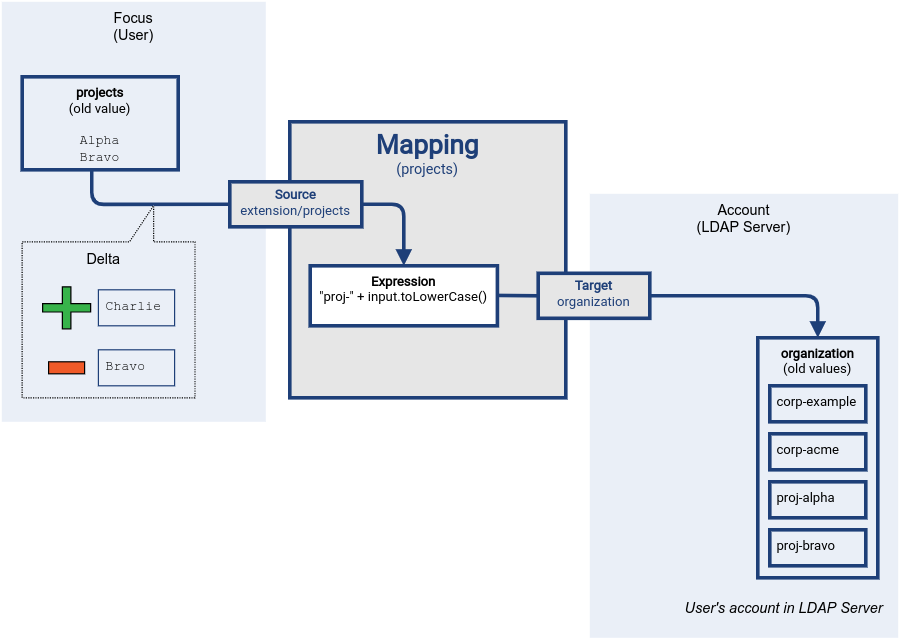

= Mapping Relativity
:page-wiki-name: Mapping Relativity
:page-wiki-id: 11370653
:page-wiki-metadata-create-user: semancik
:page-wiki-metadata-create-date: 2013-07-16T10:16:53.589+02:00
:page-wiki-metadata-modify-user: semancik
:page-wiki-metadata-modify-date: 2019-04-01T13:43:27.766+02:00
:page-upkeep-status: green
:page-toc: top

== Motivation

Mapping inputs are provided by sources and variables, which both are represented as regular variables in mapping expressions.
Every programmer knows what a variable is.
However, variables are usually too simple to handle the xref:/midpoint/reference/concepts/relativity/[relative change model] used in midPoint.
In midPoint we do not just need to know that user property `organization` has a values `foo` and `bar`. What we need to know is that before the operation there was a value of `foo`.
Even more important is to know the currently processed operation is adding the value of `bar`.
Why do we need that?
There are two reasons:

Firstly, the variables may be multi-value and in that case we want to transform each value individually.
E.g. these values may be translated to group names by prefixing them with a fixed strings.
We do not want the expression to implement loops that iterate over all the values.
However, MidPoint knows its schema, it can do the necessary processing.
MidPoint knows that the property is multi-value, and it can implement the iteration once and for all.
It can even implement it more reliably than the average programmer by checking for null values and empty strings and so on.

Secondly, there are no transactions in identity management, and use of hard data locking in integration scenarios makes more problems than it solves.
MidPoint is not relying on any of these mechanisms when interacting with identity resources.
Which means midPoint needs to be very careful with data values.
This is easy to do for single-value properties.
These properties can have at most one value, so whoever comes later overwrites the previous state.
This is usually the expected behavior.
But it is a completely different story for multi-value properties.
We usually do *not* want to overwrite all the values of a multi-value property.
What we usually do is adding and removing individual values.
E.g. adding user to a project, removing from a specific group and so on.
So, if we are adding user to organization `bar`, we want to process that single value, transform it to `org-bar` and use that as a name of the group.
Then we want to add user's account to the `org-bar` group.
But we do not want to disturb other groups that the account may already be a member of.
The account is also a member of group `org-foo`, but it may also be in the group `project-titanic` and  `adhoc-fight-club`.
Maybe the `project-titanic` group is also managed by midPoint.
However, the value may come from a very different mapping, and we will need to merge the results of the two expressions when midPoint determines the final value.
The other expression may be evaluated at all, if no sources of the mapping were changed.
Therefore, we need a way to evaluate each mapping individually.
Then there is the `adhoc-fight-club` group, which is not managed by midPoint at all (remember the first rule of the Fight Club?).
Therefore, if we just compile the list of groups in midPoint and then overwrite the entire list with a set of new values, the `adhoc-fight-club` value would disappear.
I guess this wouldn't go well with the Fight Club members.
Therefore, midPoint needs to know which individual values were changed and how they were transformed, so it can compile the final xref:/midpoint/devel/prism/concepts/deltas/[delta], which can be merged with other deltas produced by other expressions.
Resulting deltas describe value that were added and removed.
When such deltas are applied, the changes will not destroy the existing state of the target system.

Therefore, midPoint has a concept of _mapping source_, which is like a very smart change-sensitive variable.
The source will usually be presented as a simple single-value variable in the expressions.
Even though the underlying property is multi-value, and it has been changed in a very strange way, the expression will process only a single value each time it is evaluated.
MidPoint will do all the complex stuff in the background, processing expression inputs and outputs as necessary.
MidPoint will feed the correct values to the expression.
MidPoint will execute the expression as many times as necessary.
MidPoint will keep track which values are added and which are removed so the expression code does not need to care.
The expression will simply transform each value.
MidPoint will do all the other complex stuff.
This is the functionality of midPoint xref:/midpoint/reference/expressions/mappings/[mappings].

== Relativity Mechanism

// Similar description is on the mapping introduction page.
// However, it is not easy to merge them.
// Maybe it is good that there are two descriptions of the mechanism, the other is much shorter, this one is longer with pictures.

MidPoint mappings are designed to work correctly with the xref:/midpoint/reference/concepts/relativity/[relative change model] that is a fundamental principle of midPoint operation.
Simply speaking the mapping does not just maps the source values to the target values.
It also maps the corresponding deltas.

Let's explain that using an example of project membership management.
User extended property `projects` (`extension/projects`) contains names of projects that a user belongs to.
We need to map that information into LDAP server, specifically an attribute `organization`.
We want all the project names converted to lower case and prefixed with string `proj-`.
Both the source and target properties are multi-valued.
The target LDAP attribute may contain other values as well, values that describe organizational membership that is not related to projects.
The mapping should not change these values.

This can be implemented by a simple outbound mapping for `organization` LDAP property, setting user's property as source, specifying a simple expression to transform the value.

[source,xml]
----
<resource>
    <name>LDAP Server</name>
    ...
    <attribute>
        <ref>ri:organization</ref>
        <outbound>
            <source>
                <path>extension/projects</path>
            </source>
            <expression>
                <code>
                    "proj-" + input.toLowerCase()
                </code>
            </expression>
        </outbound>
    </attribute>
    ...
</resource>
----

The mapping reacts to changes in mapping source.
The source property `projects` contained two values, `Alpha` and `Bravo`.
In this example, new value `Charlie` is added, and existing value `Bravo` is removed.
The setup and initial change is illustrated below.

.Mapping delta processing: initial setup

The mapping reacts to the xref:/midpoint/devel/prism/concepts/deltas/[delta] of the source item.
Mapping expression is used to transform every changed value, computing output value.

.Mapping delta processing: transforming values

Output values that were produced from source values which were _added_ to the source, will be added to the target attribute.
Output values that were produced from source values which were _removed_ to the source, will be removed from the target attribute.
The computed output values are consolidated into a target delta, which is applied by executing an operation on the LDAP server:

.Mapping delta processing: applying delta

This is the basic principle of mapping relativity.
Mapping is processing values that were changed.
The other, unrelated, values of the target attribute (`corp-example` and `corp-acme`) are left untouched.
If we would process the source values in an _absolute_ rather than relative way, we might have removed such values.
Relativistic processing solves that problem.
Also, there is no need for transactions or locking.
As we are processing the changes, several changes to the same target attribute can be processed in parallel (in the usual case).

The description above is considerably simplified.
More details will be provided below.
Yet, even such simplified explanation gives a good overview of the basic principle.

However, such a simple relativity mechanism is not perfect.
There are some drawbacks:

* Target values may be inconsistent, e.g. there may be extra value not known to midPoint.
Perhaps this value was manually set by system administrator by mistake.
Maybe the system was restored from backup, reviving a value that was deleted after the backup was taken.
Or it may be an attacker setting an illegal value.
Simple relativistic add/delete of values will not fix that, as such value does not have corresponding value in mapping source property.
Quite obviously, we have to consider values of a target attribute, at least in some cases.

* One value may be produced by several mappings.
For example, membership in some projects may be managed manually, or information about project membership is compiled from two systems, with some data overlap.
If a value is produced by two mapping, executing one of the mappings in isolation may destroy value, as it may think that the value should be removed, while other mappings may still want to keep it.

// TODO: any other issues?

MidPoint does solve all the issues, at least to some degree.
Simply speaking, midPoint does consider existing values of a target property when it is available.
MidPoint usually executes all the mappings, even those where the source values were not changed, to make sure that all the values from all the mappings are properly merged and considered.
The details are provided below.

== Mapping Source

Mapping source is the fundamental part in mapping relativity mechanism.
Change of mapping source values triggers evaluation of the mapping.
Moreover, the changes of mapping source dictate how many times will be the mapping expression evaluated, and how the evaluation results will be handled.

The source can be defined by the mapping by simply specifying the path of the item which the source should represent:

[source,xml]
----
<outbound>
    <source>
        <path>$focus/organization</path>
    </source>
    ...
----

If the source is specified like this, then it can be used inside an expression just as a simple variable.
Like this:

[source,xml]
----
    ...
    <expression>
        
    </expression>
    ...
----

MidPoint will take care that the variable `organization` will be filled with appropriate value, the the expression will be executed as many times as needed and that the result of the expression will be interpreted in a proper way to maintain the relative change model.
All that the mapping definition needs is proper definition of sources and an expression to transform a single value.

== Scripting Expressions in Mappings

Many expression types used in mappings are built to work with deltas `(asIs` expressions, `path` expressions), and they do it correctly and efficiently.
However, scripting expressions are different.
Scripting languages are not designed to work with deltas.
The variables and return values of scripting languages are usually simple scalar values.
Therefore, we need a little trick to make them work correctly with deltas without sacrificing the simplicity and convenience of traditional scripting approach: Scripting expression is usually evaluated individually for every applicable value.
The value passed to scripting expression is either old or new value of the property or value added or removed by the delta.
The mapping knows which expression input values were added, removed or stayed unchanged, and therefore it can assume the same also for expression output values and construct the resulting delta.
In other words the delta is first decomposed into individual values, then an expression is evaluated for each of these values and then resulting values are composed back to a delta (or rather a _triple_).

.Mapping delta processing: transforming values

This approach may be quite simple for a single mapping source.
But it gets much more complex when changes in multiple mapping sources occur at the same time.
In such a case the input deltas needs to be decomposed into combinations of values from all the deltas and then composed back.
MidPoint mappings fully support this mechanism, even for multiple multi-valued sources.

=== Declaration of Script Expression Sources

For the scripting expression to work correctly the mapping must be able to identify what was changed and which part of the change is important for the script.
E.g. it is not sufficient to know that user properties `fullName`, `familyName` and `employeeType` changed (as represented in xref:/midpoint/devel/prism/concepts/deltas/[object delta]). The mapping must know that only the `fullName` property is important for the script.
Otherwise the mapping would need to combine all the changes from all the applicable deltas and execute the script for all the applicable combinations.
The number of possible combinations can be very large if multiple multi-value properties change.
As the script only cares about the value of `fullName` attribute, then most of such executions will be pointless anyway and the results would be discarded.
Which is obviously a waste of resources.
Yet, the mapping does not know which script executions to discard until it has the return value - unless there is way to specify that only the `fullName` property is interesting for the script.
There is no generic implicit way how to do it with a scripting language code that will work sufficiently well for all supported scripting languages.
Therefore, an explicit method is needed: mapping `source` definition.

The `source` definition tells the mapping that only a specific properties are interesting for the mapping.
Therefore, the script evaluation code in the mapping knows how to efficiently construct input values for the script, when to evaluate it and, most importantly, when there is no need to evaluate it.
Therefore, correct specification of `source` in a mapping that contains a scripting expression is critical for correct evaluation of such expression.
If a `source` declaration is missing then a script may not be invoked at all and will not pass a value to the output.
If too many `source` declarations are present for a script then the script may be invoked too often which might result in waste of system resources.

=== Expression null Values

Mappings usually work only with non-null values.
The mapping simply ignores all properties and deltas without a value.
Therefore, a script will usually not be executed if all its input values would be set to `null`.
However, there are two cases when mapping needs to deal with `null` or empty values:

* when a change causes empty property to become non-empty,

* when a change causes non-empty values to become empty.

E.g. these cases need to be handled for scripts that supply a default values for empty properties.
In this case the script must be executed with a `null` input parameter, otherwise the script would not have any chance to produce a value.
Similar reasoning also applies to mapping conditions that checks for "negative" cases.
E.g. a condition that will assign a default role if no other role is assigned to a user.

Such script needs to check for `null` input values to be able to correctly respond to all situations.
However, always passing `null` values to a script may make scripting code ugly and complex, littered with checks for `null` inputs.
Therefore, there is a way to avoid invoking script with `null` inputs:

.Avoid passing `null` values to script
[source,xml]
----
<mapping>
    ...
    <expression>
        
    </expression>
</mapping>
----

Please note that this setting will skip execution of a script if *all* its inputs are null.
This means that the script will be executed with non-null values only in case there is a single mapping source.
If there are several mapping sources then the script still may get executed with `null` inputs, e.g. in case that one source is `null` while the others are non-null.
In such a case, this setting will make the script execution more efficient (skipping some executions) however proper checking for null values is still needed.

There is also a convenient xref:/midpoint/reference/expressions/expressions/script/functions/[script function]`basic.isEmpty()` that can provide null-safe check for empty value:

.Null-safe check for empty value
[source,xml]
----
<mapping>
    ...
    <condition>
        
    </condition>
</mapping>
----

=== Absolute Script Execution Mode

Relative evaluation mode of an expression as described above is the default behavior of mappings because it works well in most cases.
However, there may be cases when we need to process all the values and output a new set of values.
This may be needed because the values depend on each other, because we want to select just one of several values to map multi-value input to a single-value output or for other exotic cases.
In cases like this the mapping may be switched to _absolute_ mode:

[source,xml]
----
<inbound>
    <expression>
        
    </expression>
    <target>
        <path>name</path>
    </target>
</inbound>
----

The `determineLdapSingleAttributeValue()` function above accepts a list of all LDAP attribute values as an input.
It will then select only one value and return that as an output.
This approach can be used to reduce typical LDAP multi-value attributes to a single-value midPoint properties.

== Relativity of Mapping Condition

Mapping conditions are also _relative_.
This means that the condition is not evaluated for simple `true` or `false` value.
MidPoint is watching how the condition value _changes_.
When mapping condition changes from `false` to `true`, the values produced by mapping are added.
When condition changes from `true` to `false`, the values are removed.

Please see xref:../condition/[] page for the details.

== Delta Set Triples

Mapping output is used to create output deltas, which are applied to output properties in the final steps of xref:/midpoint/reference/concepts/clockwork/clockwork-and-projector/[clockwork processing].
However, mapping output is not used to create deltas directly.
There is one quite important intermediary step.
Output of mappings that target the same property has to be merged, before the deltas can be created.
It would not be easy to merge the deltas, as deltas do not have complete information.
For example, deltas do not contain information about the data that were not changed.
Therefore, there is a special-purpose data structure in midPoint called _delta set triple_, or just _triple_ for short.

The triple is relatively simple data structure.
It contains three sets (hence the name):

* *Plus set*: set of values that should be added.

* *Zero set*: set of values that are unchanged.

* *Minus set*: set of values that should be removed.

Every midPoint mapping produces its output as a _triple_.
The values that originated from _add_ part of the input delta usually end up in _plus_ set of the triple, the values that originated from _delete_ part of the delta usually end up in _minus_ part of the triple, and the original values of the source that were unchanged usually end up in _zero_ part of the triple.
However, this can behaviour can be influenced by several factors, for example by the evaluation of mapping condition.

Processing of a scripting expression into a triple is illustrated in following diagram:

.Constructing delta set triple

Each mapping can produce the triples individually, without any regard for other mappings (except for _chaining_ of mapping evaluation due to dependencies on sources).
Once all the triples are obtained, they can be merged to produce a delta:

.Merging delta set triples

Merging of triples is much easier than merging deltas.
All values from all _plus_ sets can be used as an _add_ part of resulting deltas.
However, the _minus_ set has to be treated differently.
Only the values of the _minus_ set that are not part of any _plus_ or _zero_ set can be used for _delete_ values of resulting deltas.
We do not want to remove a value that is added or marked to be kept by any other mapping.

The _zero_ set of the triple is not used to produce the delta, not in a direct way.
The _zero_ set values are there mostly to make sure that "legal" values will not be removed.
The purpose of the _zero_ set is not meant to remove any excessive values that the target attribute might have.
That is a responsibility of xref:../range/[range].
The _zero_ set is there to keep mapping execution correct.

The process of producing target deltas is called _consolidation_.
Merging of triples is the core of the process, however there are additional steps.
E.g. values of target item are considered (if available) to avoid redundant deltas.
Merging of the triples may be a complex process on its own.
For example, a _zero_ set produced by a mapping in a role that was just assigned has to be handled in a similar way than a _plus_ set.
Even though the mapping is not indicating the value as new, the mapping itself is new, therefore the value has to be added (if not already present).
This means that there are often _triples of triples_ in xref:/midpoint/reference/concepts/clockwork/clockwork-and-projector/[projector computation].
E.g. the outer triple indicates which assignments were added, removed or left unchanged.
The inner triple contains results of mappings in that assignment.

== Existing Values of Target Item

Theoretically, mapping deals only with input data in a form of _sources_ and _variables_.
This data should be sufficient to produce output _triple_ of the mapping.
However, existing values of of target item are important for the process of triple _consolidation_ to produce deltas:

* Filtering out redundant changes.
Consolidation process will remove values from _add_ part of the deltas, for the values that already exist in target items.
Similarly, values that are not present in target item are removed from _delete_ part of the delta.
This may result in an empty delta, in which case the delta is not executed at all.

* Applying xref:../range/[mapping range].
Mapping may need to remove values that are not present in the _minus_ set of the triple.
Any existing values of the target items that are not part present in either _zero_ or _plus_ set of the triple has to be removed.

As a principle, existing values of target property are processed by xref:/midpoint/reference/concepts/clockwork/clockwork-and-projector/[projector] only if they are available, only if they were already fetched.
In that case processing of the values is very cheap, and there is no significant obstacle to process them.
However, there are few cases when read of the target value is forced:

* The item is target of _strong_ mapping.
Strong mappings are supposed to make sure that specified values are set.
Therefore the existing values need to be retrieved, to make sure that all values from the _zero_ set are present, and that all values in mapping range are properly removed.

* The item is target of _weak_ mapping.
Weak mappings are to be activated only if target item contains no value.
We need to know whether the target has a value in order to make this decision.

* Reconciliation was explicitly requested.
MidPoint reads the existing values in order to compare them.

== Limitations

While midPoint is built with xref:/midpoint/reference/concepts/relativity/[Relativity] in mind, this relativity is not complete.
MidPoint evolution, and especially financial and scheduling constraints, forced us to make compromises during midPoint development.
This does not affect correctness of midPoint computation, but it may affect performance.
The deployments that rely on a lightweight processing of large number of small changes may be affected.
Please see xref:/midpoint/features/planned/complete-relativity/[Complete Relativity] page for more details.

Currently, midPoint is executing all mappings.
There are several reasons:

* Making sure all output values are properly merged.
The reason is to make sure _zero_ set of all the mappings is properly processed, avoiding removal of "legal" value produced by one mapping by another mapping.
This is means that the processing of mappings is not very "relativistic", as all the mappings are executed all the time.
This can change, once we have full provenance information - at least for inbound and object template mappings.
For outbound case, we have no place to record the provenance, unless we are going for (almost) full caching in shadow.
This is something to consider.

* Implementation simplicity.
All the mappings are executed, even in cases where the results are discarded later (e.g. due to condition being false).
It is easier to implement the system in this way.
The execution of a mapping is usually very cheap, therefore there was not much motivation to optimize mapping execution.

See also xref:../proposed-improvements/[].

== See Also

* xref:/midpoint/reference/concepts/relativity/[Relativity]

* xref:../condition/[]

* xref:/midpoint/reference/expressions/[Mappings and Expressions]

* xref:/midpoint/features/planned/complete-relativity/[Complete Relativity]
