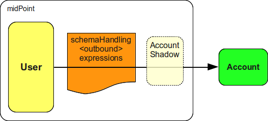

= Outbound Mapping
:page-display-order: 550
:page-wiki-name: Outbound Mapping
:page-wiki-id: 4423965
:page-wiki-metadata-create-user: semancik
:page-wiki-metadata-create-date: 2012-06-07T10:41:15.785+02:00
:page-wiki-metadata-modify-user: semancik
:page-wiki-metadata-modify-date: 2017-07-13T15:02:00.069+02:00
:page-upkeep-status: orange

Outbound mapping define how the data are xref:/midpoint/reference/synchronization/introduction/[synchronized] from the user to accounts or, in other words, when the data *out* of midPoint.
See xref:/midpoint/reference/synchronization/examples/[Synchronization Examples] for a generic explanation of the synchronization mechanism.

Outbound expressions are defined in the xref:/midpoint/reference/resources/resource-configuration/schema-handling/[schema handling] section of resource definition.
The expression definition is inside attribute definition which is inside account type definition:

[source,xml]
----
<resource>
  ...
  <schemaHandling>
    ...
    <objectType>
      ...
      <attribute>
        ...
        <outbound>
          <initial>true</initial>
          <expression>
            <code>
              concat('uid=', $c:focus/c:name, ',ou=people,dc=example,dc=com')
            </code>
          </expression>
        </outbound>
        ...
      </attribute>
      ...
    </objectType>
    ...
  </schemaHandling>
  ...
</resource>

----

== Variables

Outbound expressions usually take variables from the system variables provided by midPoint when the expression is evaluated.
Following table summarizes the variables available to outbound expressions.

[%autowidth]
|===
| Variable name | Type | Description

| `focus` +
_root node_
| Subclasses of FocusType
| Represents xref:/midpoint/reference/schema/focus-and-projections/[focal object] which is typically a user.
This is the most common source of data for outbound expressions.

| `iteration`
| integer
| Numeric value describing the current iteration.
It starts with `0` and increments on every iteration.
Iterations are used to find unique values for an account, to resolve naming conflicts, etc.

| `iterationToken`
| string
| String value describing the current iteration.
It is usually suffix that is appended to the username or a similar "extension" of the value.
It should have different value for every iteration.
The actual value is determined by the iteration settings.

|===

//== Examples
//
//TODO

== See Also

* xref:/midpoint/reference/synchronization/examples/[Synchronization Examples]

* xref:/midpoint/reference/resources/resource-configuration/schema-handling/[Resource Schema Handling]

* xref:/midpoint/reference/expressions/mappings/[Mapping]

* xref:/midpoint/reference/expressions/mappings/mapping-evaluation-examples/[Mapping Evaluation Examples]

* xref:/midpoint/reference/expressions/mappings/inbound-mapping/[Inbound Mapping]

* xref:/midpoint/reference/concepts/iteration/unique-account-username/[Unique Account Username HOWTO]
