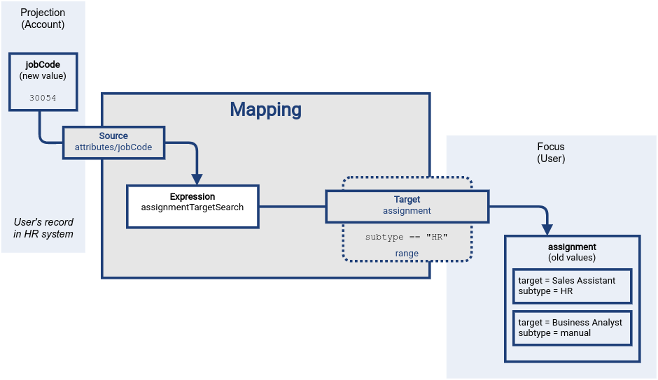
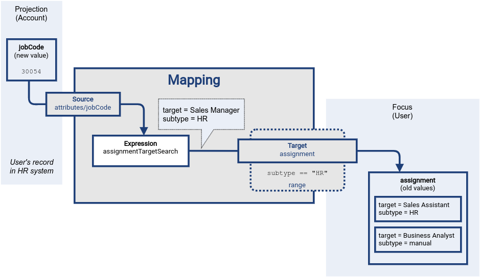
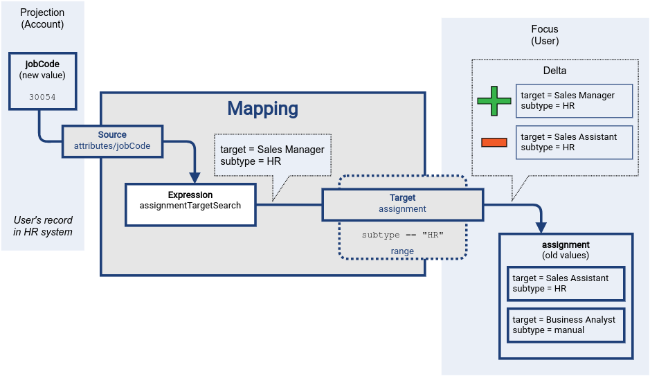
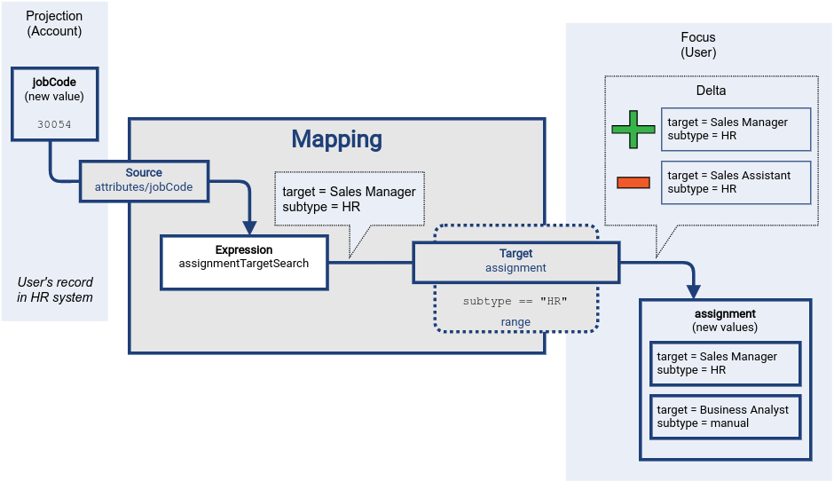
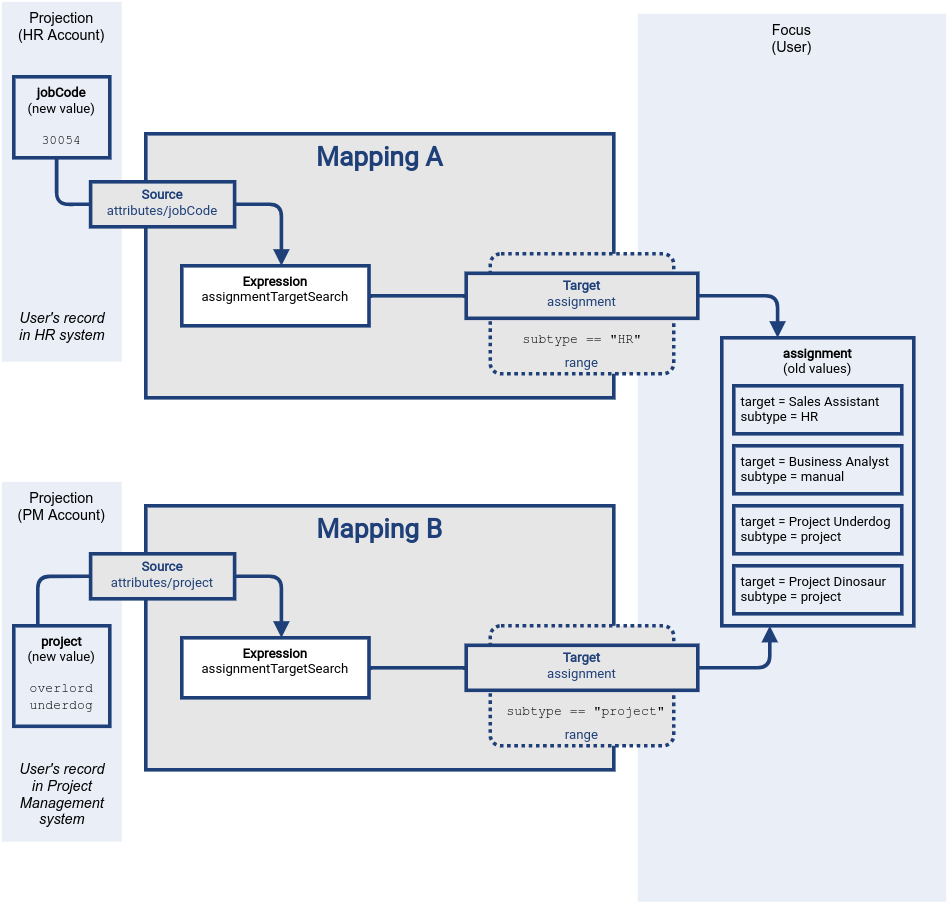
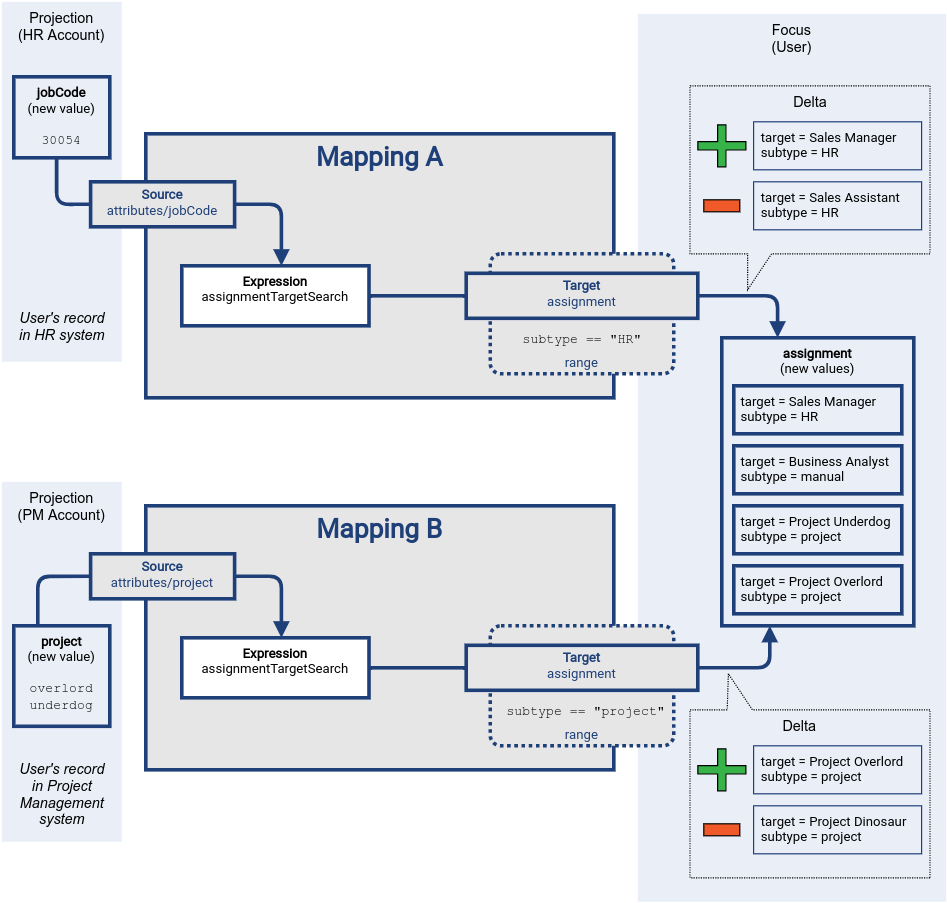
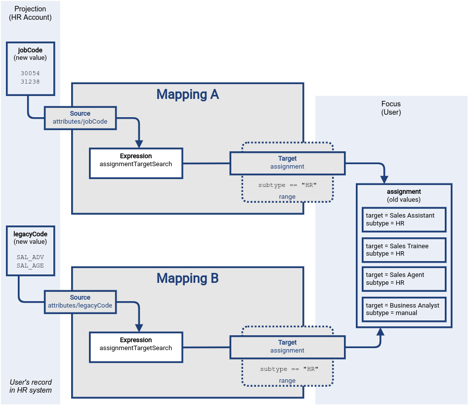
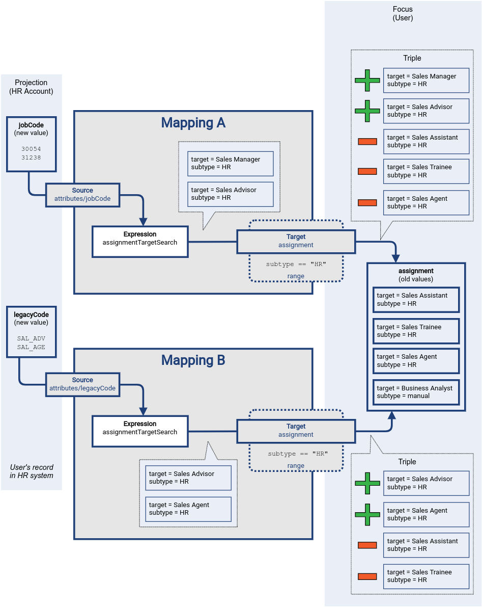
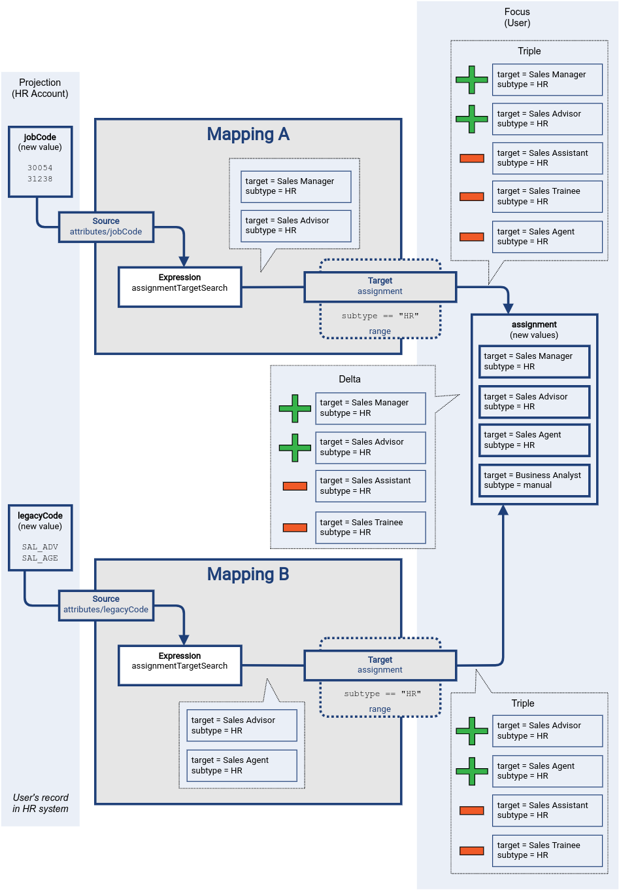

= Custom Mapping Ranges
:page-upkeep-status: green

The range defines what are the possible outputs of the mapping.
The xref:/midpoint/reference/concepts/clockwork/clockwork-and-projector/[projector] can use this information to determine what values to remove when the mapping is authoritative.

Custom mapping range specification can be created by using a condition:

[source,xml]
----
<mapping>
    <expression>
        ...
    </expression>
    <target>
        <set>
            <condition>
                
            </condition>
        </set>
    </target>
----

Above mapping is an assignment mapping, target of the mapping is an `assignment` container.
The range definition specifies that the mapping is authoritative for all assignments where target relation is _manager_.
Therefore, if there is any manager assignment that is not result of this mapping then midPoint knows that such assignment may be removed.

NOTE: The text below and examples were written before `matchingProvenance` range specification was put into production use and become default for multivalue properties and assignments.
It is still 100% valid, but the same functionality could be easily attained via the use of default range.

== Single Mapping

The usual way for automatic assignment of roles is use of xref:/midpoint/reference/expressions/mappings/inbound-mapping/[inbound mapping] with xref:/midpoint/reference/expressions/expressions/#assignment-target-search[assignmentTargetSearch] expression evaluator.
The mapping takes `jobCode` attribute from the HR system.
It transforms the `jobCode` to an assignment of midPoint role using the `assignmentTargetSearch` expression.
The new assignment value is then stored in user's `assignment` container, thus assigning the role.

However, the `assignment` container is multi-valued.
There are roles that are automatically assigned by an HR system.
There may also be other roles, assigned manually or assigned by other mappings.
We do not want the HR inbound mapping to destroy such role assignments.
We want the HR mapping to manage only the role assignments that originated from HR.

Mapping _range_ is an ideal tool to achieve that.
Firstly, the HR mapping marks all the assignments in some way, so it can recognize them later.
There is a very useful `subtype` property in the `assignment` container, which is designed especially for this purpose.
The HR mapping will produce all the assignment values with the `subtype` property set to `HR`.
Secondly, the mapping specifies its range as all the assignments that have `subtype` equal to `HR`.
Therefore the mapping will manage only the assignments of the `HR` subtype, leaving all other assignment values untouched.

Let us illustrate this approach on an example.
An employee is promoted from sales assistant to sales manager.
Before the promotion, the employee has `jobCode` attribute in the HR system set to value `30002` which corresponds to sales assistant job.
As the employee got promoted, the `jobCode` attribute has changed to `30054`, which corresponds to sales manager.
MidPoint detects the change and executes inbound mapping designed to automatically assign HR roles.
Following diagram illustrates the situation at the beginning of mapping evaluation.
The data in the source (HR) system is already changed, the expression was not evaluated yet, and the target data still have the original (old) value.

Evaluation of the mapping begins.
Source definitions are processed, and mapping expression is evaluated.
The `assignmentTargetSearch` expression looks through midPoint repository for a role that corresponds to job code `30054`.
The expression finds `Sales Manager` role, creates an assignment for that role, and makes sure the assignment subtype is set to `HR`.
This value was just produced by the mapping expression.
It is not stored anywhere yet.
User's `assignment` container still contains old values.

At this point midPoint has results of mapping expressions, and it is trying to figure out the way to properly and consistently apply results of all the mappings.
MidPoint has to construct a xref:/midpoint/devel/prism/concepts/deltas/[delta] that will later be applied to the user object.
Mapping expression has produced an assignment of `Sales Manager` role.
The expression has produced that value as a reaction to new value of `jobCode` attribute in HR system, therefore the new assignment is added to a _plus_ part of the delta.
This value will be added to user's `assignment` container when the delta is applied at the end of processing.

Then it is the time to evaluate mapping range.
Mapping range is applied to original (old) values of user's assignments.
There are two values.
One of the values has subtype set to `manual`, therefore it clearly does not belong to mapping range.
This value is left untouched.
The other value has subtype `HR`, therefore it does belong to mapping range.
This value is processed by the mapping.
MidPoint logic compares it to values produced by mapping expression, realizing that this assignment of `Sales Assistant` role was *not* produced by the expression.
Therefore, this value is removed.
It is placed to _minus_ part of the delta, dooming the value for removal.

TIP: Strictly speaking, the values are not stored in _plus_ and _minus_ part of the deltas yet, as the deltas are not yet constructed.
The values are places in _plus_ and _minus_ parts of a data structure that we call _a triple_.
It has _plus_, _zero_ and _minus_ parts, and it is used as an intermediary data structure to merge results of several mappings.
However, we have only one mapping here, therefore we can ignore such details for now.

The results of mapping expression are _consolidated_ at this point.
Data from all the mappings are considered and merged.
The deltas are all computed and ready to use.
All that remains it to apply them to user object.

The assignment of HR role `Sales Assistant` was replaced by assignment of `Sales Manager` role, all other assignments were left untouched.

== Multiple Mappings

Mapping range is usually applied if there is a need for several information sources to coexist.
This may be a case of one mapping doing the automation, while still allowing for manual adjustments of data.
However, the other common case is coexistence of several mappings, producing values targeted to the same item.

As with any other set of mapping that target the same item, the results of both mappings are merged.
What makes this situation special is removal of existing values of the target item.

Let us illustrate that using an example of two mappings, both targeted for `assignment` container.
The first mapping is the HR mapping used in the previous section.
The other is a mapping from a project management system.
Its purpose is automatic management membership in project teams.
Authoritative information about project teams is stored in the project management system.
The `project` attribute of user accounts contains a multi-valued list of project identifiers that a user belongs to.
The mapping is processing the values of `project` attribute, creating assignments to appropriate xref:/midpoint/reference/org/[orgs].

Both mappings are evaluated almost independently, producing values for their respective sources.
As in the usual case, the _plus_ part of the detlas (or _triples_) is produced by mapping expressions.
The _minus_ values in deltas are what makes this case interesting.
Each of the mapping is applying its range, looking for values to remove.
The `Sales Assistant` value is removed by the HR mapping, the `Project Dinosaur` is removed by the project management system mapping.

Finally, the deltas are applied to the target values.
Even though the deltas target the same item (`assignment`), the value sets are disjoint.
There are no conflicts, everything goes smoothly.

TIP: When constructing mappings that target the same item, the best strategy is to make sure that the mappings do not "overlap".
I.e. make sure only one mapping is used to produce any particular value at any time.
This can be achieved by mapping constraints (channel, time), use of mapping condition or range.
For mappings that target multi-valued items, the best way to make sure the mappings do not overlap it so specify mapping ranges that do not overlap.
Specifically for mappings that target `assignment` container, use of assignment subtype is strongly recommended.

== Overlapping Ranges

Mapping ranges can, in theory, overlap.
This is a case of two or more mappings for the same target item, with range definitions constructed in such a way, that some values are part of ranges of more than one mapping.

WARNING: Mapping with overlapping ranges create a lot of problems unless an utmost care is taken.
Therefore, it is *strongly recommended to avoid using mappings with overlapping ranges*, unless you are completely aware of all the circumstances and consequences of such configuration.

Despite that, there is very little special behavior when it comes to mappings with overlapping ranges.
The mappings behave in much the same way as mapping with non-overlapping ranges, which quite paradoxically, can be a source of problems.

Once again let us illustrate mapping evaluation using an example.
In this case we have two mappings, both of them are _inbound_ mappings, mapping data from the HR resource.
There is the `jobCode` attribute that have seen before.
There is also a `legacyCode` attribute, that has almost the same function as `jobCode`, but it is using legacy job codes.
The HR department is in a process to migrate all systems from the old legacy codes to a new codes.
However, this process takes years and years, with no end in sight.
Therefore, both `jobCode` and `legacyCode` has to work at the same time.
Some jobs have both the new code and old code.
New codes are continually introduced, while the legacy codes are slowly removed - without any notice.
Therefore, the best strategy is to set up an algorithm that can work with both codes at the same time.
This is one of the rare cases when use of mappings with overlapping ranges is appropriate.

The configuration contains the _inbound_ mapping of `jobCode` attribute to `assignment` container.
There is also a similar mapping that maps `legacyCode` attribute to the same `assignment` container, even setting the same `subtype` value.
Both mappings are specifying the same range, overlapping completely.

The figure below illustrates the case when the user is promoted from _sales assistant_ to _sales manager_.
However, the job codes are much more messy this time, compared to the previous cases.
Firstly, the _sales manager_ job is also associated with _sales advisor_ job code, both assigned at the same time.
The _sales manager_ job code is using a new coding scheme, using job code of `30054`.
The _sales advisor_ is a quasi-legacy concept, represent both by a new job code of `31238` and legacy code of `SAL_ADV`.
In addition to that, the user also has a part-time engagement as _sales agent_, which is represented by legacy code of `SAL_AGE`.
Finally, the old job of _sales assistant_ was accompanied by _sales trainee_ role, which is to be removed during this promotion.

Once again, the mappings start semi-independently, each of the expression creating appropriate assignment values, each of the mappings evaluating its own range.
The result of the evaluation of each mapping is a _triple_, containing three sets of values: values to be added (_plus_ set), values that remain unchanged (_zero_ set) and set of values to be removed (_minus_ set).
The _triple_ is an intermediary computation result used for all the mappings.
It is usually completely hidden from the sight.
However, in this case, the triple are important.

In this case, there is an overlap in the triples regarding the `Sales Agent` role assignment.
Triple produced by mapping A indicates that this value should be removed (_minus_), while the triple produced by mapping B indicates that the value should be added.
This is one of the reasons for computing the _triples_ first, before constructing final deltas.
Having the triples, it is easy to see that the `Sales Agent` role assignment should not be removed, as it is a valid result of mapping B.

Once we have all the triples from all the mappings, we can _consolidate_ them into deltas.
The resulting delta leaves the `Sales Agent` value unchanged.
Also, the `Business Analyst` role assignment is unchanged, as it is not part of range of any of the mappings.

Finally, the delta is applied to the target container.

This approach works, because the two mappings are both _inbound_ mappings for the same resource.
Therefore, it is pretty much guaranteed that both of them will be evaluated at the same time.
This fact is crucial for correctness of mappings with overlapping ranges.
If mapping A would be evaluated in isolation, it would remove the `Sales Agent` role assignment, leading to incorrect result.

When using mappings with overlapping ranges, *it is absolutely crucial to make sure all the mappings are evaluated together*.
Two inbound mappings for the same resource will work, as they are evaluated together.
Inbound mappings for _different_ resources are *not* guaranteed to work, as there may be a reconciliation process that is limited to one of the resources, not evaluating the other mapping.
An inbound mapping and object template mapping with overlapping ranges will *not* work either.
Such mappings are evaluated in different phases of xref:/midpoint/reference/concepts/clockwork/clockwork-and-projector/[projector computation], which may lead to incorrect results.
Moreover, user may be recomputed without re-evaluating inbound mappings.
Simply speaking, it is not straightforward to determine whether evaluation of mappings with overlapping changes is safe or note safe.

As a general rule of the thumb, only following cases should be considered safe:

* Inbound mappings for the same resource.

* Object template mappings, with the same evaluation phase.

Obviously, the mapping must have appropriate constraints (channel, time, etc.), to make sure that the mappings are evaluated correctly.
In practice, this usually means having exactly the same constraints.

Even more general (and simpler) rule of the thumb is to avoid use of mappings with overlapping changes if it can be avoided.

.Overlapping authoritative mappings
NOTE: Several mappings with `all` range definition also creates an overlapping range situation.
The `all` pre-defined range is often used to specify a fully authoritative mapping, a mapping that is the sole source of all values for target property.
It is perhaps quite intuitive that there cannot be more than one fully authoritative source for any particular target.

== Notes

The range definition does *not* influence mapping inputs or expression.
The range is used when the mapping outputs are processed.

Range specification makes sense only for authoritative mappings.
If the range is specified then the mapping will scan existing values of the target property.
It will look for values that are there and that are also in the range of the mapping.
If such values are not in the expression results, then such values will be removed (placed in the minus set).

In the explanations and examples above, we are somehow neglecting xref:../mapping-relativity/[relativity of mappings].
In fact, the entire mechanisms of _mapping range_ is designed especially for the cases where _mapping relativity_ does not work.
Such as situations where we know the new state of an account, without knowing how it has changed.
The examples above are illustrating such cases.
However, in real world case the relativity and the range mechanisms work together.
Therefore, in reality, many of the values indicated as belonging to the _plus_ set will be probably in the _zero_ set instead.
However, this is not a significant difference for the purpose of this explanation.

== See Also

* xref:/midpoint/reference/expressions/mappings/[]

* xref:../../practices/removing-values/[]