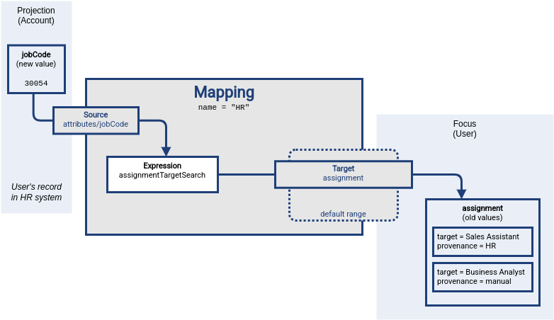
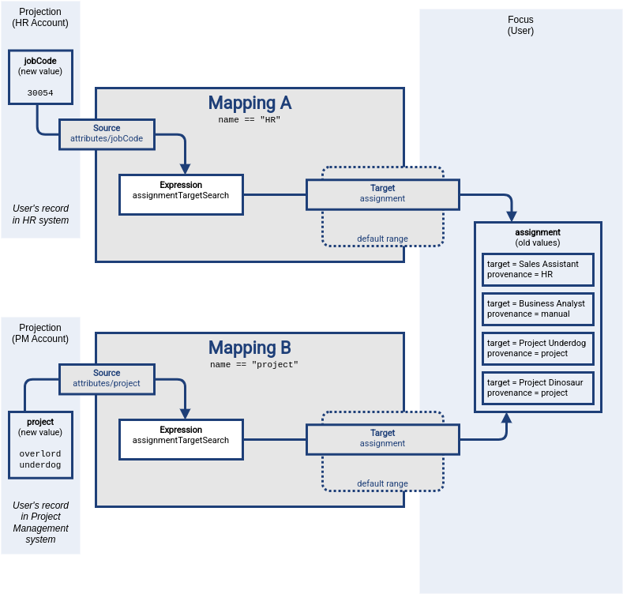
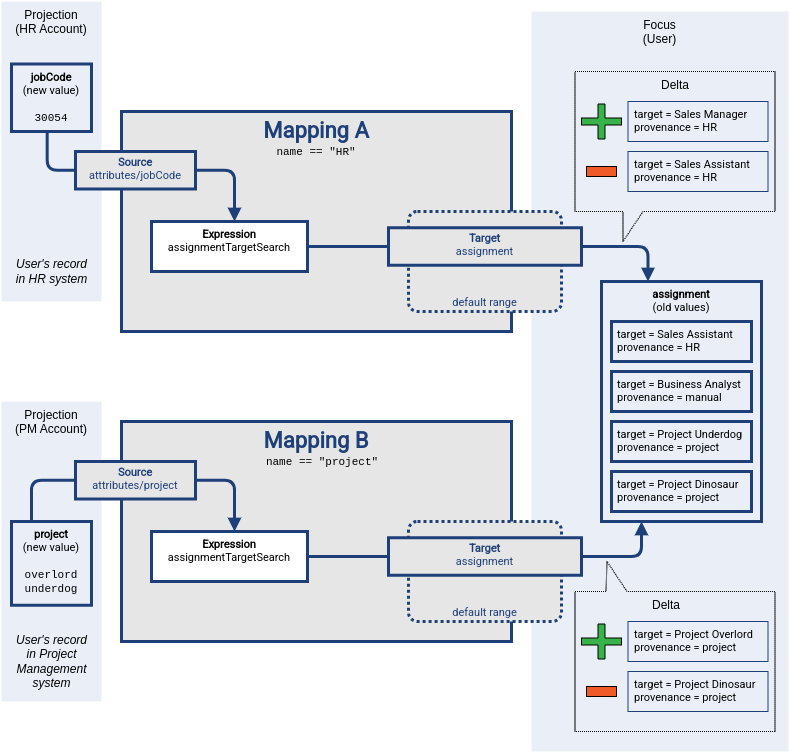

= Mapping Range
:page-upkeep-status: green

The _range_ of a mapping (in a mathematical sense) is a set of values that are considered to be valid outputs of the mapping.
Definition of mapping range is not important for evaluation of mapping expression.
However, it is important for application of mapping outputs.

The mapping is considered to be authoritative for all values in its range.
If the target item contains values that belong to the mapping range, it is assumed that the values were created by the mapping.
I.e. if the mapping contains any values that belong to the mapping range, and the mapping does not produce such values as its output, the values are removed.

The range defines what are the possible outputs of the mapping.
The xref:/midpoint/reference/concepts/clockwork/clockwork-and-projector/[projector] can use this information to determine what values to remove when the mapping is authoritative.

== Range Definition

The mapping range can be specified by using a `set` declaration in its target:

[source,xml]
----
<mapping>
    <expression>
        ...
    </expression>
    <target>
        <set>
            <predefined>all</predefined>
        </set>
    </target>
----

The `predefined` element can take following values:

* `all`: All possible values will be part of the range.
Which means that all other values (those not given by mappings) will be removed.
This is also known as _non-tolerant_ behavior.

* `none`: No value will be part of the range.
The range is empty.
Which means that no values will be removed for the reason that it is not produced by a mapping.
This is also known as _tolerant_ behavior. This was default range for multivalue and assignment mappings before midPoint 4.9.

* `matchingProvenance`:
The range contains the values created by this mapping in the past.
They will be removed if not provided by the mapping again.
This is the default behavior for inbound mappings with name specified (for all multi-valued items, and all named mappings).

The pre-defined specifications of `all` and `none` can be used for the extreme cases.
The `matchingProvenance` is a reasonable default for multi-valued items with named mappings.

If needed, a custom specification can be created by using a condition:

[source,xml]
----
<mapping>
    <expression>
        ...
    </expression>
    <target>
        <set>
            <condition>
                
            </condition>
        </set>
    </target>
----

Above mapping is an assignment mapping, target of the mapping is an `assignment` container.
The range definition specifies that the mapping is authoritative for all assignments where target relation is _manager_.
Therefore, if there is any manager assignment that is not result of this mapping then midPoint knows that such assignment may be removed.

See xref:custom/[] for more details.

== Simple Cases

There are few simple cases of mapping range use, such as extending range to all possible values and reducing it to no values.
As such cases are relatively common, there are pre-defined value set definitions to make configuration easier.

[%autowidth]
|====
| Range | predefined keyword | Summary | Description

| All values
| `all`
| Mapping is *authoritative* for all values.
| Mapping will always remove all the values that were not produced by the mapping (except for the "overlap" case, see below).

| No values
| `none`
| Mapping is *non-authoritative* for any value.
| Mapping will not remove any value, except for the case when the removal is result of relativistic computation (see below).

| Values with matching provenance
| `matchingProvenance`
| Mapping is authoritative only for the values that it produced.
| Mapping will remove only the values that were created by the same mapping in the past.

|====

Please note that mapping range is not the only mechanism that can cause removal of target values.
Even with an empty range (non-authoritative mapping), target values can be removed due to mapping relativity.
In case that mapping reacts to removal of source value, the result is likely to be removal of target value.
This is evaluated by the mapping expression, even before processing of mapping range takes place.
Please see xref:../mapping-relativity/[] for more details.

== Default Inbound Ranges - matchingProvenance

As mentioned before  `matchingProvenance` is default for multivalue properties and assignments since midPoint 4.9

=== Single Mapping

The usual way for automatic assignment of roles is use of xref:/midpoint/reference/expressions/mappings/inbound-mapping/[inbound mapping] with xref:/midpoint/reference/expressions/expressions/#assignment-target-search[assignmentTargetSearch] expression evaluator.
The mapping takes `jobCode` attribute from the HR system.
It transforms the `jobCode` to an assignment of midPoint role using the `assignmentTargetSearch` expression.
The new assignment value is then stored in user's `assignment` container, thus assigning the role.

However, the `assignment` container is multi-valued.
There are roles that are automatically assigned by an HR system.
There may also be other roles, assigned manually or assigned by other mappings.
We do not want the HR inbound mapping to destroy such role assignments.
We want the HR mapping to manage only the role assignments that originated from HR.

Mapping _range_ `matchingProvenance` is an ideal tool to achieve that and is used by default.
Firstly, the HR mapping marks all the assignments in some way, so it can recognize them later.
There is a very useful `subtype` property in the `assignment` container, which is designed especially for this purpose.
The HR mapping will produce all the assignment values with the `@metadata/provenance/mappingSpecification` container set to identifier of `HR` mapping (Mapping Specification).

Secondly, the mapping automatically specifies its range as all the assignments that have `@metadata/provenance/mappingSpecification` equal to `HR` mapping indentifiers.
Therefore the mapping will manage only the assignments it created, leaving all other assignment values untouched.

Let us illustrate this approach on an example.
An employee is promoted from sales assistant to sales manager.
Before the promotion, the employee has `jobCode` attribute in the HR system set to value `30002` which corresponds to sales assistant job.
As the employee got promoted, the `jobCode` attribute has changed to `30054`, which corresponds to sales manager.
MidPoint detects the change and executes inbound mapping designed to automatically assign HR roles.
Following diagram illustrates the situation at the beginning of mapping evaluation.
The data in the source (HR) system is already changed, the expression was not evaluated yet, and the target data still have the original (old) value.

Evaluation of the mapping begins.
Source definitions are processed, and mapping expression is evaluated.
The `assignmentTargetSearch` expression looks through midPoint repository for a role that corresponds to job code `30054`.
The expression finds `Sales Manager` role, creates an assignment for that role, and makes sure the assignment subtype is set to `HR`.
This value was just produced by the mapping expression.
It is not stored anywhere yet.
User's `assignment` container still contains old values.

image::mapping-range-single-2.png[Mapping range part 2]

At this point midPoint has results of mapping expressions, and it is trying to figure out the way to properly and consistently apply results of all the mappings.
MidPoint has to construct a xref:/midpoint/devel/prism/concepts/deltas/[delta] that will later be applied to the user object.
Mapping expression has produced an assignment of `Sales Manager` role.
The expression has produced that value as a reaction to new value of `jobCode` attribute in HR system, therefore the new assignment is added to a _plus_ part of the delta.
This value will be added to user's `assignment` container when the delta is applied at the end of processing.

Then it is the time to evaluate mapping range.
Mapping range is applied to original (old) values of user's assignments.
There are two values.
One of the values has provenance metadata set to `manual`, therefore it clearly does not belong to mapping range.
This value is left untouched.
The other value has provenance metadata of  `HR` mapping, therefore it does belong to mapping range.
This value is processed by the mapping.
MidPoint logic compares it to values produced by mapping expression, realizing that this assignment of `Sales Assistant` role was *not* produced by the expression.
Therefore, this value is removed.
It is placed to _minus_ part of the delta, dooming the value for removal.

TIP: Strictly speaking, the values are not stored in _plus_ and _minus_ part of the deltas yet, as the deltas are not yet constructed.
The values are places in _plus_ and _minus_ parts of a data structure that we call _a triple_.
It has _plus_, _zero_ and _minus_ parts, and it is used as an intermediary data structure to merge results of several mappings.
However, we have only one mapping here, therefore we can ignore such details for now.

The results of mapping expression are _consolidated_ at this point.
Data from all the mappings are considered and merged.
The deltas are all computed and ready to use.
All that remains it to apply them to user object.

image::mapping-range-single-4.png[Mapping range part 4]

The assignment of HR role `Sales Assistant` was replaced by assignment of `Sales Manager` role, all other assignments were left untouched.

=== Multiple Mappings

Mapping range is usually applied if there is a need for several information sources to coexist.
This may be a case of one mapping doing the automation, while still allowing for manual adjustments of data.
However, the other common case is coexistence of several mappings, producing values targeted to the same item.

As with any other set of mapping that target the same item, the results of both mappings are merged.
What makes this situation special is removal of existing values of the target item.

Let us illustrate that using an example of two mappings, both targeted for `assignment` container.
The first mapping is the HR mapping used in the previous section.
The other is a mapping from a project management system.
Its purpose is automatic management membership in project teams.
Authoritative information about project teams is stored in the project management system.
The `project` attribute of user accounts contains a multi-valued list of project identifiers that a user belongs to.
The mapping is processing the values of `project` attribute, creating assignments to appropriate xref:/midpoint/reference/org/[orgs].

Both mappings are evaluated almost independently, producing values for their respective sources.
As in the usual case, the _plus_ part of the detlas (or _triples_) is produced by mapping expressions.
The _minus_ values in deltas are what makes this case interesting.
Each of the mapping is applying its range, looking for values to remove.
The `Sales Assistant` value is removed by the HR mapping, the `Project Dinosaur` is removed by the project management system mapping.

Finally, the deltas are applied to the target values.
Even though the deltas target the same item (`assignment`), the value sets are disjoint.
There are no conflicts, everything goes smoothly.

== Other Cases

Mapping range is empty by default for single value properties, making the mapping non-authoritative (tolerant).

Theoretically, mapping should produce only the values that belong to its range.
This rule should hold for all authoritative mappings, otherwise some of the values produced by the mapping may not be removed.
However, there are non-authoritative mappings.
Non-authoritative mappings routinely produce values that do not belong to their range.
An extreme case is a mapping with empty range (range set to `none`).
Any value that such a mapping produces is outside of its range.
Such mapping will work reasonably well.
Values produced by the mapping will be added to the target item.
The values may even be removed, as long as xref:../mapping-relativity/[mapping relativity] mechanism takes place.
However, there is no guarantee that the value will be properly removed in all cases.

Mapping range is applied, even if expression xref:../condition/[condition] is false.
The condition does not "turn off" the mapping, it simply controls the expression.
Even if condition is false, the mapping is still applied.
Which means that mapping range is still applied as well.
This may lead to some counter-intuitive situations.

The range is applied, as the condition controls evaluation of mapping _expression_.
Even if condition is false, only the expression is affected.
Other parts of the mapping work normally.
Please see xref:../condition/[] page for the details.

Please see xref:../../practices/removing-values/[] for guidance of range usage in practical cases.

== Terminology

The term _range_ was derived from mathematical terminology.
In mathematics, functions have _domain_ (set of input values) and _range_ (set of output values).
_Domain_ and _range_ was a good metaphor at the beginning.
However, the _range_ does not describe mapping behavior perfectly, as mapping can produce values that are not part of its _range_.
The term _range_ is also confusing and non-intuitive for many people.
Therefore, we may consider using another term instead of _range_.

== Notes

The range definition does *not* influence mapping inputs or expression.
The range is used when the mapping outputs are processed.

Range specification makes sense only for authoritative mappings.
If the range is specified then the mapping will scan existing values of the target property.
It will look for values that are there and that are also in the range of the mapping.
If such values are not in the expression results, then such values will be removed (placed in the minus set).

In the explanations and examples above, we are somehow neglecting xref:../mapping-relativity/[relativity of mappings].
In fact, the entire mechanisms of _mapping range_ is designed especially for the cases where _mapping relativity_ does not work.
Such as situations where we know the new state of an account, without knowing how it has changed.
The examples above are illustrating such cases.
However, in real world case the relativity and the range mechanisms work together.
Therefore, in reality, many of the values indicated as belonging to the _plus_ set will be probably in the _zero_ set instead.
However, this is not a significant difference for the purpose of this explanation.

== See Also

* xref:/midpoint/reference/expressions/mappings/[]

* xref:../../practices/removing-values/[]
