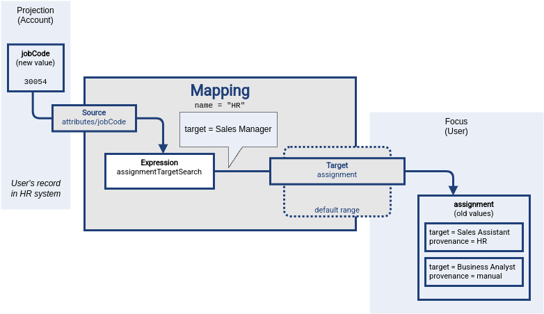

= Mapping Range

The _range_ of a mapping (in a mathematical sense) is a set of values that are considered to be valid outputs of the mapping.
Definition of mapping range is not important for evaluation of mapping expression.
However, it is important for application of mapping outputs.

The mapping is considered to be authoritative for all values in its range.
If the target item contains values that belong to the mapping range, it is assumed that the values were created by the mapping.
I.e. if the mapping contains any values that belong to the mapping range, and the mapping does not produce such values as its output, the values are removed.

TODO: intro

== Single Mapping

The usual way for automatic assignment of roles is use of xref:/midpoint/reference/expressions/mappings/inbound-mapping/[inbound mapping] with xref:/midpoint/reference/expressions/expressions/#assignment-target-search[assignmentTargetSearch] expression evaluator.
The mapping takes `jobCode` attribute from the HR system.
It transforms the `jobCode` to an assignment of midPoint role using the `assignmentTargetSearch` expression.
The new assignment value is then store in user's `assignment` container, thus assigning the role.

However, the `assignment` container is multi-valued.
There are roles that are automatically assigned by an HR system.
There may also be other roles, assigned manually or assigned by other mappings.
We do not want the HR inbound mapping to destroy such role assignments.
We want the HR mapping to manage only the role assignments that originated from HR.

Mapping _range_ is an ideal tool to achieve that.
Firstly, the HR mapping marks all the assignments in some way, so it can recognize them later.
There is a very useful `subtype` property in the `assignment` container, which is designed especially for this purpose.
The HR mapping will produce all the assignment values with the `subtype` property set to `HR`.
Secondly, the mapping specifies its range as all the assignments that have `subtype` equal to `HR`.
Therefore the mapping will manage only the assignments of the `HR` subtype, leaving all other assignment values untouched.

Let us illustrate this approach on an example.
An employee is promoted from sales assistant to sales manager.
Before the promotion, the employee has `jobCode` attribute in the HR system set to value `30002` which corresponds to sales assistant job.
As the employee got promoted, the `jobCode` attribute has changed to `30054`, which corresponds to sales manager.
MidPoint detects the change and executes inbound mapping designed to automatically assign HR roles.
Following diagram illustrates the situation at the beginning of mapping evaluation.
The data in the source (HR) system is already changed, the expression was not evaluated yet, and the target data still have the original (old) value.

image::mapping-range-single-1.png[Mapping range part 1]

Evaluation of the mapping begins.
Source definitions are processed, and mapping expression is evaluated.
The `assignmentTargetSearch` expression looks through midPoint repository for a role that corresponds to job code `30054`.
The expression finds `Sales Manager` role, creates an assignment for that role, and makes sure the assignment subtype is set to `HR`.
This value was just produced by the mapping expression.
It is not stored anywhere yet.
User's `assignment` container still contains old values.

At this point midPoint has results of mapping expressions, and it is trying to figure out the way to properly and consistently apply results of all the mappings.
MidPoint has to construct a xref:/midpoint/devel/prism/concepts/deltas/[delta] that will later be applied to the user object.
Mapping expression has produced an assignment of `Sales Manager` role.
The expression has produced that value as a reaction to new value of `jobCode` attribute in HR system, therefore the new assignment is added to a _plus_ part of the delta.
This value will be added to user's `assignment` container when the delta is applied at the end of processing.

Then it is the time to evaluate mapping range.
Mapping range is applied to original (old) values of user's assignments.
There are two values.
One of the values has subtype set to `manual`, therefore it clearly does not belong to mapping range.
This value is left untouched.
The other value has subtype `HR`, therefore it does belong to mapping range.
This value is processed by the mapping.
MidPoint logic compares it to values produced by mapping expression, realizing that this assignment of `Sales Assistant` role was *not* produced by the expression.
Therefore, this value is removed.
It is placed to _minus_ part of the delta, dooming the value for removal.

TIP: Strictly speaking, the values are not stored in _plus_ and _minus_ part of the deltas yet, as the deltas are not yet constructed.
The values are places in _plus_ and _minus_ parts of a data structure that we call _a triple_.
It has _plus_, _zero_ and _minus_ parts, and it is used as an intermediary data structure to merge results of several mappings.
However, we have only one mapping here, therefore we can ignore such details for now.

image::mapping-range-single-3.png[Mapping range part 3]

The results of mapping expression are _consolidated_ at this point.
Data from all the mappings are considered and merged.
The deltas are all computed and ready to use.
All that remains it to apply them to user object.

The assignment of HR role `Sales Assistant` was replaced by assignment of `Sales Manager` role, all other assignments were left untouched.

== Simple Cases

There are few simple cases of mapping range use, such as extending range to all possible values and reducing it to no values.
As such cases are relatively common, there are pre-defined value set definitions to make configuration easier.

[%autowidth]
|====
| Range | predefined keyword | Summary | Description

| All values
| `all`
| Mapping is *authoritative* for all values.
| Mapping will always remove all the values that were not produced by the mapping (except for the "overlap" case, see below).

| No values
| `none`
| Mapping is *non-authoritative* for any value.
| Mapping will not remove any value, except for the case when the removal is result of relativistic computation (see below).

| Values with matching provenance
| `matchingProvenance`
| Mapping is authoritative only for the values that it produced.
| Mapping will remove only the values that were created by the same mapping in the past.

This option is xref:/midpoint/versioning/experimental/[experimental].
It is a part of prototype functionality resulting from xref:/midpoint/projects/midprivacy/phases/01-data-provenance-prototype/[] project.

|====

Please note that mapping range is not the only mechanism that can cause removal of target values.
Even with an empty range (non-authoritative mapping), target values can be removed due to mapping relativity.
In case that mapping reacts to removal of source value, the result is likely to be removal of target value.
This is evaluated by the mapping expression, even before processing of mapping range takes place.
Please see xref:../mapping-relativity/[] for more details.

== Multiple Mappings

Mapping range is usually applied if there is a need for several information sources to coexist.
This may be a case of one mapping doing the automation, while still allowing for manual adjustments of data.
However, the other common case is coexistence of several mappings, producing values targeted to the same item.

TODO: picture: two mappings with non-overlapping ranges

== Overlapping Ranges

TODO: picture: two mappings with overlapping ranges

TODO: warning about overlapping ranges, partial evaluation can produce invalid results (e.g. inbound mapping, reconcile only one resource).
Do not use overlapping ranges if it can be avoided

TODO: this also applies to "all" range. Do not overlap authoritative mappings.

== Other Cases

TODO: Mapping producing a value that is not part of the range.

TODO: range is still applied, even if condition is false. Why?

== Terminology

TODO: why is it called "range"?

== Range and Metadata

TODO

== See Also

* xref:../[]
