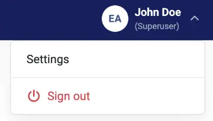
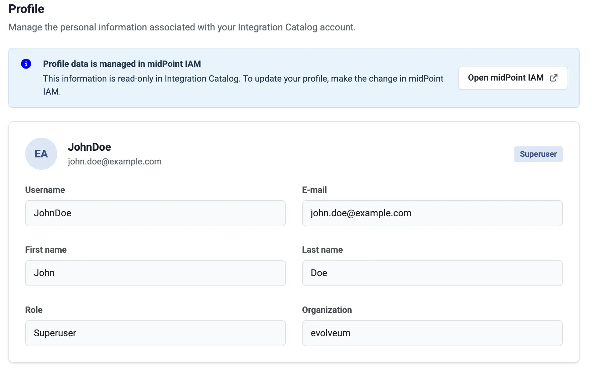
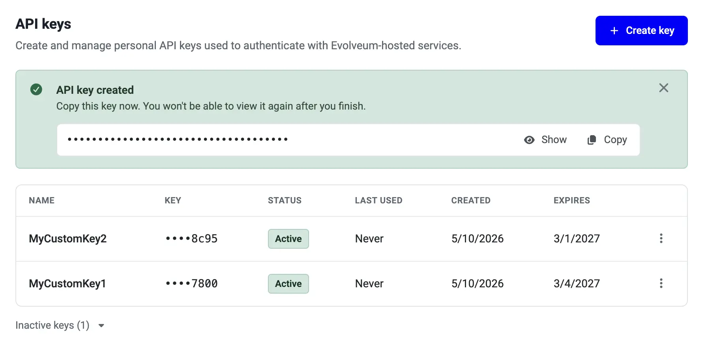
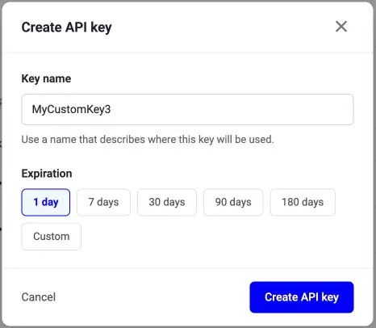

= Integration catalog settings
:page-nav-title: Settings
:experimental:
:page-toc: top
:page-description: This page describes the Settings section of the Integration catalog.
:page-keywords:

This page describes the Settings section of the Integration catalog.

The Settings page classifies configuration under the following tabs:

* *Profile* - Displays and manages your profile information.
* *API keys* - Creates and manages API keys that enable you to authenticate with Evolveum-hosted services.

Access the Integration catalog settings page by clicking your username in the right upper corner of the Integration catalog, and by selecting *Settings* from the drop-down menu.

[[profile]]
== Profile

The Profile page displays your profile information as it is registered in the Evolveum environment.

As the profile information is managed by Evolveum, it is read-only in the Integration catalog.
However, you can still edit some of your profile information by clicking the [.nowrap]#btn:[Open midPoint IAM] icon:arrow-up-right-from-square[]# directly in the Evolveum midPoint environment.

[[api-keys]]
== API keys

The API keys page enables you to create and manage API keys that allow you to authenticate with Evolveum-hosted services.

You can use these to generate xref:/midpoint/reference/interfaces/integration-catalog/share-connectors/upload-connector/#select-connector-type[low-code connectors] using the Evolveum xref:/midpoint/get-started/install/midpilot-setup/#smart-resource-integration-microservice[connector generation microservice] without having to set up your own LLM service.

=== Create a new API key

. Click [.nowrap]#icon:plus[] btn:[Create key]#.
. Type the *Key name*.
. Set the *Expiration*.
You can either select one of the predefined expiration periods, or click btn:[Custom] to set a custom expiration date.

+

. Click btn:[Create API key].
. Once created, enter the API key in your midPoint configuration by going to [.nowrap]#icon:gear[] btn:[Settings]# > [.nowrap]#icon:wand-magic-sparkles[] btn:[Smart integration]# in your midPoint.

=== API key actions

You can manage the existing API keys by clicking their respective [.nowrap]#icon:ellipsis-vertical[] btn:[Key actions]# buttons.
The following actions are available:

* *Rotate* - Revokes the key and generates a new key with an identical name and expiration period.
The old key will still work for another 2 hours, giving you time to update your midPoint configuration with the new API key.
* *Revoke* - Revokes the key. +
You can view all revoked keys by clicking btn:[Inactive keys] below the list of active keys.