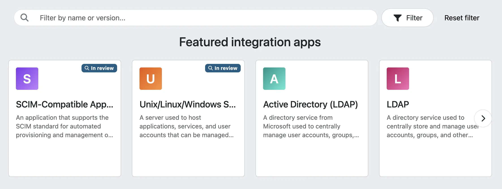
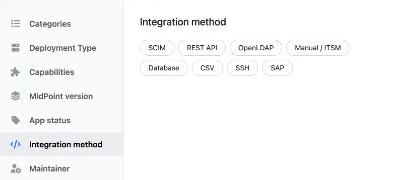
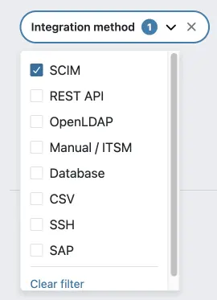
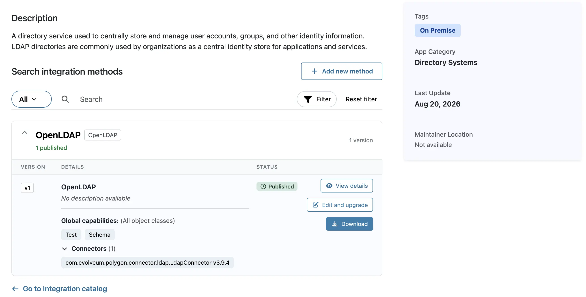

= Download integrations
:experimental:
:page-toc: top
:page-description:
:page-keywords:

This describes how you can browse and download integrations from the xref:/midpoint/reference/interfaces/integration-catalog[Integration catalog].

== Browse and download integrations

To get integration methods that allow you to connect midPoint with your target applications, follow these steps:

. In your web browser, navigate to the Integration catalog at https://integrations.evolveum.com.
. Locate the application that you need to integrate with midPoint:
** The *Featured integration apps* listing shows the most prominent or widely used applications.
** The *More apps* section below lists all integrations in the catalog.
** Alternatively, you can use the search field to locate the application that you want to integrate with midPoint.

+
.Locate the application using Search

+
You can use pre-defined filters to narrow down the listing by clicking [.nowrap]#icon:filter[] btn:[Filter]#:

+
.Apply filters to search results

+
Configure filters by expanding and editing them, or click the btn:[Reset filter] button next to the [.nowrap]#icon:filter[] btn:[Filter]# button to remove all applied filters.

+
.Expand filters edit them

. Click your target application.
. In the application detail, hover your mouse over an integration.

+
.Hover your mouse over an integration

+
Note that the available buttons may differ from those in the image above based on your permissions.

. Click the [.nowrap]#icon:download[] btn:[Download]# button to download a package file containing the integration including the connector and other relevant information, such as documentation (if available).
. Import the connector found in the package into your midPoint installation.
. xref:/midpoint/reference/interfaces/integration-catalog/share-connectors/#validation[Validate the connector] in your midPoint installation.

== See also

* xref:/midpoint/reference/interfaces/integration-catalog/[Integration catalog]
* xref:/midpoint/reference/interfaces/integration-catalog/share-connectors[Sharing custom connectors]
* xref:/midpoint/reference/interfaces/integration-catalog/share-connectors/validate-connector/[Validating custom connectors]
* xref:/midpoint/reference/interfaces/integration-catalog/share-connectors/upgrade-integration/[Upgrading existing integration methods]
* xref:/midpoint/reference/interfaces/integration-catalog/request-integration[Requesting new integration methods]