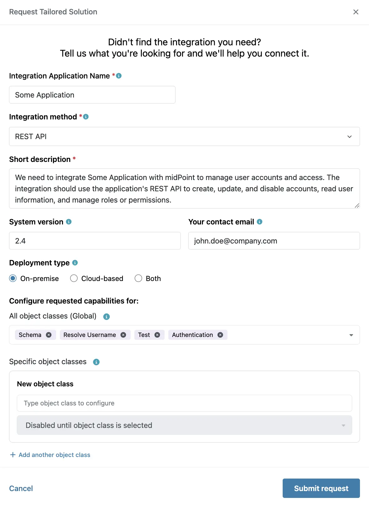

= Request integration
:experimental:
:page-toc: top
:page-description:
:page-keywords:

This page describes how to request new integration methods in the xref:/midpoint/reference/interfaces/integration-catalog/[Integration catalog]. This may enable you to integrate midPoint with applications for which there are currently no connectors.

== Request new integration method

Before requesting a new integration method, make sure the integration you need is not already xref:/midpoint/reference/interfaces/integration-catalog/download-integrations/[[available in the Integration catalog] (IC).

If you do not find the application that you need to integrate with midPoint with the required integration method in the IC, you can request an addition to the catalog:

. xref:/midpoint/reference/interfaces/integration-catalog/#permissions[Log into] the Integration catalog.
. At the landing page, scroll to the bottom and click [.nowrap]#icon:call-pull-request[] btn:[Request Tailored Solution]#.

+
.Request tailored solution

. Fill in the following information:
** Integration application name - The name of the application for which you need a new integration method.
** Integration method - Select the protocol that should be used for the integration, such as REST API or SCIM.
** Short description of the requested integration with the specific use case (required capabilities) you need it for.
The description should be descriptive and specific enough for the implementation team to best understand your intentions.
** System version - The version of the application for which you need an integration.
While not mandatory, this may be relevant as various application versions may use different protocols.
** Your contact information so that the Evolveum team can get back to you in case further details are needed.
** Deployment type - Whether the application is on-premise, cloud, or whether it is used in both of those environments.
** Configure requested capabilities - Define if the requested capabilities should be supported for all, or only for specific object classes.

+
.Request application integration

. Click [.nowrap]#btn:[Submit request]# and wait for the Evolveum team to review your request and get back to you.

== See also

* xref:/midpoint/reference/interfaces/integration-catalog/[Integration catalog]
* xref:/midpoint/reference/interfaces/integration-catalog/download-integrations[Downloading integration methods]
* xref:/midpoint/reference/interfaces/integration-catalog/share-connectors[Sharing custom connectors]
* xref:/midpoint/reference/interfaces/integration-catalog/share-connectors/validate-connector/[Validating custom connectors]
* xref:/midpoint/reference/interfaces/integration-catalog/share-connectors/upgrade-integration/[Upgrading existing integration methods]